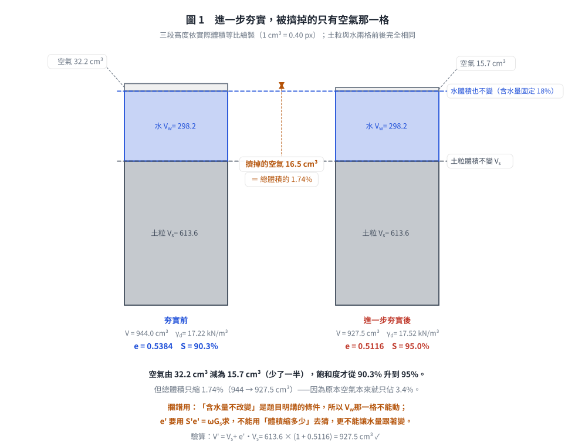
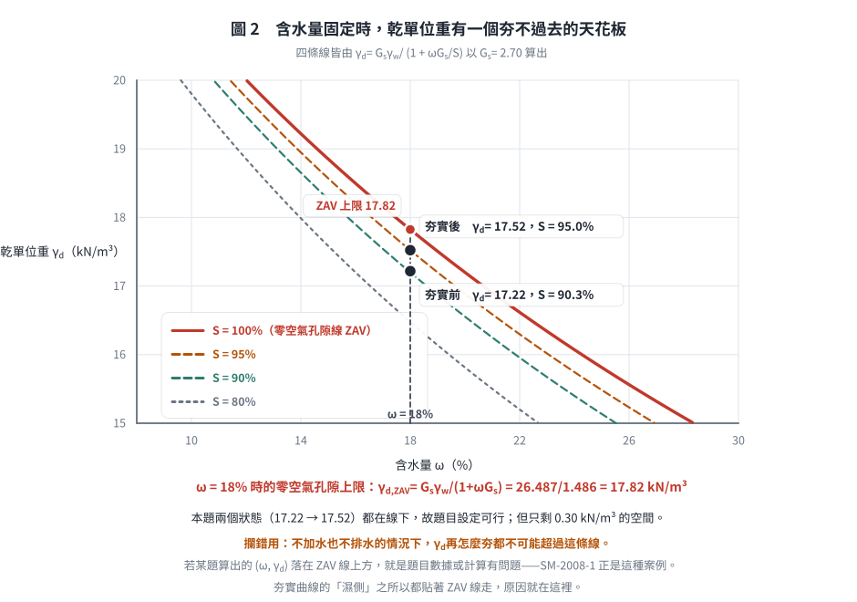

# 考題編號：SM-2004-1

**主分類：** `SM-U1-1` 土壤基本性質
**副分類：** 無
**分析法：** 混合
**標籤：** `三相關係` `孔隙比` `飽和度` `乾單位重` `濕單位重` `比重`
---

## 1. 原始題目重述 (Problem Restatement)
一、某一凝聚性土壤夯實後含水量為 18%，土壤顆粒之比重為 2.70，夯實試體之體積為 944 cm³，質量為 1955 公克。試求此夯實土壤之孔隙比、飽和度、濕土單位重（kN/m³）、及乾土單位重（kN/m³）。若進一步夯實後，可將土壤試體之飽和度提高至 95%。假設試體之含水量不改變，試計算進一步夯實後，土壤試體之孔隙比、濕土單位重（kN/m³）、及乾土單位重（kN/m³）。（25 分）

## 2. 考題核心精神與出題者意圖 (Core Concepts & Examiner's Intent)
- 測驗考生對土壤三相圖（固體、液體、氣體）基本物理性質定義的熟練度。
- 檢驗基本公式（如 $Se = wG_s$、$ \gamma = \frac{G_s+Se}{1+e}\gamma_w $、$\gamma_d = \frac{\gamma_t}{1+w}$）的靈活運用能力。
- 了解進一步夯實過程對三相物理量的影響（在未加水且土壤比重固定的情況下，含水量 $w$ 與比重 $G_s$ 不變，但孔隙比 $e$ 減小，使得飽和度與單位重增加）。

## 3. 解題戰略地圖與陷阱分析 (Strategic Roadmap & Trap Analysis)
- **步驟一**：由已知的總體積與總質量，求出初始濕密度 $\rho_t$，並推算乾密度 $\rho_d$。將密度乘以重力加速度轉換為單位重 $\gamma_t$ 與 $\gamma_d$。
- **步驟二**：利用乾密度公式 $\rho_d = \frac{G_s \rho_w}{1+e}$ 求出初始孔隙比 $e$。
- **步驟三**：利用三相關係 $Se = wG_s$ 求出初始飽和度 $S$。
- **步驟四**：針對進一步夯實狀態，利用含水量與比重不變，結合新的飽和度 $S' = 95\%$，利用 $S'e' = wG_s$ 反求新的孔隙比 $e'$。
- **步驟五**：利用新的孔隙比 $e'$ 計算進一步夯實後的乾土單位重 $\gamma_d'$ 與濕土單位重 $\gamma_t'$。
- **陷阱**：題目給定的質量與體積單位為 $\text{g}$ 與 $\text{cm}^3$，算出來的是「密度」（相當於 $\text{t/m}^3$）。要求作答單位為「$\text{kN/m}^3$」，因此必須乘上重力加速度 $g$（常取 $9.81 \text{ m/s}^2$）才能換算成單位重。

## 3.5 變數層次分析 (Variable Hierarchy Analysis)

### 最終目標
求出初始夯實狀態及進一步夯實狀態下的孔隙比、飽和度、濕土單位重與乾土單位重。

### 本題關鍵公式（依計算順序）
初始狀態物理量：
$$ \rho_t = \frac{M}{V} $$
$$ \rho_d = \frac{\boxed{\rho_t}}{1+w} $$
$$ e = \frac{G_s \rho_w}{\boxed{\rho_d}} - 1 $$
$$ S = \frac{w G_s}{\boxed{e}} $$
$$ \gamma_t = \boxed{\rho_t} \cdot g $$
$$ \gamma_d = \boxed{\rho_d} \cdot g $$

進一步夯實後物理量：
$$ e' = \frac{w G_s}{S'} $$
$$ \gamma_d' = \frac{G_s \gamma_w}{1+\boxed{e'}} $$
$$ \gamma_t' = \boxed{\gamma_d'} (1+w) $$

### L1：題目直接給定
| 符號 | 數值 | 說明 |
|---|---|---|
| $w$ | $0.18$ | 初始含水量 |
| $G_s$ | $2.70$ | 土壤顆粒比重 |
| $V$ | $944 \text{ cm}^3$ | 初始試體體積 |
| $M$ | $1955 \text{ g}$ | 初始試體質量 |
| $S'$ | $0.95$ | 進一步夯實後飽和度 |

### L2：需知識點推導
**初始夯實狀態**
| 符號 | 公式／來源 | 卡關? |
|---|---|---|
| $\rho_t$ | $\rho_t = M/V$ | |
| $\rho_d$ | $\rho_d = \rho_t/(1+w)$ | |
| $e$ | $\rho_d = G_s\rho_w/(1+e)$ | |
| $S$ | $Se = wG_s$ | |
| $\gamma_t$ | $\gamma_t = \rho_t \times g$ | |
| $\gamma_d$ | $\gamma_d = \rho_d \times g$ | |

**進一步夯實狀態**
| 符號 | 公式／來源 | 卡關? |
|---|---|---|
| $e'$ | $S'e' = wG_s$ | |
| $\gamma_d'$ | $\gamma_d' = G_s\gamma_w/(1+e')$ | |
| $\gamma_t'$ | $\gamma_t' = \gamma_d'(1+w)$ | |

### L3：深層知識（不懂就卡住）
| 知識點 | 說明 | 卡關? |
|---|---|---|
| 質量與重量單位的換算 | $\text{g/cm}^3$ 為密度單位，要轉為單位重 $\text{kN/m}^3$ 須乘以 $g$ (通常取 $9.81$)，亦即水的單位重 $\gamma_w = 9.81 \text{ kN/m}^3$。 | |
| 夯實過程不變量 | 土體進行夯實時，僅排除孔隙中的空氣，土壤固體顆粒重量、體積及含水量 (未加水或排水) 不變，因此 $w$、$G_s$ 不變。 | |

## 4. 步驟化詳細計算過程 (Step-by-Step Detailed Calculation)
**一、初始夯實狀態：**

(1) 濕密度與乾密度
已知 $M = 1955 \text{ g}$，$V = 944 \text{ cm}^3$，求濕密度 $\rho_t$：
$$ \rho_t = \frac{M}{V} = \frac{1955}{944} = 2.0710 \text{ g/cm}^3 $$
由含水量 $w = 18\%$，求乾密度 $\rho_d$：
$$ \rho_d = \frac{\rho_t}{1+w} = \frac{2.0710}{1+0.18} = 1.7551 \text{ g/cm}^3 $$

(2) 濕土單位重與乾土單位重
取重力加速度 $g = 9.81 \text{ m/s}^2$（即水的單位重 $\gamma_w = 9.81 \text{ kN/m}^3$）：
濕土單位重 $\gamma_t$：
$$ \gamma_t = \rho_t \cdot g = 2.0710 \times 9.81 = 20.316 \approx \boxed{20.32 \text{ kN/m}^3} $$
乾土單位重 $\gamma_d$：
$$ \gamma_d = \rho_d \cdot g = 1.7551 \times 9.81 = 17.217 \approx \boxed{17.22 \text{ kN/m}^3} $$

(3) 孔隙比與飽和度
已知比重 $G_s = 2.70$，由乾密度公式 $\rho_d = \frac{G_s \rho_w}{1+e}$（取 $\rho_w = 1.0 \text{ g/cm}^3$），求孔隙比 $e$：
$$ 1+e = \frac{G_s \rho_w}{\rho_d} = \frac{2.70 \times 1.0}{1.7551} = 1.5384 $$
$$ e = 1.5384 - 1 = 0.5384 \approx \boxed{0.538} $$
由三相關係 $Se = wG_s$，求飽和度 $S$：
$$ S = \frac{wG_s}{e} = \frac{0.18 \times 2.70}{0.5384} = 0.9027 \approx \boxed{90.3\%} $$

**二、進一步夯實後狀態：**

進一步夯實，假設含水量不變（$w=18\%$），土壤比重不變（$G_s=2.70$），飽和度提高至 $S'=95\%$。

(1) 新的孔隙比 $e'$
由三相關係 $S'e' = wG_s$：
$$ e' = \frac{wG_s}{S'} = \frac{0.18 \times 2.70}{0.95} = 0.5116 \approx \boxed{0.512} $$

(2) 新的乾土與濕土單位重
新的乾土單位重 $\gamma_d'$：
$$ \gamma_d' = \frac{G_s \gamma_w}{1+e'} = \frac{2.70 \times 9.81}{1+0.5116} = \frac{26.487}{1.5116} = 17.522 \approx \boxed{17.52 \text{ kN/m}^3} $$
新的濕土單位重 $\gamma_t'$：
$$ \gamma_t' = \gamma_d' (1+w) = 17.522 \times (1+0.18) = 20.676 \approx \boxed{20.68 \text{ kN/m}^3} $$

*圖 1　進一步夯實時，被擠掉的只有空氣那一格。它攔的是讓水量跟著變：「含水量不改變」是題目明講的條件，所以 $V_w$ 這一格前後必須完全相同，$e'$ 只能由 $S'e' = \omega G_s$ 求得。空氣少了一半，總體積卻只縮 1.74%——因為空氣本來就只佔 3.4%。*

## 5. 關鍵爭議點與進階探討 (Critical Issues & Advanced Discussion)
- **重力加速度的選取**：考試若無特別規定 $g = 9.81 \text{ m/s}^2$ 或水的單位重 $\gamma_w = 9.81 \text{ kN/m}^3$ 時，使用 $9.81$ 是最標準且安全的作法。部分參考書或考題為了計算方便會允許 $g=9.8 \text{ m/s}^2$ 甚至 $10 \text{ m/s}^2$，計算時可以加註所使用的假設。
- **這塊土還能再夯多少？（夯實的物理天花板）**：
  含水量固定在 $\omega = 18\%$、$G_s = 2.70$ 時，最緊的可能狀態就是「空氣被完全擠光」，
  即 $S = 100\%$，此時的孔隙比與乾單位重為：
  $$e_{min,\omega} = \omega G_s = 0.18 \times 2.70 = 0.486
  \quad,\quad \gamma_{d,ZAV} = \frac{G_s\gamma_w}{1+\omega G_s} = \frac{26.487}{1.486} = 17.82 \text{ kN/m}^3$$
  本題的兩個狀態分別為 $\gamma_d = 17.22$（$S = 90.3\%$）與 $\gamma_d' = 17.52$（$S' = 95\%$），
  都在 $17.82$ 以下，故題目設定是可行的；但也看得出來**剩餘空間只剩 $0.30 \text{ kN/m}^3$**——
  再怎麼夯，乾單位重也不可能超過 17.82，除非把水排掉或降低含水量。
  這正是夯實曲線在最佳含水量右側會貼近零空氣孔隙線的原因。
  （反例見 SM-2008-1：該題考卷指定的目標狀態就落在 ZAV 線之上，物理上做不到。）

*圖 2　含水量固定時，乾單位重有一個夯不過去的天花板。它攔的是「以為可以無限夯下去」：本題兩個狀態都在線下，但距離上限只剩 0.30 kN/m³。凡是算出的 $(\omega,\ \gamma_d)$ 落在 ZAV 線上方，就是題目數據或計算有問題——SM-2008-1 正是那種案例。*

- **體積縮減量**：由 $e = 0.538$ 夯到 $e' = 0.512$，體積縮減率為
  $\frac{(1+e)-(1+e')}{1+e} = \frac{0.0268}{1.5384} = 1.74\%$，
  即 $944 \text{ cm}^3$ 的試體約縮為 $927.5 \text{ cm}^3$。飽和度從 90.3% 提到 95% 聽起來很多，
  但體積只變了不到 2%——因為擠掉的只是那一點點殘餘空氣。
- **有效小數點位數**：物理量的計算中，四捨五入的取捨會略微影響最後的數值，建議在中間計算時至少保留四位有效小數，最後結果取至小數點後二或三位。例如先取 $e = 0.538$ 直接代入計算 $S$ 可得 $90.3\%$；若用精確值 $0.5384$ 則得 $90.27\%$。兩者在國考閱卷上均屬正確。

---

*解析日期：見 `wiki/log.md`　｜　圖解補繪：2026-08-28（向量 SVG，程式繪製，腳本 `gen_SM-2004-1.py` 可重跑；同名 2× PNG 供簡報／影片管線使用）*
