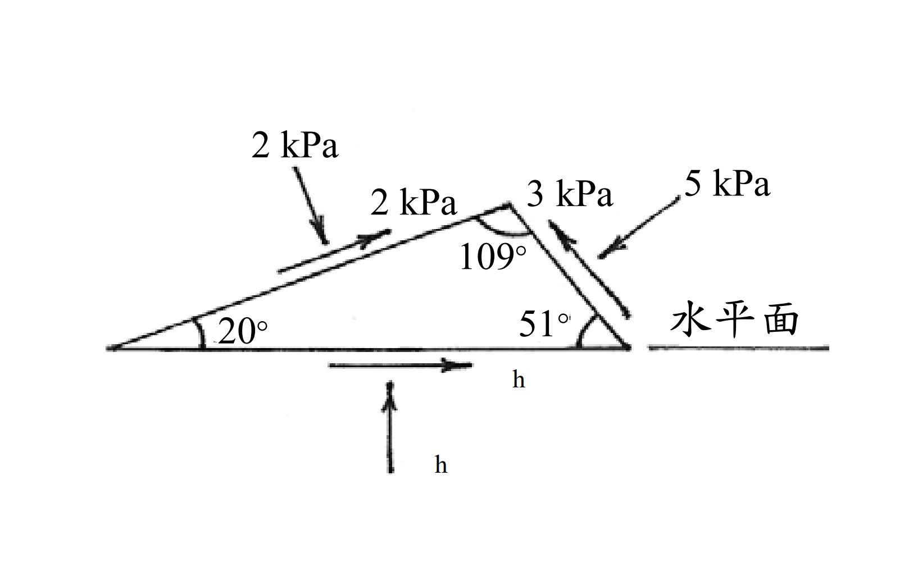

# 考題編號：SM-2004-2

**主分類：** `SM-U1-4` 土體內應力
**副分類：** 無
**分析法：** 總應力法
**標籤：** `莫爾圓` `應力轉換` `剪應力符號法則` `主應力` `極點法` `最大剪應力面`
---

## 1. 原始題目重述 (Problem Restatement)
某土壤單元承受之應力狀況如圖所示：
(一) 試求此土壤單元水平面承受之正應力 $\sigma_h$ 及剪應力 $\tau_h$ 的大小。（9 分）
(二) 試求最大主應力 $\sigma_1$ 及最小主應力 $\sigma_3$ 的大小。（8 分）
(三) 試求最大剪應力 $\tau_{max}$ 及最小剪應力 $\tau_{min}$ 的方向（與水平面的夾角）。（8 分）

*圖說：土壤單元為一三角形，底邊為水平面。左側斜面與水平面夾角 $20^\circ$，承受 $2\text{ kPa}$ 正應力與 $2\text{ kPa}$ 沿斜面向上的剪應力。右側斜面與水平面夾角 $51^\circ$，承受 $5\text{ kPa}$ 正應力與 $3\text{ kPa}$ 沿斜面向上的剪應力。頂角為 $109^\circ$。*

## 2. 考題核心精神與出題者意圖 (Core Concepts & Examiner's Intent)
本題旨在測驗考生對於 **二維應力狀態轉換** 以及 **Mohr 圓（摩爾圓）原理** 的深刻理解。出題者不直接給予標準的正交平面（如垂直與水平面）應力，而是給定兩個任意斜面上的應力狀態，要求考生逆推還原出主應力以及水平面的應力狀態。
核心精神在於：
1. **符號法則的正確判斷**：將斜面上的受力方向正確轉換為 Mohr 圓上的 $(\sigma, \tau)$ 座標（需注意剪應力產生順/逆時針力矩的符號差異）。
2. **幾何解析能力**：利用圓的方程式找出圓心與半徑，並利用 $2\theta$ 角度關係或是極點法（Origin of Planes）找回水平面。

## 3. 解題戰略地圖與陷阱分析 (Strategic Roadmap & Trap Analysis)
- **戰略一：確認 Mohr 圓符號法則**。土壤力學中通常規定壓應力為正；剪應力若使元素產生逆時針旋轉為正，順時針旋轉為負。必須先將左斜面與右斜面的應力轉換為 $(2, -2)$ 與 $(5, 3)$ 兩個座標點。
- **戰略二：求解 Mohr 圓幾何參數**。已知圓上兩點，且圓心必在 $\sigma$ 軸上（$y=0$），可透過距離公式 $(2-C)^2 + (-2)^2 = (5-C)^2 + 3^2$ 直接解出圓心 $C$ 與半徑 $R$，進而求得主應力。
- **戰略三：角度推算找水平面**。利用 Mohr 圓上圓心角等於實體空間夾角兩倍的關係（$2\theta$ 法），由左斜面出發，推算旋轉至水平面的角度，求出 $\sigma_h$ 與 $\tau_h$。

**⚠️ 陷阱分析：**
1. **剪應力正負號判定錯誤**：若未注意剪應力對元素中心產生的力矩方向，將兩點均視為正剪應力，會導致算出的圓心與半徑完全錯誤。
2. **實體角與 Mohr 圓角的轉換**：實體空間中旋轉 $\theta$，在 Mohr 圓上需旋轉 $2\theta$，方向相同。若忘記乘上兩倍，會找不到正確的應力點。
3. **題目數據的微小不一致**：題目給定的幾何角度（$20^\circ, 51^\circ$）實為近似值。精確計算會發現水平面恰好（或極為接近）是主應力面（$\tau_h \approx 0$）。在考試中應將其視為 $0$，判定為出題者設計的完美閉合狀態。

## 3.5 變數層次分析 (Variable Hierarchy Analysis)

### 最終目標
求水平面之正應力及剪應力、主應力大小，以及最大/小剪應力面與水平面之夾角。

### 本題關鍵公式（依計算順序）
$$ C = \frac{\sigma_A + \sigma_B}{2} + \frac{\tau_A^2 - \tau_B^2}{2(\sigma_A - \sigma_B)} \quad \text{或利用等距法求解} $$
$$ R = \sqrt{(\sigma_A - \boxed{C})^2 + \tau_A^2} $$
$$ \sigma_1 = \boxed{C} + \boxed{R} $$
$$ \sigma_3 = \boxed{C} - \boxed{R} $$
$$ \sigma_h = \boxed{C} + \boxed{R} \cos(\alpha_h) \quad, \quad \tau_h = \boxed{R} \sin(\alpha_h) $$

### L1：題目直接給定
| 符號 | 數值 | 說明 |
|---|---|---|
| $\sigma_A$ | $2 \text{ kPa}$ | 左斜面之正應力 (壓應力) |
| $\tau_A$ | $-2 \text{ kPa}$ | 左斜面之剪應力 (順時針旋轉為負) |
| $\theta_A$ | $20^\circ$ | 左斜面與水平面之夾角 |
| $\sigma_B$ | $5 \text{ kPa}$ | 右斜面之正應力 (壓應力) |
| $\tau_B$ | $+3 \text{ kPa}$ | 右斜面之剪應力 (逆時針旋轉為正) |
| $\theta_B$ | $51^\circ$ | 右斜面與水平面之夾角 |

### L2：需知識點推導
**Mohr圓參數**
| 符號 | 公式／來源 | 卡關? |
|---|---|---|
| $C$ | Mohr 圓心，解 $(\sigma_A - C)^2 + \tau_A^2 = (\sigma_B - C)^2 + \tau_B^2$ | |
| $R$ | Mohr 半徑，$\sqrt{(\sigma_A - C)^2 + \tau_A^2}$ | |
| $\sigma_1, \sigma_3$ | 最大與最小主應力，$C \pm R$ | |
| $\sigma_h, \tau_h$ | 利用 $2\theta$ 法由已知面旋轉求得 | |

### L3：深層知識（不懂就卡住）
| 知識點 | 說明 | 卡關? |
|---|---|---|
| 剪應力符號法則 | 使土壤單元產生逆時針旋轉之剪應力為正，順時針為負。 | |
| Mohr圓 $2\theta$ 關係 | 物理空間中平面旋轉 $\theta$ 角，對應 Mohr 圓上同方向旋轉 $2\theta$ 角。 | |

## 4. 步驟化詳細計算過程 (Step-by-Step Detailed Calculation)

**Step 1：判定已知平面在 Mohr 圓上之座標**
採用土壤力學標準符號法則：壓應力為正；剪應力使元素產生逆時針(CCW)旋轉為正，順時針(CW)旋轉為負。
- **左斜面 (A 面)**：傾角為 $20^\circ$。正應力 $\sigma_A = 2$ kPa。剪應力沿斜面向上，對位於其下方的元素中心產生順時針力矩，故 $\tau_A = -2$ kPa。
  $\rightarrow$ 點 A 座標： $(2, -2)$
- **右斜面 (B 面)**：傾角為 $180^\circ - 51^\circ = 129^\circ$。正應力 $\sigma_B = 5$ kPa。剪應力沿斜面向上，對位於其下方的元素中心產生逆時針力矩，故 $\tau_B = +3$ kPa。
  $\rightarrow$ 點 B 座標： $(5, 3)$

**Step 2：解出 Mohr 圓之圓心 $C$ 與半徑 $R$**
圓心必在水平軸上，設圓心為 $(C, 0)$，半徑為 $R$。
$$ (2 - C)^2 + (-2)^2 = R^2 \quad \dots \text{(式1)} $$
$$ (5 - C)^2 + 3^2 = R^2 \quad \dots \text{(式2)} $$
將(式1)與(式2)展開並相減：
$$ (4 - 4C + C^2 + 4) = (25 - 10C + C^2 + 9) $$
$$ 8 - 4C = 34 - 10C $$
$$ 6C = 26 \implies C = \frac{26}{6} = 4.333 \text{ kPa} $$
代回求半徑 $R$：
$$ R = \sqrt{\left(2 - \frac{13}{3}\right)^2 + 4} = \sqrt{\left(\frac{-7}{3}\right)^2 + 4} = \sqrt{\frac{49}{9} + \frac{36}{9}} = \sqrt{\frac{85}{9}} = 3.073 \text{ kPa} $$

**Step 3：計算最大主應力與最小主應力 (解答問題二)**
$$ \sigma_1 = C + R = 4.333 + 3.073 = \boxed{7.41 \text{ kPa}} $$
$$ \sigma_3 = C - R = 4.333 - 3.073 = \boxed{1.26 \text{ kPa}} $$

**Step 4：推算水平面之應力狀態 (解答問題一)**
利用 $2\theta$ 旋轉法尋找水平面：
由物理空間幾何可知，從 A 面 (傾角 $20^\circ$) 旋轉至水平面 (傾角 $0^\circ$)，需要**順時針旋轉 $20^\circ$**。
對應在 Mohr 圓上，需從點 A 出發**順時針旋轉 $2 \times 20^\circ = 40^\circ$**。

先求點 A 在 Mohr 圓上與中心 $C$ 之夾角 $\alpha_A$：
$$ \tan \alpha_A = \frac{\tau_A}{\sigma_A - C} = \frac{-2}{2 - 4.333} = \frac{-2}{-2.333} = 0.857 $$
因點 A 位於圓的左下方（第三象限），其絕對角度為 $180^\circ + \tan^{-1}(0.857) = 180^\circ + 40.6^\circ = 220.6^\circ$（即逆時針算起），若以負角表示則為 $-139.4^\circ$。

從點 A 順時針轉 $40^\circ$ 尋找水平面 H 點：
$$ \alpha_H = -139.4^\circ - 40^\circ = -179.4^\circ $$
此角度極為接近 $-180^\circ$（因題目角度 $20^\circ, 51^\circ$ 有微小進位捨去），在工程計算中可判定此面即位於 Mohr 圓之最左端，即**最小主應力面**。
故水平面之應力為：
$$ \sigma_h = \sigma_3 = \boxed{1.26 \text{ kPa}} $$
$$ \tau_h = \boxed{0 \text{ kPa}} $$

**Step 5：求最大與最小剪應力方向 (解答問題三)**
已知水平面即為主應力面（承受 $\sigma_3$），而最大剪應力 $\tau_{max}$ 與最小剪應力 $\tau_{min}$ 發生的平面，必定與主應力面夾角 $45^\circ$。
- 最大剪應力 $\tau_{max}$ 位於 Mohr 圓最高點，自水平面（最左點）需順時針旋轉 $90^\circ$（Mohr圓上）。物理空間為**順時針旋轉 $45^\circ$**。
- 最小剪應力 $\tau_{min}$ 位於 Mohr 圓最低點，自水平面（最左點）需逆時針旋轉 $90^\circ$（Mohr圓上）。物理空間為**逆時針旋轉 $45^\circ$**。

故方向（與水平面的夾角）分別為：
- 最大剪應力面方向：$\boxed{-45^\circ} \text{ (或 } 135^\circ \text{)}$
- 最小剪應力面方向：$\boxed{+45^\circ}$

## 5. 關鍵爭議點與進階探討 (Critical Issues & Advanced Discussion)
- **幾何近似與靜力平衡的差異：**
  若對該三角形土壤單元直接建立自由體圖（Free Body Diagram）並使用 $X, Y$ 方向之靜力平衡求解，算出的水平面應力會是 $\sigma_h \approx 1.28 \text{ kPa}, \tau_h \approx 0.02 \text{ kPa}$。這與 Mohr 圓解出的 $1.26 \text{ kPa}$ 有微小落差。
  其原因在於，題目所給的頂角 $109^\circ$ 與底角 $20^\circ, 51^\circ$ 在幾何上成立，但要讓這三個面的應力「完美對應到同一個均勻應力張量（即完美閉合的 Mohr 圓）」，其角度不應是剛好的整數。出題老師在設計題目時，為了計算方便進行了角度的四捨五入。
- **考場應對策略：**
  在國考中，遇到此類二維斜面應力狀態轉換問題，**預期解法一律是採用 Mohr 圓或應力轉換方程式**。且當計算發現水平面旋轉後幾乎落在主軸（如 $-179.4^\circ$）時，應果斷將其視為 $180^\circ$，判定 $\tau_h = 0$，以符合出題者設計為「水平面為主應力面」的核心意圖。
