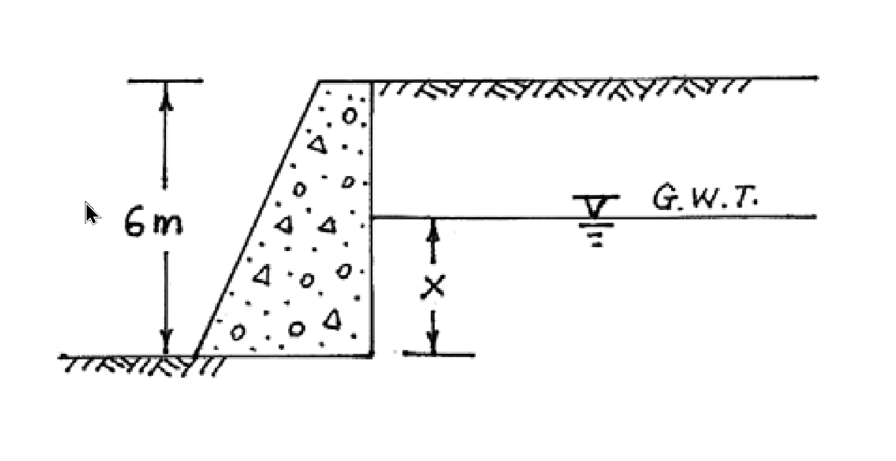
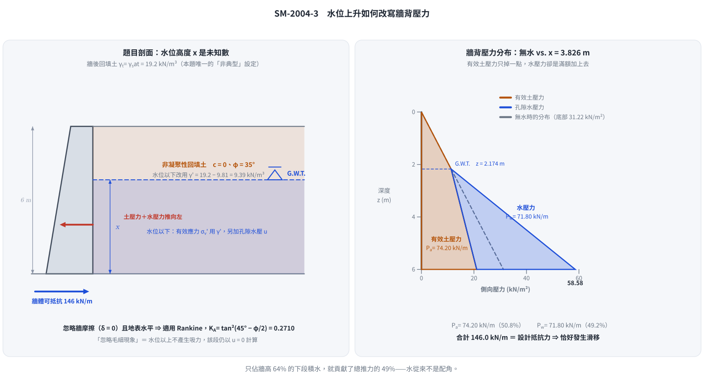
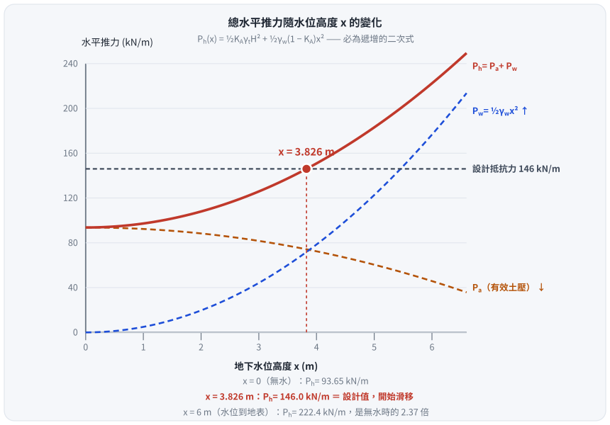

# 考題編號：SM-2004-3

**主分類：** `SM-U3-1` 側向土壓力理論
**副分類：** `SM-U3-2` 擋土結構物穩定分析
**分析法：** 有效應力法
**標籤：** `Rankine主動土壓力` `孔隙水壓` `水中單位重` `地下水位影響` `抗滑動` `重力式擋土牆`

---

## 1. 原始題目重述 (Problem Restatement)

右圖所示 6.0 m 高之重力式擋土牆被設計為可以抵抗 146 kN/m 之水平推力。牆後非凝聚性回填土之飽和單位重及濕土單位重皆為 19.2 kN/m³，而內摩擦角為 35°。假設忽略牆摩擦角及毛細現象，試求地下水位（G.W.T.）上升至何高度 $x$ 時？此擋土牆將發生滑移（sliding）現象。（25 分）

*圖說：重力式擋土牆高度 $H = 6\text{ m}$，牆後填土水平，地下水位（G.W.T.）自底部算起高度為 $x$。土壤參數未在圖上標示，由題幹給定為 $\gamma_t = \gamma_{sat} = 19.2\text{ kN/m}^3$，$\phi = 35^\circ$。*

## 2. 考題核心精神與出題者意圖 (Core Concepts & Examiner's Intent)

本題旨在測驗考生對於**地下水位變化如何影響側向土壓力及總水平推力**的觀念。
出題者意圖包含：
1. 忽略牆摩擦角（$\delta = 0^\circ$）及背填土表面水平，暗示應採用 Rankine 主動土壓力理論。
2. 了解地下水位的存在會使水位以下的土壤單位重由飽和單位重降為有效單位重（水下單位重），從而減少該部分的有效側向土壓力。
3. 但同時必須額外加上孔隙水壓力，總水平推力將因此顯著增加。考生需具備分別計算「有效主動土壓力」與「水壓力」，並將兩者疊加求取總推力的能力。

## 3. 解題戰略地圖與陷阱分析 (Strategic Roadmap & Trap Analysis)

**作戰計畫：**
1. 計算 Rankine 主動土壓力係數 $K_a$。
2. 以 $x$（水位高度）為未知數，計算總有效主動土壓力 $P_a$。這裡可以利用一個計算技巧：無水時的總土壓力，扣除水位以下因浮力失去的有效土壓力。
3. 計算水壓力 $P_w$。
4. 將總水平推力 $P_h = P_a + P_w$ 等於設計抵抗力 146 kN/m，解一元二次方程式求出 $x$。

**陷阱分析：**
- **陷阱一：漏加水壓力。** 考生可能只記得將水位以下的單位重改為有效單位重 $\gamma'$，卻忘記要將孔隙水壓力 $u$ 加上去。
- **陷阱二：有效應力的面積計算錯誤。** 由於有效應力圖形在水位下轉折，分解梯形與三角形面積時若未小心處理，容易在以 $x$ 為變數展開時發生代數錯誤。建議採用「全斷面視為無水，再扣除水浮力減少之有效應力」的觀念來計算，可大幅減少代數複雜度。

## 3.5 變數層次分析 (Variable Hierarchy Analysis)

### 最終目標
`求出使總水平推力達到 146 kN/m 的地下水位高度 x。`

### 本題關鍵公式（依計算順序）
- 步驟 1：求 Rankine 主動土壓力係數
  $$K_a = \tan^2\left(45^\circ - \frac{\phi}{2}\right)$$
- 步驟 2：建立包含水位高度 $x$ 的總水平推力方程式
  $$P_h = P_a + P_w = \left[ \frac{1}{2} \boxed{K_a} \gamma_t H^2 - \frac{1}{2} \boxed{K_a} \gamma_w x^2 \right] + \frac{1}{2} \gamma_w x^2$$
- 步驟 3：令推力等於設計抵抗力解 $x$
  $$x = \sqrt{\frac{P_{design} - \frac{1}{2} \boxed{K_a} \gamma_t H^2}{\frac{1}{2}\gamma_w (1 - \boxed{K_a})}}$$

### L1：題目直接給定
_看到題目就能讀出的數字，不需要任何公式。_

| 符號 | 數值 | 說明 |
|---|---|---|
| $\gamma_t$ | $19.2 \text{ kN/m}^3$ | 牆後非凝聚性回填土濕單位重 |
| $\gamma_{sat}$ | $19.2 \text{ kN/m}^3$ | 牆後非凝聚性回填土飽和單位重（與 $\gamma_t$ 同值） |
| $\phi$ | $35^\circ$ | 內摩擦角 |
| $c$ | $0$ | 非凝聚性回填土 |
| $H$ | $6.0 \text{ m}$ | 擋土牆高度 |
| $P_{design}$ | $146 \text{ kN/m}$ | 擋土牆設計可抵抗之水平推力（滑移臨界推力） |

### L2：需知識點推導
_需要知道公式名稱與適用條件，套入 L1 即可算出。_

**主動土壓力與水壓力計算**

| 符號 | 公式／來源 | 卡關? |
|---|---|:---:|
| $K_a$ | $\tan^2(45^\circ - \phi/2)$（Rankine，$\delta = 0$、地表水平） | |
| $\gamma_w$ | $9.81 \text{ kN/m}^3$（水的單位重，常數） | |
| $\gamma'$ | $\gamma_{sat} - \gamma_w$ | |
| $P_a(x)$ | $\frac{1}{2}K_a\gamma_t H^2 - \frac{1}{2}K_a\gamma_w x^2$ | |
| $P_w(x)$ | $\frac{1}{2}\gamma_w x^2$ | |
| $P_h(x)$ | $P_a(x) + P_w(x)$，令其 $= P_{design}$ 解 $x$ | |

### L3：深層知識（不懂就卡住）
_L2 中某些公式本身需要背景概念才能正確應用的知識點。_

| 知識點 | 說明 | 卡關? |
|---|---|:---:|
| 水位以上與水位以下之有效應力計算技巧 | 若將全域先視為 $\gamma_t$，則水位以下因浮力減少的土壓力剛好為負的 $\frac{1}{2}K_a\gamma_w x^2$，加上水壓力 $\frac{1}{2}\gamma_w x^2$ 後可得到簡潔的二次式，避免繁雜的代數運算。 | |
| 水位上升為何反而使推力增加 | 有效土壓力只掉 $K_a$ 倍（$\times 0.271$），水壓力卻是滿額 $1.0$ 倍，兩者淨效應為 $\frac{1}{2}\gamma_w(1-K_a)x^2 > 0$，故必然遞增。 | |
| 「忽略毛細現象」的意思 | 水位以上不產生負孔隙水壓（吸力），故該段仍以 $\gamma_t$ 與 $u=0$ 計算，不得再加上毛細帶來的額外有效應力。 | |

## 4. 步驟化詳細計算過程 (Step-by-Step Detailed Calculation)

**Step 1：計算 Rankine 主動土壓力係數**
因忽略牆摩擦角（$\delta=0$），且背填土表面為水平，故採用 Rankine 理論：
$$K_a = \tan^2\left(45^\circ - \frac{\phi}{2}\right) = \tan^2\left(45^\circ - \frac{35^\circ}{2}\right) = \tan^2(27.5^\circ) \approx 0.271$$

**Step 2：計算水平總推力 $P_h$ (含 $x$ 變數)**
假設水的單位重 $\gamma_w = 9.81 \text{ kN/m}^3$。
擋土牆總高 $H = 6\text{ m}$，地下水位距底部為 $x$（m）。

> **策略註解：**
> 為了避免繁瑣的梯形面積拆解，我們可想像若全斷面皆無地下水（皆為 $\gamma_t$），總有效主動土壓力為 $\frac{1}{2} K_a \gamma_t H^2$。
> 由於底部高度 $x$ 範圍內充滿地下水，土壤單位重由 $\gamma_{sat}$ 變為有效單位重 $\gamma' = \gamma_{sat} - \gamma_w$。
> 此變化相當於在高度 $x$ 的範圍內，減去了一個「以 $\gamma_w$ 遞增」的土壓力，即 $-\frac{1}{2} K_a \gamma_w x^2$。
> 接著，再補上孔隙水壓力 $P_w = \frac{1}{2} \gamma_w x^2$ 即可得總推力。

有效主動土壓力 $P_a$：
$$P_a = \frac{1}{2} K_a \gamma_t H^2 - \frac{1}{2} K_a \gamma_w x^2$$
$$P_a = \frac{1}{2} \times 0.271 \times 19.2 \times 6^2 - \frac{1}{2} \times 0.271 \times 9.81 \times x^2$$
$$P_a = 93.658 - 1.329 x^2 \quad (\text{kN/m})$$

水壓力 $P_w$：
$$P_w = \frac{1}{2} \gamma_w x^2 = \frac{1}{2} \times 9.81 \times x^2 = 4.905 x^2 \quad (\text{kN/m})$$

總水平推力 $P_h$：
$$P_h = P_a + P_w = (93.658 - 1.329 x^2) + 4.905 x^2$$
$$P_h = 93.658 + 3.576 x^2 \quad (\text{kN/m})$$

*圖 1　水位上升後牆背壓力的重組。攔的是「只把 $\gamma$ 換成 $\gamma'$ 卻忘了加水壓」——圖上虛線（無水）在牆底只有 $31.22$，而有水時土壓反而降到 $21.05$，看起來「變小了」；真正的變化是右邊多出一整塊 $37.53$ 的水壓三角，總值反而升到 $58.58$。*

**Step 3：解臨界水位高度 $x$**
依題意，當總水平推力達到 146 kN/m 時發生滑移：
$$P_h = 146$$
$$93.658 + 3.576 x^2 = 146$$
$$3.576 x^2 = 146 - 93.658 = 52.342$$
$$x^2 = \frac{52.342}{3.576} = 14.637$$
$$x = \sqrt{14.637} = 3.826 \text{ m}$$

（若取 $K_a = 0.27099$ 精確值計算，結果亦為 3.826 m）

$$\boxed{x = 3.83 \text{ m}}$$

*圖 2　$P_h(x)$ 與臨界水位。攔的是「以為水位上升會讓推力下降」——橘色虛線（有效土壓）確實一路遞減，但藍色虛線（水壓）以 $\tfrac{1}{2}\gamma_w x^2$ 上升，淨效應 $\tfrac{1}{2}\gamma_w(1-K_a)x^2$ 恆為正，紅線只會往上。*

## 5. 關鍵爭議點與進階探討 (Critical Issues & Advanced Discussion)
- **水對擋土牆穩定的雙重危害**：由本題計算結果可知，地下水位上升會造成「有效土壓力的微幅減少（減去 $1.329 x^2$）」，但卻帶來「水壓力的巨幅增加（增加 $4.905 x^2$）」。整體而言，水位上升必然導致總推力呈現二次曲線快速上升。因此，在擋土牆背面設置良好的排水系統（如地工織物、碎石級配排水層、洩水孔）以防止地下水位異常升高，是實務設計上最經濟且最重要的防範措施。
- **推力的組成：水佔了幾乎一半**
  - 臨界狀態（$x = 3.826 \text{ m}$）下拆開來看：
    - 有效土壓力 $P_a = 93.658 - 1.329(14.638) = 74.20 \text{ kN/m}$（$50.8\%$）
    - 孔隙水壓力 $P_w = 4.905(14.638) = 71.80 \text{ kN/m}$（$49.2\%$）
  - 也就是說，**只佔牆高 64\% 的下段積水，就貢獻了將近一半的總推力**。
    這個比例是本題最值得記住的量級感——水從來不是配角。
- **邊界檢核：$x$ 必須落在 $0 \sim H$ 之間**
  - 解出 $x = 3.826 \text{ m} < H = 6 \text{ m}$，答案有效。
  - 若水位一路升到地表（$x = 6$）：$P_h = 93.658 + 3.576(36) = 222.4 \text{ kN/m}$，
    是無水時（$93.66$）的 $2.37$ 倍、是設計抵抗力（$146$）的 $1.52$ 倍。
  - 反過來說，若代入 $x = H$ 仍解不到 $P_{design}$，就代表這面牆在任何水位下都不會滑動，
    答案應寫「不會發生滑移」而不是硬解出一個大於 $H$ 的 $x$。
- **$\gamma_w$ 的選取**：一般考試若未特別聲明，習慣取 $\gamma_w = 9.81 \text{ kN/m}^3$ 進行精確計算。部分考生若取 $\gamma_w = 10 \text{ kN/m}^3$，解出的 $x$ 則約為 $3.79 \text{ m}$，這在國家考試的閱卷標準中通常也屬於可接受的合理誤差範圍。

---

*解析日期：見 `wiki/log.md`　｜　圖解補繪：2026-08-29（向量 SVG，程式繪製，腳本 `gen_SM-2004-3.py` 可重跑；同名 2× PNG 供簡報／影片管線使用）*
