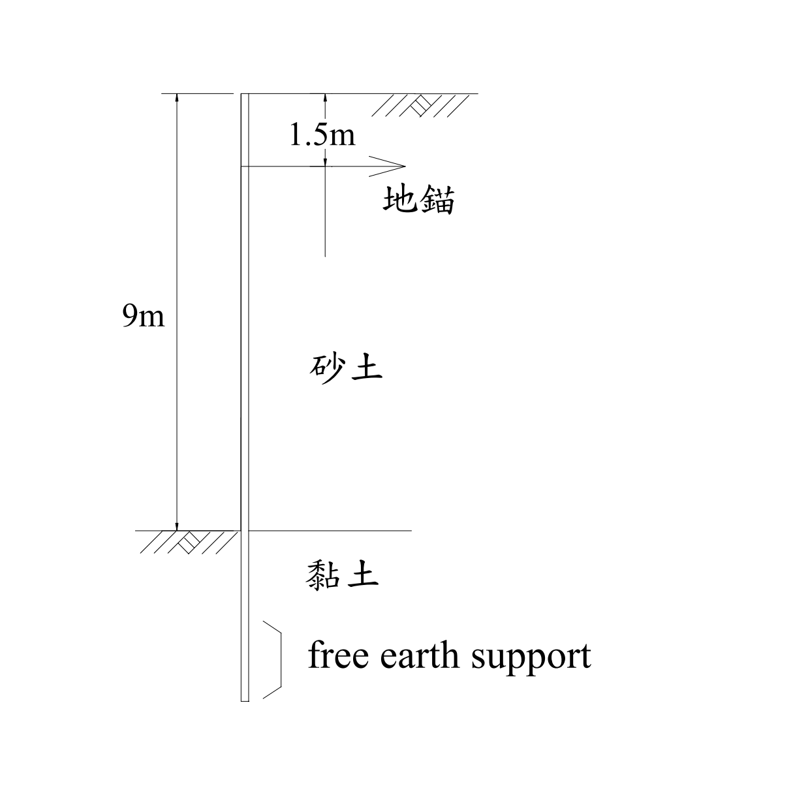
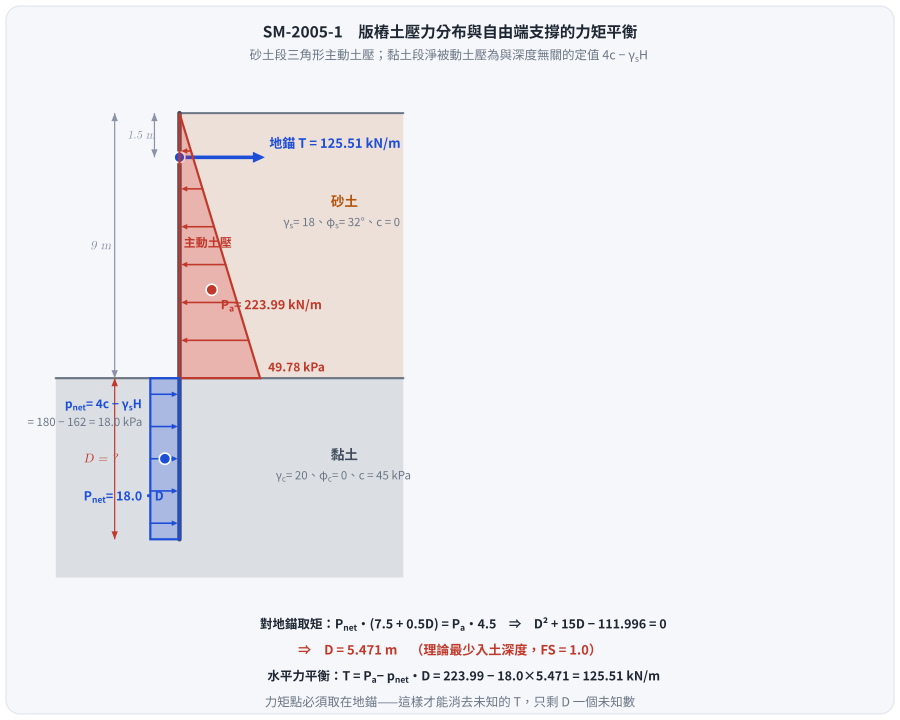
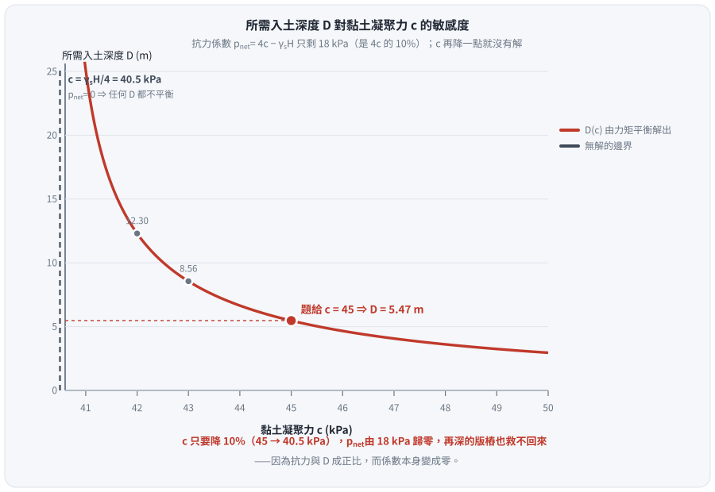

# 考題編號：SM-2005-1

**主分類：** `SM-U2-3` 開挖之穩定性分析
**副分類：** `SM-U3-1` 側向土壓力理論
**分析法：** 混合
**標籤：** `板樁` `錨定式版樁` `自由端支撐法` `Rankine主動土壓力` `淨被動土壓力` `開挖穩定性` `貫入深度` `地錨預力`
---

## 1. 原始題目重述 (Problem Restatement)

一、有一版樁 (sheet pile) 使用於地下水位以上之開挖支撐，開挖面高 9m，其背後為砂性土壤，單位重 $\gamma_s = 18 \text{ kN/m}^3$，摩擦角 $\phi_s = 32^\circ$，凝聚力 $c_s = 0$。開挖面以下為黏土層，單位重 $\gamma_c = 20 \text{ kN/m}^3$，摩擦角 $\phi_c = 0^\circ$，凝聚力 $c_c = 45\text{ kPa}$。若版樁自頂部下 1.5m 設置有一排水平地錨，且版樁深入黏土層底部為自由土壤支撐（free earth support）形式：
(一) 試繪出作用於版樁之土壓力分佈情形。（10 分）
(二) 版樁深入黏土層之最少入土深度及地錨預力為何？（15 分）

*圖說：開挖深度 9m 之背填砂土層 ($\gamma=18, \phi=32^\circ, c=0$) 及開挖面以下黏土層 ($\gamma=20, \phi=0^\circ, c=45$) 條件，地錨位於頂部往下 1.5m 處。*

## 2. 考題核心精神與出題者意圖 (Core Concepts & Examiner's Intent)

本題測驗考生對於**錨碇版樁**在**自由土壤支撐法（Free Earth Support Method）**下的力學平衡分析能力。
出題者特別設定了「開挖面以上為砂土，開挖面以下為黏土 ($\phi=0$)」的地層組合，目的在於：
1. 檢驗砂土層的 Rankine 主動土壓力計算。
2. 檢驗黏土層在不排水條件 ($\phi=0$) 下，開挖側淨被動土壓力呈「均勻分布」的特殊性質 ($p_{net} = 4c - q$)。
3. 測驗自由支撐法的靜力平衡條件：以對地錨點取力矩平衡 ($\Sigma M=0$) 求得未知入土深度 $D$，再以水平力平衡 ($\Sigma F_x=0$) 求解地錨拉力 $T$。

## 3. 解題戰略地圖與陷阱分析 (Strategic Roadmap & Trap Analysis)

- **戰略：**
  1. 計算開挖面以上砂土層的主動土壓力強度 $p_a$、總推力合力 $P_a$ 及對地錨的力臂。
  2. 計算開挖面以下黏土層的淨被動土壓力強度 $p_{net}$。
  3. 利用對地錨作用點的力矩平衡（$\Sigma M_{\text{anchor}} = 0$）列出一元二次方程式解出最少入土深度 $D$。
  4. 利用水平力平衡（$\Sigma F_x = 0$）解出地錨預力 $T$。

- **陷阱：**
  1. **黏土層淨被動土壓力公式：** 必須理解在 $\phi=0$ 條件下，$p_{net} = 4c_c - \gamma_s H$。如果不熟悉此結論而分別計算主被動壓力，很容易在深度 $z$ 的代數推導中發生錯誤，而使用此簡化公式可將梯形載重轉化為簡易的均布載重。
  2. **力矩平衡點的選擇：** 自由支撐法的力矩平衡點**必須取於地錨位置**，以此消除未知地錨力 $T$，方能順利解出入土深度 $D$。若誤對樁底取矩，會因為有兩個未知數 ($T$ 與 $D$) 而無法求解。

## 3.5 變數層次分析 (Variable Hierarchy Analysis)

### 最終目標
`求出錨碇版樁在自由土壤支撐條件下的最少入土深度與地錨所需預力（每單位寬度）。`

### 本題關鍵公式（依計算順序）
$$ K_a = \tan^2\left(45^\circ - \frac{\phi_s}{2}\right) $$
(砂土層主動土壓力係數)

$$ P_a = \frac{1}{2} \gamma_s H^2 \boxed{K_a} $$
(砂土層主動土壓力合力)

$$ p_{net} = 4c_c - \gamma_s H $$
(黏土層淨被動土壓力)

$$ \Sigma M_{\text{anchor}} = 0 \implies \boxed{p_{net}} \cdot D \cdot \left(H - h_a + \frac{D}{2}\right) - \boxed{P_a} \cdot \left(\frac{2}{3}H - h_a\right) = 0 $$
(對地錨取力矩平衡，解出入土深度 D)

$$ \Sigma F_x = 0 \implies T = \boxed{P_a} - \boxed{p_{net}} \cdot \boxed{D} $$
(水平力平衡，解出地錨預力 T)

### L1：題目直接給定
| 符號 | 數值 | 說明 |
|---|---|---|
| $H$ | $9 \text{ m}$ | 開挖面深度 |
| $h_a$ | $1.5 \text{ m}$ | 地錨設置深度（自樁頂部向下） |
| $\gamma_s$ | $18 \text{ kN/m}^3$ | 砂性土壤單位重 |
| $\phi_s$ | $32^\circ$ | 砂性土壤摩擦角 |
| $\gamma_c$ | $20 \text{ kN/m}^3$ | 黏土層單位重 |
| $c_c$ | $45 \text{ kPa}$ | 黏土層凝聚力 |

### L2：需知識點推導
**砂土層主動土壓力**
| 符號 | 公式／來源 | 卡關? |
|---|---|---|
| $K_a$ | $\tan^2(45^\circ - \phi_s/2)$ | |
| $p_a$ | $\gamma_s H K_a$ | |
| $P_a$ | $0.5 p_a H$ | |

**黏土層淨土壓力**
| 符號 | 公式／來源 | 卡關? |
|---|---|---|
| $p_{net}$ | $4c_c - \gamma_s H$ | |

**平衡方程式求解**
| 符號 | 公式／來源 | 卡關? |
|---|---|---|
| $D$ | $\Sigma M_{\text{anchor}} = 0$ | |
| $T$ | $\Sigma F_x = 0$ | |

### L3：深層知識（不懂就卡住）
| 知識點 | 說明 | 卡關? |
|---|---|---|
| 自由土壤支撐法 | 假設版樁於土層中無反曲點，樁底容許微小轉動，力矩平衡點通常取於地錨處以消除未知地錨力 $T$。 | |
| $\phi=0$ 黏土層淨被動壓力 | 被動側 $p_p = \gamma z + 2c$，主動側 $p_a = \gamma z + q - 2c$，淨壓力 $p_{net} = p_p - p_a = 4c - q$。在 $\phi=0$ 時，兩側單位重相消，$p_{net}$ 與深度 $z$ 無關呈均布載重。 | |

## 4. 步驟化詳細計算過程 (Step-by-Step Detailed Calculation)

### (一) 繪出作用於版樁之土壓力分佈情形

**Step 1: 開挖面以上（砂土層，深度 $0 \sim 9\text{ m}$）之主動土壓力**
砂土層之主動土壓力係數 $K_a$ 為：
$$ K_a = \tan^2\left(45^\circ - \frac{\phi_s}{2}\right) = \tan^2\left(45^\circ - \frac{32^\circ}{2}\right) = \tan^2(29^\circ) \approx 0.3073 $$
在樁頂（深度 $z = 0$），主動土壓力 $p_a = 0$。
在開挖面處（深度 $z = H = 9 \text{ m}$），主動土壓力強度為：
$$ p_a = \gamma_s H K_a = 18 \times 9 \times 0.3073 = 49.78 \text{ kPa} $$
由於地表無超載，主動土壓力呈**三角形分布**。

**Step 2: 開挖面以下（黏土層，深度 $9\text{ m}$ 以下）之淨被動土壓力**
版樁在開挖面以下受到開挖側的被動土壓力及背填側的主動土壓力。由於黏土層 $\phi_c = 0^\circ$，其主、被動土壓力係數 $K_{ac} = K_{pc} = 1$。
設開挖面以下深度為 $z'$，則：
- 背填側主動土壓力：$p_{a(clay)} = \gamma_s H + \gamma_c z' - 2c_c$
- 開挖側被動土壓力：$p_{p(clay)} = \gamma_c z' + 2c_c$

淨被動土壓力 $p_{net}$ 為兩者之差（向左，抵抗滑動）：
$$ p_{net} = p_{p(clay)} - p_{a(clay)} = (\gamma_c z' + 2c_c) - (\gamma_s H + \gamma_c z' - 2c_c) = 4c_c - \gamma_s H $$
代入數值：
$$ p_{net} = 4(45) - 18(9) = 180 - 162 = 18 \text{ kPa} $$
因為 $p_{net} = 18\text{ kPa} > 0$，黏土層提供向左的淨被動土壓力，且呈**均勻矩形分布**。

**解答 (一) 的文字描述（對應於圖形繪製）：**
作用於版樁之土壓力分佈為：
- 開挖面以上（深度 $0 \sim 9\text{m}$）：為向右推的主動土壓力，呈三角形分佈，由頂部 $0\text{ kPa}$ 增加至開挖面處的 $49.78\text{ kPa}$。
- 開挖面以下（黏土層中）：為向左推的淨被動土壓力，呈與深度無關的均勻矩形分佈，大小恆為 $18\text{ kPa}$。

*圖 1　兩段土壓力的形狀完全不同。攔的是「把黏土段也畫成三角形」與「把牆重算進抗滑力」：$\phi_c = 0$ 使淨被動土壓力 $p_{net} = 4c - \gamma_s H$ 與深度無關，恆為 $18 \text{ kPa}$ 的矩形；力矩點必須取在地錨，才能消去未知的 $T$、只剩 $D$ 一個未知數。*

---

### (二) 版樁深入黏土層之最少入土深度及地錨預力

**Step 3: 求解最少入土深度 $D$**
開挖面以上主動土壓力合力 $P_a$ 及其作用點：
$$ P_a = \frac{1}{2} p_a H = \frac{1}{2} \times 49.776 \times 9 = 223.99 \text{ kN/m} $$
$P_a$ 的作用點距離開挖面為 $\frac{H}{3} = 3 \text{ m}$，距離地錨的作用力臂 $L_a$ 為：
$$ L_a = \frac{2}{3}H - h_a = \frac{2}{3}(9) - 1.5 = 6 - 1.5 = 4.5 \text{ m} $$

開挖面以下淨被動土壓力合力 $P_{net}$ 及其作用點：
$$ P_{net} = p_{net} \cdot D = 18 D $$
$P_{net}$ 的作用點在黏土層入土深度的中點（因分布均勻），距離地錨的作用力臂 $L_p$ 為：
$$ L_p = (H - h_a) + \frac{D}{2} = (9 - 1.5) + 0.5D = 7.5 + 0.5D \text{ (單位: m)} $$

根據自由土壤支撐法，針對地錨設置點取力矩平衡 $\Sigma M_{\text{anchor}} = 0$：
$$ P_{net} \cdot L_p = P_a \cdot L_a $$
$$ 18D \cdot (7.5 + 0.5D) = 223.99 \cdot 4.5 $$
$$ 135D + 9D^2 = 1007.96 $$
$$ D^2 + 15D - 111.996 = 0 $$
解一元二次方程式：
$$ D = \frac{-15 \pm \sqrt{15^2 - 4(1)(-112.005)}}{2} = \frac{-15 \pm \sqrt{225 + 447.984}}{2} = \frac{-15 \pm \sqrt{672.984}}{2} \approx \frac{-15 \pm 25.9420}{2} $$
取正根：
$$ D = \frac{10.9420}{2} = 5.4710 \text{ m} $$
故理論最少入土深度為 $\boxed{D = 5.47 \text{ m}}$。

**Step 4: 求解地錨預力 $T$**
利用水平力平衡方程式 $\Sigma F_x = 0$（向左的力 = 向右的力）：
$$ T + P_{net} = P_a $$
$$ T = P_a - 18D = 223.99 - 18(5.4710) = 223.99 - 98.48 = 125.51 \text{ kN/m} $$
故每延米的地錨預力為 $\boxed{T = 125.51 \text{ kN/m}}$。

## 5. 關鍵爭議點與進階探討 (Critical Issues & Advanced Discussion)

- **安全係數的實務考量：** 
  本題計算出的 $D = 5.47 \text{ m}$ 為處於極限平衡狀態下的「理論最少入土深度」，在此深度下擋土牆的安全係數 $FS = 1.0$。在工程設計實務中，由於土層參數存在不確定性，通常會將理論求得的入土深度直接增加 20% ~ 30%（即 $D_{design} \approx 1.2 \sim 1.3 \times D$），或者在列力矩方程式時，將被動土壓力預先除以 $FS = 1.5 \sim 2.0$。因考試明確詢問「最少入土深度」，故填寫理論值 $5.47 \text{ m}$ 是正確標準作法。
- **⚠ 這面版樁只剩 $10\%$ 的餘裕——$c$ 的敏感度是本題真正的重點：**
  淨被動土壓力 $p_{net} = 4c - \gamma_s H = 180 - 162 = 18 \text{ kPa}$，
  **只佔 $4c = 180$ 的 $10\%$**。也就是說，黏土層提供的抗力幾乎全部被上覆砂土的重量吃掉，
  剩下來能用的只有那一小塊。把 $c$ 從 $45$ 往下調一點點，入土深度就會失控：

  | $c$ (kPa) | $p_{net} = 4c-162$ (kPa) | 所需入土深度 $D$ (m) |
  |---|---|---|
  | $45.0$（題給） | $18.0$ | $5.47$ |
  | $44.0$（$-2.2\%$） | $14.0$ | $6.65$ |
  | $43.0$（$-4.4\%$） | $10.0$ | $8.56$ |
  | $42.0$（$-6.7\%$） | $6.0$ | $12.30$ |
  | $41.0$（$-8.9\%$） | $2.0$ | $25.12$ |
  | $\mathbf{40.5}$（$\mathbf{-10\%}$） | $\mathbf{0}$ | **無解——任何深度都不平衡** |

  $c$ 只要降 $10\%$（到 $40.5 = \gamma_s H/4$），$p_{net}$ 歸零，**再深的版樁也救不回來**，
  因為抗力與 $D$ 成正比、而係數本身變成零。這也是為什麼實務上這種「上砂下黏、開挖又深」的
  剖面不會用自由端支撐的單錨版樁，而會改用多層支撐或加深到下方較硬的地層。
  考場上若能補一句「本設計對 $c$ 極度敏感，$c \le \gamma_s H/4 = 40.5$ kPa 即無解」，
  比只寫出 $D = 5.47 \text{ m}$ 有價值得多。

*圖 2　抗力係數只剩 $10\%$ 時的懸崖。攔的是「把 $D = 5.47 \text{ m}$ 當成穩健答案」：$p_{net} = 4c - \gamma_s H$ 是兩個大數相減的小差值，$c$ 只要降 $10\%$ 就歸零，$D$ 沿雙曲線發散到無解——這正是實務上不採用單錨自由端支撐的原因。*
- **淨被動土壓力的物理意義：** 
  在 $\phi=0$ 的飽和黏土層中，$p_{net} = 4c - \gamma H$ 為常數。若開挖深度 $H$ 較深，或上覆土壤單位重 $\gamma_s$ 較大，導致 $4c < \gamma_s H$ 時，淨被動土壓力將變為負值。此時表示黏土層強度不足以支撐開挖面的土壓，版樁不僅無法達到平衡，甚至可能發生嚴重的**基底隆起 (Basal Heave)** 破壞。本題中 $4(45) > 18(9)$，故淨土壓力為正，版樁可維持穩定。

---

*解析日期：見 `wiki/log.md`　｜　圖解補繪：2026-08-29（向量 SVG，程式繪製，腳本 `gen_SM-2005-1.py` 可重跑；同名 2× PNG 供簡報／影片管線使用）*
