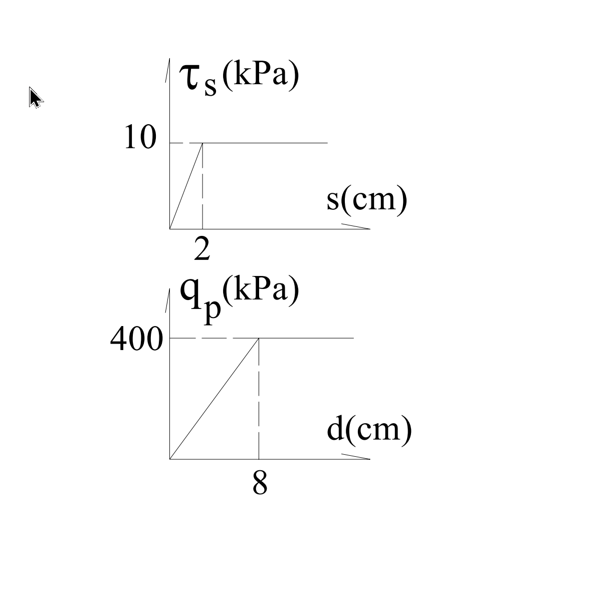

# 考題編號：SM-2005-4

**主分類：** `SM-U2-2` 深基礎之支承力與沉陷量
**副分類：** 無
**分析法：** 混合
**標籤：** `墩基` `樁基承載力` `端點承載力` `摩擦力` `極限載重` `位移限制` `變形相容`
---

## 1. 原始題目重述 (Problem Restatement)
有一墩基（pier）直徑為 $1.2\text{ m}$，長度為 $12\text{ m}$。其平均側向摩擦剪應力 $\tau_s$ 與剪位移 $s$ 關係，以及底部承載應力 $q_p$ 與位移 $d$ 關係如圖所示：
- $\tau_s - s$ 關係：位移 $2\text{ cm}$ 時達最大摩擦力 $10\text{ kPa}$，之前為線性。
- $q_p - d$ 關係：位移 $8\text{ cm}$ 時達最大端承力 $400\text{ kPa}$，之前為線性。

要求：
(一) 利用極限載重支承力（ultimate load bearing capacity）求工作荷重（working load）。（5 分）
(二) 利用位移限制為 $1\text{ cm}$ 與 $1.5\text{ cm}$ 分別求工作荷重。（10 分）
(三) 試檢討前述兩種方法之適當性。（10 分）

*圖說：上方圖為平均側向摩擦剪應力 $\tau_s$ 與剪位移 $s$ 關係，線性增長至 $s=2\text{ cm}$ 達到極限 $10\text{ kPa}$；下方圖為底部承載應力 $q_p$ 與位移 $d$ 關係，線性增長至 $d=8\text{ cm}$ 達到極限 $400\text{ kPa}$。*

## 2. 考題核心精神與出題者意圖 (Core Concepts & Examiner's Intent)
本題旨在測驗考生對於深基礎**「承載力發揮機制」**與**「變形相容（Strain Compatibility）」**的理解。
傳統的極限載重法是將極限側向摩擦力與極限端承力直接相加，再除以整體安全係數，但忽略了兩者要達到極限所需的變形量（位移）差異極大（通常側摩擦只需極小位移即可發揮，而端承力需要較大位移）。
出題者藉由給定荷重－位移曲線，要求考生利用變形限制（容許沉陷量）來反求工作荷重，並比較這兩種設計哲學的優劣與適當性，突顯以「位移控制」進行深基礎設計的重要性。

## 3. 解題戰略地圖與陷阱分析 (Strategic Roadmap & Trap Analysis)
**戰略地圖：**
1. **(一) 極限載重法：**
   - 從圖中讀取極限剪應力 $\tau_{s,max} = 10\text{ kPa}$ 與極限端承應力 $q_{p,max} = 400\text{ kPa}$。
   - 計算樁身側面積 $A_s$ 與端面積 $A_p$。
   - 計算極限承載力 $Q_u = \tau_{s,max} A_s + q_{p,max} A_p$。
   - 除以安全係數 $FS$ (通常取 $FS=3$) 得到工作荷重 $Q_{all}$。
2. **(二) 位移限制法：**
   - 假設樁為剛體，各部位向下位移量 $\Delta = s = d$。
   - 由圖形推導線性段方程式：$\tau_s = (10/2)s = 5\Delta$ 及 $q_p = (400/8)d = 50\Delta$。
   - 分別代入 $\Delta = 1\text{ cm}$ 及 $\Delta = 1.5\text{ cm}$ 計算當時發揮的 $\tau_s$ 與 $q_p$。
   - 計算對應之工作荷重。
3. **(三) 適當性檢討：**
   - 比較兩種方法的物理意義（是否考慮變形相容），並闡述為何後者較合理。

**陷阱分析：**
- **安全係數的假設：** 題目在第(一)小題並未明確給定安全係數 $FS$，考生須自行假設合理值（如 $FS=3$）並寫出假設前提。
- **剛體假設：** 第(二)小題須假設墩基本身為剛體（忽略彈性壓縮變形），才能認定側向剪位移 $s$ 與底部端點位移 $d$ 相等。
- **單位換算：** 計算 $\tau_s$ 與 $q_p$ 的函數關係時要注意位移單位是 $\text{cm}$，而面積使用 $\text{m}^2$，算出的承載力單位為 $\text{kN}$。

## 3.5 變數層次分析 (Variable Hierarchy Analysis)

### 最終目標
分別利用極限承載力與位移限制求取樁之工作荷重，並評估兩方法之合理性。

### 本題關鍵公式（依計算順序）
極限承載力：
$$ Q_u = \tau_{s,max} (\pi D L) + q_{p,max} \left(\frac{\pi}{4} D^2\right) $$
工作荷重（極限法）：
$$ Q_{all} = \frac{\boxed{Q_u}}{FS} $$
應變相容下之承載力（位移 $\Delta$）：
$$ Q(\Delta) = \tau_s(\Delta) \cdot (\pi D L) + q_p(\Delta) \cdot \left(\frac{\pi}{4} D^2\right) $$

### L1：題目直接給定
| 符號 | 數值 | 說明 |
|---|---|---|
| $D$ | $1.2 \text{ m}$ | 墩基直徑 |
| $L$ | $12 \text{ m}$ | 墩基長度 |
| $\tau_{s,max}$ | $10 \text{ kPa}$ | 側向極限摩擦應力 (發揮位移 $2\text{cm}$) |
| $q_{p,max}$ | $400 \text{ kPa}$ | 底部極限端承應力 (發揮位移 $8\text{cm}$) |

### L2：需知識點推導
**1. 幾何參數計算**
| 符號 | 公式／來源 | 卡關? |
|---|---|---|
| $A_s$ | $A_s = \pi D L$ | |
| $A_p$ | $A_p = \frac{\pi}{4} D^2$ | |

**2. 承載力隨位移之函數**
| 符號 | 公式／來源 | 卡關? |
|---|---|---|
| $\tau_s(\Delta)$ | 當 $\Delta \le 2\text{ cm}$，$\tau_s = \frac{10}{2}\Delta$ | |
| $q_p(\Delta)$ | 當 $\Delta \le 8\text{ cm}$，$q_p = \frac{400}{8}\Delta$ | |

### L3：深層知識（不懂就卡住）
| 知識點 | 說明 | 卡關? |
|---|---|---|
| 變形相容 (Strain Compatibility) | 樁身各點在不同深度或介面產生的位移，對應激發出不同程度的土壤剪力。忽略自身壓縮變形時，全樁位移量一致。 | |
| 整體安全係數之局限 | 傳統 $FS$ 無法反映摩擦力與端承力在同一工作位移下發揮程度不同的事實。 | |

## 4. 步驟化詳細計算過程 (Step-by-Step Detailed Calculation)

### (一) 利用極限載重支承力求工作荷重
1. **計算樁側面積與端面積：**
   $$ A_s = \pi \cdot D \cdot L = \pi \cdot 1.2 \cdot 12 = 14.4\pi \text{ m}^2 \approx 45.239 \text{ m}^2 $$
   $$ A_p = \frac{\pi}{4} \cdot D^2 = \frac{\pi}{4} \cdot (1.2)^2 = 0.36\pi \text{ m}^2 \approx 1.131 \text{ m}^2 $$

2. **計算極限支承力 $Q_u$：**
   由圖中讀出：極限側摩擦應力 $\tau_{s,max} = 10 \text{ kPa}$，極限端承應力 $q_{p,max} = 400 \text{ kPa}$。
   $$ Q_u = Q_{s,max} + Q_{p,max} = \tau_{s,max} A_s + q_{p,max} A_p $$
   $$ Q_u = 10 \times 14.4\pi + 400 \times 0.36\pi = 144\pi + 144\pi = 288\pi \text{ kN} $$
   $$ Q_u \approx 904.78 \text{ kN} $$

3. **求工作荷重 $Q_{all}$：**
   題目未給定安全係數 $FS$，依一般深基礎設計慣例，通常取 $FS = 3$。
   $$ Q_{all} = \frac{Q_u}{FS} = \frac{288\pi}{3} = 96\pi \text{ kN} \approx \boxed{301.59 \text{ kN}} $$
   *(註：若取 $FS=2.5$，則為 $361.91 \text{ kN}$，一般建議明列所假設之 $FS$ 值。)*

### (二) 利用位移限制求工作荷重
假設墩基本身為剛體（忽略樁身彈性壓縮變形），則樁側剪位移 $s$ 與底部位移 $d$ 皆等於總沉陷位移 $\Delta$。
由題意線性關係可得應力函數：
- 側摩擦：$\tau_s(\Delta) = \frac{10}{2} \cdot \Delta = 5\Delta \text{ (kPa)}$ ，其中 $\Delta \le 2\text{ cm}$
- 端承力：$q_p(\Delta) = \frac{400}{8} \cdot \Delta = 50\Delta \text{ (kPa)}$ ，其中 $\Delta \le 8\text{ cm}$

1. **位移限制為 $\Delta = 1\text{ cm}$ 時：**
   $$ \tau_s = 5 \times 1 = 5 \text{ kPa} $$
   $$ q_p = 50 \times 1 = 50 \text{ kPa} $$
   對應之工作荷重：
   $$ Q_1 = \tau_s A_s + q_p A_p = (5 \times 14.4\pi) + (50 \times 0.36\pi) $$
   $$ Q_1 = 72\pi + 18\pi = 90\pi \text{ kN} \approx \boxed{282.74 \text{ kN}} $$

2. **位移限制為 $\Delta = 1.5\text{ cm}$ 時：**
   $$ \tau_s = 5 \times 1.5 = 7.5 \text{ kPa} $$
   $$ q_p = 50 \times 1.5 = 75 \text{ kPa} $$
   對應之工作荷重：
   $$ Q_{1.5} = \tau_s A_s + q_p A_p = (7.5 \times 14.4\pi) + (75 \times 0.36\pi) $$
   $$ Q_{1.5} = 108\pi + 27\pi = 135\pi \text{ kN} \approx \boxed{424.12 \text{ kN}} $$

### (三) 試檢討前述兩種方法之適當性
1. **極限載重法（方法一）：**
   - **缺點：** 此法將最大的摩擦力與端承力直接相加作為極限承載力。然而，從題圖可知，摩擦力發揮到極限僅需 $2\text{ cm}$ 位移，端承力發揮到極限卻需 $8\text{ cm}$ 位移。當基礎位移達到 $8\text{ cm}$ 時，側向土壤極可能已進入大變形破壞（甚至軟化/殘餘強度狀態）；而在工作荷重下，也無法保證樁的實際變形會落在結構容許的沉陷量內。
   - **適當性：** 較不適當。該法忽略了樁周土壤與端部土壤的「變形相容性（Strain Compatibility）」，可能高估了工作狀態下的實際安全度或導致過大的變形。

2. **位移限制法（方法二）：**
   - **優點：** 這種方法（或稱荷重—沉陷法）在給定同一位移時，計算各部分實際能激發的抵抗力。如此不僅確保了變形相容，也直接控制了工程結構最關心的「沉陷量」。
   - **適當性：** 較為適當且符合實務精神。在實際基礎設計中，結構物的容許沉陷量往往是控制設計條件的關鍵。根據地質參數建立荷重-位移曲線，再由容許沉陷量反推安全的工作荷重，能確保上部結構在長期使用下不會發生因變形過大而破壞的情況。

## 5. 關鍵爭議點與進階探討 (Critical Issues & Advanced Discussion)
- **整體安全係數與部分安全係數：** 在極限載重法中，由於摩擦力與端承力的位移特性相差懸殊，有些規範會要求分別採用不同的安全係數，例如對端承力取較高的 $FS$（如 $FS_p=3$），對側摩擦取較低的 $FS$（如 $FS_s=1.5$ 或 $2$），再進行加總。此種考量稍微彌補了傳統極限法的缺陷。
- **樁身壓縮量的影響：** 本題計算位移限制時，隱含了「樁基為剛體（Rigid Body）」的假設。但在實際深且長的樁基礎中，樁身受到載重會產生顯著的彈性壓縮變形（Elastic Shortening），導致樁頂的位移大於樁底的位移（$s \ne d$ 且隨深度變化）。實務上常使用 $t-z$ 曲線（側向荷重-位移）及 $Q-z$ 曲線（端部荷重-位移）進行有限差分分析，以得到更精確的沉陷量評估。
