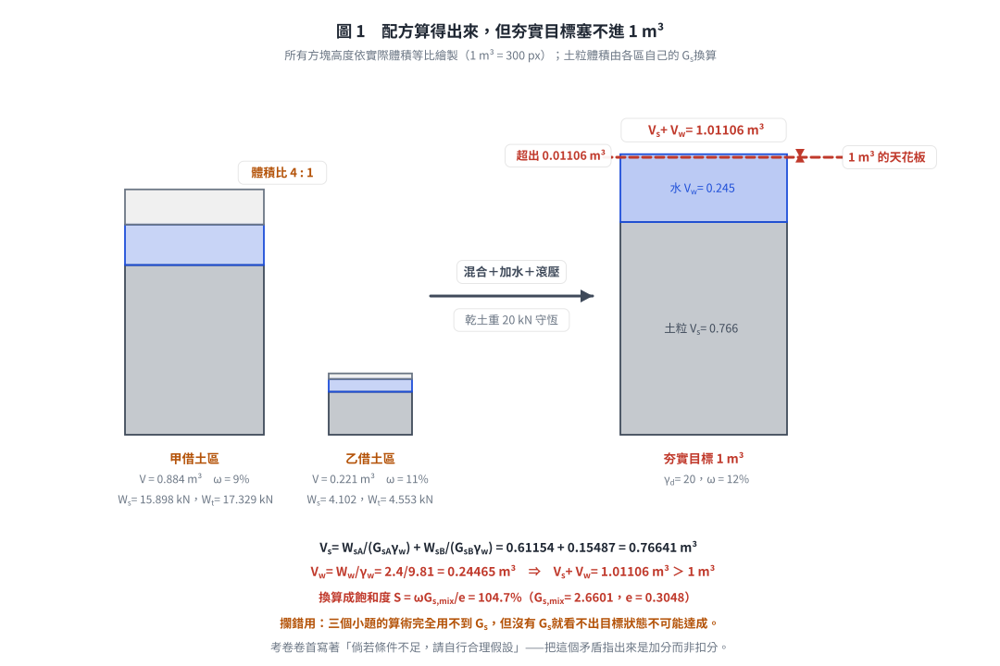
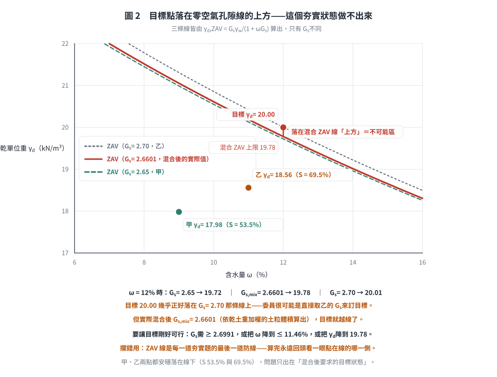

# 考題編號：SM-2008-1

**主分類：** `SM-U1-1` 土壤基本性質
**副分類：** `SM-U1-3` 土壤夯實及壓密
**分析法：** 混合
**標籤：** `三相關係` `乾單位重` `含水量` `乾土重守恆` `體積比` `加水量` `夯實`
---

## 1. 原始題目重述 (Problem Restatement)
高速公路某路段的路堤填方工程需從甲借土區和乙借土區進行借土，借土區土壤基本性質如附表所示。為考慮整體路段夯實土壤強度與變形的一致性，施工規範要求甲、乙土壤先以 4:1 之體積比混合後再進行滾壓，且經滾壓後土壤之含水量 $\omega=12\%$，乾土單位重 $\gamma_d = 20 \text{ kN/m}^3$。試問 $1 \text{ m}^3$ 之夯實土需甲、乙兩借土區土壤各多少體積與重量？$1 \text{ m}^3$ 之夯實土需加多少水？（25 分）

**附表：借土區土壤基本性質**
| 借土區 | 含水量, $\omega(\%)$ | 單位重, $\gamma_t \text{ (kN/m}^3\text{)}$ | 比重, $G_s$ |
|---|---|---|---|
| 甲 | 9% | 19.6 | 2.65 |
| 乙 | 11% | 20.6 | 2.70 |

## 2. 考題核心精神與出題者意圖 (Core Concepts & Examiner's Intent)
本題測驗的核心為「三相圖關係」與「夯實配方計算」。出題者藉由給定借土區的含水量與濕單位重，要求考生推算乾土重與水量，並利用「體積混合比例」結合「目標夯實密度」來建立聯立方程式。
出題者意圖包含：
1. 測驗由濕單位重與含水量換算乾單位重之能力。
2. 測驗質量（重量）守恆觀念：夯實前後，**乾土重量守恆**。
3. 測驗添加水量的觀念：目標水重扣除土壤原有水重即為應加水重。
4. **測驗考生會不會拿 $G_s$ 去檢核可行性。** 三個小題的算術確實用不到 $G_s$，但它是唯一能回答
   「這個夯實目標做得到嗎」的參數——本題的答案是**做不到**（$S = 104.7\% > 100\%$，見 §5）。

## 3. 解題戰略地圖與陷阱分析 (Strategic Roadmap & Trap Analysis)
**戰略地圖：**
1. 將目標夯實土的條件展開，求出 $1 \text{ m}^3$ 夯實土所需的「總乾土重」與「總水重」。
2. 將甲、乙兩借土區的濕單位重與含水量，換算為各自的「乾單位重」。
3. 根據甲、乙借土體積比 4:1，假設乙借土體積為 $V_B$，甲為 $4V_B$。
4. 以「甲乾土重 + 乙乾土重 = 總乾土重」建立方程式，解出 $V_B$。進而求出兩借土區的體積與總重量。
5. 計算甲、乙兩借土區原始含有的水重。
6. 將目標總水重減去兩區原始水重，即為應添加的水量。

**陷阱分析：**
1. **體積比與重量比的混淆**：題目所稱「以 4:1 之體積比混合」，是指在**借土區開挖的自然體積（原狀體積）**之比，而非乾體積或夯實後體積之比。
2. **$G_s$ 不是干擾項，是檢核用的**：求體積、重量與加水量這三個答案確實用不到 $G_s$，
   但寫完答案後應該花 30 秒拿它驗一次「土粒體積 ＋ 水體積 是否塞得進 $1 \text{ m}^3$」。
   本題驗下去會發現塞不進（超出 1.1%），亦即考卷指定的夯實目標超過零空氣孔隙線。
   **在考卷已寫明「倘若條件不足，請自行合理假設」的情況下，把這個矛盾指出來是加分而非扣分。**

## 3.5 變數層次分析 (Variable Hierarchy Analysis)

### 最終目標
求出 $1 \text{ m}^3$ 夯實土所需甲、乙借土區的體積、重量，以及所需添加的水重。

### 本題關鍵公式（依計算順序）
1. 夯實土目標乾重：$W_s = \gamma_d \times V_c$
2. 夯實土目標水重：$W_w = \boxed{W_s} \times \omega_c$
3. 借土區乾單位重：$\gamma_{di} = \frac{\gamma_{ti}}{1 + \omega_i}$
4. 依體積比建立乾土重守恆方程式：$\boxed{\gamma_{dA}} (4V_B) + \boxed{\gamma_{dB}} V_B = \boxed{W_s}$
5. 借土區原總重量：$W_{ti} = \gamma_{ti} \times V_i$
6. 借土區原有水重：$W_{wi} = W_{ti} - W_{si}$ 或 $W_{wi} = W_{si} \times \omega_i$
7. 添加水重：$\Delta W_w = \boxed{W_w} - (\boxed{W_{wA}} + \boxed{W_{wB}})$

### L1：題目直接給定
| 符號 | 數值 | 說明 |
|---|---|---|
| $V_c$ | $1 \text{ m}^3$ | 夯實土目標體積 |
| $\gamma_d$ | $20 \text{ kN/m}^3$ | 夯實土目標乾單位重 |
| $\omega_c$ | $12\%$ | 夯實土目標含水量 |
| $V_A:V_B$ | $4:1$ | 甲、乙借土體積比 |
| $\omega_A$ | $9\%$ | 甲借土區含水量 |
| $\gamma_{tA}$ | $19.6 \text{ kN/m}^3$ | 甲借土區單位重 |
| $\omega_B$ | $11\%$ | 乙借土區含水量 |
| $\gamma_{tB}$ | $20.6 \text{ kN/m}^3$ | 乙借土區單位重 |

### L2：需知識點推導
**目標狀態參數**
| 符號 | 公式／來源 | 卡關? |
|---|---|---|
| $W_s$ | $W_s = \gamma_d \times V_c$ | |
| $W_w$ | $W_w = W_s \times \omega_c$ | |

**借土區參數換算**
| 符號 | 公式／來源 | 卡關? |
|---|---|---|
| $\gamma_{dA}$ | $\gamma_{dA} = \frac{\gamma_{tA}}{1 + \omega_A}$ | |
| $\gamma_{dB}$ | $\gamma_{dB} = \frac{\gamma_{tB}}{1 + \omega_B}$ | |

**體積與重量計算**
| 符號 | 公式／來源 | 卡關? |
|---|---|---|
| $V_B$ | 由 $\gamma_{dA}(4V_B) + \gamma_{dB}V_B = W_s$ 求解 | |
| $V_A$ | $V_A = 4V_B$ | |
| $W_{tA}$ | $W_{tA} = \gamma_{tA} \times V_A$ | |
| $W_{tB}$ | $W_{tB} = \gamma_{tB} \times V_B$ | |

**加水量計算**
| 符號 | 公式／來源 | 卡關? |
|---|---|---|
| $W_{wA}$ | $W_{wA} = \gamma_{dA} V_A \times \omega_A$ | |
| $W_{wB}$ | $W_{wB} = \gamma_{dB} V_B \times \omega_B$ | |
| $\Delta W_w$ | $\Delta W_w = W_w - W_{wA} - W_{wB}$ | |

### L3：深層知識（不懂就卡住）
| 知識點 | 說明 | 卡關? |
|---|---|---|
| 乾重量守恆 | 夯實過程體積改變，但土粒質量（重量）不變，需以「乾土重」做為連結各狀態的橋梁。 | |
| 濕單位重轉換乾單位重 | 知道 $\gamma_d = \frac{\gamma_t}{1+\omega}$ 即可將現場取得的單位重轉換為不受水分影響的乾單位重。 | |

## 4. 步驟化詳細計算過程 (Step-by-Step Detailed Calculation)

**Step 1: 計算 $1 \text{ m}^3$ 目標夯實土之需求量**
- 目標乾土重：
  $$W_s = \gamma_d \times V_c = 20 \times 1 = 20 \text{ kN}$$
- 目標總水重：
  $$W_w = W_s \times \omega_c = 20 \times 0.12 = 2.4 \text{ kN}$$

**Step 2: 計算甲、乙兩借土區的乾單位重**
- 甲借土區乾單位重：
  $$\gamma_{dA} = \frac{\gamma_{tA}}{1 + \omega_A} = \frac{19.6}{1 + 0.09} = 17.9817 \text{ kN/m}^3$$
- 乙借土區乾單位重：
  $$\gamma_{dB} = \frac{\gamma_{tB}}{1 + \omega_B} = \frac{20.6}{1 + 0.11} = 18.5586 \text{ kN/m}^3$$

**Step 3: 依體積比求所需借土體積**
假設乙借土區所需體積為 $V_B$，依題意體積比 $V_A : V_B = 4 : 1$，故甲借土區所需體積為 $V_A = 4V_B$。
藉由乾土重守恆（甲乾土重 + 乙乾土重 = 目標乾土重）建立方程式：
$$W_{sA} + W_{sB} = W_s$$
$$\gamma_{dA} V_A + \gamma_{dB} V_B = 20$$
$$17.9817(4V_B) + 18.5586(V_B) = 20$$
$$(71.9268 + 18.5586)V_B = 20$$
$$90.4854 V_B = 20$$
解得：
$$V_B = 0.2210 \text{ m}^3$$
$$V_A = 4 \times 0.2210 = 0.8841 \text{ m}^3$$
> **答：1 $\text{m}^3$ 夯實土需甲土壤體積 $\boxed{0.884 \text{ m}^3}$，需乙土壤體積 $\boxed{0.221 \text{ m}^3}$。**

**Step 4: 計算甲、乙借土所需之總重量**
- 甲土壤總重量：
  $$W_{tA} = \gamma_{tA} \times V_A = 19.6 \times 0.8841 = 17.328 \text{ kN}$$
- 乙土壤總重量：
  $$W_{tB} = \gamma_{tB} \times V_B = 20.6 \times 0.2210 = 4.553 \text{ kN}$$
> **答：1 $\text{m}^3$ 夯實土需甲土壤重量 $\boxed{17.328 \text{ kN}}$，需乙土壤重量 $\boxed{4.553 \text{ kN}}$。**

**Step 5: 計算需添加之水量**
- 甲土壤原有水重：
  $$W_{wA} = W_{sA} \times \omega_A = (17.9817 \times 0.8841) \times 0.09 = 15.898 \times 0.09 = 1.431 \text{ kN}$$
- 乙土壤原有水重：
  $$W_{wB} = W_{sB} \times \omega_B = (18.5586 \times 0.2210) \times 0.11 = 4.101 \times 0.11 = 0.451 \text{ kN}$$
- 所需添加水重：
  $$\Delta W_w = W_w - (W_{wA} + W_{wB}) = 2.4 - (1.431 + 0.451) = 2.4 - 1.882 = 0.518 \text{ kN}$$
若以體積表示（假設 $\gamma_w = 9.81 \text{ kN/m}^3$）：
  $$V_w = \frac{\Delta W_w}{\gamma_w} = \frac{0.518}{9.81} = 0.0528 \text{ m}^3 = 52.8 \text{ L}$$
> **答：1 $\text{m}^3$ 夯實土需加水重量為 $\boxed{0.518 \text{ kN}}$（約 $52.8 \text{ 公升}$）。**

*圖 1　配方算得出來，但夯實目標塞不進 $1 \text{ m}^3$。它攔的是「$G_s$ 是干擾項」這個誤解：三個小題的算術確實用不到 $G_s$，但沒有它就看不出土粒加水已經超出 $1 \text{ m}^3$ 一成一（$S = 104.7\%$）。*

## 5. 關鍵爭議點與進階探討 (Critical Issues & Advanced Discussion)
- **⚠️ 首要爭議點：考卷指定的夯實目標（$\gamma_d = 20 \text{ kN/m}^3$、$\omega = 12\%$）物理上做不到**

  三個小題的算術不需要 $G_s$，但拿 $G_s$ 一驗就會發現目標狀態超過零空氣孔隙線：

  **① 先求混合土的土粒體積**（各borrow區的土粒體積相加，因為兩者 $G_s$ 不同，不能直接平均）：
  $$V_{sA} = \frac{W_{sA}}{G_{sA}\gamma_w} = \frac{15.898}{2.65 \times 9.81} = 0.61154 \text{ m}^3$$
  $$V_{sB} = \frac{W_{sB}}{G_{sB}\gamma_w} = \frac{4.102}{2.70 \times 9.81} = 0.15487 \text{ m}^3$$
  $$V_s = 0.61154 + 0.15487 = 0.76641 \text{ m}^3
  \quad\Rightarrow\quad G_{s,mix} = \frac{20}{0.76641 \times 9.81} = 2.660$$

  **② 再看目標水體積塞不塞得下**：
  $$V_w = \frac{W_w}{\gamma_w} = \frac{2.4}{9.81} = 0.24465 \text{ m}^3$$
  $$V_s + V_w = 0.76641 + 0.24465 = \boxed{1.01106 \text{ m}^3 \;>\; 1 \text{ m}^3}$$

  **土粒加水已經超出 $1 \text{ m}^3$ 一成一，連一點空氣都容不下。** 換算成飽和度：
  $$e = \frac{G_{s,mix}\gamma_w}{\gamma_d} - 1 = \frac{2.660 \times 9.81}{20} - 1 = 0.3048
  \quad,\quad S = \frac{\omega G_{s,mix}}{e} = \frac{0.12 \times 2.660}{0.3048} = 104.7\%$$

  **③ 換個角度看同一件事**——$\omega = 12\%$ 時的零空氣孔隙（ZAV）乾單位重上限為：
  $$\gamma_{d,ZAV} = \frac{G_{s,mix}\gamma_w}{1 + \omega G_{s,mix}}
  = \frac{2.660 \times 9.81}{1 + 0.12 \times 2.660} = \frac{26.096}{1.3192} = 19.78 \text{ kN/m}^3$$
  題目要求的 $20 \text{ kN/m}^3$ 已超過此上限。若要讓目標剛好可行，需 $G_{s,mix} \ge 2.699$
  （實際只有 2.660），或把含水量降到 $\omega \le 11.46\%$。

  **④ 考場上該怎麼寫**：三個小題照常作答（那是題目要的），最後補一段檢核並註明
  「依附表之 $G_s$，本目標夯實狀態之 $S = 104.7\% > 100\%$，實務上無法達成；
  建議或將 $\gamma_d$ 降至 $19.78 \text{ kN/m}^3$，或將 $\omega$ 降至 $11.46\%$」。
  本卷卷首已明寫「倘若條件不足，請自行合理假設」，指出並處理這個矛盾是加分項。

  > 對照組：甲借土區 $S = 53.5\%$、乙借土區 $S = 69.5\%$，兩者都在合理範圍，
  > 問題只出在「混合後要求的目標狀態」。

*圖 2　目標點落在零空氣孔隙線的上方。它攔的是「算完就交卷」：$\omega = 12\%$ 時，$G_s = 2.70$ 的 ZAV 恰為 20.01——目標 20.00 幾乎正好貼在那條線上，可以合理推測委員是直接取乙的 $G_s$ 來訂目標；但混合後的實際 $G_{s,mix} = 2.6601$，上限只有 19.78，目標就越線了。甲、乙兩點本身都安穩落在線下，問題只出在混合後要求的目標狀態。*
- **水量單位表示：** 題目詢問「加多少水」，一般土壤力學計算上回答水重量（kN）即為正確解答。但實務施工時常以體積計量加水，故順帶換算為體積（L 或 m³）能讓答案更為完整與實用。

---

*解析日期：見 `wiki/log.md`　｜　圖解補繪：2026-08-28（向量 SVG，程式繪製，腳本 `gen_SM-2008-1.py` 可重跑；同名 2× PNG 供簡報／影片管線使用）*
