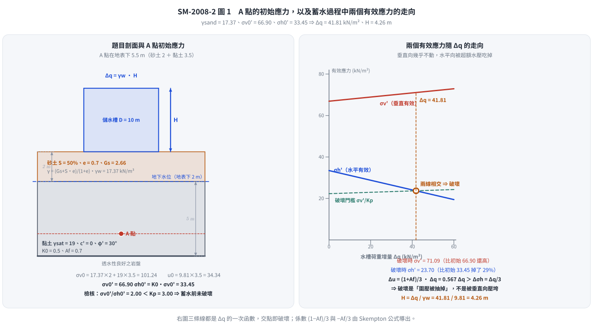
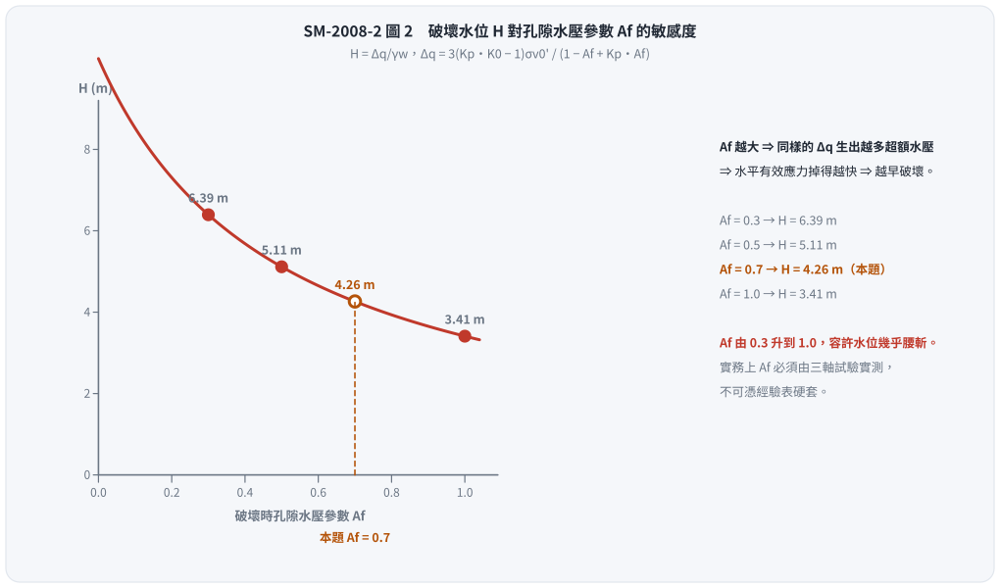

# 考題編號：SM-2008-2

**主分類：** `SM-U1-5` 土壤強度特性與變形性
**副分類：** `SM-U1-4` 土體內應力
**分析法：** 混合
**標籤：** `Skempton孔隙水壓參數` `Mohr-Coulomb破壞準則` `有效應力原理` `應力增量` `孔隙水壓` `靜止土壓力`

---

## 1. 原始題目重述
二、有一工廠為解決用水問題，擬興建一內徑 D=10 m 之儲水槽，如圖一所示。由試驗得知砂土層之飽和度 S=50%，孔隙比 e=0.7，比重 Gs=2.66；黏土層之飽和單位重γsat=19 kN/m³。已知蓄水的荷重增量 Δq 造成圖中 A 點垂直應力增量 Δσv 和水平應力增量 Δσh 分別為 1.5Δσv=3Δσh=Δq。已知黏土層有效凝聚力 c'=0，有效摩擦角φ'=30°，靜止土壓力係數 K0=0.5，破壞時之孔隙水壓力參數 Af=0.7，地下水位於地表下 2 m。試問水槽中的水位 H 上升至多高時黏土中的 A 點產生破壞？（25 分）
（註：假設水槽自重不計，且水位快速上升）

*圖說：本圖顯示一內徑 10 m 儲水槽置於地表。地層分為兩層，上層為 2 m 厚砂土，地下水位於地表下 2 m 處；下層為 5 m 厚黏土。A 點位於黏土層內，距黏土層頂部深 3.5 m（砂土 2 m + 黏土 3.5 m = 距地表深 5.5 m）。*

## 2. 考題核心精神與出題者意圖
這是一道結合「應力增量」、「Skempton 孔隙水壓參數」與「有效應力破壞準則」的綜合題。
出題者旨在測驗考生是否了解：
1. 短期不排水加載（水位快速上升）時，土壤內會產生超額孔隙水壓力，其大小可用 Skempton 參數 $A_f$ 與 $B$ 估算。
2. 土壤真正的破壞是由「有效應力」控制，即便是在不排水條件下，只要能推算出現場的孔隙水壓，就能將總應力轉換為有效應力，並代入 Mohr-Coulomb 有效應力破壞準則判斷是否破壞。
3. 題目雖給了直徑 D=10 m，但又直接給定了應力增量與 $\Delta q$ 的關係式，測驗考生能否直接利用已知關係式建立代數方程式求解。

## 3. 解題戰略地圖與陷阱分析
1. **計算初始有效應力**：先依據土層參數求出 A 點的初始總應力 $\sigma_{v0}$ 與水壓 $u_0$，得出初始垂直有效應力 $\sigma'_{v0}$。再利用靜止土壓力係數 $K_0$ 求出初始水平有效應力 $\sigma'_{h0}$。
2. **計算總應力增量與超額水壓**：根據題目給定條件，以水槽荷重增量 $\Delta q$ 表示 $\Delta\sigma_v$ 與 $\Delta\sigma_h$。由於黏土飽和，取 $B=1$，代入 Skempton 孔隙水壓公式 $\Delta u = \Delta\sigma_3 + A_f(\Delta\sigma_1 - \Delta\sigma_3)$ 求出破壞時的超額孔隙水壓。
3. **建立破壞時的有效應力**：將初始有效應力加上總應力增量，再扣除超額孔隙水壓，得到破壞時的垂直與水平有效應力 $\sigma'_{vf}$、$\sigma'_{hf}$（皆為 $\Delta q$ 的函數）。
4. **代入破壞準則求解**：將 $\sigma'_{vf}$ 與 $\sigma'_{hf}$ 代入 $c'=0, \phi'=30^\circ$ 的 Mohr-Coulomb 破壞準則，解出 $\Delta q$，進而換算為水深 $H$。

**陷阱分析**：
- **陷阱 1**：將 $\Delta\sigma_v$ 直接當作有效應力增量。這是未排水加載，必須扣除 $\Delta u$ 才能得到有效應力增量。
- **陷阱 2**：忽略砂土層的水位條件。砂土層在地下水位以上，飽和度 S=50%，需使用公式 $\gamma_t = (G_s + Se)\gamma_w / (1+e)$ 準確計算單位重，不能當作乾土或全飽和。
- **陷阱 3**：$\Delta\sigma_1$ 與 $\Delta\sigma_3$ 的判定。由於 $\Delta\sigma_v = 2/3 \Delta q$ 大於 $\Delta\sigma_h = 1/3 \Delta q$，且初始 $\sigma'_{v0} > \sigma'_{h0}$，故加載過程中垂直方向始終為大主應力，水平方向為小主應力。若搞錯 $A_f$ 公式中括號內的相減順序會導致錯誤。

## 3.5 變數層次分析

### 最終目標
計算水槽水位上升的高度 $H$，使得黏土層內的 A 點達到剪力破壞。

### 本題關鍵公式（依計算順序）
初始有效應力：
$\sigma_{v0}' = \sigma_{v0} - u_0$
$\sigma_{h0}' = K_0 \cdot \boxed{\sigma_{v0}'}$

加載後應力與水壓增量：
$\Delta u = \Delta \sigma_h + A_f (\Delta \sigma_v - \Delta \sigma_h)$

破壞時有效應力狀態：
$\sigma_{vf}' = \boxed{\sigma_{v0}'} + \Delta \sigma_v - \boxed{\Delta u}$
$\sigma_{hf}' = \boxed{\sigma_{h0}'} + \Delta \sigma_h - \boxed{\Delta u}$

Mohr-Coulomb 破壞準則：
$\boxed{\sigma_{vf}'} = \boxed{\sigma_{hf}'} \tan^2\left(45^\circ + \frac{\phi'}{2}\right) + 2c' \tan\left(45^\circ + \frac{\phi'}{2}\right)$

### L1：題目直接給定
| 符號 | 數值 | 說明 |
|---|---|---|
| $S_{sand}$ | 50% | 砂土飽和度 |
| $e$ | 0.7 | 砂土孔隙比 |
| $G_s$ | 2.66 | 砂土比重 |
| $\gamma_{sat,clay}$ | 19 $\text{kN/m}^3$ | 黏土飽和單位重 |
| $z_{sand}$ | 2 m | 砂土層厚度（水表上） |
| $z_{clay}$ | 3.5 m | 黏土層中A點深度 |
| $c'$ | 0 | 黏土有效凝聚力 |
| $\phi'$ | $30^\circ$ | 黏土有效摩擦角 |
| $K_0$ | 0.5 | 靜止土壓力係數 |
| $A_f$ | 0.7 | 破壞時之孔隙水壓力參數 |
| $\Delta\sigma_v$ | $\frac{2}{3}\Delta q$ | 垂直應力增量 |
| $\Delta\sigma_h$ | $\frac{1}{3}\Delta q$ | 水平應力增量 |

### L2：需知識點推導
**初始應力計算**
| 符號 | 公式／來源 | 卡關? |
|---|---|---|
| $\gamma_{sand}$ | $\frac{G_s + S \cdot e}{1+e}\gamma_w$ | |
| $\sigma_{v0}'$ | $\sum \gamma \Delta z - \gamma_w z_w$ | |
| $\sigma_{h0}'$ | $K_0 \cdot \sigma_{v0}'$ | |

**應力與水壓增量計算**
| 符號 | 公式／來源 | 卡關? |
|---|---|---|
| $\Delta u$ | $B[\Delta\sigma_3 + A_f(\Delta\sigma_1 - \Delta\sigma_3)]$ (取 B=1) | |
| $\sigma_{1f}'$ | $\sigma_{v0}' + \Delta\sigma_v - \Delta u$ | |
| $\sigma_{3f}'$ | $\sigma_{h0}' + \Delta\sigma_h - \Delta u$ | |

**破壞高度計算**
| 符號 | 公式／來源 | 卡關? |
|---|---|---|
| $\Delta q$ | $\sigma_{1f}' = \sigma_{3f}' \tan^2(45^\circ+\phi'/2)$ 解方程式 | |
| $H$ | $\Delta q / \gamma_w$ | |

### L3：深層知識（不懂就卡住）
| 知識點 | 說明 | 卡關? |
|---|---|---|
| 快速加載下的不排水分析 | 「快速上升」表示土壤不排水加載，需使用 Skempton 公式求 $\Delta u$，並由有效應力準則判斷破壞。 | |
| Skempton 參數 B 的取值 | 題目未給 B 值，但黏土層位於地下水位以下，為完全飽和，故隱含 $B = 1$。 | |
| 主應力方向判斷 | 加載點在圓形基礎中心線上，對稱性使剪應力為零，垂直與水平即為主應力方向。由於 $\sigma_v > \sigma_h$，故垂直為大主應力。 | |

## 4. 步驟化詳細計算過程

**Step 1: 砂土層單位重計算**
已知砂土層 $G_s = 2.66$，$e = 0.7$，$S = 50\% = 0.5$。
水的單位重取 $\gamma_w = 9.81 \text{ kN/m}^3$。
$$
\gamma_{sand} = \frac{G_s + S \cdot e}{1+e} \gamma_w = \frac{2.66 + 0.5 \times 0.7}{1 + 0.7} \times 9.81 = \frac{3.01}{1.7} \times 9.81 = 17.37 \text{ kN/m}^3
$$

**Step 2: A點初始有效應力計算**
A 點位於地表下 5.5 m 處（砂土 2 m + 黏土 3.5 m）。地下水位於地表下 2 m 處。
初始總垂直應力：
$$
\sigma_{v0} = \gamma_{sand} \times 2 + \gamma_{sat,clay} \times 3.5 = 17.37 \times 2 + 19 \times 3.5 = 34.74 + 66.50 = 101.24 \text{ kN/m}^2
$$
初始孔隙水壓力：
$$
u_0 = \gamma_w \times 3.5 = 9.81 \times 3.5 = 34.34 \text{ kN/m}^2
$$
初始垂直有效應力：
$$
\sigma_{v0}' = \sigma_{v0} - u_0 = 101.24 - 34.34 = 66.90 \text{ kN/m}^2
$$
初始水平有效應力：
$$
\sigma_{h0}' = K_0 \cdot \sigma_{v0}' = 0.5 \times 66.90 = 33.45 \text{ kN/m}^2
$$

**Step 3: 加載引起之應力與孔隙水壓增量**
假設水槽水深為 $H$，蓄水荷重增量 $\Delta q = \gamma_w H = 9.81 H$。
題目給定：
$$
1.5\Delta \sigma_v = \Delta q \implies \Delta \sigma_v = \frac{2}{3} \Delta q = 0.667 \Delta q
$$
$$
3\Delta \sigma_h = \Delta q \implies \Delta \sigma_h = \frac{1}{3} \Delta q = 0.333 \Delta q
$$
A 點位於水槽中心線正下方，無剪應力產生，且 $\Delta\sigma_v > \Delta\sigma_h$，故大主應力增量 $\Delta\sigma_1 = \Delta\sigma_v$，小主應力增量 $\Delta\sigma_3 = \Delta\sigma_h$。
由於黏土層完全飽和，Skempton 參數 $B = 1$。不排水加載產生之超額孔隙水壓 $\Delta u$：
$$
\Delta u = B[\Delta \sigma_3 + A_f (\Delta \sigma_1 - \Delta \sigma_3)] = 1 \cdot \left[ \frac{1}{3}\Delta q + 0.7 \left( \frac{2}{3}\Delta q - \frac{1}{3}\Delta q \right) \right]
$$
$$
\Delta u = \frac{1}{3}\Delta q + 0.7 \times \frac{1}{3}\Delta q = \frac{1.7}{3}\Delta q = 0.567 \Delta q
$$

**Step 4: 破壞時之有效應力狀態**
破壞時垂直有效應力（即大主應力 $\sigma_{1f}'$）：
$$
\sigma_{1f}' = \sigma_{vf}' = \sigma_{v0}' + \Delta \sigma_v - \Delta u = 66.90 + \frac{2}{3}\Delta q - \frac{1.7}{3}\Delta q = 66.90 + \frac{0.3}{3}\Delta q = 66.90 + 0.1 \Delta q
$$
破壞時水平有效應力（即小主應力 $\sigma_{3f}'$）：
$$
\sigma_{3f}' = \sigma_{hf}' = \sigma_{h0}' + \Delta \sigma_h - \Delta u = 33.45 + \frac{1}{3}\Delta q - \frac{1.7}{3}\Delta q = 33.45 - \frac{0.7}{3}\Delta q = 33.45 - 0.233 \Delta q
$$

**Step 5: 代入 Mohr-Coulomb 破壞準則求解**
黏土的有效強度參數為 $c' = 0$ 且 $\phi' = 30^\circ$。破壞準則為：
$$
\sigma_{1f}' = \sigma_{3f}' \tan^2\left(45^\circ + \frac{\phi'}{2}\right) + 2c' \tan\left(45^\circ + \frac{\phi'}{2}\right)
$$
代入數值 $\tan^2(45^\circ + 15^\circ) = \tan^2(60^\circ) = 3$：
$$
\sigma_{1f}' = 3 \sigma_{3f}'
$$
$$
66.90 + 0.1 \Delta q = 3 \left( 33.45 - \frac{0.7}{3} \Delta q \right)
$$
$$
66.90 + 0.1 \Delta q = 100.35 - 0.7 \Delta q
$$
$$
0.8 \Delta q = 33.45 \implies \Delta q = 41.81 \text{ kN/m}^2
$$

將 $\Delta q = \gamma_w H$ 帶入求 $H$：
$$
H = \frac{\Delta q}{\gamma_w} = \frac{41.81}{9.81} = \boxed{4.26 \text{ m}}
$$

*圖 1　右圖把「破壞是怎麼發生的」畫出來：垂直有效應力其實幾乎沒漲（$+0.1\Delta q$），是水平有效應力被超額水壓吃掉（$-0.233\Delta q$）才讓莫爾圓長胖到碰上包絡線。這張圖攔的是把 $\Delta\sigma_v$ 直接當成有效應力增量（會以為越蓄水越安全），也攔砂土層單位重用錯（$S = 50\%$ 必須用 $\gamma = \frac{G_s + Se}{1+e}\gamma_w$，不是乾土或飽和土單位重）。*

## 5. 關鍵爭議點與進階探討
- **破壞的真正機制：不是「壓垮」，是水平有效應力被水壓吃掉**：把 Step 4 的兩個結果攤開看——
  $\sigma_v'$ 由 $66.90 \to 71.09 \text{ kPa}$（**增加** 4.19），$\sigma_h'$ 由 $33.45 \to 23.70 \text{ kPa}$（**減少** 9.75）。
  蓄水明明是往下壓，垂直有效應力卻幾乎沒漲，水平有效應力反而掉了三成。原因是超額水壓
  $\Delta u = 0.567\Delta q$ 比水平總應力增量 $\Delta\sigma_h = 0.333\Delta q$ 還大，兩者相減為負。
  換句話說，**是圍壓被抽掉、莫爾圓往左長胖，而不是被垂直向壓破的**。看懂這件事，第 3、4 步就不會把 $\Delta u$ 漏掉或加錯號。
- **封閉解與 $A_f$ 敏感度（可當作驗算，也是口試常問）**：把 $\Delta u = \frac{1+A_f}{3}\Delta q$ 代入破壞條件 $\sigma_{1f}' = K_p \sigma_{3f}'$ 並解 $\Delta q$，可得
  $$\Delta q = \frac{3\,(K_p K_0 - 1)\,\sigma_{v0}'}{1 - A_f + K_p A_f}$$
  代入本題（$K_p = 3$、$K_0 = 0.5$、$\sigma_{v0}' = 66.90$、$A_f = 0.7$）：$\Delta q = \frac{3 \times 0.5 \times 66.90}{0.3 + 2.1} = \frac{100.36}{2.4} = 41.82 \text{ kN/m}^2$，與 Step 5 逐步解出的完全相同。
  由此式可讀出 $A_f$ 的威力：

  | $A_f$ | $\Delta q$ (kN/m²) | 破壞水位 $H$ (m) |
  |---|---|---|
  | 0.3 | 62.72 | 6.39 |
  | 0.5 | 50.18 | 5.12 |
  | **0.7（本題）** | **41.82** | **4.26** |
  | 1.0 | 33.45 | 3.41 |

  $A_f$ 由 0.3 升到 1.0，容許水位幾乎腰斬。$A_f$ 是靈敏度最高的參數，實務上必須由試驗實測，不可憑經驗表硬套。

*圖 2　封閉解 $\Delta q = \frac{3(K_pK_0-1)\sigma_{v0}'}{1-A_f+K_pA_f}$ 畫成曲線後，$A_f$ 的份量一眼看得出來。這張圖攔的是「$A_f$ 反正差不多、隨便查個表就好」——同一個地層，$A_f$ 由 0.3 到 1.0 會讓容許蓄水高度從 6.39 m 掉到 3.41 m。*
- **先檢查「還沒加載就破壞了沒有」**：初始狀態 $\sigma_{v0}'/\sigma_{h0}' = 66.90/33.45 = 2.0$，而破壞需要 $K_p = 3.0$，$2.0 < 3.0$ 故現地土層在蓄水前是安全的（等價說法：$K_0 = 0.5 > K_a = \frac{1-\sin 30^\circ}{1+\sin 30^\circ} = 0.333$）。這一步只要三秒，卻能擋掉「解出負的 $\Delta q$ 卻沒察覺」這類低級錯誤。
- **題給關係式的合理性（$D = 10$ m 其實沒有白給）**：A 點在圓形載重中心線下 $z = 5.5 \text{ m}$、載重半徑 $R = 5 \text{ m}$，$z/R = 1.1$。由 Boussinesq 圓形均佈載重解，中心線下之垂直應力影響係數
  $I_z = 1 - \left[1 + (R/z)^2\right]^{-3/2} = 1 - (1 + 0.826)^{-1.5} = 0.595$，
  與題目直接給的 $\Delta\sigma_v = 0.667\Delta q$ 同一數量級。命題者是為了免去查表才把係數寫成整數比，**不是**多餘資訊——它同時告訴你「$\Delta\sigma_v > \Delta\sigma_h$，垂直向是大主應力」這個判定 $A_f$ 公式括號內相減順序的關鍵。
- **有效應力分析與總應力分析的選擇**：遇到「快速加載」、「施工期間」等情境，常規作法有兩種：一是使用 UU 試驗得到的未壓密未排水強度 $S_u$ 進行總應力分析；二是使用已知孔壓參數 ($A, B$) 預測超額孔隙水壓，再搭配有效應力強度參數 ($c', \phi'$) 進行有效應力分析。本題明確給定了 $A_f, c', \phi'$，即指明考生必須採取「預測孔壓的有效應力分析法」。
- **水槽直徑 D=10m 的用途**：題目雖給出 D=10 m，但同時直接提供 $\Delta q$ 與 $\Delta \sigma_v, \Delta \sigma_h$ 的轉換關係式，這是為了避免考生繁瑣查表或代入 Boussinesq 公式計算圓形載重下方的應力增量。若題目未給關係式，考生就必須利用 Boussinesq 的圓周均佈載重公式自行求出應力增量。
- **$\Delta u$ 的推導中 B 值的選用**：題目說明黏土為「飽和單位重」，且地下水位在黏土層上方，表示黏土處於完全飽和狀態 ($S=100\%$)，故 Skempton 參數 $B=1$ 是合理的隱含條件。

---

*解析日期：見 `wiki/log.md`　｜　圖解補繪：2026-08-28（向量 SVG，程式繪製，腳本 `gen_SM-2008-2.py` 可重跑；同名 2× PNG 供簡報／影片管線使用）*
