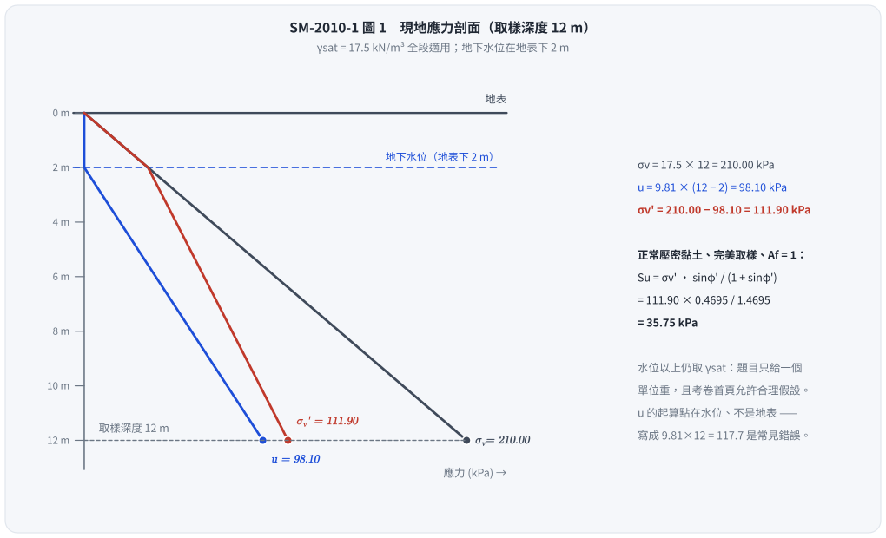
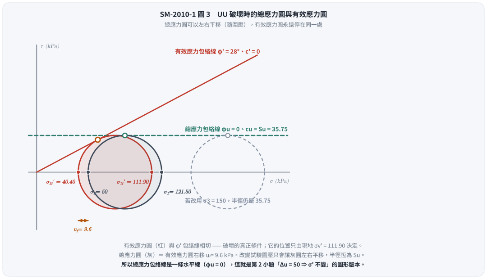

# 考題編號：SM-2010-1

**主分類：** `SM-U1-5` 土壤強度特性與變形性
**副分類：** `SM-U1-4` 土體內應力
**分析法：** 有效應力法
**標籤：** `UU試驗` `三軸試驗` `不排水剪力強度` `Skempton孔隙水壓參數` `有效應力原理` `正常壓密`

---

## 1. 原始題目重述 (Problem Restatement)
有一黏土層其土壤單位重 $\gamma_{sat} = 17.5 \text{ kN/m}^3$，有效摩擦角 $\phi' = 28^\circ$，於現地土層深度 $12 \text{ m}$ 處取得土樣進行不排水三軸（UU）試驗。
若現地地下水位面位於地表以下 $2 \text{ m}$，請計算：
1. 由不排水三軸試驗所測得之不排水剪力強度 $S_u$ 為何？
2. 如果在 UU 試驗過程對於試體施加圍壓 $\sigma_3 = 50 \text{ kPa}$，且試體仍維持飽和狀態，則其內部產生之孔隙水壓力為何？（25 分）

*(註：本題為純文字題，無附圖)*

## 2. 考題核心精神與出題者意圖 (Core Concepts & Examiner's Intent)
本題旨在測驗考生對於**正常壓密黏土（Normally Consolidated Clay）之不排水剪力強度與有效應力參數之間關係**的深刻理解。
出題者的核心意圖包括：
1. **建立現地有效應力狀態**：能準確計算給定深度之現地有效覆土壓力 $\sigma'_{v0}$。
2. **完美取樣與破壞應力路徑**：測驗考生是否知道，若未給定 Skempton 孔隙水壓參數，實務與理論上常針對正常壓密黏土假設破壞時的 $A_f \approx 1$（或等效認為破壞時的最大主有效應力 $\sigma'_{1f}$ 恰等於現地最大主有效應力 $\sigma'_{v0}$）。
3. **有效應力破壞準則的應用**：在 UU 試驗中，雖然總應力呈現 $\phi_u = 0$ 之行為，但其**有效應力莫爾圓**在破壞時必定會相切於由 $\phi'$ 定義之破壞包絡線。
4. **飽和度與 Skempton $B$ 參數**：第 2 小題特別寫明「試體仍維持飽和狀態」，這句話就是 $B = 1$ 的判定條件；施加等向圍壓時 $\Delta u = B \cdot \Delta\sigma_3 = \Delta\sigma_3$，有效應力**完全不變**——這正是 UU 試驗呈現 $\phi_u = 0$、$S_u$ 與圍壓無關的根本原因，也是本小題真正的考點。

## 3. 解題戰略地圖與陷阱分析 (Strategic Roadmap & Trap Analysis)
1. **計算現地應力狀態**：
   - 地表下 $2 \text{ m}$ 為地下水位，假設水位上方土層受毛細作用或初始狀態下單位重亦接近 $\gamma_t = \gamma_{sat} = 17.5 \text{ kN/m}^3$（若未特指乾單位重，此為常態假設）。
   - 計算深度 $12 \text{ m}$ 處之總應力 $\sigma_{v0}$、孔隙水壓 $u_0$ 及有效應力 $\sigma'_{v0}$。
2. **推求不排水剪力強度 $S_u$**：
   - 針對正常壓密黏土，在未給定 $A_f$ 之情況下，採用最合理之理論邊界條件：假設 $A_f = 1$。
   - 根據此條件，破壞時的最大主有效應力 $\sigma'_{1f} = \sigma'_{v0}$。
   - 依據 Mohr-Coulomb 有效應力破壞準則，利用 $\sigma'_{1f}$ 與 $\phi'$ 推算 $\sigma'_{3f}$。
   - $S_u$ 即為破壞時莫爾圓之半徑：$S_u = (\sigma'_{1f} - \sigma'_{3f}) / 2$。
   - 亦可直接代入推導結果：$S_u = \sigma'_{v0} \frac{\sin \phi'}{1 + \sin \phi'}$。
3. **計算施加圍壓所產生之孔隙水壓力**：
   - 題目寫「施加圍壓 $\sigma_3 = 50 \text{ kPa}$，**試體仍維持飽和狀態**，則其內部**產生**之孔隙水壓力為何」——「仍維持飽和」是 $B = 1$ 的明示條件，「產生」對應的是施加圍壓這個動作。
   - 等向加壓階段 $\Delta\sigma_1 = \Delta\sigma_3 = 50 \text{ kPa}$，Skempton 公式退化為 $\Delta u = B \cdot \Delta\sigma_3 = 50 \text{ kPa}$，**這就是主答**。
   - 隨即指出其後果：$\Delta\sigma_3' = 50 - 50 = 0$，有效應力沒變，故 $S_u$ 與圍壓無關（$\phi_u = 0$）——與第 1 小題首尾呼應。
   - *(延伸)* 若閱卷者問的是「破壞時試體內的總孔隙水壓」，再依 Step 2 的完美取樣模型追出 $u_f = \sigma_3 - \sigma'_{3f} = 9.6 \text{ kPa}$。兩者答的是不同的問題，答題時兩個都寫、並註明各自對應哪個階段最保險。

## 3.5 變數層次分析 (Variable Hierarchy Analysis)

### 最終目標
求出現地土樣在 UU 試驗中之不排水剪力強度 $S_u$，以及在施加 $\sigma_3 = 50 \text{ kPa}$ 圍壓破壞時試體內部之孔隙水壓力 $u_f$。

### 本題關鍵公式（依計算順序）
現地有效覆土壓力：
$$ \sigma'_{v0} = \Sigma \gamma z - \gamma_w z_w $$
破壞時主有效應力與強度關係（假設 $A_f=1 \Rightarrow \sigma'_{1f} = \boxed{\sigma'_{v0}}$）：
$$ S_u = \frac{\boxed{\sigma'_{1f}} - \sigma'_{3f}}{2} \quad \text{其中} \quad \sigma'_{3f} = \boxed{\sigma'_{1f}} \tan^2\left(45^\circ - \frac{\phi'}{2}\right) $$
*(或直接使用導出公式)*：
$$ S_u = \boxed{\sigma'_{v0}} \frac{\sin \phi'}{1 + \sin \phi'} $$
施加圍壓階段所產生之孔隙水壓（飽和 $\Rightarrow B = 1$）：
$$ \Delta u_c = B \cdot \Delta\sigma_3 = \boxed{\Delta\sigma_3} $$
（延伸）破壞時試體內之總孔隙水壓力：
$$ u_f = \sigma_3 - \boxed{\sigma'_{3f}} $$

### L1：題目直接給定
| 符號 | 數值 | 說明 |
|---|---|---|
| $\gamma_{sat}$ | $17.5 \text{ kN/m}^3$ | 土壤飽和單位重 |
| $\phi'$ | $28^\circ$ | 土壤有效摩擦角 |
| $z$ | $12 \text{ m}$ | 取樣深度 |
| $z_w$ | $10 \text{ m}$ | 地下水頭高度（$12\text{m} - 2\text{m}$） |
| $\sigma_3$ | $50 \text{ kPa}$ | UU 試驗施加之總應力圍壓 |

### L2：需知識點推導
**現地應力狀態**
| 符號 | 公式／來源 | 卡關? |
|---|---|---|
| $\sigma_{v0}$ | $\gamma_t \times 2 + \gamma_{sat} \times 10$ | |
| $u_0$ | $\gamma_w \times z_w$ | |
| $\sigma'_{v0}$ | $\sigma_{v0} - u_0$ | |

**剪力強度與試驗應力狀態**
| 符號 | 公式／來源 | 卡關? |
|---|---|---|
| $\sigma'_{1f}$ | $\sigma'_{1f} \approx \sigma'_{v0}$ (基於 $A_f=1$ 之 NC 黏土假設) | |
| $\sigma'_{3f}$ | $\sigma'_{1f} \tan^2(45^\circ - \phi'/2)$ | |
| $S_u$ | $(\sigma'_{1f} - \sigma'_{3f}) / 2$ | |
| $\Delta u_c$ | $B \cdot \Delta\sigma_3$（$B=1$，等向加壓階段） | |
| $u_f$ | $\sigma_3 - \sigma'_{3f}$（延伸：破壞時之總水壓） | |

### L3：深層知識（不懂就卡住）
| 知識點 | 說明 | 卡關? |
|---|---|---|
| $A_f=1$ 假設 | 在未提供孔隙水壓參數的考題中，由 Skempton 理論可知，完美取樣之 NC 黏土破壞時 $\sigma'_{1f} \approx \sigma'_{v0}$，此為解題唯一突破口。 | |
| 有效應力破壞準則 | 即使 UU 試驗是總應力 $\phi_u=0$ 之行為，但其破壞瞬間的內部有效應力仍須滿足 $c'=0, \phi'$ 之 Mohr-Coulomb 包絡線。 | |
| $B = 1$ 的意義 | 飽和土的孔隙全由水填滿，水的壓縮性遠小於土骨架，故等向加壓時外加應力 **100% 由孔隙水承擔**（$\Delta u = \Delta\sigma_3$），有效應力增量為零。這是 UU 試驗 $S_u$ 與圍壓無關的唯一理由。 | |

## 4. 步驟化詳細計算過程 (Step-by-Step Detailed Calculation)

**Step 1: 計算現地深度 12 m 處之有效應力**
假設地下水位以上之土壤因毛細作用或天然含水量高，單位重近似為 $17.5 \text{ kN/m}^3$（若未特別說明乾單位重，此為常態假設；水的單位重取 $\gamma_w = 9.81 \text{ kN/m}^3$）。
總垂直應力：
$$ \sigma_{v0} = 17.5 \times 12 = 210 \text{ kPa} $$
孔隙水壓力：
$$ u_0 = 9.81 \times (12 - 2) = 9.81 \times 10 = 98.1 \text{ kPa} $$
有效垂直應力：
$$ \sigma'_{v0} = 210 - 98.1 = 111.9 \text{ kPa} $$

*圖 1　$u$ 這條線在水位以上是零、從水位才開始長，$\sigma'_v$ 因此在 2 m 以下的斜率變緩。這張圖攔的是把孔隙水壓從地表起算（$9.81 \times 12 = 117.7$，會讓 $\sigma'_{v0}$ 少掉 19.6 kPa、$S_u$ 少掉 6.3 kPa）。*

**Step 2: 推算不排水剪力強度 $S_u$**
對於正常壓密黏土（$c'=0$），根據 Skempton 之孔隙水壓理論，若經過完美取樣並進行 UU 試驗，在破壞時若假設孔隙水壓參數 $A_f = 1$（此為正常壓密黏土之典型值），則破壞時之最大主有效應力 $\sigma'_{1f}$ 會等於現地有效覆土壓力 $\sigma'_{v0}$。
$$ \sigma'_{1f} = \sigma'_{v0} = 111.9 \text{ kPa} $$
依據 Mohr-Coulomb 有效應力破壞準則，破壞時主應力關係為：
$$ \sigma'_{1f} = \sigma'_{3f} \tan^2\left(45^\circ + \frac{\phi'}{2}\right) = \sigma'_{3f} \frac{1+\sin\phi'}{1-\sin\phi'} $$
代入 $\phi' = 28^\circ$，計算主動土壓力係數倒數（或稱被動土壓力係數 $K_p$）：
$$ \tan^2\left(45^\circ + \frac{28^\circ}{2}\right) = \tan^2(59^\circ) \approx 2.7698 $$
求破壞時之有效圍壓 $\sigma'_{3f}$：
$$ \sigma'_{3f} = \frac{\sigma'_{1f}}{2.7698} = \frac{111.9}{2.7698} \approx 40.40 \text{ kPa} $$
不排水剪力強度 $S_u$ 即為破壞時莫爾圓之半徑：
$$ S_u = \frac{\sigma'_{1f} - \sigma'_{3f}}{2} = \frac{111.9 - 40.40}{2} = 35.75 \text{ kPa} $$
*(註：代入公式 $S_u = \sigma'_{v0} \frac{\sin 28^\circ}{1 + \sin 28^\circ} = 111.9 \times \frac{0.46947}{1.46947} = 35.75 \text{ kPa}$，結果完全一致。)*

**答 1：不排水剪力強度 $S_u = \boxed{35.75 \text{ kPa}}$**

**Step 3: 計算施加圍壓所產生之孔隙水壓力**
題目條件：UU 試驗中對試體施加圍壓 $\sigma_3 = 50 \text{ kPa}$，且**試體仍維持飽和狀態**。
「仍維持飽和」即 $S = 100\%$，對應 Skempton 孔隙水壓參數 $B = 1$。
此階段為**等向加壓**（$\Delta\sigma_1 = \Delta\sigma_3 = 50 \text{ kPa}$），Skempton 公式
$$ \Delta u = B\left[\Delta\sigma_3 + A(\Delta\sigma_1 - \Delta\sigma_3)\right] $$
中的偏差項為零，退化為：
$$ \Delta u_c = B \cdot \Delta\sigma_3 = 1 \times 50 = 50 \text{ kPa} $$

**答 2：施加圍壓 $\sigma_3 = 50 \text{ kPa}$ 於飽和試體所產生之孔隙水壓力 $\Delta u = \boxed{50 \text{ kPa}}$**

*圖 2　把 ② 與 ③ 的紅柱（有效應力）並排看：施加 50 kPa 圍壓後它一動也沒動——圍壓 100% 被孔隙水吃掉，這就是 $B = 1$ 的全部意思，也是 UU 試驗 $\phi_u = 0$、$S_u$ 與圍壓無關的唯一理由。這張圖攔的是把 50 kPa 圍壓當成有效應力去算強度。*

**這個答案的物理意義（本小題真正的考點）：**
$$ \Delta\sigma_3' = \Delta\sigma_3 - \Delta u_c = 50 - 50 = 0 $$
圍壓 100% 由孔隙水承擔，土壤骨架的有效應力**一點也沒有改變**。因此 UU 試驗不論圍壓開 50、100 還是 300 kPa，量到的莫爾圓半徑（$= S_u$）都一樣，總應力破壞包絡線是一條水平線，即 $\phi_u = 0$。
第 1 小題的 $S_u = 35.75 \text{ kPa}$ 之所以只由現地 $\sigma'_{v0}$ 決定、與試驗圍壓無關，靠的正是這件事。

**延伸：若問的是「破壞時」試體內的總孔隙水壓**
承 Step 2 的完美取樣模型（$A_s = A_f = 1$），可把整條孔隙水壓的來龍去脈追完（破壞時 $\Delta\sigma_d = 2S_u = 71.5 \text{ kPa}$）：

| 階段 | 總圍壓 $\sigma_3$ | 孔隙水壓 $u$ | 有效圍壓 $\sigma'_3$ |
|---|---|---|---|
| 現地（深度 12 m，垂直向） | — | $u_0 = 98.1$ | $\sigma'_{v0} = 111.9$ |
| 完美取樣後（試體離地，外加應力歸零） | 0 | $-111.9$（負孔隙水壓／吸力） | 111.9 |
| 裝機、施加圍壓 50（$B=1$） | 50 | $-111.9 + 50 = -61.9$ | 111.9（**不變**） |
| 剪至破壞（$\Delta u = A_f \Delta\sigma_d = 71.5$） | 50 | $-61.9 + 71.5 = \mathbf{+9.6}$ | $50 - 9.6 = 40.4$ |

驗算：$\sigma'_{1f} = (50 + 71.5) - 9.6 = 111.9 \text{ kPa}$，與 Step 2 的 $\sigma'_{1f} = \sigma'_{v0}$ 完全一致；$\sigma'_{3f} = 40.4 \text{ kPa}$ 亦與 Step 2 相同。

$$ u_f = \sigma_3 - \sigma'_{3f} = 50 - 40.40 = \boxed{9.6 \text{ kPa}} $$

*圖 3　總應力圓 ＝ 有效應力圓向右平移 $u_f = 9.6$ kPa；換一個試驗圍壓只會讓灰圓左右滑動，半徑永遠是 $S_u$，所以總應力包絡線是一條水平線。這張圖攔的是「以為 UU 試驗量到的 $\phi_u = 0$ 代表土壤真的沒有摩擦角」——紅圓仍然結結實實地切在 $\phi' = 28^\circ$ 上。*

**考場作答建議：** 兩個都寫。先答「施加圍壓產生 $\Delta u = 50 \text{ kPa}$（$B=1$）」並點出 $\phi_u = 0$ 的因果，再補「若計至破壞，試體內總孔隙水壓為 $9.6 \text{ kPa}$」，並註明兩者對應不同階段。

## 5. 關鍵爭議點與進階探討 (Critical Issues & Advanced Discussion)
1. **$A_f = 1$ 的隱含假設**：
   這類題目在未提供 Skempton $A$ 參數的情況下，最合理的破題方式便是假定正常壓密黏土 $A_f = 1$ 以及 $A_s = 1$。如此一來，試體從現地取樣到 UU 試驗破壞的有效應力路徑，其最大主有效應力恰好會回到 $\sigma'_{1f} = \sigma'_{v0}$。這是許多教科書（如 Das 或施國欽《土壤力學》）推導 $S_u / \sigma'_{v0}$ 理論公式的核心前置假設。
2. **孔隙水壓力的語意解讀（本題最容易失分處）**：
   題目敘述「施加圍壓 $\sigma_3 = 50 \text{ kPa}$，試體仍維持飽和狀態，則其內部產生之孔隙水壓力為何？」，兩個答案都有人寫：
   - (A) 施加圍壓「當下」產生的水壓：$B = 1 \Rightarrow \Delta u = 50 \text{ kPa}$。
   - (B) UU 試驗「破壞時」的內部總水壓：$u_f = \sigma_3 - \sigma'_{3f} = 9.6 \text{ kPa}$。

   **本解析以 (A) 為主答**，理由有三：
   ① 題目的動詞是「施加圍壓…**產生**」，主語是加圍壓這個動作，不是剪力破壞；
   ② 「試體**仍維持飽和狀態**」這句話在題目裡沒有別的用途——它唯一的功能就是宣告 $B = 1$，而 $B$ 只出現在等向加壓那一項；若要算破壞時的水壓，需要的是 $A_f$，題目並未給；
   ③ (A) 的答案能直接解釋第 1 小題「$S_u$ 為何與圍壓無關」，兩小題構成一個完整的命題邏輯，(B) 則需要額外引入「完美取樣 + $A_f = 1$」這一整套本題未提示的假設。

   作答時仍建議兩者並陳（先 A 後 B），這是最穩的寫法：若閱卷者要的是 (B)，也不會漏掉。
3. **單位重 $\gamma_{sat}$ 之選用**：
   考題僅給定 $\gamma_{sat} = 17.5 \text{ kN/m}^3$，並未給定水位上方土層的乾單位重或濕單位重。在實務上，近地表的細粒土壤通常因毛細現象而處於高飽和或完全飽和狀態，因此全段採用 $17.5 \text{ kN/m}^3$ 來計算總應力是這類考題最標準的處理方式。

---

*解析日期：見 `wiki/log.md`　｜　圖解補繪：2026-08-28（向量 SVG，程式繪製，腳本 `gen_SM-2010-1.py` 可重跑；同名 2× PNG 供簡報／影片管線使用）*
