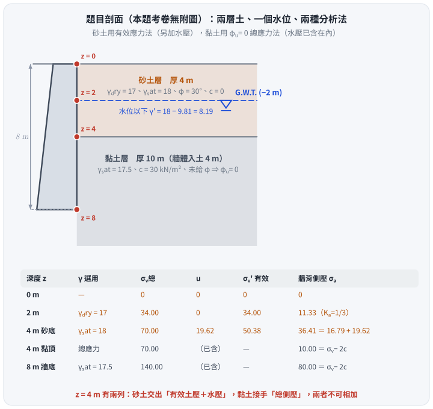
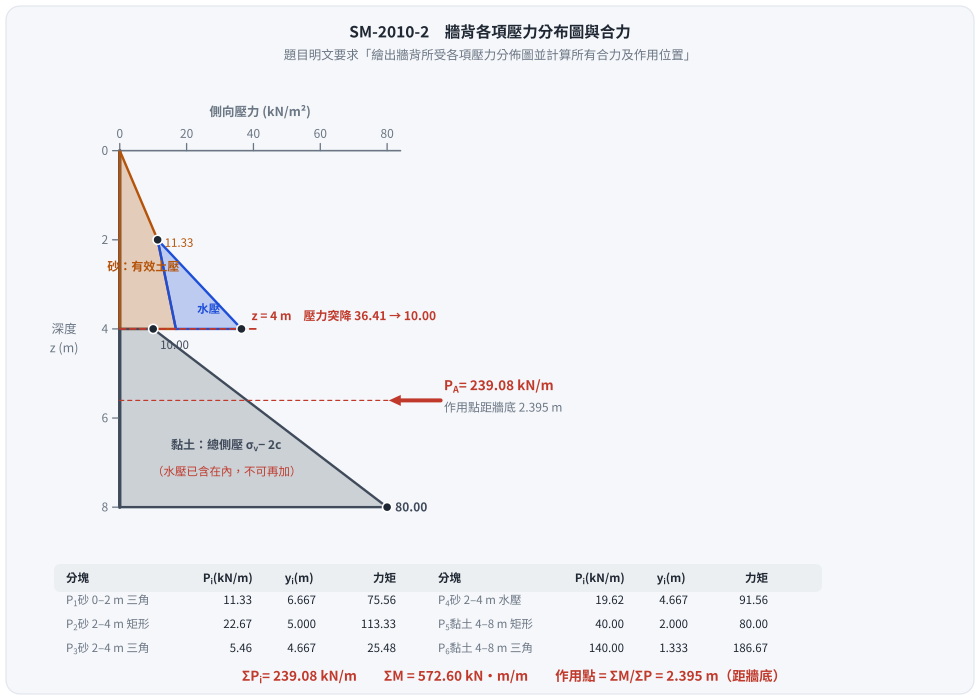
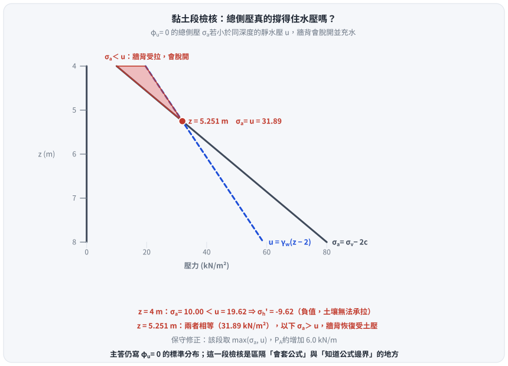

# 考題編號：SM-2010-2

**主分類：** `SM-U3-1` 側向土壓力理論
**副分類：** `SM-U1-4` 土體內應力
**分析法：** 混合
**標籤：** `Rankine主動土壓力` `土壓力分布圖` `水中單位重` `孔隙水壓` `總應力` `張力裂縫`

---

## 1. 原始題目重述 (Problem Restatement)
- 擋土牆高 $8 \text{ m}$，牆背垂直。
- 地層分為兩層：
  - **頂層（砂土）**：厚度 $4 \text{ m}$。$\gamma_{dry} = 17 \text{ kN/m}^3$、$\gamma_{sat} = 18 \text{ kN/m}^3$、$\phi = 30^\circ$、$c = 0$。
  - **底層（黏土）**：厚度 $10 \text{ m}$（牆體深入此層 $4 \text{ m}$）。$\gamma_{sat} = 17.5 \text{ kN/m}^3$、$c = 30 \text{ kN/m}^2$。
- **地下水位**：位於地表以下 $2 \text{ m}$。
- **要求**：利用 Rankine 理論計算牆背所受主動土壓力，繪出牆背所受各項壓力分佈圖並計算所有合力及作用位置。

（考卷本題**無附圖**，題目條件全以文字給定；下圖為依題幹重繪的剖面與應力對照表。）

*圖 1　題目剖面與各深度的應力狀態。攔的是「$\gamma$ 選錯」與「兩種分析法混用」——$z = 4 \text{ m}$ 在表上有**兩列**：砂土交出的是「有效土壓＋水壓」（$16.79 + 19.62 = 36.41$），黏土接手的是「總側壓」（$\sigma_v - 2c = 10.00$），兩者是不同的東西，不可相加。*

## 2. 考題核心精神與出題者意圖 (Core Concepts & Examiner's Intent)
- **核心精神**：考驗考生對「雙層地層（砂土與黏土）」及「地下水位」影響下，主動側向土壓力分佈的計算能力。
- **出題者意圖**：
  1. 測驗地下水位以上與以下土層應力參數的正確選用（乾單位重 vs. 水下有效單位重）。
  2. 測驗砂土層與黏土層的力學狀態判斷：砂土透水性佳，採用有效應力法（$c'=0$、$\phi'=30^\circ$）；黏土僅給定凝聚力 $c$ 而無摩擦角，暗示短期不排水狀態，應採用總應力法（$\phi_u=0$、$c_u=30 \text{ kN/m}^2$）。
  3. 測驗黏土層總應力法中，是否能正確理解總應力已包含孔隙水壓，不需再疊加獨立的水壓力分佈。

## 3. 解題戰略地圖與陷阱分析 (Strategic Roadmap & Trap Analysis)
- **第一步：砂土層（$0 \sim 4 \text{ m}$）分析**
  - 分為水位上（$0 \sim 2 \text{ m}$）與水位下（$2 \sim 4 \text{ m}$）兩段。
  - 計算砂土主動土壓力係數 $K_{a,sand}$。
  - 分別計算各深度的有效垂直應力 $\sigma_v'$，求出砂土層有效主動土壓力 $\sigma_a'$，水位下需額外疊加孔隙水壓力 $u$。
- **第二步：黏土層（$4 \sim 8 \text{ m}$）分析**
  - 黏土未給定內摩擦角，判斷為 $\phi_u=0$ 的短期不排水狀況。
  - 黏土主動土壓力係數 $K_{a,clay} = 1$。
  - 採用總應力分析，計算各深度的總垂直應力 $\sigma_v$。
  - 計算總主動土壓力 $\sigma_a = \sigma_v - 2c$。
- **第三步：合力與作用位置**
  - 將壓力分佈圖切割為多個三角形與矩形。
  - 分別計算各區塊的合力及其相對於牆底的力臂，力矩加總後除以總合力求得合力作用點位置。

- **關鍵陷阱**：
  1. **黏土層的水壓力重複計算**：在 $\phi=0$ 的總應力分析中，$\sigma_a$ 已經是牆背受到的總側向壓力，若誤將砂土層的水壓力向下延伸並額外疊加至黏土層，會導致嚴重的錯誤。
  2. **應力轉換交界面**：在 $z = 4 \text{ m}$ 處，從砂土轉換為黏土，側壓力分佈會發生突變（由有效側向土壓力加水壓，突變為黏土的總側向壓力）。

## 3.5 變數層次分析 (Variable Hierarchy Analysis)

### 最終目標
`求出擋土牆牆背的 Rankine 主動土壓力分佈圖、總合力大小，及其距牆底的作用位置。`

### 本題關鍵公式（依計算順序）
- 砂土層主動土壓力係數：
  $$K_{a,sand} = \tan^2\left(45^\circ - \frac{\phi}{2}\right)$$
- 砂土層（有效應力法）總主動土壓力：
  $$\sigma_{a,sand} = \sigma_a' + u = \sigma_v' \boxed{K_{a,sand}} + u$$
- 黏土層（總應力法，$\phi_u = 0$）主動土壓力係數：
  $$K_{a,clay} = \tan^2(45^\circ - 0^\circ) = 1$$
- 黏土層（總應力法）總主動土壓力：
  $$\sigma_{a,clay} = \sigma_v \boxed{K_{a,clay}} - 2c\sqrt{\boxed{K_{a,clay}}} = \sigma_v - 2c$$
- 總合力與作用位置：
  $$P_A = \sum P_i$$
  $$\bar{y} = \frac{\sum (P_i \cdot y_i)}{\boxed{P_A}}$$

### L1：題目直接給定
| 符號 | 數值 | 說明 |
|---|---|---|
| $H$ | $8 \text{ m}$ | 擋土牆受力段高度 |
| $H_{sand}$ | $4 \text{ m}$ | 砂土層厚度 |
| $\gamma_{dry(sand)}$ | $17 \text{ kN/m}^3$ | 砂土乾單位重（$0 \sim 2\text{ m}$） |
| $\gamma_{sat(sand)}$ | $18 \text{ kN/m}^3$ | 砂土飽和單位重（$2 \sim 4\text{ m}$） |
| $\phi_{sand}$ | $30^\circ$ | 砂土內摩擦角 |
| $\gamma_{sat(clay)}$ | $17.5 \text{ kN/m}^3$ | 黏土飽和單位重 |
| $c_{clay}$ | $30 \text{ kN/m}^2$ | 黏土凝聚力 |
| $H_w$ | $2 \text{ m}$ | 地下水位深度 |

### L2：需知識點推導
**砂土層應力參數計算**
| 符號 | 公式／來源 | 卡關? |
|---|---|---|
| $K_{a,sand}$ | $\tan^2(45^\circ - 30^\circ / 2)$ | |
| $\gamma_{sand}'$ | $\gamma_{sat(sand)} - \gamma_w$ | |
| $\sigma_v'$ | 依深度計算上覆有效重量 | |
| $u$ | 依水位下深度計算靜水壓力 | |

**黏土層應力參數計算**
| 符號 | 公式／來源 | 卡關? |
|---|---|---|
| $K_{a,clay}$ | $\tan^2(45^\circ - 0^\circ / 2) = 1$ | |
| $\sigma_{v}$ | 上方土層總重 + 黏土層總重 | |

**合力與力矩計算**
| 符號 | 公式／來源 | 卡關? |
|---|---|---|
| $P_i$ | 各壓力區塊（三角形、矩形）面積 | |
| $y_i$ | 各區塊形心距牆底高度 | |
| $\bar{y}$ | $\sum(P_i y_i) / \sum P_i$ | |

### L3：深層知識（不懂就卡住）
| 知識點 | 說明 | 卡關? |
|---|---|---|
| 黏土 $\phi=0$ 總應力法 | 題目未給黏土摩擦角，暗示為不排水狀態（$\phi_u=0$）。此時側向主動土壓力公式為 $\sigma_a = \sigma_v - 2c$，**不可再額外加上孔隙水壓力**。 | |
| 有效與總應力切換 | 砂土透水佳用有效應力（需加水壓）；黏土短期不排水用總應力（水壓已包含在內）。交界面處側土壓力會產生明顯跳躍。 | |

## 4. 步驟化詳細計算過程 (Step-by-Step Detailed Calculation)

**計算約定：** 採用水的單位重 $\gamma_w = 9.81 \text{ kN/m}^3$。（若考場習慣採用 $10 \text{ kN/m}^3$ 計算過程亦相同，僅數值微調）

### Step 1: 主動土壓力係數計算
砂土層（$c=0, \phi=30^\circ$）：
$$K_{a1} = \tan^2\left(45^\circ - \frac{30^\circ}{2}\right) = \frac{1}{3}$$
黏土層（$c=30 \text{ kN/m}^2, \phi_u=0^\circ$）：
$$K_{a2} = \tan^2\left(45^\circ - \frac{0^\circ}{2}\right) = 1$$

### Step 2: 牆背各深度土壓力計算

**1. 深度 $z = 0 \text{ m}$ (地表)**
- 有效垂直應力：$\sigma_v' = 0$
- 孔隙水壓力：$u = 0$
- 總主動土壓力：$\sigma_a = 0 \times \frac{1}{3} + 0 = 0 \text{ kN/m}^2$

**2. 深度 $z = 2 \text{ m}$ (地下水位面)**
- 有效垂直應力：$\sigma_v' = 17 \times 2 = 34.00 \text{ kN/m}^2$
- 孔隙水壓力：$u = 0$
- 總主動土壓力：$\sigma_a = \sigma_v' K_{a1} + u = 34 \times \frac{1}{3} + 0 = 11.33 \text{ kN/m}^2$

**3. 深度 $z = 4 \text{ m}$ (砂土層底部)**
- 砂土有效單位重：$\gamma_{sand}' = 18 - 9.81 = 8.19 \text{ kN/m}^3$
- 有效垂直應力：$\sigma_v' = 34 + 8.19 \times 2 = 50.38 \text{ kN/m}^2$
- 孔隙水壓力：$u = 9.81 \times 2 = 19.62 \text{ kN/m}^2$
- 砂土有效主動壓力：$\sigma_a' = 50.38 \times \frac{1}{3} = 16.79 \text{ kN/m}^2$
- 總主動土壓力：$\sigma_a = \sigma_a' + u = 16.79 + 19.62 = 36.41 \text{ kN/m}^2$

> *策略註解：在 $z=4\text{ m}$ 處，土層交界會產生土壓力突變。下層為不排水黏土層，需切換為總應力法重新計算此深度之總應力。*

**4. 深度 $z = 4 \text{ m}$ (黏土層頂部)**
- 總垂直應力：
  $$\sigma_v = 17 \times 2 + 18 \times 2 = 34 + 36 = 70.00 \text{ kN/m}^2$$
- 總主動土壓力：
  $$\sigma_a = \sigma_v K_{a2} - 2c\sqrt{K_{a2}} = 70 \times 1 - 2 \times 30 = 10.00 \text{ kN/m}^2$$
*(備註：因 $\sigma_a > 0$，此處無張力裂縫。)*

**5. 深度 $z = 8 \text{ m}$ (牆底，黏土層中)**
- 總垂直應力：
  $$\sigma_v = 70 + 17.5 \times 4 = 140.00 \text{ kN/m}^2$$
- 總主動土壓力：
  $$\sigma_a = \sigma_v K_{a2} - 2c\sqrt{K_{a2}} = 140 \times 1 - 2 \times 30 = 80.00 \text{ kN/m}^2$$

---

### Step 3: 各項合力與作用位置計算
將壓力分佈圖切割為 6 個簡單幾何區塊，統一對牆底（$z=8\text{ m}$）取力臂 $y_i$。

| 區塊 | 說明 | 深度區間 | 面積大小 $P_i$ ($\text{kN/m}$) | 力臂 $y_i$ ($\text{m}$) | 力矩 $M_i = P_i \cdot y_i$ |
|---|---|---|---|---|---|
| $P_1$ | 砂土上層(三角形) | 0~2m 砂有效壓力 | $\frac{1}{2} \times 2 \times 11.33 = 11.33$ | $6 + \frac{2}{3} = 6.667$ | $75.53$ |
| $P_2$ | 砂土下層(矩形) | 2~4m 砂有效壓力 | $2 \times 11.33 = 22.66$ | $4 + 1 = 5.000$ | $113.30$ |
| $P_3$ | 砂土下層(三角形) | 2~4m 砂有效增量 | $\frac{1}{2} \times 2 \times (16.79-11.33) = 5.46$ | $4 + \frac{2}{3} = 4.667$ | $25.48$ |
| $P_4$ | 砂土下層(三角形) | 2~4m 水壓力 | $\frac{1}{2} \times 2 \times 19.62 = 19.62$ | $4 + \frac{2}{3} = 4.667$ | $91.57$ |
| $P_5$ | 黏土層(矩形) | 4~8m 黏土總壓力 | $4 \times 10 = 40.00$ | $2.000$ | $80.00$ |
| $P_6$ | 黏土層(三角形) | 4~8m 黏土增量 | $\frac{1}{2} \times 4 \times (80-10) = 140.00$ | $\frac{4}{3} = 1.333$ | $186.67$ |

計算總和：
- 總合力：$P_A = 11.33 + 22.66 + 5.46 + 19.62 + 40.00 + 140.00 = \boxed{239.07 \text{ kN/m}}$
- 總力矩：$\sum M = 75.53 + 113.30 + 25.48 + 91.57 + 80.00 + 186.67 = 572.55 \text{ kN-m/m}$

計算合力作用點（距牆底）：
$$ \bar{y} = \frac{\sum M}{P_A} = \frac{572.55}{239.07} = \boxed{2.395 \text{ m}} $$

*圖 2　題目明文要求的「各項壓力分佈圖」與合力。攔的是黏土層重複疊加水壓——圖上黏土段只有一塊灰色的總側壓，右側沒有第二個水壓三角；若把砂層的水壓三角延伸到牆底，$P_A$ 會多算 $80 \text{ kN/m}$ 以上。*

## 5. 關鍵爭議點與進階探討 (Critical Issues & Advanced Discussion)
- **水壓力是否獨立於黏土層中計算？**
  - 當黏土僅提供總應力參數（凝聚力 $c$，且未給定 $\phi'$，慣例視為 $\phi_u=0$ 之短期狀態）時，必須採用「總應力分析」。此時求得之 $\sigma_a$ 已經是包含孔隙水壓在內的**總側向壓力**。
  - 若在此段額外加上靜水壓力，則犯了將水壓力重複計算的錯誤。
- **⚠ 黏土層頂部：牆背可能與土體脫開並充水（本題最深的爭議點）**
  - 在 $z = 4 \sim 5.25 \text{ m}$ 的範圍內，黏土層的**總**側向壓力小於同深度的靜水壓力：
    $$\sigma_{a}(z) = 10 + 17.5(z-4), \qquad u(z) = 9.81(z-2)$$
    兩者在 $z = 4 \text{ m}$ 為 $10.00$ 與 $19.62$、在 $z = 5.251 \text{ m}$ 相等（$\sigma_a = u = 31.89$）。
  - 這代表該段的**有效**水平應力為負（$z=4$ 時 $\sigma_h' = 10 - 19.62 = -9.62 \text{ kN/m}^2$）。
    土壤不能對牆面施加拉力，故理論上牆背與黏土在此段會**脫開**；
    上方砂土層的地下水一旦沿縫隙灌入，牆面實際承受的就是靜水壓 $u$ 而非 $\sigma_a$。
  - 保守修正做法：該段取 $\max(\sigma_a,\; u)$。此時 $4 \sim 5.251 \text{ m}$ 改用水壓三角形，
    合力與作用點都會略增（$P_A$ 增加約 $6.0 \text{ kN/m}$，即該段三角形 $\tfrac{1}{2}(19.62-10.00)(5.251-4) = 6.02$）。
  - **考場建議：** 主答仍寫本解析的 $\phi_u = 0$ 總應力分布（這是本題預期的標準解），
    但在答案末尾補上這一段檢核，可明確區隔出「只會套公式」與「知道公式邊界」的考生。

*圖 3　$\phi_u = 0$ 總側壓與靜水壓的比較。攔的是「算完就交卷」——紅色區間內牆背的有效水平應力為負，土壤不能承拉，理論上會脫開並充水。這張圖不改主答，但能看出標準解在 $z = 4 \sim 5.25 \text{ m}$ 之間偏不保守。*

- **單位水重的選用差異**
  - 本解析採用精確的單位水重 $\gamma_w = 9.81 \text{ kN/m}^3$。若習慣上採用 $\gamma_w = 10 \text{ kN/m}^3$ 進行計算：
    - $z=4\text{ m}$ 處 $\gamma' = 8 \text{ kN/m}^3$、$\sigma_v' = 50 \text{ kN/m}^2$、$\sigma_a' = 16.667 \text{ kN/m}^2$、$u = 20 \text{ kN/m}^2$、總壓力為 $36.667 \text{ kN/m}^2$。
    - 六個區塊改為 $11.333 / 22.667 / 5.333 / 20.000 / 40.000 / 140.000$，總合力 $P_A = 239.33 \text{ kN/m}$、總力矩 $573.78 \text{ kN-m/m}$、作用點 $\bar{y} = 2.397 \text{ m}$。
    - 與 $\gamma_w = 9.81$ 的結果（$239.07$、$2.395$）相差不到 $0.11\%$，兩種常數選用考選部閱卷均可接受，唯建議於計算起始清楚註明。

---

*解析日期：見 `wiki/log.md`　｜　圖解補繪：2026-08-29（向量 SVG，程式繪製，腳本 `gen_SM-2010-2.py` 可重跑；同名 2× PNG 供簡報／影片管線使用）*
