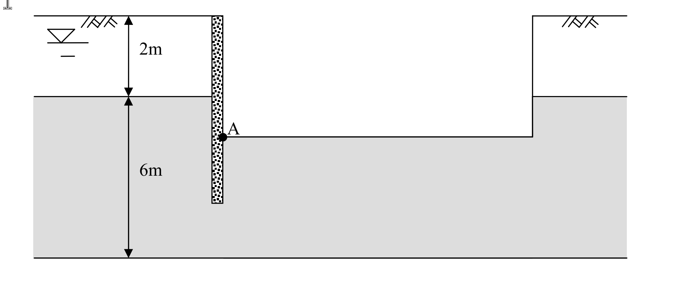

# 考題編號：SM-2010-3

**主分類：** `SM-2` 深基礎與開挖
**副分類：** `SM-1` 土壤滲透
**分析法：** 有效應力法
**標籤：** `滲流力` `管湧` `砂湧` `臨界水力坡降` `一維流徑假設`

---

## 1. 原始題目重述 (Problem Restatement)

有一厚 2 m 之黏土層，其下方為厚 6 m 之砂土層，地下水面位於地表下 1 m 處。今如在該地層開挖至地表下 4 m 後進行建築結構，為便利施工構築，將開挖面內之水位抽降至與開挖面等高，開挖擋土壁貫入至深度 5 m 處。
已知參數：
- 砂土之飽和單位重 $\gamma_{sat} = 18 \text{ kN/m}^3$
- 黏土層之飽和單位重 $\gamma_{sat} = 17.5 \text{ kN/m}^3$

**問題：**
1. 計算位於開挖擋土壁內側 A 點所受之滲流力。
2. 檢核此時開挖底面是否有管湧問題。（25 分）

*圖說：深開挖抽水之剖面幾何圖（示意圖，非按比例繪製）。*
*・**分層**：地表以下第一層未填色、以尺寸線標註 **2 m**，對應題幹之黏土層（$\gamma_{sat} = 17.5$ kN/m³）；其下為灰色填色層、以尺寸線標註 **6 m**，對應題幹之砂土層（$\gamma_{sat} = 18$ kN/m³）。地層總厚 8 m。*
*・**地下水位**：圖左上於地表下方繪有水位符號（三角形加雙橫線），對應題幹之「地表下 1 m」。*
*・**擋土壁**：圖中央之垂直網點狀構件，自地表向下貫入，對應題幹之「貫入至深度 5 m 處」。壁底位於砂土層中，未貫穿至砂層底部（故砂層下方仍為連通之滲流通道）。*
*・**開挖區**：圖右側為已開挖範圍，開挖底面繪為水平線並延伸至圖右緣；開挖面內水位已抽降至與開挖底面等高，對應題幹之「開挖至地表下 4 m」。*
*・**A 點**：以實心圓標示於**擋土壁與開挖底面的交會處（開挖側，即壁的內側）**，即第 1 小題要求計算滲流力的位置。*

*（本圖提供的是幾何配置與 A 點位置；**圖上僅印出 2 m 與 6 m 兩個尺寸**，水位深度 1 m、開挖深度 4 m、壁貫入深度 5 m 三個數值均由題幹文字給定，不可由圖上比例量測。）*

*(註：本題附圖為開挖剖面幾何圖，考卷**未提供流網圖**，故採一維簡化最短流徑法進行解析。)*

## 2. 考題核心精神與出題者意圖 (Core Concepts & Examiner's Intent)

1. **滲流路徑之判斷：** 測驗考生是否理解黏土層與砂土層之透水性差異（$k_{clay} \ll k_{sand}$），從而判斷水流主要沿著透水性佳之砂土層進行滲流，並能合理推估無流網圖時的最短流徑長度。
2. **滲流力計算：** 測驗滲流力 $j = i \cdot \gamma_w$ 之基本概念，及其作為單位體積受力之物理意義。
3. **管湧破壞檢核：** 測驗管湧（或砂湧）之臨界水力坡降 $i_{cr}$ 之計算方式，以及如何比較實際坡降 $i$ 與臨界坡降 $i_{cr}$ 以判別整體穩定性。

## 3. 解題戰略地圖與陷阱分析 (Strategic Roadmap & Trap Analysis)

- **步驟一：建立幾何與水頭模型**
  - 確定外側水頭高程（-1 m）、內側水頭高程（-4 m），計算驅動滲流之全水頭差 $\Delta h$。
- **步驟二：計算平均水力坡降 $i$**
  - 考量黏土層極難透水，假設水流僅於砂土層內發生。計算砂土層中沿擋土壁外側至內側之最短流徑長度 $L$。
  - 求得平均水力坡降 $i = \Delta h / L$。
- **步驟三：計算 A 點滲流力**
  - 利用 $j = i \cdot \gamma_w$ 求得滲流力。
- **步驟四：檢核管湧穩定性**
  - 計算砂土之臨界水力坡降 $i_{cr} = \gamma' / \gamma_w$。
  - 求安全係數 $FS = i_{cr} / i$，判斷是否大於 1.0。

**⚠ 關鍵陷阱：**
- **流徑長度的計算區間：** 擋土壁總長為 5 m，但外側 0~2 m 為黏土層。因黏土透水性極低，滲流路徑應僅計算砂土層區間（外側 2~5 m，內側 5~4 m），若將黏土層厚度計入流徑將導致坡降被低估。
- **管湧破壞土層之選用：** 開挖底面（-4 m）位於砂土層中，故臨界坡降計算必須使用「砂土」之參數，而非黏土。

## 3.5 變數層次分析 (Variable Hierarchy Analysis)

### 最終目標
`計算擋土壁內側 A 點之單位體積滲流力，並檢核開挖底面是否會發生管湧破壞。`

### 本題關鍵公式（依計算順序）
- 全水頭差：$\Delta h = h_{out} - h_{in}$
- 砂土層內最短流徑長度：$L = D_{out} + D_{in}$
- 平均水力坡降：$i = \frac{\boxed{\Delta h}}{\boxed{L}}$
- 滲流力：$j = \boxed{i} \cdot \gamma_w$
- 臨界水力坡降：$i_{cr} = \frac{\gamma_{sat,s} - \gamma_w}{\gamma_w}$
- 管湧安全係數：$FS = \frac{\boxed{i_{cr}}}{\boxed{i}}$

### L1：題目直接給定
| 符號 | 數值 | 說明 |
|---|---|---|
| $\gamma_{sat,s}$ | 18 kN/m³ | 砂土飽和單位重 |
| $\gamma_{sat,c}$ | 17.5 kN/m³ | 黏土飽和單位重 |
| $GL_{wt,out}$ | -1.0 m | 擋土壁外側地下水面高程 |
| $GL_{wt,in}$ | -4.0 m | 擋土壁內側（開挖面）水面高程 |

### L2：需知識點推導
**幾何與滲流參數**
| 符號 | 公式／來源 | 卡關? |
|---|---|---|
| $\Delta h$ | $h_{out} - h_{in}$ | |
| $L$ | $D_{out} + D_{in}$ (沿擋土壁於砂層之長度) | |
| $i$ | $\Delta h / L$ | |
| $j$ | $i \cdot \gamma_w$ | |

**管湧檢核**
| 符號 | 公式／來源 | 卡關? |
|---|---|---|
| $i_{cr}$ | $(\gamma_{sat,s} - \gamma_w) / \gamma_w$ | |
| $FS$ | $i_{cr} / i$ | |

### L3：深層知識（不懂就卡住）
| 知識點 | 說明 | 卡關? |
|---|---|---|
| 簡化一維流徑法 | 在無流網之情況下，假設水流沿擋土壁表面做最短距離流動。因黏土透水性極低，水流幾乎皆於砂土層中流動。 | |
| 滲流力 (Seepage Force) | 單位體積土體所承受由水流摩擦產生之推力，方向與水流方向一致。 | |

## 4. 步驟化詳細計算過程 (Step-by-Step Detailed Calculation)

**Step 1：建立高程與水頭模型**
設定地表高程為 $GL \pm 0.0 \text{ m}$，則各界線高程如下：
- 外側地下水位：$GL -1.0 \text{ m}$
- 黏土層底 / 砂土層頂：$GL -2.0 \text{ m}$
- 開挖面（內側水位）：$GL -4.0 \text{ m}$
- 擋土壁底（貫入深度）：$GL -5.0 \text{ m}$
- 砂土層底：$GL -8.0 \text{ m}$

決定驅動水流之總水頭差 $\Delta h$：
$$
\Delta h = (\text{外側水頭}) - (\text{內側水頭}) = (-1.0) - (-4.0) = 3.0 \text{ m}
$$
*(註：因黏土層滲透係數極低，可將外側砂土層視為受壓水層，其總水頭由上方地下水位控制。)*

**Step 2：計算最短流徑長度與平均水力坡降**
假設水流沿擋土壁表面流動，且僅考慮透水性較佳之砂土層。
- 擋土壁外側在砂土層之流徑長度：$D_{out} = |-5.0| - |-2.0| = 3.0 \text{ m}$
- 擋土壁內側在砂土層之流徑長度：$D_{in} = |-5.0| - |-4.0| = 1.0 \text{ m}$
- 總流徑長度 $L$：
$$
L = D_{out} + D_{in} = 3.0 + 1.0 = 4.0 \text{ m}
$$
平均水力坡降 $i$：
$$
i = \frac{\Delta h}{L} = \frac{3.0}{4.0} = 0.75
$$

**Step 3：計算 A 點所受之滲流力**
A 點位於擋土壁內側，承受由下往上的滲流作用，其單位體積滲流力 $j$ 為：
$$
j = i \cdot \gamma_w = 0.75 \times 9.81 = 7.3575 \text{ kN/m}^3
$$
> **策略註解**：滲流力屬於「體積力」(Body Force)，故單位為 $\text{kN/m}^3$。方向與水流一致，即「向上」。

$$
\boxed{ j = 7.36 \text{ kN/m}^3 \text{ (方向向上)} }
$$

**Step 4：檢核開挖底面管湧問題**
開挖底面位於砂土層中，已知砂土飽和單位重 $\gamma_{sat,s} = 18 \text{ kN/m}^3$。
計算砂土之臨界水力坡降 $i_{cr}$：
$$
i_{cr} = \frac{\gamma_{sat,s} - \gamma_w}{\gamma_w} = \frac{18.0 - 9.81}{9.81} = \frac{8.19}{9.81} \approx 0.835
$$
計算管湧安全係數 $FS$：
$$
FS = \frac{i_{cr}}{i} = \frac{0.835}{0.75} = 1.113
$$

$$
\boxed{ FS = 1.11 > 1.0 \text{，理論上無管湧發生} }
$$

## 5. 關鍵爭議點與進階探討 (Critical Issues & Advanced Discussion)

1. **安全係數偏低之實務考量：**
   雖然本題計算出 $FS = 1.11 > 1.0$，理論上不會發生管湧破壞。但在實際工程中，考量到土壤參數的變異性以及二維流網局部出口坡降（Exit Gradient）往往大於平均坡降，一般規範要求抵抗管湧之安全係數應達 $FS \ge 1.5 \sim 2.0$。因此，此設計在實務上**極度危險**，建議加深擋土壁貫入深度，或於擋土壁外側進行點井降水以降低水頭差。
2. **一維流徑假設的侷限性：**
   本解析採用「沿壁面最短流徑法」估算平均水力坡降，這是國家考試在未提供流網圖時的標準簡化解法。若實際繪製流網，擋土壁底端（即繞流點附近）之水力坡降會發生集中而大於 0.75，而開挖面出口之水力坡降可能會略小於或接近平均值。若嚴格要求特定點位之準確受力，必須依賴二維滲流分析軟體或流網圖。
3. **$\gamma_w$ 數值選用：**
   若考場上為了計算方便選用 $\gamma_w = 10 \text{ kN/m}^3$，則 $i_{cr} = (18 - 10) / 10 = 0.80$，$FS = 0.80 / 0.75 = 1.07$，結論同樣為 $FS > 1.0$。本解析依據一般工程慣例採用精確值 $9.81 \text{ kN/m}^3$ 進行計算。
