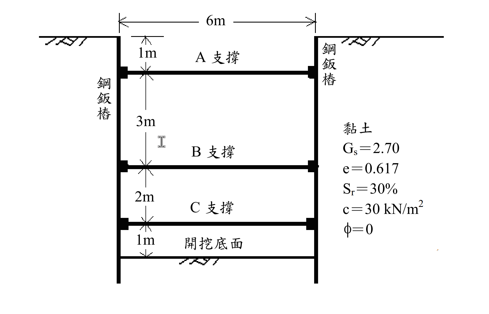

# 考題編號：SM-2011-4

**主分類：** `SM-U2-3` 開挖之穩定性分析
**分析法：** 總應力法
**標籤：** `視在土壓力` `Peck土壓力包絡線` `支撐載重` `鋼鈑樁截面模數`

---

## 1. 原始題目重述 (Problem Restatement)
某工地在中等堅硬（medium stiff）之黏土層作鋼鈑樁支撐開挖，已知參數如下：
- **土層參數**：孔隙比 $e = 0.617$、比重 $G_s = 2.70$、飽和度 $S_r = 30\%$。
- **強度參數**：依圖示 $c = 30 \text{ kN/m}^2$, $\phi = 0$。
- **幾何條件**：開挖總寬度 $6\text{ m}$，開挖總深度 $H = 1 + 3 + 2 + 1 = 7\text{ m}$。
- **支撐位置**：A 支撐位於地表下 $1\text{ m}$，B 支撐位於 $4\text{ m}$，C 支撐位於 $6\text{ m}$。支撐水平間距 $s = 5\text{ m}$。
- **鋼鈑樁允許應力**：$\sigma_{all} = 170 \text{ MN/m}^2$。

**求解問題**：
(一) 繪出作用於擋土鋼鈑樁之土壓力。
(二) 計算作用於 A、B、C 支撐之作用力各為若干（kN）？
(三) 計算鋼鈑樁所需之截面模數 $S$（$\text{m}^3\text{/m}$）？

*圖說：開挖深度 7m，設有三階支撐 A(1m)、B(4m)、C(6m)。土層為黏土，$G_s=2.70, e=0.617, S_r=30\%, c=30 \text{ kN/m}^2, \phi=0$。*

## 2. 考題核心精神與出題者意圖 (Core Concepts & Examiner's Intent)
- **單位重基本關係**：測驗從基本物理量（$G_s, e, S_r$）推算土壤濕單位重 $\gamma_t$。
- **Peck 視在土壓力包絡線**：測驗如何利用穩定數 $N_c$ 判斷黏土類別，並畫出對應的經驗土壓力分佈。
- **支撐載重計算**：測驗利用「鉸接假設（Hinge Method）」將連續的擋土壁拆解為靜定結構，以計算各階支撐反力。
- **鋼鈑樁設計**：尋找剪力為零之處求得最大彎矩，並依據材料力學公式 $S = M_{\text{max}} / \sigma_{all}$ 決定截面模數。

## 3. 解題戰略地圖與陷阱分析 (Strategic Roadmap & Trap Analysis)
1. **單位重陷阱**：題目給定飽和度 $S_r=30\%$，代表土壤未飽和，不可直接使用 $\gamma_{sat}$ 公式，必須使用 $\gamma_t = \frac{G_s + S_r e}{1+e}\gamma_w$。
2. **包絡線判斷陷阱**：題幹雖稱「中等堅硬（medium stiff）」，但計算穩定數 $N_c = \gamma H / c = 4.08 > 4$，且 $S_u = 30 \text{ kPa} < 50 \text{ kPa}$，依據 Peck (1969) 規範，此土層應判定為「軟弱至中等黏土 (Soft to Medium Clay)」。若誤用「堅硬黏土 (Stiff Clay)」包絡線，將導致 C 支撐載重嚴重低估。
3. **下限值陷阱**：軟弱至中等黏土之最大壓力 $p_a = \gamma H (1 - \frac{4c}{\gamma H})$ 計算值可能極小，必須套用 $p_a \ge 0.3 \gamma H$ 之下限規定。
4. **最大彎矩尋找**：不可僅計算支撐點處的彎矩，第一段（0~4m）跨距最大，通常最大正彎矩發生在 A 與 B 之間的「剪力為零」處。

## 3.5 變數層次分析 (Variable Hierarchy Analysis)

### 最終目標
計算出作用於擋土鋼鈑樁之土壓力、A/B/C支撐作用力，以及鋼鈑樁所需之截面模數 $S$。

### 本題關鍵公式（依計算順序）
- 濕單位重：$\gamma_t = \frac{G_s + S_r e}{1 + e} \gamma_w$
- 穩定數：$N_c = \frac{\boxed{\gamma_t} H}{c}$
- 視在土壓力（軟弱至中等黏土）：$p_a = \max\left( \boxed{\gamma_t} H \left(1 - \frac{4c}{\boxed{\gamma_t} H}\right), 0.3 \boxed{\gamma_t} H \right)$
- 支撐載重：$P = R \times s$ （$R$為鉸接假設下之支承反力）
- 截面模數：$S = \frac{M_{\text{max}}}{\sigma_{all}}$

### L1：題目直接給定
| 符號 | 數值 | 說明 |
|---|---|---|
| $G_s$ | 2.70 | 土壤比重 |
| $e$ | 0.617 | 孔隙比 |
| $S_r$ | 30% | 飽和度 |
| $c$ | 30 kN/m² | 黏聚力 (不排水剪力強度 $S_u$) |
| $H$ | 7 m | 總開挖深度 |
| $s$ | 5 m | 支撐水平間距 |
| $\sigma_{all}$ | 170 MN/m² | 鋼鈑樁允許應力 |

### L2：需知識點推導
**1. 土壤單位重與穩定數**
| 符號 | 公式／來源 | 卡關? |
|---|---|---|
| $\gamma_t$ | $\gamma_t = \frac{G_s + S_r e}{1 + e} \gamma_w$ | |
| $N_c$ | $N_c = \frac{\gamma_t H}{c}$ | |

**2. Peck 視在土壓力**
| 符號 | 公式／來源 | 卡關? |
|---|---|---|
| $p_a$ | $\max\left( \gamma_t H \left(1 - \frac{4c}{\gamma_t H}\right), 0.3 \gamma_t H \right)$ | |

**3. 支撐作用力與最大彎矩**
| 符號 | 公式／來源 | 卡關? |
|---|---|---|
| $P_A, P_B, P_C$ | 鉸接連續梁法求得各支承反力 $\times s$ | |
| $M_{\text{max}}$ | 求剪力零點處之彎矩 | |
| $S$ | $S = M_{\text{max}} / \sigma_{all}$ | |

### L3：深層知識（不懂就卡住）
| 知識點 | 說明 | 卡關? |
|---|---|---|
| 視在土壓力包絡線選定 | $N_c > 4$ 時應選用軟弱至中等黏土包絡線，且須注意 $0.3\gamma H$ 的下限值。 | |
| 支撐反力鉸接假設 | 分析支撐載重時，必須假設鈑樁在各內部支撐處與開挖底面為鉸接，分段靜定計算反力。 | |

## 4. 步驟化詳細計算過程 (Step-by-Step Detailed Calculation)

### (一) 繪出作用於擋土鋼鈑樁之土壓力
**Step 1：計算黏土層之濕單位重 $\gamma_t$**
假設水的單位重 $\gamma_w = 9.81 \text{ kN/m}^3$：
$$ \gamma_t = \frac{G_s + S_r e}{1 + e} \gamma_w = \frac{2.70 + 0.30 \times 0.617}{1 + 0.617} \times 9.81 = \frac{2.8851}{1.617} \times 9.81 = 17.50 \text{ kN/m}^3 $$

**Step 2：計算穩定數 $N_c$ 並判定土壓力包絡線**
$$ N_c = \frac{\gamma_t H}{c} = \frac{17.50 \times 7}{30} = 4.083 $$
因為 $N_c > 4$ (且 $S_u = 30 \text{ kPa}$ 小於 $50 \text{ kPa}$)，依據 Peck (1969) 規範，應採用**「軟弱至中等黏土 (Soft to Medium Clay)」**之視在土壓力包絡線。

計算理論最大壓力值 $p_a$：
$$ p_a = \gamma_t H \left( 1 - m\frac{4c}{\gamma_t H} \right) $$
取 $m = 1.0$，則：
$$ p_a = 122.5 \left( 1 - \frac{4 \times 30}{122.5} \right) = 122.5 \times 0.0204 = 2.5 \text{ kN/m}^2 $$
依據規範，軟弱至中等黏土之 $p_a$ 不得小於 $0.3 \gamma_t H$：
$$ 0.3 \gamma_t H = 0.3 \times 17.50 \times 7 = \boxed{36.75 \text{ kN/m}^2} $$
因此，採用 $p_a = 36.75 \text{ kN/m}^2$。

**Step 3：繪製土壓力分佈**
- 深度 $0$ 至 $0.25H = 1.75\text{ m}$：土壓力由 $0$ 線性遞增至 $36.75 \text{ kN/m}^2$。
- 深度 $1.75\text{ m}$ 至開挖底面 $H = 7\text{ m}$：土壓力維持均勻分佈 $36.75 \text{ kN/m}^2$。
*(作答時請依此數值繪製出梯形加矩形的土壓力包絡線圖)*

### (二) 計算作用於 A、B、C 支撐之作用力
採用鉸接假設法（Hinge Method），假設擋土壁於各內部支撐（B、C）及開挖底面皆存在塑性鉸，將擋土壁分為三段靜定梁進行計算：

**第一段 (深度 0m ~ 4m)：由 A(1m) 與 B(4m) 支承**
作用於此段之土壓力分為三角形 $F_1$ 與矩形 $F_2$：
- $F_1$ (0~1.75m): $\frac{1}{2} \times 1.75 \times 36.75 = 32.156 \text{ kN/m}$，作用點距 B 鉸 $4 - (\frac{2}{3}\times 1.75) = 2.833 \text{ m}$。
- $F_2$ (1.75~4m): $2.25 \times 36.75 = 82.688 \text{ kN/m}$，作用點距 B 鉸 $\frac{2.25}{2} = 1.125 \text{ m}$。
對 B 點取彎矩 $\Sigma M_B = 0$：
$$ R_A \times (4 - 1) = 32.156 \times 2.833 + 82.688 \times 1.125 $$
$$ 3 R_A = 91.108 + 93.024 = 184.132 \implies R_A = 61.377 \text{ kN/m} $$
由水平力平衡 $\Sigma F_x = 0$ 得到第一段傳遞至 B 支撐的反力 $R_{B1}$：
$$ R_{B1} = F_1 + F_2 - R_A = 32.156 + 82.688 - 61.377 = 53.467 \text{ kN/m} $$

**第二段 (深度 4m ~ 6m)：由 B(4m) 與 C(6m) 支承**
此段承受均佈載重 $q = 36.75 \text{ kN/m}^2$：
$$ R_{B2} = R_{C1} = \frac{36.75 \times 2}{2} = 36.75 \text{ kN/m} $$

**第三段 (深度 6m ~ 7m)：由 C(6m) 與開挖底面(7m) 支承**
此段亦承受均佈載重 $q = 36.75 \text{ kN/m}^2$：
$$ R_{C2} = R_D = \frac{36.75 \times 1}{2} = 18.375 \text{ kN/m} $$

**計算總支撐作用力 ($s = 5\text{ m}$)**
- A 支撐：$P_A = R_A \times 5 = 61.377 \times 5 = \boxed{306.9 \text{ kN}}$
- B 支撐：$P_B = (R_{B1} + R_{B2}) \times 5 = (53.467 + 36.75) \times 5 = 90.217 \times 5 = \boxed{451.1 \text{ kN}}$
- C 支撐：$P_C = (R_{C1} + R_{C2}) \times 5 = (36.75 + 18.375) \times 5 = 55.125 \times 5 = \boxed{275.6 \text{ kN}}$

### (三) 計算鋼鈑樁所需之截面模數 $S$
找出擋土壁所受之最大彎矩 $M_{\text{max}}$：
- 第二段 (4~6m) 最大彎矩：$M_2 = \frac{ql^2}{8} = \frac{36.75 \times 2^2}{8} = 18.38 \text{ kN-m/m}$
- 第一段 (0~4m) 最大彎矩發生在剪力 $V = 0$ 處。
  設距地表 $z$ 處 ($z > 1.75\text{m}$) 剪力為 0：
  $$ V(z) = (\text{0~1.75m 總載重}) + (\text{1.75~z 均佈載重}) - R_A = 0 $$
  $$ 32.156 + 36.75(z - 1.75) - 61.377 = 0 $$
  $$ 36.75(z - 1.75) = 29.221 \implies z - 1.75 = 0.795 \text{ m} \implies z = 2.545 \text{ m} $$
  計算 $z = 2.545\text{ m}$ 處的彎矩：
  $$ M_{\text{max}} = R_A(2.545 - 1) - M_{\text{load, 0~1.75}} - M_{\text{load, 1.75~2.545}} $$
  $$ M_{\text{max}} = 61.377 \times 1.545 - \left[ 32.156 \times (2.545 - 1.167) + 36.75 \times \frac{0.795^2}{2} \right] $$
  $$ M_{\text{max}} = 94.83 - [44.31 + 11.61] = 94.83 - 55.92 = 38.91 \text{ kN-m/m} $$
故整支鋼鈑樁之絕對最大彎矩為 $\boxed{38.91 \text{ kN-m/m}}$。

計算所需截面模數 $S$：
已知 $\sigma_{all} = 170 \text{ MN/m}^2 = 170,000 \text{ kN/m}^2$
$$ S = \frac{M_{\text{max}}}{\sigma_{all}} = \frac{38.91}{170,000} = 2.289 \times 10^{-4} \text{ m}^3\text{/m} = \boxed{228.9 \text{ cm}^3\text{/m}} $$

## 5. 關鍵爭議點與進階探討 (Critical Issues & Advanced Discussion)
- **「中等堅硬」字眼的詮釋歧義**：題幹雖明示為「中等堅硬 (medium stiff)」，但在 Peck 經驗土壓力的標準定義中，$N_c \le 4$ 始可稱為「堅硬黏土 (Stiff Clay)」，而本題 $N_c = 4.08 > 4$，故嚴謹做法是選用「軟弱至中等黏土 (Soft to Medium Clay)」包絡線。
- **若誤用 Stiff Clay 包絡線的影響**：若考生直觀認定其為堅硬黏土，下半部（5.25m~7.0m）的土壓力會遞減至 0。這會使 C 支撐的載重顯著下降（約變為 192.9 kN）。然而，對於第一段 (0~4m) 的剪力與彎矩分佈，兩種包絡線的圖形完全一致，因此**A/B支撐載重與最大彎矩 $M_{\text{max}}$ 的計算結果會是相同的**，顯示出題者可能刻意將關鍵設計值（如鋼鈑樁斷面需求）設計為不受此歧義影響。
