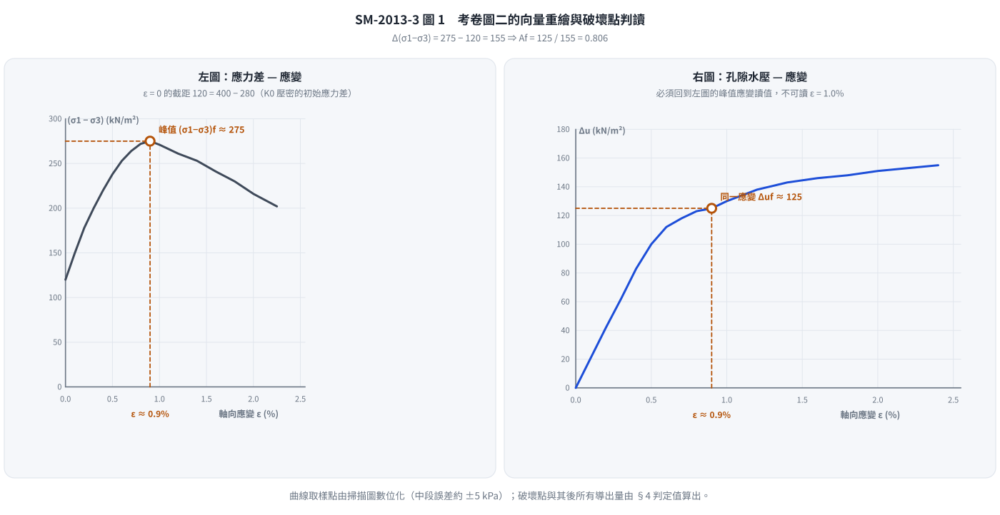
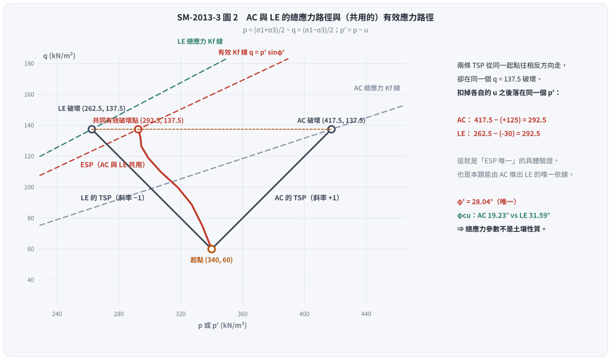
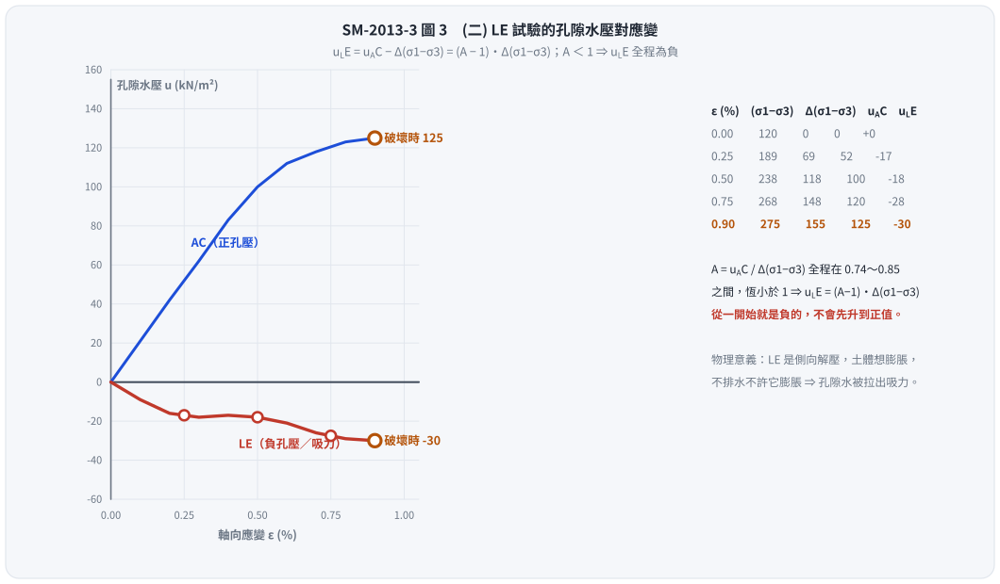

# 考題編號：SM-2013-3

**主分類：** `SM-U1-5` 土壤強度特性與變形性
**副分類：** 無
**分析法：** 有效應力法
**標籤：** `三軸試驗` `應力路徑` `有效應力路徑` `孔隙水壓參數Af` `K0壓密` `不排水剪力強度` `破壞面角度`

---

## 1. 原始題目重述 (Problem Restatement)

有一不擾動之黏土樣品，若進行 $K_0$ 不等向壓密不排水軸向壓縮（axial compression, AC）試驗，靜止土壓力係數 $K_0=0.7$，即初始條件為水平壓密應力 $\sigma_{cell}=280 \text{ kN/m}^2$，垂直軸向壓密應力為 $400 \text{ kN/m}^2$，假設初始孔隙水壓為零。此 AC 試驗之應力對應變以及孔隙水壓（$\Delta u$）對應變之結果，如圖二所示。

茲再準備一完全相同之黏土樣品（即孔隙比、含水量等皆保持相同），進行側向伸張試驗（lateral extension, LE），即垂直軸向應力保持一定，而側向壓力減少至試體破壞為止。

(一) 試繪出 AC 與 LE 試驗之總應力與有效應力路徑？（8 分）
(二) 試繪出 LE 試驗中，孔隙水壓對應變圖？（8 分）
(三) 試決定 AC 與 LE 試驗中之破壞時孔隙水壓參數 $A_f$，有效應力抗剪角 $\phi'$，總應力抗剪角 $\phi$ 與破壞面角度？（9 分）

*圖說：考卷圖二，左右兩張皆以軸向應變 $\epsilon$ (%) 為橫軸。左圖為應力差 $(\sigma_1-\sigma_3)$（縱軸 0～300 kN/m²，格線每 50），曲線自 $\epsilon = 0$ 的 $120 \text{ kN/m}^2$（即 $K_0$ 壓密的初始應力差 $400 - 280$）起升，**峰值約 $275 \text{ kN/m}^2$ 落在 $\epsilon \approx 0.9\%$**，其後軟化，至 $\epsilon = 2.25\%$ 降為約 $200$。右圖為孔隙水壓 $\Delta u$（縱軸 0～180 kN/m²，格線每 20），自原點單調上升，在 $\epsilon \approx 0.5\%$ 通過 $100$，**在峰值應變 $\epsilon \approx 0.9\%$ 處約為 $125 \text{ kN/m}^2$**，其後趨緩，$\epsilon = 2.4\%$ 時約 $155$。兩張圖必須在**同一個應變**（峰值處）讀值。*

---

## 2. 考題核心精神與出題者意圖 (Core Concepts & Examiner's Intent)

本題為極高水準之觀念題，主要測試考生對**應力路徑 (Stress Path)**與**有效應力原理**的深刻理解。出題者意圖包含：
1. **有效應力路徑 (ESP) 唯一性**：對於初始狀態相同的同種黏土，在不排水條件下，只要主應力方向不旋轉，不論總應力路徑如何改變（加載或解載），其有效應力路徑與孔隙水壓參數 $A$ 皆視為相同。
2. **總應力與有效應力參數之差異**：引導考生發現，儘管兩試驗的有效應力抗剪角 $\phi'$ 相同，但在不同總應力路徑下（若假設 $c=0$），總應力抗剪角 $\phi$ 會因測試方法 (AC vs LE) 而有顯著差異，凸顯總應力參數非土壤基本性質。
3. **破壞面角度的本質**：測試考生是否知道物理上的破壞面角度應由**有效應力摩擦角 $\phi'$** 控制，而非總應力摩擦角。

---

## 3. 解題戰略地圖與陷阱分析 (Strategic Roadmap & Trap Analysis)

- **步驟 1：讀取圖表與判定破壞點**
  從圖二中，需準確讀出破壞（應力差峰值）時的對應狀態。觀察左圖，峰值發生在應變 $\epsilon \approx 0.9\%$，此時 $(\sigma_1-\sigma_3)_f \approx 275 \text{ kPa}$；**再回到右圖的同一個應變**讀取，孔隙水壓 $\Delta u_f \approx 125 \text{ kPa}$。
  **兩張圖必須在同一應變讀值**——這是本題最常見的失分點：在左圖找峰值、卻在右圖隨手讀 $\epsilon = 1.0\%$（$\Delta u = 130$），$A_f$、$\phi'$ 就全部帶偏。
- **步驟 2：總應力路徑 (TSP) 分析**
  - **AC 試驗**：側壓不變 ($\Delta \sigma_3 = 0$)，軸壓增加 ($\Delta \sigma_1 > 0$)。
  - **LE 試驗**：軸壓不變 ($\Delta \sigma_1 = 0$)，側壓減少 ($\Delta \sigma_3 < 0$)。
  需注意 LE 試驗中，垂直應力 (400) 始終大於側向應力 (280 遞減)，故大主應力 $\sigma_1$ 始終為垂直向，主應力方向未旋轉。
- **步驟 3：利用 ESP 唯一性求孔壓**
  由 Skempton 參數 $A$ 在相同應變下相等的特性，可推導出 $u_{LE}$ 與 $u_{AC}$ 的直接數學關係，藉此繪製 LE 試驗的水壓變化圖。
- **陷阱與應對**：
  - **陷阱**：計算 $\phi$ 與 $\phi'$ 時，許多人不知如何處理凝聚力 $c$。
  - **應對**：由於僅有一組初始壓密狀態，依據考題慣例，針對單一試驗推導 $\phi'$ 與 $\phi$ 時，皆假設過原點 ($c'=0$ 及 $c_{cu}=0$) 進行計算。

---

## 3.5 變數層次分析 (Variable Hierarchy Analysis)

### 最終目標
`繪製 AC 與 LE 之應力路徑與水壓應變圖，並求出破壞時之強度與孔壓參數`

### 本題關鍵公式（依計算順序）
- 應力路徑座標 (以 $p, q$ 表示)：
  $$p = \frac{\sigma_1 + \sigma_3}{2} \quad ; \quad q = \frac{\sigma_1 - \sigma_3}{2}$$
- 總應力增量與 Skempton 孔隙水壓公式：
  $$\Delta u = \Delta \sigma_3 + A_f(\Delta \sigma_1 - \Delta \sigma_3)$$
- 兩試驗孔隙水壓關聯（基於 $A$ 參數相同）：
  $$u_{LE} = u_{AC} - \Delta(\sigma_1 - \sigma_3)$$
- 有效應力破壞參數（假設 $c'=0$）：
  $$\sin\phi' = \frac{\sigma_{1f}' - \sigma_{3f}'}{\sigma_{1f}' + \sigma_{3f}'}$$
- 總應力破壞參數（假設 $c_{cu}=0$）：
  $$\sin\phi_{cu} = \frac{\sigma_{1f} - \sigma_{3f}}{\sigma_{1f} + \sigma_{3f}}$$
- 實質破壞面角度（由有效應力控制）：
  $$\theta = 45^\circ + \frac{\phi'}{2}$$

### L1：題目直接給定
| 符號 | 數值 | 說明 |
|-----|------|-----|
| $\sigma_{vc}$ | $400 \text{ kPa}$ | 初始垂直壓密應力 |
| $\sigma_{hc}$ | $280 \text{ kPa}$ | 初始水平壓密應力 |
| $(\sigma_1-\sigma_3)_0$ | $120 \text{ kPa}$ | 初始應力差（$= 400 - 280$，圖二左圖 $\epsilon=0$ 之截距） |
| $(\sigma_1-\sigma_3)_f$ | $275 \text{ kPa}$ | 由圖讀取之破壞應力差（峰值，於 $\epsilon \approx 0.9\%$） |
| $\Delta u_{AC,f}$ | $125 \text{ kPa}$ | 由圖讀取之破壞孔隙水壓（**同一應變** $\epsilon \approx 0.9\%$） |

### L2：需知識點推導
**應力路徑與水壓關係**
| 符號 | 公式／來源 | 卡關? |
|-----|-----------|------|
| $u_{LE}$ | $= u_{AC} - [(\sigma_1-\sigma_3) - (\sigma_1-\sigma_3)_0]$ | |
| $p', q$ | $p' = p - u$ ; $q = (\sigma_1-\sigma_3)/2$ | |

### L3：深層知識（不懂就卡住）
| 知識點 | 說明 | 卡關? |
|-------|------|------|
| **有效應力路徑 (ESP) 唯一性** | 相同壓密狀態下，不排水剪力行為由有效應力決定。AC與LE的 $p'-q$ ESP 為同一條曲線。 | |
| **總應力抗剪角 $\phi$ 的非基本性** | 對同一土壤，不同總應力路徑(AC vs LE)繪出過原點之總應力包絡線，會得到不同的 $\phi_{cu}$。 | |
| **破壞面角度 $\theta$** | 土壤破壞由有效應力摩擦控制，故永遠為 $45^\circ + \phi'/2$，不受總應力路徑影響。 | |

---

## 4. 步驟化詳細計算過程 (Step-by-Step Detailed Calculation)

### Step 1: 初始狀態與破壞點數值讀取
定義應力路徑座標為 $p = \frac{\sigma_1 + \sigma_3}{2}$， $q = \frac{\sigma_1 - \sigma_3}{2}$。
初始狀態（對於 AC 與 LE 皆同）：
- $\sigma_1 = \sigma_v = 400 \text{ kPa}$
- $\sigma_3 = \sigma_h = 280 \text{ kPa}$
- $p_0 = \frac{400+280}{2} = 340 \text{ kPa}$
- $q_0 = \frac{400-280}{2} = 60 \text{ kPa}$
初始孔壓 $u_0 = 0$，故初始有效應力 $p_0' = p_0 = 340 \text{ kPa}$。

從圖二讀取 **AC 試驗破壞點**（左右兩圖在**同一應變**讀值）：
- 應力差峰值在 $\epsilon \approx 0.9\%$
- 破壞應力差 $(\sigma_1 - \sigma_3)_f = 275 \text{ kPa} \implies \Delta(\sigma_1 - \sigma_3) = 275 - 120 = 155 \text{ kPa}$
- 同一應變處之孔隙水壓 $u_{AC, f} = 125 \text{ kPa}$
- 不排水剪力強度 $S_u = (\sigma_1-\sigma_3)_f / 2 = 137.5 \text{ kPa}$

*圖 1　兩張圖的十字虛線落在同一個應變上——這正是本題的第一個關卡。這張圖攔的是「左圖找峰值、右圖卻順手讀 $\epsilon = 1.0\%$」：峰值其實在 $0.9\%$，讀到 $1.0\%$ 拿到的是破壞後的孔壓（130），$A_f$、$\phi'$、$\theta$ 會一路被帶偏。左圖 $\epsilon = 0$ 的截距 120 必須等於 $400 - 280$，可以當作讀圖前的校準檢核。*

---

### Step 2: (一) AC 與 LE 試驗之總應力與有效應力路徑

**1. AC 試驗總應力路徑 (TSP)**：
- 條件：$\Delta \sigma_1 > 0$，$\Delta \sigma_3 = 0$
- 破壞時：$\sigma_{1f} = 400 + 155 = 555 \text{ kPa}$，$\sigma_{3f} = 280 \text{ kPa}$
- 破壞點座標：$p_f = \frac{555+280}{2} = 417.5 \text{ kPa}$， $q_f = \frac{275}{2} = 137.5 \text{ kPa}$
- 路徑：起點 $(340, 60)$，終點 $(417.5, 137.5)$，斜率為 $+1$ 的直線。

**2. LE 試驗總應力路徑 (TSP)**：
- 條件：$\Delta \sigma_1 = 0$ (保持 400 kPa)，$\Delta \sigma_3 < 0$ (減少至破壞)。
- 因有效應力路徑唯一，兩者破壞時之 $q_f$ 相同（$q_f = 137.5 \text{ kPa}$），對應 $(\sigma_1 - \sigma_3)_f = 275 \text{ kPa}$。
- 破壞時：$\sigma_{1f} = 400 \text{ kPa}$，則 $\sigma_{3f} = 400 - 275 = 125 \text{ kPa}$。
- 破壞點座標：$p_f = \frac{400+125}{2} = 262.5 \text{ kPa}$， $q_f = 137.5 \text{ kPa}$
- 路徑：起點 $(340, 60)$，終點 $(262.5, 137.5)$，斜率為 $-1$ 的直線。

**3. 有效應力路徑 (ESP) (兩者共用)**：
- 破壞時有效應力（以 AC 為例）：$p_f' = p_f - u_{AC,f} = 417.5 - 125 = 292.5 \text{ kPa}$。
- 以 LE 驗算：$p_f' = 262.5 - (-30) = 292.5 \text{ kPa}$ —— 兩條完全不同的總應力路徑，**收斂到同一個有效應力破壞點**，這正是「ESP 唯一」的具體驗證。
- 破壞點座標：$(p_f', q_f) = (292.5, 137.5)$。
- 路徑：從起點 $(340, 60)$ 隨孔壓增加，向左彎曲延伸至終點 $(292.5, 137.5)$。

*圖 2　兩條總應力路徑從同一起點往相反方向走，卻收斂到同一個有效應力破壞點——「ESP 唯一」在這張圖上是可以用尺量的：$417.5 - (+125) = 262.5 - (-30) = 292.5$。這張圖攔的是「LE 也要重畫一條 ESP」的誤解，也讓 $\phi_{cu}$ 隨試驗方法從 $19.23^\circ$ 跳到 $31.59^\circ$、而 $\phi'$ 紋風不動這件事變得看得見。*

*(考試作答時，請於平面圖上標示橫軸 $p$ 或 $p'$，縱軸 $q$，並畫出上述三條路徑及起終點座標)*

---

### Step 3: (二) LE 試驗中，孔隙水壓對應變圖

依據 Skempton 孔隙水壓公式 $\Delta u = \Delta \sigma_3 + A(\Delta \sigma_1 - \Delta \sigma_3)$：
- AC 試驗：$\Delta u_{AC} = A \cdot \Delta(\sigma_1 - \sigma_3)$
- LE 試驗：$\Delta \sigma_1 = 0 \implies \Delta \sigma_3 = -\Delta(\sigma_1 - \sigma_3)$
  $\Delta u_{LE} = -\Delta(\sigma_1 - \sigma_3) + A[0 - (-\Delta(\sigma_1 - \sigma_3))] = \Delta u_{AC} - \Delta(\sigma_1 - \sigma_3)$
已知初始應力差為 120 kPa，故應力差增量 $\Delta(\sigma_1 - \sigma_3) = (\sigma_1 - \sigma_3)_{current} - 120$。
代入得 LE 試驗之孔壓公式：
$$u_{LE} = u_{AC} - (\sigma_1 - \sigma_3)_{current} + 120$$

從圖二逐點擷取（左右兩圖取同一應變）計算 $u_{LE}$：

| 應變 $\epsilon$ (%) | $(\sigma_1-\sigma_3)$ (kPa) | $\Delta(\sigma_1-\sigma_3)$ (kPa) | $u_{AC}$ (kPa) | $A = u_{AC}/\Delta(\sigma_1-\sigma_3)$ | **$u_{LE} = u_{AC} - \Delta(\sigma_1-\sigma_3)$** |
|:---:|:---:|:---:|:---:|:---:|:---:|
| 0 | 120 | 0 | 0 | — | **0** |
| 0.25 | 189 | 69 | 52 | 0.74 | **-17** |
| 0.50 | 238 | 118 | 100 | 0.85 | **-18** |
| 0.75 | 268 | 148 | 120 | 0.81 | **-28** |
| 0.90 (破壞) | 275 | 155 | 125 | 0.81 | **-30** |

**關鍵觀察：$u_{LE}$ 全程為負。**
因為 $u_{LE} = (A - 1)\,\Delta(\sigma_1-\sigma_3)$，而本土樣在整個剪切過程中 $A$ 都小於 1（見上表，$A \approx 0.74 \sim 0.85$），故 $u_{LE}$ **從一開始就是負值，且隨應力差增大而愈負**，不存在「先升到正值再下降」的階段。

**繪圖描述**：
LE 試驗的 $u_{LE}$ 曲線自原點 $(0,0)$ 出發即向下（負向）發展，$\epsilon \approx 0.25 \sim 0.5\%$ 之間約在 $-17 \sim -18 \text{ kPa}$ 附近趨平，之後隨應力差續增再度下探，於破壞點（$\epsilon \approx 0.9\%$）達到 $u_{LE} = -30 \text{ kPa}$。
*(由於題目指定側向壓力減少「至試體破壞為止」，曲線繪製至 $\epsilon \approx 0.9\%$ 即可；中間各點受讀圖精度影響約 $\pm 5 \text{ kPa}$，作圖時取平滑單調下降即可，形狀正確比數值精確重要)*

**物理意義**：LE 是「側向解壓」，平均總應力 $p$ 一路下降，土體有膨脹（減壓）的傾向；不排水條件不許它膨脹，孔隙水於是被拉出負壓（吸力）來抵抗。這與 AC 的正孔壓恰好相反，卻由**同一個** $A$ 參數描述——這就是本題要考的東西。

*圖 3　$u_{LE} = (A-1)\,\Delta(\sigma_1-\sigma_3)$，而本土樣的 $A$ 全程落在 $0.74 \sim 0.85$、恆小於 1，所以 LE 的孔壓**從第一步就是負的**。這張圖攔的是把 LE 曲線畫成「先升到正值再掉下來」——那要求某段 $A > 1$，與 AC 圖讀出來的數據直接矛盾。*

---

### Step 4: (三) 決定破壞時之強度與孔壓參數

**1. 破壞時孔隙水壓參數 $A_f$**
對於 AC 與 LE 試驗，在同一破壞應變下具有相同的 $A_f$。以 AC 試驗計算：
- $\Delta \sigma_1 = 155 \text{ kPa}$，$\Delta \sigma_3 = 0$，$\Delta u_f = 125 \text{ kPa}$
$$A_f = \frac{\Delta u_f - \Delta \sigma_3}{\Delta \sigma_1 - \Delta \sigma_3} = \frac{125 - 0}{155 - 0} = \boxed{0.806}$$

**2. 有效應力抗剪角 $\phi'$**
破壞時有效主應力：
$\sigma_{1f}' = \sigma_{1f} - u_f = 555 - 125 = 430 \text{ kPa}$
$\sigma_{3f}' = \sigma_{3f} - u_f = 280 - 125 = 155 \text{ kPa}$
假設有效應力凝聚力 $c' = 0$：
$$\sin\phi' = \frac{\sigma_{1f}' - \sigma_{3f}'}{\sigma_{1f}' + \sigma_{3f}'} = \frac{430 - 155}{430 + 155} = \frac{275}{585} = 0.4701$$
$$\phi' = \arcsin(0.4701) = \boxed{28.04^\circ}$$
（以 LE 驗算：$\sigma_{1f}' = 400 - (-30) = 430$、$\sigma_{3f}' = 125 - (-30) = 155 \text{ kPa}$，與 AC 完全相同，故 $\phi'$ 亦相同——再次印證 ESP 唯一。）

**3. 總應力抗剪角 $\phi$**
因試驗方法不同，過原點之總應力包絡線（假設 $c_{cu}=0$）將產生不同之 $\phi_{cu}$：
- **AC 試驗**：$\sigma_{1f} = 555$, $\sigma_{3f} = 280$
  $$\sin\phi_{AC} = \frac{555 - 280}{555 + 280} = \frac{275}{835} = 0.3293 \implies \boxed{\phi_{AC} = 19.23^\circ}$$
- **LE 試驗**：$\sigma_{1f} = 400$, $\sigma_{3f} = 125$
  $$\sin\phi_{LE} = \frac{400 - 125}{400 + 125} = \frac{275}{525} = 0.5238 \implies \boxed{\phi_{LE} = 31.59^\circ}$$
*(註：若以同一不排水狀態下 $S_u = 137.5 \text{ kPa}$ 恆定之觀點，兩總應力莫爾圓半徑相同，其共同水平切線則對應 $\phi = 0^\circ, c_u = 137.5 \text{ kPa}$。考試時建議以上述分別計算 $\phi_{cu}$ 為主，並附註此觀念。)*

**4. 破壞面角度 $\theta$**
土壤實質破壞面受**有效應力摩擦角**控制，與大主應力面（對於 AC 與 LE 皆為水平面）的夾角為：
$$\theta = 45^\circ + \frac{\phi'}{2} = 45^\circ + \frac{28.04^\circ}{2} = 45^\circ + 14.02^\circ = \boxed{59.02^\circ}$$

---

## 5. 關鍵爭議點與進階探討 (Critical Issues & Advanced Discussion)

0. **讀圖精度與「同一應變」原則（本題的頭號失分點）**
   圖二是掃描的手繪圖，格線左圖每 $50$、右圖每 $20 \text{ kN/m}^2$，任何人讀出來都有約 $\pm 5 \text{ kPa}$ 的誤差。真正會扣分的不是這 $\pm 5$，而是**在兩張圖上讀了不同的應變**：
   左圖峰值在 $\epsilon \approx 0.9\%$（不是 $1.0\%$），若在左圖找峰值、卻在右圖順手讀 $\epsilon = 1.0\%$ 的 $\Delta u = 130$，等於把「破壞時的孔壓」換成了「破壞後的孔壓」。
   敏感度：以 $(275,\,125)$ 求得 $A_f = 0.806$、$\phi' = 28.0^\circ$、$\theta = 59.0^\circ$；若讀成 $(280,\,130)$ 則為 $A_f = 0.813$、$\phi' = 28.9^\circ$、$\theta = 59.4^\circ$。
   兩者差不到 $1^\circ$，閱卷通常都給分，但**在同一應變讀值**這件事本身就是評分的觀念點，作答時務必在圖上把破壞點的十字線畫出來、並寫明「於 $\epsilon \approx 0.9\%$ 讀取」。
1. **總應力抗剪角的陷阱**
   很多考生誤以為土壤有唯一的「總應力抗剪角」。本題完美展示了：對於同一土壤、同樣的壓密狀態，僅因為加載路徑的不同（AC 為被動加壓，LE 為主動解載），求出的總應力摩擦角 $\phi_{cu}$ 竟從 $19.23^\circ$ 變為 $31.59^\circ$。這證明了**總應力參數不是土壤的基本力學性質**，它高度依賴於應力路徑與試驗方法。
2. **$A$ 參數的物理意義**
   本題能順利解出 LE 的孔壓，完全仰賴 $A$ 參數在相同偏應力/應變下恆定之假設。對於未發生主應力旋轉之 $K_0$ 壓密土壤，此假設與「唯一有效應力路徑」在數學與力學上是完全等價的。
3. **破壞面的判定**
   不管總應力表現出的 $\phi$ 是多少，物理上的剪切破壞面永遠由有效力學機制主導。因此破壞面角度必須使用 $\theta = 45^\circ + \phi'/2$ 計算，若誤用 $\phi_{cu}$ 代入將得到錯誤的傾角。

---

*解析日期：見 `wiki/log.md`　｜　圖解補繪：2026-08-28（向量 SVG，程式繪製，腳本 `gen_SM-2013-3.py` 可重跑；同名 2× PNG 供簡報／影片管線使用）*
