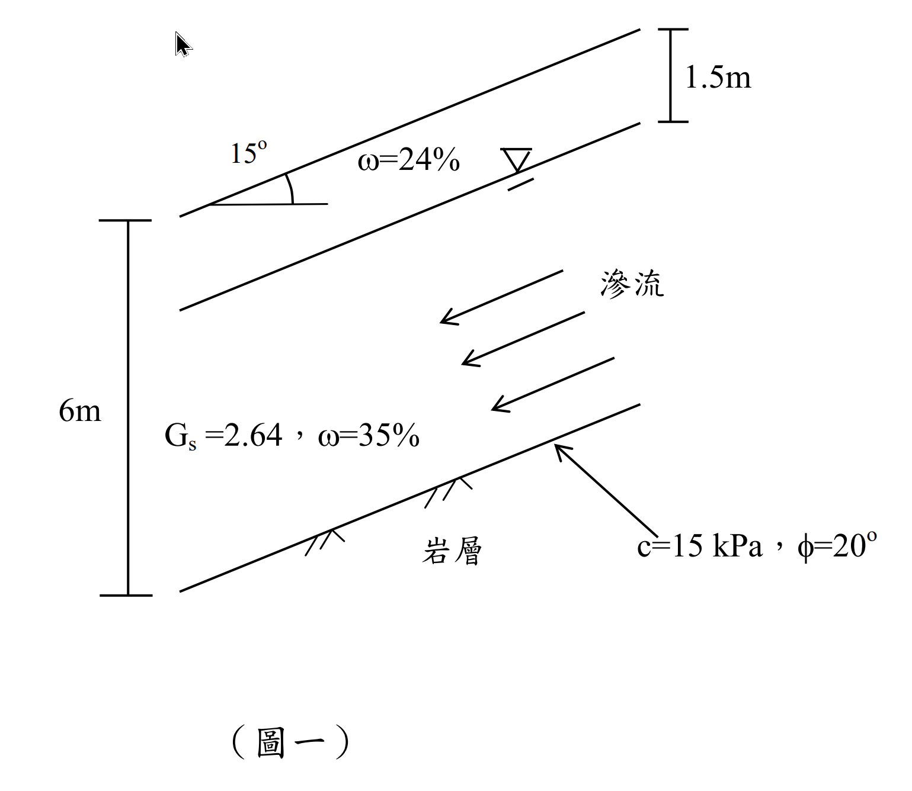

# 考題編號：[SM-2014-1]

**主分類：** `SM-U3` 坡地工程
**副分類：** `SM-U1` 土壤基本性質與分類
**分析法：** 有效應力法
**標籤：** `無限邊坡` `平行滲流` `有效應力` `三相圖`

---

## 1. 原始題目重述 (Problem Restatement)
一、二維度無限邊坡如圖一所示，崩積土層厚 6 m，地下水位於地表下方 1.5 m，其滲流平行於坡面，地下水位上下方崩積土有相同空隙比（void ratio, e）與比重 $G_s = 2.64$，地下水位以下與上方崩積土之含水量 $\omega$ 分別為 35% 與 24%，崩積土與下方岩層之介面摩擦角 $\phi$ 為 20°、凝聚力 $c$ 為 15 kPa，試求該無限邊坡之安全係數。（25 分）

*圖說：二維無限邊坡，邊坡傾角 $\beta = 15^\circ$，崩積土垂直總厚度 $H = 6\text{m}$，地下水位距地表垂直深度 $H_1 = 1.5\text{m}$。水位於土層中產生平行於坡面之滲流。土壤比重 $G_s = 2.64$，水位上方 $\omega_1 = 24\%$，水位下方 $\omega_2 = 35\%$。滑動面為土岩交界面，參數 $c = 15\text{ kPa}$、$\phi = 20^\circ$。*

## 2. 考題核心精神與出題者意圖 (Core Concepts & Examiner's Intent)
本題主要測驗考生兩大核心觀念：
1. **土壤基本物理性質的換算（三相圖）**：利用地下水位以下為完全飽和（$S=1$）的隱藏條件，結合已知含水量推算整層共用的空隙比 $e$，進而求出水位上方的濕單位重與下方的飽和單位重。
2. **無限邊坡之平行滲流分析**：測驗考生是否清楚平行於坡面滲流時，等勢線應垂直於坡面，此時破壞面上的孔隙水壓為 $u = \gamma_w H_w \cos^2\beta$。同時測驗對於「垂直深度」轉換為滑動面上正向力與剪力的幾何關係（$\sigma_n = \sigma_v \cos^2\beta$ 及 $\tau = \sigma_v \sin\beta \cos\beta$）。

## 3. 解題戰略地圖與陷阱分析 (Strategic Roadmap & Trap Analysis)
**作戰計畫：**
1. **求空隙比 $e$**：由水位下方飽和狀態 ($S=1$) 及含水量 $\omega_2 = 35\%$，代入 $S \cdot e = \omega \cdot G_s$ 求解。
2. **計算單位重**：分別計算水位上方土層之濕單位重 $\gamma_t$ 與下方土層之飽和單位重 $\gamma_{sat}$。
3. **計算應力與水壓**：
   - 總垂直應力 $\sigma_v = \gamma_t H_1 + \gamma_{sat} H_2$
   - 孔隙水壓 $u = \gamma_w H_2 \cos^2\beta$（平行滲流條件）
   - 有效正向應力 $\sigma_n' = \sigma_v \cos^2\beta - u$
   - 剪應力（驅動力）$\tau = \sigma_v \sin\beta \cos\beta$
4. **計算安全係數**：代入 Mohr-Coulomb 破壞準則求抗剪強度 $\tau_f$，最後計算 $FS = \tau_f / \tau$。

**陷阱分析：**
- ⚠ **陷阱 1：孔隙水壓計算錯誤**
  若誤用靜水壓力公式 $u = \gamma_w H_2$，將會高估孔隙水壓，導致有效應力與安全係數偏低。必須乘上 $\cos^2\beta$ 修正。
- ⚠ **陷阱 2：幾何尺寸的判讀**
  圖示中的尺寸線為鉛直方向，代表 $6\text{m}$ 與 $1.5\text{m}$ 為「鉛直厚度」$H$。若誤認為是垂直於坡面之厚度 $z$，則應力公式的轉換會完全不同（$\sigma_n = \Sigma \gamma z \cos\beta$），易造成計算錯誤。
- ⚠ **陷阱 3：水位上方土層單位重**
  水位上方並非乾燥狀態，亦不一定完全飽和。需帶入題目給定的含水量 $\omega_1 = 24\%$ 以及算出的空隙比 $e$ 來求取正確的濕單位重 $\gamma_t$。

## 3.5 變數層次分析 (Variable Hierarchy Analysis)

### 最終目標
求出該二維無限邊坡在平行滲流條件下之安全係數 (Factor of Safety, FS)

### 本題關鍵公式（依計算順序）
- 藉由飽和土層之含水量求空隙比：$e = \omega_{sat} G_s$
- 地下水位上方之單位重：$\gamma_t = \frac{G_s(1+\omega_1)}{1+\boxed{e}}\gamma_w$
- 地下水位下方之飽和單位重：$\gamma_{sat} = \frac{G_s(1+\omega_2)}{1+\boxed{e}}\gamma_w$
- 滑動面上之總垂直應力：$\sigma_v = \boxed{\gamma_t} H_1 + \boxed{\gamma_{sat}} H_2$
- 滑動面上之孔隙水壓：$u = \gamma_w H_2 \cos^2\beta$
- 滑動面上之有效正向應力：$\sigma_n' = \boxed{\sigma_v} \cos^2\beta - \boxed{u}$
- 滑動面上之剪應力（驅動力）：$\tau = \boxed{\sigma_v} \sin\beta \cos\beta$
- 滑動面上之抗剪強度：$\tau_f = c' + \boxed{\sigma_n'} \tan\phi'$
- 安全係數：$FS = \frac{\boxed{\tau_f}}{\boxed{\tau}}$

### L1：題目直接給定
| 符號 | 數值 | 說明 |
|-----|-----|-----|
| $H$ | $6\text{ m}$ | 崩積土層總垂直厚度 |
| $H_1$ | $1.5\text{ m}$ | 地下水位上方垂直厚度 |
| $H_2$ | $4.5\text{ m}$ | 地下水位下方垂直厚度 ($H - H_1$) |
| $\beta$ | $15^\circ$ | 邊坡傾角 |
| $G_s$ | $2.64$ | 土壤比重 |
| $\omega_1$ | $24\%$ | 水位上方含水量 |
| $\omega_2$ | $35\%$ | 水位下方含水量 |
| $c'$ | $15\text{ kPa}$ | 滑動介面凝聚力 |
| $\phi'$ | $20^\circ$ | 滑動介面摩擦角 |

### L2：需知識點推導
**土壤物理性質計算**
| 符號 | 公式／來源 | 卡關? |
|-----|-----|------|
| $e$ | $e = \omega_2 G_s$ | |
| $\gamma_t$ | $\gamma_t = \frac{G_s(1+\omega_1)}{1+e}\gamma_w$ | |
| $\gamma_{sat}$ | $\gamma_{sat} = \frac{G_s(1+\omega_2)}{1+e}\gamma_w$ | |

**邊坡應力狀態計算**
| 符號 | 公式／來源 | 卡關? |
|-----|-----|------|
| $\sigma_v$ | $\sigma_v = \gamma_t H_1 + \gamma_{sat} H_2$ | |
| $u$ | $u = \gamma_w H_2 \cos^2\beta$ | |
| $\sigma_n'$ | $\sigma_n' = \sigma_v \cos^2\beta - u$ | |
| $\tau$ | $\tau = \sigma_v \sin\beta \cos\beta$ | |

**抗剪強度與安全係數**
| 符號 | 公式／來源 | 卡關? |
|-----|-----|------|
| $\tau_f$ | $\tau_f = c' + \sigma_n' \tan\phi'$ | |
| $FS$ | $FS = \tau_f / \tau$ | |

### L3：深層知識（不懂就卡住）
| 知識點 | 說明 | 卡關? |
|-------|-----|------|
| 孔隙水壓計算 (平行滲流) | 平行邊坡滲流時，等勢線垂直於坡面，水壓水頭等於等勢線上至水位的垂直距離乘上 $\cos^2\beta$。故 $u = \gamma_w H_2 \cos^2\beta$。 | |
| 垂直厚度與應力關係 | 題目給定的是「鉛直厚度」$H$。總垂直應力直接為 $\sigma_v = \Sigma \gamma H$。若誤認為垂直於坡面的厚度 $z$，則公式大不相同。 | |
| 飽洪度與空隙比的關係 | 地下水位以下預設為飽和狀態 ($S=1$)，利用 $\omega_2$ 即可求得全區共用的空隙比 $e = \omega_2 G_s$。 | |

## 4. 步驟化詳細計算過程 (Step-by-Step Detailed Calculation)
> 💡 水單位重取 $\gamma_w = 9.81\text{ kN/m}^3$

**Step 1：推導土壤共用空隙比 $e$**
地下水位下方土層視為完全飽和，飽和度 $S = 1$。
利用三相關係式 $S \cdot e = \omega \cdot G_s$：
$$1 \cdot e = \omega_2 \cdot G_s = 0.35 \times 2.64$$
$$e = 0.924$$
*(註：題目敘述「地下水位上下方崩積土有相同空隙比」，故整層土之 $e = 0.924$)*

**Step 2：計算各層土壤單位重**
水位上方之濕單位重 $\gamma_t$：
$$\gamma_t = \frac{G_s (1 + \omega_1)}{1 + e} \gamma_w = \frac{2.64 \times (1 + 0.24)}{1 + 0.924} \times 9.81 = \frac{3.2736}{1.924} \times 9.81 = 1.7015 \times 9.81 = 16.69\text{ kN/m}^3$$

水位下方之飽和單位重 $\gamma_{sat}$：
$$\gamma_{sat} = \frac{G_s (1 + \omega_2)}{1 + e} \gamma_w = \frac{2.64 \times (1 + 0.35)}{1 + 0.924} \times 9.81 = \frac{3.564}{1.924} \times 9.81 = 1.8524 \times 9.81 = 18.17\text{ kN/m}^3$$

**Step 3：計算滑動面上之應力與水壓**
滑動面位於地表下方垂直深度 $H = 6\text{m}$ 處，岩層與土層交界面。
水位上方垂直厚度 $H_1 = 1.5\text{m}$，水位下方垂直厚度 $H_2 = 6 - 1.5 = 4.5\text{m}$。

滑動面上之**總垂直應力 $\sigma_v$**：
$$\sigma_v = \gamma_t H_1 + \gamma_{sat} H_2 = 16.69 \times 1.5 + 18.17 \times 4.5 = 25.035 + 81.765 = 106.80\text{ kPa}$$

滑動面上之**孔隙水壓 $u$**（平行滲流條件）：
$$u = \gamma_w H_2 \cos^2\beta = 9.81 \times 4.5 \times \cos^2(15^\circ) = 44.145 \times 0.9330 = 41.19\text{ kPa}$$

滑動面上之**有效正向應力 $\sigma_n'$**：
$$\sigma_n' = \sigma_v \cos^2\beta - u = 106.80 \times \cos^2(15^\circ) - 41.19 = 106.80 \times 0.9330 - 41.19 = 99.64 - 41.19 = 58.45\text{ kPa}$$
*(另解核對：$\sigma_n' = (\gamma_t H_1 + \gamma' H_2) \cos^2\beta = [16.69 \times 1.5 + (18.17 - 9.81) \times 4.5] \times 0.9330 = 62.655 \times 0.9330 = 58.46\text{ kPa}$)*

滑動面上之**剪應力 $\tau$**（即下滑驅動力）：
$$\tau = \sigma_v \sin\beta \cos\beta = 106.80 \times \sin(15^\circ) \cos(15^\circ) = 106.80 \times 0.2588 \times 0.9659 = 106.80 \times 0.25 = 26.70\text{ kPa}$$

**Step 4：計算抗剪強度與安全係數**
滑動面上之**抗剪強度 $\tau_f$**：
$$\tau_f = c' + \sigma_n' \tan\phi' = 15 + 58.45 \times \tan(20^\circ) = 15 + 58.45 \times 0.3640 = 15 + 21.28 = 36.28\text{ kPa}$$

**安全係數 $FS$**：
$$FS = \frac{\tau_f}{\tau} = \frac{36.28}{26.70} = 1.3588 \approx 1.36$$

$$\boxed{FS = 1.36}$$

## 5. 關鍵爭議點與進階探討 (Critical Issues & Advanced Discussion)
- **垂直厚度 $H$ 與法向厚度 $z$ 的判讀**：在無限邊坡分析中，常常會遇到題目給定的厚度到底是鉛直的還是垂直坡面的。本題圖示的尺寸線採用標準的鉛直繪製法（帶有水平引線），應解讀為鉛直厚度 $H$。倘若給定的是垂直坡面的厚度 $z$，則總法向應力會變為 $\sigma_n = \Sigma \gamma z \cos\beta$，剪應力為 $\tau = \Sigma \gamma z \sin\beta$。考場上須仔細辨別圖示標註方式。
- **單位重的精確度**：在使用水單位重 $\gamma_w$ 時，採用 $9.81\text{ kN/m}^3$ 最為嚴謹，計算出的結果也最貼近標準答案。若習慣採用 $9.8\text{ kN/m}^3$ 或 $10\text{ kN/m}^3$，只要過程清楚列式，計算出的 FS 皆落於 1.36 上下（如用 9.8 算出約為 1.36），不會影響得分。
- **孔隙水壓公式推導提醒**：平行滲流時，由於水流平行坡面，等勢線垂直坡面。從水面上某點垂直往下至滑動面長度為 $H_w$，對應的水壓水頭即為 $H_w \cos^2\beta$。此為國考無限邊坡考題中極高頻出現的考點，必須牢記。
