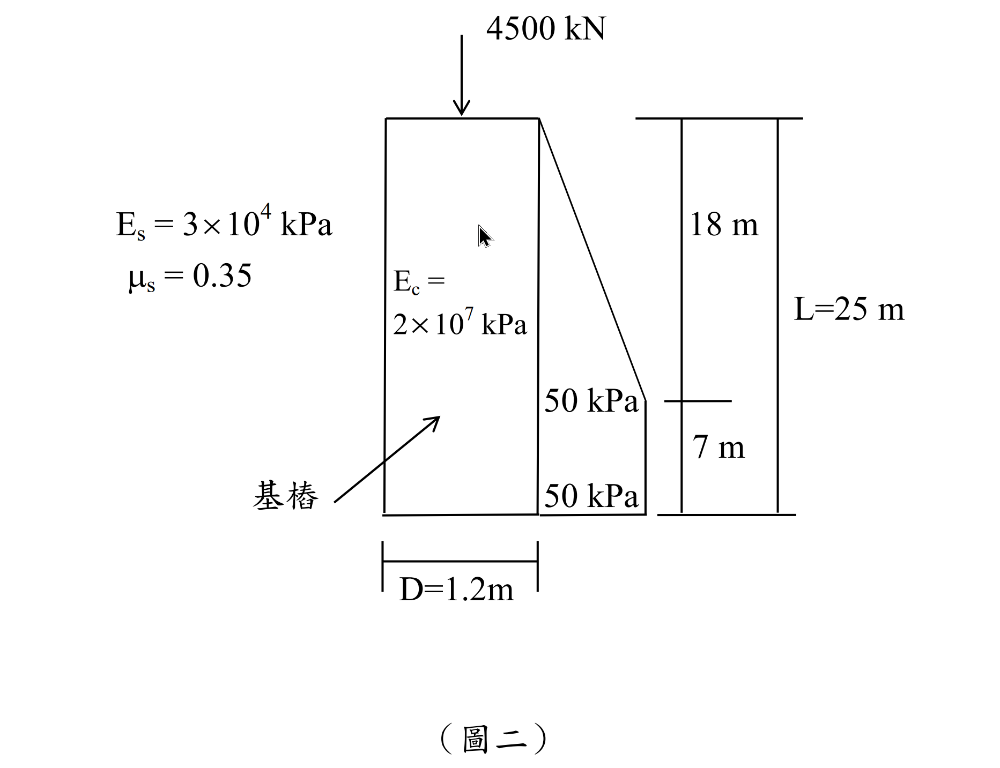

# 考題編號：SM-2014-2

**主分類：** `SM-U2-2` 深基礎之支承力與沉陷量
**副分類：** 無
**分析法：** 總應力法
**標籤：** `樁沉陷` `彈性沉陷` `樁身彈性壓縮` `端點承載力` `摩擦力` `摩擦應力分布`
---

## 1. 原始題目重述 (Problem Restatement)
- 有一直徑 $D = 1.2 \text{ m}$、長度 $L = 25 \text{ m}$ 的基樁，埋設於砂質土壤中。
- 樁頂承受軸重 $Q_t = 4500 \text{ kN}$。
- 側向摩擦應力 $f_s(z)$ 隨深度分布如題圖所示：自頂部 $z=0$ 為零，以線性增加至 $18 \text{ m}$ 深之 $50 \text{ kPa}$，並保持 $50 \text{ kPa}$ 至樁底部 ($z=25 \text{ m}$)。
- 基樁楊氏模數 $E_p = 2.0 \times 10^7 \text{ kPa}$。
- 土壤楊氏模數 $E_s = 3 \times 10^4 \text{ kPa}$，土壤柏松比 $\mu_s = 0.35$。
- 求該樁之總沉陷量 $S_e = S_{e1} + S_{e2} + S_{e3}$，其中：
  - 基樁之底部彈性沉陷 $S_{e2} = \frac{q_{wp} D}{E_s}(1-\mu_s^2)I_{wp}$，其中 $I_{wp} = 0.85$。
  - 基樁之側向摩擦彈性沉陷 $S_{e3} = \left(\frac{Q_{ws}}{pL}\right)\frac{D}{E_s}(1-\mu_s^2)I_{ws}$，其中 $I_{ws} = 2+0.35\sqrt{\frac{L}{D}}$，式中 $p$ 為樁周長。
  - 基樁之彈性壓縮 $S_{e1}$ 需自行運用材料力學公式推導或使用經驗公式。

*圖說：樁長 25m，直徑 1.2m。側向摩擦力於 0~18m 由 0 線性增加至 50 kPa，18~25m 維持 50 kPa 恆定。樁頂承受 4500 kN 載重。*

## 2. 考題核心精神與出題者意圖 (Core Concepts & Examiner's Intent)
本題旨在測驗考生對於基樁沉陷量三成分 (樁身壓縮 $S_{e1}$、樁底土壤變形 $S_{e2}$、樁側土壤變形 $S_{e3}$) 之計算能力。
出題者明確給定 $S_{e2}$ 與 $S_{e3}$ 之經驗公式，測驗重點在於：
1. **側摩擦力 $Q_{ws}$ 與端承載力 $Q_{wp}$ 的分離**：需由給定之應力分佈圖，精確積分出總側摩擦力，並由力平衡求出端承載力。
2. **樁身壓縮 $S_{e1}$ 的計算**：面對非均勻分佈之側摩擦力，需具備應用材料力學基本定義 $S_{e1} = \int \frac{Q(z)}{AE} dz$ 進行分段積分之能力，而非死背 $\alpha$ 係數公式。
3. **單位與幾何參數**：圓面積 $A_p$、周長 $p$、$q_{wp}$ 之換算不能出錯。

## 3. 解題戰略地圖與陷阱分析 (Strategic Roadmap & Trap Analysis)
1. **計算幾何參數**：樁斷面積 $A_p$ 與樁周長 $p$。
2. **力平衡分析求 $Q_{ws}$ 與 $Q_{wp}$**：
   - 將摩擦應力 $f_s(z)$ 依深度分為三角形分佈 ($0 \sim 18 \text{ m}$) 與矩形分佈 ($18 \sim 25 \text{ m}$)。
   - 乘上樁周長 $p$ 得到總摩擦力 $Q_{ws}$。
   - 由 $Q_t = Q_{ws} + Q_{wp}$ 求出樁底傳遞荷重 $Q_{wp}$ 與基底應力 $q_{wp}$。
3. **計算樁身彈性壓縮 $S_{e1}$**：
   - 推導樁身軸力 $Q(z) = Q_t - \int_0^z f_s(x) p \, dx$。
   - 帶入 $S_{e1} = \int_0^L \frac{Q(z)}{A_p E_p} dz$ 進行分段積分。
4. **計算樁底與樁側沉陷 $S_{e2}, S_{e3}$**：
   - 將前述參數代入題目給定之公式，注意單位一致性。
5. **陷阱分析**：
   - ⚠️ **$S_{e3}$ 公式中的 $p$**：題目原文公式寫為 $PL$ 且 $P$ 未明定，依據 Vesic 理論，分母的 $P$ 實為周長 perimeter，本文以 $p$ 標示以避免與荷重 $P$ 混淆。
   - ⚠️ **端承應力 $q_{wp}$ 的定義**：$q_{wp} = Q_{wp}/A_p$，並非直接帶入 $Q_{wp}$。
   - ⚠️ **單位**：全算式統一採用 $\text{kN}$ 與 $\text{m}$，沉陷量最終換算為 $\text{mm}$。

## 3.5 變數層次分析 (Variable Hierarchy Analysis)

### 最終目標
計算基樁頂部受軸壓時，樁體變形與周圍土壤變形所產生的總沉陷量 $S_e$。

### 本題關鍵公式（依計算順序）
總側摩擦阻力：
$$ Q_{ws} = p \int_0^L f_s(z) \, dz $$
樁底端承載力：
$$ Q_{wp} = Q_t - \boxed{Q_{ws}} $$
樁身彈性壓縮量（分段積分）：
$$ S_{e1} = \int_0^L \frac{Q(z)}{A_p E_p} dz \quad \text{where } Q(z) = Q_t - p \int_0^z f_s(x) dx $$
樁底彈性沉陷量：
$$ S_{e2} = \frac{\left( \boxed{Q_{wp}} / A_p \right) D}{E_s} (1-\mu_s^2) I_{wp} $$
樁側彈性沉陷量：
$$ S_{e3} = \left( \frac{\boxed{Q_{ws}}}{p L} \right) \frac{D}{E_s} (1-\mu_s^2) \left( 2+0.35\sqrt{\frac{L}{D}} \right) $$

### L1：題目直接給定
| 符號 | 數值 | 說明 |
|---|---|---|
| $D$ | $1.2 \text{ m}$ | 基樁直徑 |
| $L$ | $25 \text{ m}$ | 基樁長度 |
| $Q_t$ | $4500 \text{ kN}$ | 樁頂承受軸重 |
| $E_p$ | $2.0 \times 10^7 \text{ kPa}$ | 樁身楊氏模數 |
| $E_s$ | $3 \times 10^4 \text{ kPa}$ | 土壤楊氏模數 |
| $\mu_s$ | $0.35$ | 土壤柏松比 |
| $I_{wp}$ | $0.85$ | 樁底沉陷影響係數 |

### L2：需知識點推導
**幾何與荷重分配**
| 符號 | 公式／來源 | 卡關? |
|---|---|---|
| $A_p$ | $\frac{\pi}{4}D^2$ | |
| $p$ | $\pi D$ | |
| $Q_{ws}$ | $p \int_0^L f_s(z) dz$ | |
| $Q_{wp}$ | $Q_t - Q_{ws}$ | |
| $q_{wp}$ | $Q_{wp} / A_p$ | |

**沉陷量計算**
| 符號 | 公式／來源 | 卡關? |
|---|---|---|
| $S_{e1}$ | $\int_0^L \frac{Q(z)}{A_p E_p} dz$ | |
| $I_{ws}$ | $2 + 0.35\sqrt{L/D}$ | |
| $S_{e2}$ | $\frac{q_{wp} D}{E_s}(1-\mu_s^2)I_{wp}$ | |
| $S_{e3}$ | $(\frac{Q_{ws}}{p L})\frac{D}{E_s}(1-\mu_s^2)I_{ws}$ | |
| $S_e$ | $S_{e1} + S_{e2} + S_{e3}$ | |

### L3：深層知識（不懂就卡住）
| 知識點 | 說明 | 卡關? |
|---|---|---|
| $S_{e1}$ 積分法 | 當 $f_s$ 非均佈時，需以 $Q(z) = Q_t - \Sigma f_s$ 分段列式並積分，勿直接用經驗係數 $\alpha=0.5$ 計算 | |
| $S_{e3}$ 公式解析 | 公式中的 $P$ 或 $p$ 指的是 Perimeter (樁周長)，$Q_{ws}/(pL)$ 實為平均側向摩擦應力 $f_{s,avg}$ | |

## 4. 步驟化詳細計算過程 (Step-by-Step Detailed Calculation)

**Step 1: 幾何參數計算**
基樁斷面積：
$$ A_p = \frac{\pi}{4}D^2 = \frac{\pi}{4}(1.2)^2 = 0.36\pi \approx 1.13097 \text{ m}^2 $$
基樁周長：
$$ p = \pi D = 1.2\pi \approx 3.76991 \text{ m} $$
樁體軸向勁度：
$$ A_p E_p = (0.36\pi) \times (2.0 \times 10^7) = 7.2\pi \times 10^6 \text{ kN} \approx 22619467 \text{ kN} $$

**Step 2: 樁側摩擦力 $Q_{ws}$ 與端承載力 $Q_{wp}$**
側向摩擦應力分佈：
- $0 \le z \le 18 \text{ m}$：$f_s(z) = \frac{50}{18}z \text{ kPa}$
- $18 \le z \le 25 \text{ m}$：$f_s(z) = 50 \text{ kPa}$

對深度積分求單位周長之摩擦力：
$$ \int_0^{25} f_s(z) dz = \left( \frac{1}{2} \times 18 \times 50 \right) + \left( 7 \times 50 \right) = 450 + 350 = 800 \text{ kN/m} $$
總側摩擦力 $Q_{ws}$：
$$ Q_{ws} = p \int_0^{25} f_s(z) dz = (1.2\pi) \times 800 = 960\pi \approx 3015.93 \text{ kN} $$
端承載力 $Q_{wp}$：
$$ Q_{wp} = Q_t - Q_{ws} = 4500 - 960\pi \approx 1484.07 \text{ kN} $$
樁底應力 $q_{wp}$：
$$ q_{wp} = \frac{Q_{wp}}{A_p} = \frac{4500 - 960\pi}{0.36\pi} = \frac{12500}{\pi} - 2666.67 \approx 1312.19 \text{ kPa} $$

**Step 3: 樁身彈性壓縮 $S_{e1}$ 計算**
深度 $z$ 處之軸力 $Q(z)$ 為：
- $0 \le z \le 18 \text{ m}$：
  $$ Q(z) = Q_t - p \int_0^z \left( \frac{50}{18}x \right) dx = Q_t - p \left( \frac{25}{18}z^2 \right) $$
- $18 \le z \le 25 \text{ m}$：
  $$ Q(z) = Q(18) - p \int_{18}^z 50 \, dx = (Q_t - 450p) - 50p(z - 18) $$

積分求 $S_{e1}$ 分子 $\int_0^{25} Q(z) dz$：
第一段 ($0 \sim 18 \text{ m}$)：
$$ \int_0^{18} \left( Q_t - p \frac{25}{18}z^2 \right) dz = \left[ Q_t z - p \frac{25}{54} z^3 \right]_0^{18} = 18 Q_t - 2700 p $$
第二段 ($18 \sim 25 \text{ m}$)，令 $y = z - 18$：
$$ \int_0^7 \left[ (Q_t - 450p) - 50p y \right] dy = 7 (Q_t - 450p) - 25p(7)^2 = 7 Q_t - 3150p - 1225p = 7 Q_t - 4375 p $$
加總兩段：
$$ \int_0^{25} Q(z) dz = 25 Q_t - 7075 p $$
代入數值 $Q_t = 4500$ 與 $p = 1.2\pi$：
$$ \int_0^{25} Q(z) dz = 25(4500) - 7075(1.2\pi) = 112500 - 8490\pi \approx 85827.44 \text{ kN}\cdot\text{m} $$
計算樁身變形：
$$ S_{e1} = \frac{1}{A_p E_p} \int_0^{25} Q(z) dz = \frac{112500 - 8490\pi}{7.2\pi \times 10^6} \approx 0.003794 \text{ m} = \boxed{3.79 \text{ mm}} $$

**Step 4: 樁底彈性沉陷 $S_{e2}$ 計算**
代入題目給定公式：
$$ S_{e2} = \frac{q_{wp} D}{E_s} (1-\mu_s^2) I_{wp} $$
$$ S_{e2} = \frac{1312.19 \times 1.2}{3 \times 10^4} \times (1 - 0.35^2) \times 0.85 = 0.052488 \times 0.8775 \times 0.85 \approx 0.039149 \text{ m} = \boxed{39.15 \text{ mm}} $$

**Step 5: 樁側彈性沉陷 $S_{e3}$ 計算**
先求係數 $I_{ws}$：
$$ I_{ws} = 2 + 0.35\sqrt{\frac{L}{D}} = 2 + 0.35\sqrt{\frac{25}{1.2}} = 2 + 0.35(4.564) = 3.5975 $$
代入 $S_{e3}$ 公式（注意 $Q_{ws}/(pL)$ 實為平均摩擦應力）：
$$ \frac{Q_{ws}}{p L} = \frac{960\pi}{1.2\pi \times 25} = \frac{800}{25} = 32 \text{ kPa} $$
$$ S_{e3} = \left( \frac{Q_{ws}}{p L} \right) \frac{D}{E_s} (1-\mu_s^2) I_{ws} $$
$$ S_{e3} = 32 \times \frac{1.2}{3 \times 10^4} \times (1 - 0.35^2) \times 3.5975 = 0.00128 \times 0.8775 \times 3.5975 \approx 0.004041 \text{ m} = \boxed{4.04 \text{ mm}} $$

**Step 6: 總沉陷量計算**
$$ S_e = S_{e1} + S_{e2} + S_{e3} = 3.79 + 39.15 + 4.04 = \boxed{46.98 \text{ mm}} $$

## 5. 關鍵爭議點與進階探討 (Critical Issues & Advanced Discussion)
1. **$S_{e1}$ 的近似法差異**：實務上常使用經驗公式 $S_{e1} = \frac{(Q_{wp} + \alpha Q_{ws})L}{A_p E_p}$，若假設摩擦力為均佈（$\alpha=0.5$）或三角形分佈（$\alpha \approx 0.67$），會得到與精確積分不同的結果。本題摩擦力為複合分佈，推算其等效 $\alpha \approx 0.646$，故考場上**建議直接利用材料力學原理分段積分**，能避免選用 $\alpha$ 係數之爭議且理論嚴謹。
2. **符號 $P$ 與 $p$ 的釐清**：考卷排版上 $S_{e3}$ 公式寫作 $P L$，許多考生會誤將 $P$ 當成載重。但在 Vesic (1977) 半經驗理論中，$P \cdot L$ 代表的是樁身總表面積 (Perimeter $\times$ Length)，因此應代入 $p = \pi D$ 進行運算，理解公式中 $\frac{Q_{ws}}{p L}$ 為「平均樁側摩擦應力」即可輕易避開此陷阱。
