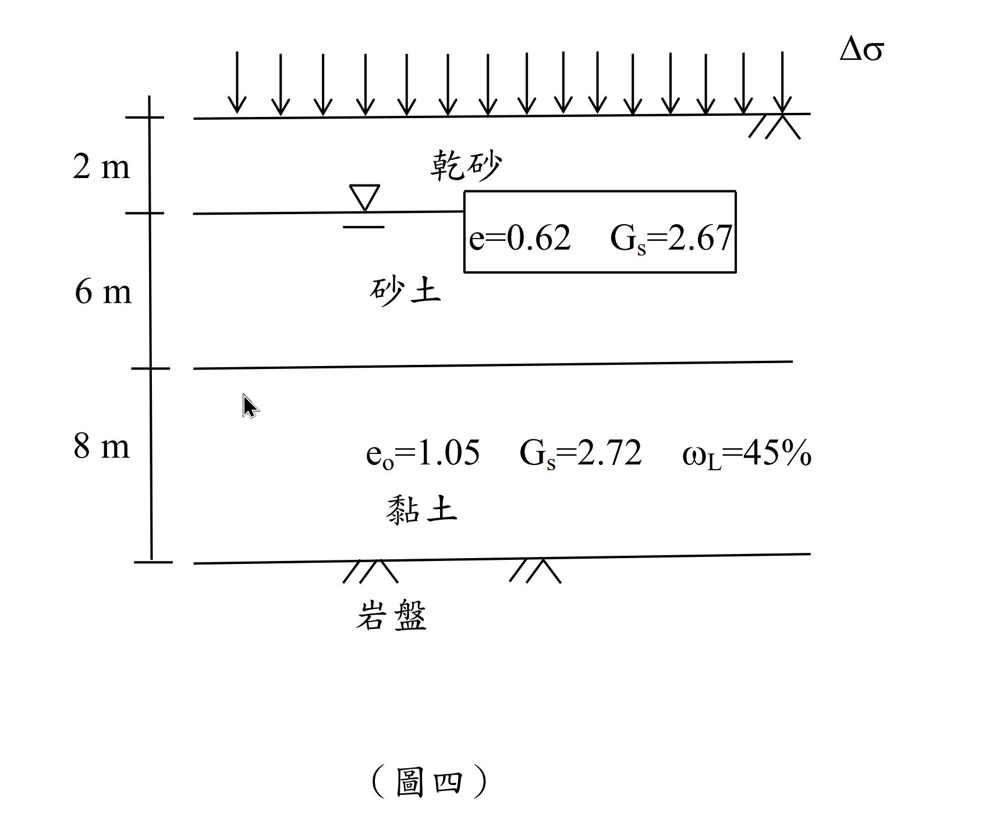

# 考題編號：SM-2014-4

**主分類：** `SM-U1-3` 土壤夯實及壓密
**副分類：** `SM-U1-1` 土壤基本性質與分類
**分析法：** 有效應力法
**標籤：** `壓密沉陷` `壓密度` `單面排水` `有效應力` `岩盤`

---

## 1. 原始題目重述 (Problem Restatement)

有一基地土層剖面如圖所示，地下水位於地表下方 2 m，若黏土為正常壓密，於地表施加均佈載重 $\Delta\sigma$ 後，黏土空隙比（void ratio） $e$ 變為 0.96，試估算：
1. 現地黏土層主要壓密之沉陷量為何？
2. 均佈載重 $\Delta\sigma$ 數值為何？
3. 當沉陷量為 20 cm 時，該黏土層之平均壓密度為何？
4. 若黏土層之壓密係數 $C_v$ 於壓密過程為定值 $0.005 \text{ cm}^2/\text{sec}$，則前述 20 cm 沉陷量，需多久（以天為單位）才能達成？（25 分）

（壓縮指數 $C_c = 0.009(LL-10)$；壓密度 $U > 60\%$，$T_v = 1.781-0.933\log(100-U\%)$，$U \le 60\%$，$T_v = \frac{\pi}{4}(\frac{U\%}{100})^2$ ）

*圖說：地表受均佈載重 $\Delta\sigma$；0~2m 為乾砂；2~8m 為飽和砂土，砂土參數為 $e=0.62$、$G_s=2.67$；地下水位位於地表下 2m；8~16m 為黏土層，參數為 $e_0=1.05$、$G_s=2.72$、$\omega_L=45\%$；黏土層下方為岩盤。*

## 2. 考題核心精神與出題者意圖 (Core Concepts & Examiner's Intent)

本題旨在測驗考生對「一維壓密理論」整套流程的掌握度。出題者刻意設計了兩個特點：
1. **逆向思考能力：** 一般題型是給載重求沉陷，但本題直接給定壓密前後的「孔隙比變化」，讓考生能第一時間跳過繁瑣的應力計算，直接由孔隙比變化求得最終沉陷量，接著再「逆推」出外加載重。
2. **邊界條件的敏銳度：** 黏土層下方標示為「岩盤」，這是在考驗考生是否能正確判斷出此為「單面排水」，從而代入正確的排水路徑長度 $H_{dr}$。若盲目背誦公式使用雙面排水 $H_{dr}=H/2$，時間計算將產生四倍的誤差。

## 3. 解題戰略地圖與陷阱分析 (Strategic Roadmap & Trap Analysis)

**解題戰略：**
1. **直接算沉陷量：** 由於題目直接給了黏土初終孔隙比（$e_0=1.05 \to e=0.96$），不需先算應力，可直接用 $S_c = \frac{\Delta e}{1+e_0}H$ 求解。
2. **算土層有效應力：** 依序計算乾砂、飽和砂、飽和黏土的單位重，然後求出黏土層「中點」的初始有效覆土應力 $\sigma_{vo}'$。
3. **逆推均佈載重：** 利用經驗公式 $C_c = 0.009(LL-10)$ 算出壓縮指數，再利用正常壓密黏土公式 $\Delta e = C_c \log \frac{\sigma_{vo}' + \Delta \sigma}{\sigma_{vo}'}$ 反解出地表均佈載重 $\Delta \sigma$。
4. **求時間因素與時間：** 利用目標沉陷 20 cm 求出壓密度 $U$，判斷 $U \le 60\%$ 使用對應的 $T_v$ 公式，最後代入單面排水條件（$H_{dr}=H$）求出時間，並記得轉換單位為「天」。

**陷阱分析：**
- **陷阱 1（計算順序迷思）：** 許多考生習慣先算 $\Delta \sigma$ 再算沉陷，但本題必須反過來，若未察覺 $\Delta e$ 已給定，可能會在考場上愣住。
- **陷阱 2（岩盤的排水條件）：** 岩盤預設為不透水層，故黏土層只有上方接砂土處能排水，屬於單面排水（$H_{dr} = 8\text{m}$）。若習慣性取 $H_{dr} = 4\text{m}$ 則會錯失分數。
- **陷阱 3（單位一致性）：** 壓密係數 $C_v$ 的單位是 $\text{cm}^2/\text{sec}$，沉陷量為 $\text{cm}$，厚度 $H$ 需轉為 $\text{cm}$；計算出的時間 $t$ 為秒（$\text{sec}$），最後必須記得除以 $86400$ 轉為「天」。

## 3.5 變數層次分析 (Variable Hierarchy Analysis)

### 最終目標
`求出黏土層最終沉陷量、地表均佈載重、達 20cm 沉陷之壓密度，及所需天數。`

### 本題關鍵公式（依計算順序）
1. 沉陷量公式：$S_c = \frac{\Delta e}{1+e_0} H$
2. 初始有效應力：$\sigma_{vo}' = \sum \gamma_i h_i - u$ （黏土層中點）
3. 壓縮指數：$C_c = 0.009(LL-10)$
4. 逆推載重：$\Delta e = \boxed{C_c} \log \frac{\boxed{\sigma_{vo}'} + \Delta \sigma}{\boxed{\sigma_{vo}'}}$
5. 壓密度：$U = \frac{S_t}{\boxed{S_c}}$
6. 時間因素：$T_v = \frac{\pi}{4}\left(\frac{\boxed{U}}{100}\right)^2$
7. 壓密時間：$t = \frac{\boxed{T_v} H_{dr}^2}{C_v}$

### L1：題目直接給定
| 符號 | 數值 | 說明 |
|---|---|---|
| $H$ | $8 \text{ m}$ | 黏土層厚度 |
| $\omega_L$ (LL) | 45 | 黏土液性限度 |
| $e_0$ | 1.05 | 黏土初始孔隙比 |
| $e$ | 0.96 | 黏土最終孔隙比 |
| $e_{sand}$ | 0.62 | 砂土孔隙比 |
| $G_{s,sand}$ | 2.67 | 砂土比重 |
| $G_{s,clay}$ | 2.72 | 黏土比重 |
| $S_t$ | 20 cm | 指定壓密沉陷量 |
| $C_v$ | $0.005 \text{ cm}^2/\text{s}$ | 壓密係數 |

### L2：需知識點推導
**1. 物理性質與初始應力**
| 符號 | 公式／來源 | 卡關? |
|---|---|---|
| $\gamma_d$ | $\frac{G_{s,sand}}{1+e_{sand}}\gamma_w$ | |
| $\gamma_{sat,sand}$ | $\frac{G_{s,sand}+e_{sand}}{1+e_{sand}}\gamma_w$ | |
| $\gamma_{sat,clay}$ | $\frac{G_{s,clay}+e_{0}}{1+e_{0}}\gamma_w$ | |
| $\sigma_{vo}'$ | $h_{dry}\gamma_d + h_{sat,s}(\gamma_{sat,sand}-\gamma_w) + h_{c}(\gamma_{sat,clay}-\gamma_w)$ | |

**2. 沉陷量與載重逆推**
| 符號 | 公式／來源 | 卡關? |
|---|---|---|
| $S_c$ | $\frac{e_0 - e}{1+e_0} H$ | |
| $C_c$ | $0.009(LL-10)$ | |
| $\Delta \sigma$ | 移項求解 $e_0 - e = C_c \log \frac{\sigma_{vo}' + \Delta \sigma}{\sigma_{vo}'}$ | |

**3. 壓密時間預測**
| 符號 | 公式／來源 | 卡關? |
|---|---|---|
| $U$ | $S_t / S_c$ | |
| $H_{dr}$ | 單面排水，取等於 $H$ | |
| $T_v$ | $\frac{\pi}{4} U^2$ | |
| $t$ | $\frac{T_v H_{dr}^2}{C_v}$，最後除以 $86400$ 轉天數 | |

### L3：深層知識（不懂就卡住）
| 知識點 | 說明 | 卡關? |
|---|---|---|
| 岩盤邊界條件 | 圖中底層為「岩盤」，應判定為不透水層，故黏土只有向上排水（單面排水 $H_{dr}=H$） | |
| 有效應力取樣點 | 計算壓密沉陷時，初始有效應力 $\sigma_{vo}'$ 必須取黏土層之「中點」代表整層平均受力 | |

## 4. 步驟化詳細計算過程 (Step-by-Step Detailed Calculation)

本解答以水的單位重 $\gamma_w = 9.81 \text{ kN/m}^3$ 進行較精確之計算。（註：若取 $\gamma_w = 1 \text{ t/m}^3$ 亦為考試常見假設，會一併註記結果）

**【Step 1】估算黏土層主要壓密之沉陷量 $S_c$**
黏土層厚度 $H = 8 \text{ m} = 800 \text{ cm}$
已知孔隙比由 $e_0 = 1.05$ 降至 $e = 0.96$，孔隙比變化量 $\Delta e = 1.05 - 0.96 = 0.09$
$$S_c = \frac{\Delta e}{1+e_0} H = \frac{0.09}{1+1.05} \times 800 \text{ cm} \approx 35.12 \text{ cm}$$
> **策略註解：** 題目給定 $\Delta e$，可直接求出沉陷量，無須先求應力，這是本題破題捷徑。
$$\boxed{S_c = 35.12 \text{ cm}}$$

**【Step 2】計算各土層單位重與黏土層中點初始有效應力 $\sigma_{vo}'$**
黏土層中點深度為地表下 $2 + 6 + \frac{8}{2} = 12 \text{ m}$ 處。
1. **0~2m 乾砂：** 
   $$\gamma_d = \frac{G_s \gamma_w}{1+e} = \frac{2.67 \times 9.81}{1+0.62} = 16.17 \text{ kN/m}^3$$
2. **2~8m 飽和砂土：** 
   $$\gamma_{sat,s} = \frac{(G_s + e)\gamma_w}{1+e} = \frac{(2.67 + 0.62) \times 9.81}{1+0.62} = 19.92 \text{ kN/m}^3$$
3. **8~16m 飽和黏土：** 
   $$\gamma_{sat,c} = \frac{(G_s + e_0)\gamma_w}{1+e_0} = \frac{(2.72 + 1.05) \times 9.81}{1+1.05} = 18.04 \text{ kN/m}^3$$

計算黏土層中點有效覆土應力：
$$\sigma_{vo}' = h_{dry}\gamma_d + h_{sat,s}(\gamma_{sat,s} - \gamma_w) + h_{sat,c}(\gamma_{sat,c} - \gamma_w)$$
$$\sigma_{vo}' = 2 \times 16.17 + 6 \times (19.92 - 9.81) + 4 \times (18.04 - 9.81)$$
$$\sigma_{vo}' = 32.34 + 60.66 + 32.94 = 125.94 \text{ kPa}$$
*(若使用 $\gamma_w = 1 \text{ t/m}^3$，$\sigma_{vo}' = 12.84 \text{ t/m}^2$)*

**【Step 3】求地表均佈載重 $\Delta\sigma$**
壓縮指數：$C_c = 0.009(\omega_L - 10) = 0.009(45 - 10) = 0.315$
因黏土為正常壓密，套用公式：
$$\Delta e = C_c \log \left( \frac{\sigma_{vo}' + \Delta\sigma}{\sigma_{vo}'} \right)$$
$$0.09 = 0.315 \log \left( \frac{125.94 + \Delta\sigma}{125.94} \right)$$
$$\log \left( \frac{125.94 + \Delta\sigma}{125.94} \right) = \frac{0.09}{0.315} = 0.2857$$
$$\frac{125.94 + \Delta\sigma}{125.94} = 10^{0.2857} = 1.9307$$
$$125.94 + \Delta\sigma = 243.15 \text{ kPa} \implies \Delta\sigma = 117.21 \text{ kPa}$$
*(若使用 $\gamma_w = 1 \text{ t/m}^3$，$\Delta\sigma = 11.95 \text{ t/m}^2$)*
$$\boxed{\Delta\sigma = 117.21 \text{ kPa} \quad (\text{或 } 11.95 \text{ t/m}^2)}$$

**【Step 4】求沉陷量 20 cm 時之平均壓密度 $U$**
$$U = \frac{S_t}{S_c} \times 100\% = \frac{20 \text{ cm}}{35.122 \text{ cm}} \times 100\% = 56.94\%$$
$$\boxed{U = 56.94\%}$$

**【Step 5】求達成 20 cm 沉陷所需天數 $t$**
因 $U = 56.94\% < 60\%$，代入題目給定之時間因素公式：
$$T_v = \frac{\pi}{4} \left(\frac{U\%}{100}\right)^2 = \frac{\pi}{4} (0.5694)^2 = 0.2547$$
**判斷排水邊界條件：** 黏土層下方為岩盤，視為不透水層，故為「單面排水」，$H_{dr} = H = 800 \text{ cm}$。
$$t = \frac{T_v H_{dr}^2}{C_v} = \frac{0.2547 \times (800)^2}{0.005} = 32,601,600 \text{ sec}$$
轉換為天數：
$$t = \frac{32,601,600}{60 \times 60 \times 24} = 377.33 \text{ 天}$$
$$\boxed{t = 377.33 \text{ 天}}$$

## 5. 關鍵爭議點與進階探討 (Critical Issues & Advanced Discussion)
- **岩盤透水性假設：** 實務與國考上，除非題目特別註明「破碎岩盤」或「透水岩盤」，否則看到「岩盤 (bedrock)」一律假設為不透水層，採單面排水分析。排水路徑 $H_{dr}$ 的誤判會導致時間 $t$ 產生 4 倍的巨大誤差。
- **單位重的選擇：** 考場上若無特別說明，$\gamma_w$ 採用 $9.81 \text{ kN/m}^3$ 計算最無爭議。部分教科書或補習班詳解為了計算簡便，會取 $\gamma_w = 10 \text{ kN/m}^3$ 或 $\gamma_w = 1 \text{ t/m}^3$，若在計算過程中有明確標示所用的 $\gamma_w$，通常閱卷委員都會給予滿分，但求出的 $\Delta\sigma$ 數值會有些微差異（如 $117.21 \text{ kPa}$ vs $11.95 \text{ t/m}^2 \approx 117.2 \text{ kPa}$，兩者皆為正確答案）。
