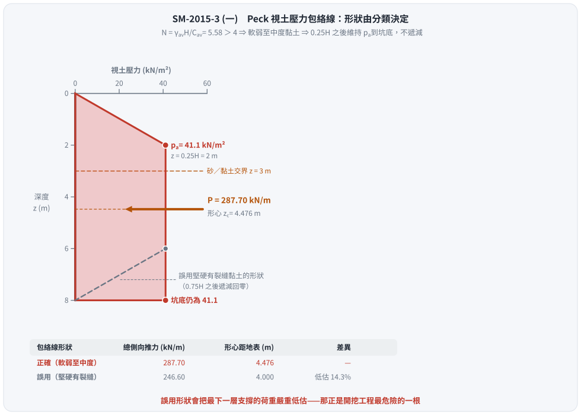
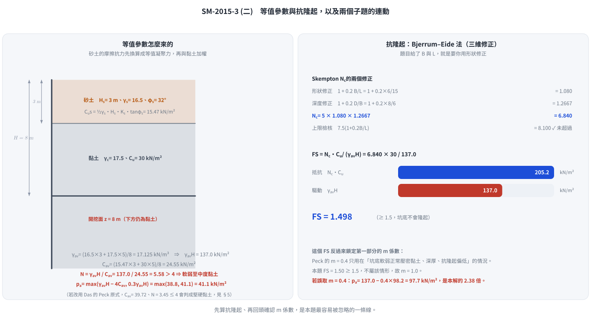

# 考題編號：SM-2015-3

**主分類：** `SM-U2-3` 開挖之穩定性分析
**副分類：** 無
**分析法：** 混合
**標籤：** `開挖穩定性` `支撐系統` `視土壓力` `Peck包絡線` `基盤隆起` `不排水剪力強度` `安全係數`
---

## 1. 原始題目重述 (Problem Restatement)
有一支撐開挖，其開挖深度為 $H = 8 \text{ m}$，地層剖面如下：
- **上方砂土層**：厚度 $H_s = 3 \text{ m}$，土壤單位重 $\gamma_s = 16.5 \text{ kN/m}^3$，土壤摩擦角 $\phi_s = 32^\circ$。
- **下方黏土層**：開挖範圍內厚度 $H_c = 5 \text{ m}$（假設向下延伸），土壤單位重 $\gamma_c = 17.5 \text{ kN/m}^3$，不排水剪力強度 $C_u = 30 \text{ kN/m}^2$。
- **開挖面幾何**：寬度 $B = 6 \text{ m}$，長度 $L = 15 \text{ m}$。

**要求：**
1. 計算並繪出支撐牆背之設計視土壓力 (Apparent Earth Pressure) 分布情形。
2. 計算開挖底部之抗隆起安全係數 (Factor of Safety against Basal Heave)。

*註：本題無附圖，依文字描述即可完全建構分析模型。*

## 2. 考題核心精神與出題者意圖 (Core Concepts & Examiner's Intent)
1. **層狀土壤之視土壓力計算**：測驗考生是否知道當開挖面包含砂土與黏土時，不能分開繪製土壓力，而必須計算「等值平均單位重 $\bar{\gamma}$」與「等值平均凝聚力 $\bar{C_u}$」，再判斷整體開挖區的穩定數 $N$ 來套用 Peck (1969) 的經驗圖體。
2. **砂土層的等值凝聚力轉換**：測驗考生是否懂得將砂土的抗剪強度轉換為等效的 $C_{u,s}$ 以便與黏土層合併計算。
3. **三維抗隆起分析**：測驗考生在非無限長條形開挖（給定 $B$ 與 $L$）時，能正確選用 Bjerrum & Eide (1956) 的 Skempton 承載力係數 $N_c$ 來計算抗隆起安全係數。

## 3. 解題戰略地圖與陷阱分析 (Strategic Roadmap & Trap Analysis)
- **步驟一**：計算全深度之平均單位重 $\bar{\gamma}$。
- **步驟二**：計算砂土層之等值不排水剪力強度 $C_{u,s}$，再與黏土層計算加權平均 $\bar{C_u}$。
- **步驟三**：計算開挖穩定數 $N = \bar{\gamma}H / \bar{C_u}$。判斷為軟弱至中度黏土 ($N>4$) 或堅硬黏土 ($N \le 4$)。
- **步驟四**：依判定之土層類別，套用 Peck 視土壓力公式，取極大值作為設計壓力 $p_a$，並繪製分布圖。
- **步驟五**：使用 Bjerrum & Eide 法，依據開挖深度 $D$、寬度 $B$ 與長度 $L$ 計算 Skempton $N_c$ 係數。
- **步驟六**：代入 $FS = N_c C_u / \Sigma \gamma H$ 計算抗隆起安全係數。

**⚠ 陷阱分析：**
- **陷阱一**：將砂土與黏土的視土壓力分開畫。Peck 視土壓力是支撐系統的**總包絡線**，必須以全深度單一圖形呈現。
- **陷阱二**：忽略砂土層本身的抗剪強度貢獻，直接以 $C_u = 0$ 加權，這會導致穩定數 $N$ 高估、設計土壓力偏大。標準做法應將砂土轉換為 $C_{u,s} = \frac{1}{2}\gamma_s H_s K_s \tan\phi_s$。
- **陷阱三**：抗隆起檢核時，將上方砂土的自重漏掉。覆土壓力應包含砂土與黏土的總和 ($\Sigma \gamma H$)。

## 3.5 變數層次分析 (Variable Hierarchy Analysis)

### 最終目標
求出「支撐牆背等值視土壓力最大值 $p_a$ 及分布圖」與「底部抗隆起安全係數 $FS$」。

### 本題關鍵公式（依計算順序）
1. 等值單位重：$\bar{\gamma} = \frac{\sum \gamma_i H_i}{H}$
2. 砂土等值強度：$C_{u,s} = \frac{1}{2} \gamma_s H_s K_s \tan\phi_s$
3. 平均等值強度：$\bar{C_u} = \frac{C_{u,s} H_s + C_{u,c} H_c}{H}$
4. 穩定數：$N = \frac{\boxed{\bar{\gamma}} H}{\boxed{\bar{C_u}}}$
5. 軟弱黏土最大視土壓力：$p_a = \max \left[ \boxed{\bar{\gamma}} H \left( 1 - \frac{4\boxed{\bar{C_u}}}{\boxed{\bar{\gamma}}H} \right), 0.3 \boxed{\bar{\gamma}} H \right]$
6. Skempton 承載力係數：$N_c = 5 \left( 1 + 0.2 \frac{B}{L} \right) \left( 1 + 0.2 \frac{D}{B} \right)$
7. 抗隆起安全係數：$FS = \frac{\boxed{N_c} C_{u,b}}{\Sigma \gamma H}$

### L1：題目直接給定
| 符號 | 數值 | 說明 |
|-----|-----|-----|
| $H$ | 8 m | 總開挖深度 |
| $H_s$ | 3 m | 砂土層厚度 |
| $\gamma_s$ | 16.5 kN/m³ | 砂土單位重 |
| $\phi_s$ | $32^\circ$ | 砂土摩擦角 |
| $H_c$ | 5 m | 黏土層厚度 (開挖內) |
| $\gamma_c$ | 17.5 kN/m³ | 黏土單位重 |
| $C_u$ | 30 kN/m² | 黏土不排水剪力強度 |
| $B, L$ | 6 m, 15 m | 開挖面寬度與長度 |

### L2：需知識點推導
**等值參數與視土壓力**
| 符號 | 公式／來源 | 卡關? |
|-----|-----------|------|
| $\bar{\gamma}$ | $\frac{\gamma_s H_s + \gamma_c H_c}{H}$ | |
| $C_{u,s}$ | $\frac{1}{2} \gamma_s H_s K_s \tan\phi_s$ (取 $K_s=1$) | |
| $\bar{C_u}$ | $\frac{C_{u,s} H_s + C_{u,c} H_c}{H}$ | |
| $N$ | $\frac{\bar{\gamma}H}{\bar{C_u}}$ | |
| $p_a$ | $\max[\bar{\gamma} H - 4\bar{C_u}, 0.3\bar{\gamma}H]$ (當 $N>4$) | |

**抗隆起分析**
| 符號 | 公式／來源 | 卡關? |
|-----|-----------|------|
| $N_c$ | $5(1+0.2\frac{B}{L})(1+0.2\frac{D}{B})$ | |
| $\Sigma \gamma H$ | 底部上方總覆土壓力 ($\bar{\gamma}H$) | |
| $FS$ | $\frac{N_c C_u}{\Sigma \gamma H}$ | |

### L3：深層知識（不懂就卡住）
| 知識點 | 說明 | 卡關? |
|-------|-----|------|
| 層狀土壤等值強度轉換 | 砂土的抗剪強度隨深度增加，其等效 $C_{u}$ 是將推力積分後的平均值，需熟記 $C_{u,s} = \frac{1}{2}\gamma_s H_s K_s \tan\phi_s$ 公式。 | |
| Peck 視土壓力判別 | 必須先求出 $N$，若 $N \le 4$ 屬堅硬黏土，若 $N > 4$ 屬軟弱至中度黏土，兩者對應的經驗分布圖完全不同。 | |
| 矩形開挖抗隆起 | 不能盲目代入 Terzaghi 2D 公式，必須使用 Bjerrum & Eide 搭配 Skempton $N_c$ 公式。 | |

## 4. 步驟化詳細計算過程 (Step-by-Step Detailed Calculation)

### 第一部分：設計視土壓力分布情形
**Step 1：計算等值平均單位重 ($\bar{\gamma}$)**
$$
\bar{\gamma} = \frac{\gamma_s H_s + \gamma_c H_c}{H_{total}} = \frac{16.5 \times 3 + 17.5 \times 5}{8} = \frac{49.5 + 87.5}{8} = 17.125 \text{ kN/m}^3
$$
開挖面底部之總覆土壓力：
$$
\Sigma \gamma H = \bar{\gamma}H = 17.125 \times 8 = 137 \text{ kN/m}^2
$$

**Step 2：計算等值平均不排水剪力強度 ($\bar{C_u}$)**
依據 Peck 等人建議，砂土層之等值不排水剪力強度 $C_{u,s}$（常取 $K_s = 1.0$）：
$$
C_{u,s} = \frac{1}{2} \gamma_s H_s K_s \tan\phi_s = \frac{1}{2} \times 16.5 \times 3 \times 1.0 \times \tan 32^\circ = 24.75 \times 0.6249 = 15.47 \text{ kN/m}^2
$$
加權平均求全層等值強度：
$$
\bar{C_u} = \frac{C_{u,s} H_s + C_{u,c} H_c}{H_{total}} = \frac{15.47 \times 3 + 30 \times 5}{8} = \frac{46.41 + 150}{8} = 24.55 \text{ kN/m}^2
$$

**Step 3：判斷穩定數與土壤行為分類**
穩定數 $N$：
$$
N = \frac{\bar{\gamma} H}{\bar{C_u}} = \frac{137}{24.55} = 5.58
$$
因為 $N = 5.58 > 4$，視為**軟弱至中度黏土 (Soft to Medium Clay)**。

**Step 4：計算最大視土壓力 ($p_a$)**
對於軟弱至中度黏土，其最大視土壓力取下列兩者之極大值：
$$
p_{a1} = \bar{\gamma} H \left( 1 - m \frac{4\bar{C_u}}{\bar{\gamma}H} \right) \quad (\text{一般取 } m=1.0)
$$
$$
p_{a1} = 137 - 4 \times 24.55 = 137 - 98.2 = 38.8 \text{ kN/m}^2
$$
$$
p_{a2} = 0.3 \bar{\gamma} H = 0.3 \times 137 = 41.1 \text{ kN/m}^2
$$
取較大值，故設計最大視土壓力：
$$
\boxed{p_a = 41.1 \text{ kN/m}^2}
$$

**Step 5：繪製設計視土壓力分布圖**

> ⚠ **形狀由 Step 3 的分類決定，不可混用。** Peck (1969) 的三張包絡線裡，
> **只有「堅硬且有裂縫之黏土」才在 $0.75H$ 以下遞減回零**；
> 本題 $N = 5.58 > 4$ 判為**軟弱至中度黏土**，其包絡線在 $0.25H$ 之後
> **一路維持 $p_a$ 直到坑底**，底部不歸零。

軟弱至中度黏土之 Peck 包絡線：
- $0 \sim 0.25H$（$0 \sim 2 \text{ m}$）：由 $0$ 線性增加至 $p_a = 41.1 \text{ kN/m}^2$。
- $0.25H \sim H$（$2 \sim 8 \text{ m}$）：**維持 $p_a = 41.1 \text{ kN/m}^2$ 至開挖面**。

分布圖示意如下：
```text
深度 (m)      視土壓力 (kN/m²)
  0    +--+ 0
       |   \
       |    \
  2    +-----+ 41.1
       |     |
       |     |     ← 一路維持到坑底，不遞減
       |     |
  8    +-----+ 41.1
```

**合力與作用位置**（供支撐荷重分配用）：
- 三角形段（$0 \sim 2 \text{ m}$）：$\tfrac{1}{2}(2)(41.1) = 41.10 \text{ kN/m}$
- 矩形段（$2 \sim 8 \text{ m}$）：$6 \times 41.1 = 246.60 \text{ kN/m}$
- 總側向推力 $\boxed{P = 287.70 \text{ kN/m}}$，形心距地表
  $\bar{z} = \dfrac{41.10(1.333) + 246.60(5.0)}{287.70} = 4.476 \text{ m}$

*(作答時依比例尺畫出，並標註轉折深度 2 m、最大壓力 41.1 kN/m² 與底部仍為 41.1 kN/m²)*



*圖 1　包絡線在底部到底收不收。攔的是「軟弱至中等黏土的 Peck 包絡線在 $0.25H$ 以下維持定值、不回收」這個形狀判斷：誤用硬黏土的梯形會把總推力由 $287.70$ 低估成 $246.60 \text{ kN/m}$（低估 $14.3\%$），形心也由 $4.476$ 上移到 $4.000 \text{ m}$，支撐荷重分配全盤失真。*

---

### 第二部分：底部抗隆起安全係數
**Step 1：選擇適用公式與參數**
因題目給定長寬比，故採用 Bjerrum & Eide (1956) 三維抗隆起公式。
開挖面下方為黏土，其強度 $C_{u,b} = 30 \text{ kN/m}^2$。
開挖總深 $D = 8 \text{ m}$，寬度 $B = 6 \text{ m}$，長度 $L = 15 \text{ m}$。

**Step 2：計算 Skempton 承載力係數 ($N_c$)**
$$
N_c = 5 \left( 1 + 0.2 \frac{B}{L} \right) \left( 1 + 0.2 \frac{D}{B} \right)
$$
$$
N_c = 5 \left( 1 + 0.2 \times \frac{6}{15} \right) \left( 1 + 0.2 \times \frac{8}{6} \right) = 5 \times (1 + 0.08) \times (1 + 0.2667)
$$
$$
N_c = 5 \times 1.08 \times 1.2667 = 6.84
$$
檢核 $N_c$ 上限：最大不得超過 $7.5(1 + 0.2 \frac{B}{L}) = 7.5(1.08) = 8.1$。
本題 $6.84 \le 8.1$，故採用 $N_c = 6.84$。

**Step 3：計算安全係數 ($FS$)**
$$
FS = \frac{N_c C_{u,b}}{\Sigma \gamma H} = \frac{6.84 \times 30}{137} = \frac{205.2}{137} = 1.498
$$
$$
\boxed{FS \approx 1.50}
$$



*圖 2　為什麼 $N_c$ 不是 $5.14$ 也不是 $5$。攔的是「把 Bjerrum–Eide 的三維修正漏掉」：少了 $(1+0.2B/L)(1+0.2D/B) = 1.368$ 這個係數，$FS$ 會從 $1.498$ 掉到 $1.09$，結論由「勉強安全」變成「不安全」。同一個 $N_c$ 也決定了視土壓力該用 $m = 1.0$ 還是 $m = 0.4$。*

## 5. 關鍵爭議點與進階探討 (Critical Issues & Advanced Discussion)
1. **⚠ 包絡線的形狀是本題最容易失分的地方**：
   Peck (1969) 三張圖必須配對正確——砂土是**全深度矩形**；軟弱至中度黏土是
   「$0.25H$ 前爬升、之後到坑底維持定值」；堅硬有裂縫黏土才是
   「$0.25H$ 爬升、$0.75H$ 之後遞減回零」的對稱梯形。
   本題若誤用堅硬黏土的形狀，總側向推力會由 $287.70$ 變成 $246.60 \text{ kN/m}$，
   **低估 $14.3\%$**（$41.10/287.70$），且最下一層支撐的荷重會被嚴重低估——那正是開挖工程最危險的一根。

2. **等值凝聚力 $\bar{C_u}$ 的兩種公式版本（會改變分類，進而改變形狀）**：
   本解析採用由「垂直面上總抗剪力相等」直接推導的形式
   $$\bar{C_u} = \frac{1}{H}\left[\tfrac{1}{2}\gamma_s K_s H_s^2 \tan\phi_s + C_u(H - H_s)\right] = 24.55 \text{ kN/m}^2$$
   部分教科書（如 Das）採 Peck (1943) 的原式
   $\bar{C_u} = \frac{1}{H}[\gamma_s K_s H_s^2 \tan\phi_s + (H-H_s)n'q_u]$（$n' \approx 0.75$、$q_u = 2C_u$），
   代入得 $\bar{C_u} = 39.72$、$N = 3.45 \le 4$ ⇒ 會判成**堅硬黏土**、改用另一張包絡線。
   兩者的 $p_a$ 恰好同為 $41.1 \text{ kN/m}^2$（一個由 $0.3\bar{\gamma}H$ 控制、一個落在 $0.2\sim0.4\bar{\gamma}H$ 的中間），
   **但形狀不同、合力差 $16.7\%$**。第三種最簡單的判法是直接用坑底黏土的 $C_u = 30$：
   $N = 137/30 = 4.57 > 4$，同樣是軟弱至中度。三種判法有兩種指向軟弱至中度，
   且本解析用的形式是可由力學推導的，故採之；作答時務必寫出所用公式與 $K_s$ 假設。

3. **$m$ 係數：$1.0$ 還是 $0.4$？**
   Peck 對軟弱至中度黏土的完整式為 $p_a = \bar{\gamma}H\left[1 - m\dfrac{4\bar{C_u}}{\bar{\gamma}H}\right]$。
   當坑底為**正常壓密軟弱黏土且向下延伸很深、抗隆起安全係數偏低**時才取 $m = 0.4$，
   此時 $p_a = 137 - 0.4(98.2) = 97.7 \text{ kN/m}^2$，是本解答案的 **2.38 倍**。
   本題第二部分算得 $FS_{heave} = 1.50 \ge 1.5$，坑底並非瀕臨隆起的軟弱狀態，
   故取 $m = 1.0$ 是正確的——**兩個子題在這裡是連動的**，先算抗隆起再回頭確認 $m$ 才嚴謹。

4. **砂土層側向土壓力係數 $K_s$ 的選定**：
   在將砂土轉換為等值黏土強度時，公式中的 $K_s$ 依據 Peck (1969) 原文建議，常假設為 $1.0$。部分學者或規範可能會建議使用 $K_a = \tan^2(45^\circ - \phi/2)$。若考場上採用 $K_a$ ($0.307$)，算得之等值 $C_{u,s}$ 將較小，導致 $\bar{C_u}$ 變小、$N$ 變大，最終土壓力可能由 $\bar{\gamma}H - 4\bar{C_u}$ 控制而變大。在台灣國考中，一般採用 $K_s=1.0$ 為主流（如施國欽《基礎工程》之範例做法），故本解析以此為標準解答。
5. **抗隆起公式的選擇**：
   當題目中明確給定開挖平面的尺寸 ($B \times L$) 時，強烈暗示考生需要考慮「三維形狀效應」。若此時仍使用 Terzaghi (1943) 的二維長條形公式（未修正長寬比），會低估基地的抗隆起能力，因此 Bjerrum & Eide (1956) 是最標準且正確的選擇。

---

*解析日期：見 `wiki/log.md`　｜　圖解補繪：2026-08-29（向量 SVG，程式繪製，腳本 `gen_SM-2015-3.py` 可重跑；同名 2× PNG 供簡報／影片管線使用）*
