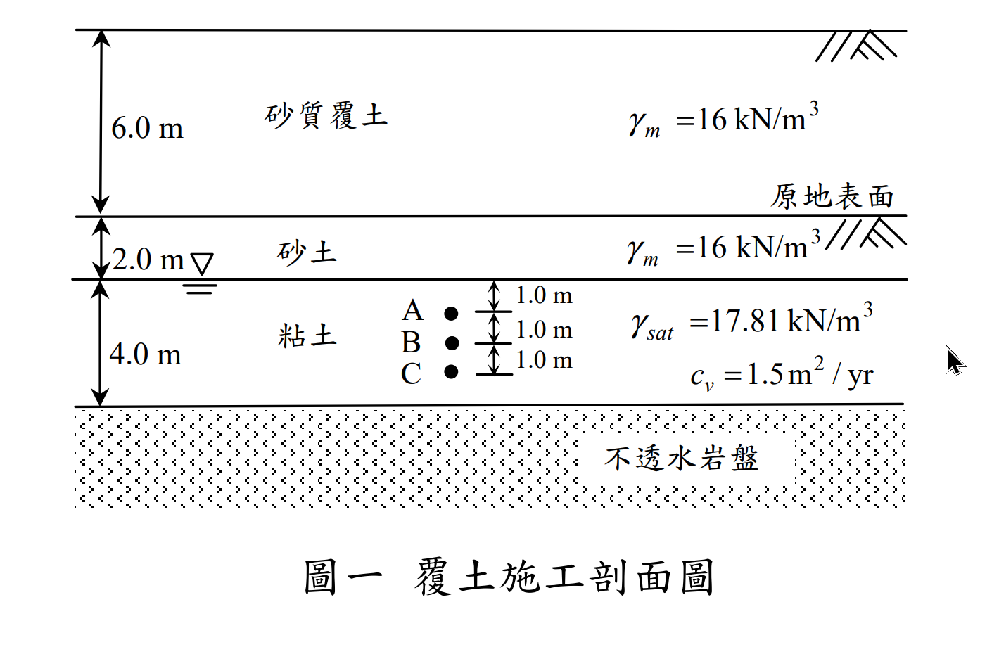
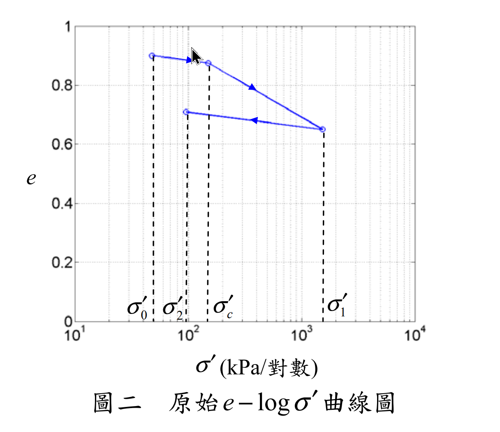
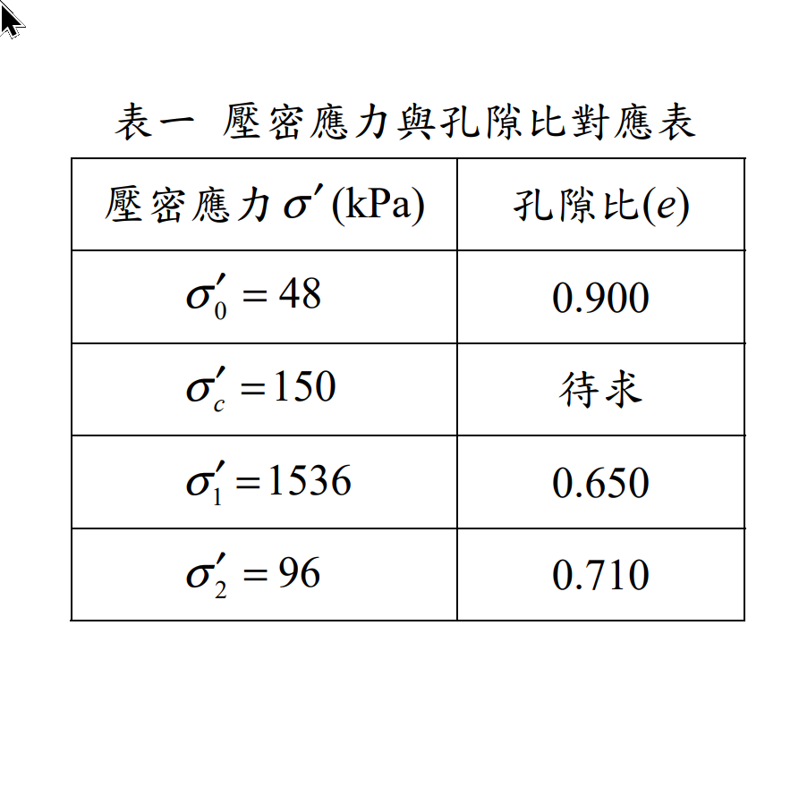
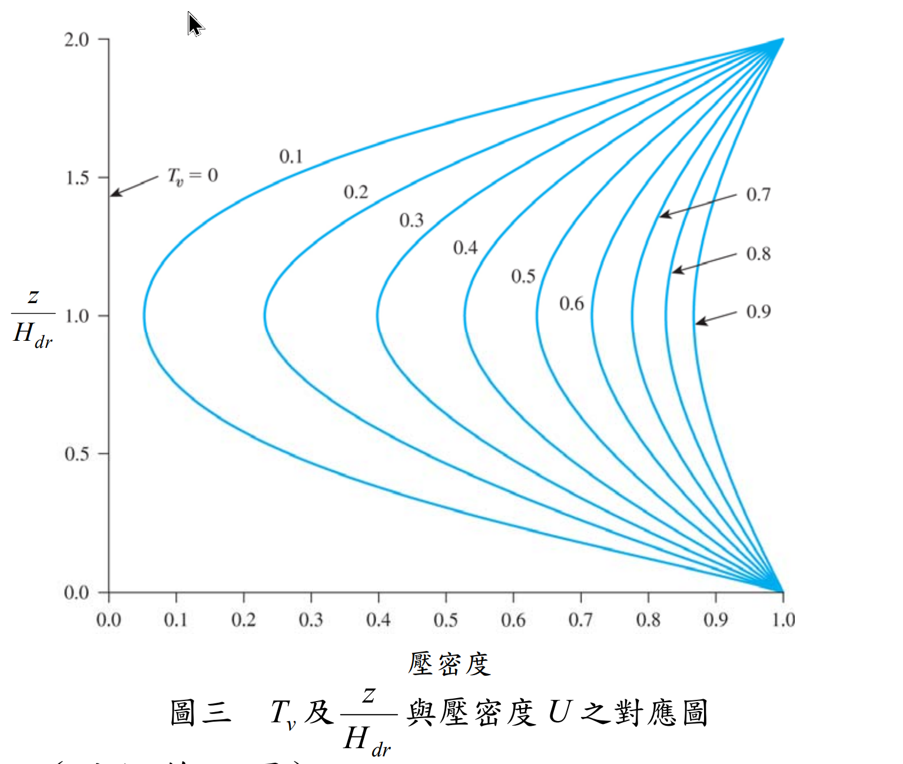

# 考題編號：SM-2016-1

**主分類：** `SM-U1-3` 土壤夯實及壓密
**副分類：** `SM-U1-4` 土體內應力
**分析法：** 有效應力法
**標籤：** `e-log p'曲線` `OCR` `過壓密` `回脹指數Cs` `壓密沉陷` `超額孔隙水壓` `壓密度` `單面排水`
---

## 1. 原始題目重述 (Problem Restatement)
一、圖一為某覆土加載施工剖面圖，施工前於地下 4.0 m（點 B 處）取回粘土執行壓密試驗；圖二為壓密試驗結果推算之原始 $e-\log\sigma'$ 曲線，圖三為 $T_v$ 及 $z/H_{dr}$ 與壓密度 $U$ 之對應圖，表一表列原始 $e-\log\sigma'$ 曲線主要加壓與解壓應力對應之孔隙比。
(一)請分析此粘土試樣於 $\sigma_c'$ 時對應之孔隙比 $e$ 及其過壓密比值（OCR）。（8 分）
(二)請分析於此粘土層上加載 6.0 m 砂質覆土 3 年後壓密沉陷量為何？（5 分）
(三)請分析此粘土層上加載 6.0 m 砂質覆土 3 年後，點 A、B 及 C 點之超額孔隙水壓為何？（12 分）

*圖說：地表依序為 6.0 m 砂質覆土($\gamma_m = 16\text{ kN/m}^3$)、2.0 m 原有砂土($\gamma_m = 16\text{ kN/m}^3$)，地下水位位於深 2.0 m 處(砂土與粘土交界)。下方為 4.0 m 粘土層($\gamma_{sat} = 17.81\text{ kN/m}^3$，$c_v = 1.5\text{ m}^2/\text{yr}$)，底部為不透水岩盤。A、B、C 點分別位於粘土層頂面下 1.0 m、2.0 m、3.0 m。*

*圖說：壓密試驗推算之原始 $e-\log\sigma'$ 曲線。包含再壓密段($\sigma_0'$ 至 $\sigma_c'$)、主壓密段($\sigma_c'$ 至 $\sigma_1'$)及解壓回脹段($\sigma_1'$ 至 $\sigma_2'$)。*

*圖說：表一列出 $\sigma_0'=48\text{ kPa}$ 對應 $e=0.900$；$\sigma_c'=150\text{ kPa}$ 對應 $e$ 待求；$\sigma_1'=1536\text{ kPa}$ 對應 $e=0.650$；$\sigma_2'=96\text{ kPa}$ 對應 $e=0.710$。*

*圖說：圖表為時間因素 $T_v$ 及深度比例 $z/H_{dr}$ 與壓密度 $U$ 之對應圖(Isochrones)。*

## 2. 考題核心精神與出題者意圖 (Core Concepts & Examiner's Intent)
- **有效應力與應力歷史：** 測驗考生計算原地層有效應力($\sigma_{v0}'$)，並能與室內壓密試驗結果($\sigma_0'$)對接，判斷過壓密比(OCR)。
- **沉陷量計算判別：** 測驗考生判斷加載後之最終有效應力($\sigma_f'$)是否超過預壓密應力($\sigma_c'$)。本題 $\sigma_f' < \sigma_c'$，故整體沉陷皆處於「再壓密(Recompression)」階段，必須先從解壓段求得回脹指數($C_s$)，並假定再壓密指數 $C_r \approx C_s$ 進行計算。
- **單面排水與等時線圖讀取：** 粘土層上方為砂土、下方為不透水岩盤，構成單面排水條件，排水路徑 $H_{dr} = H = 4.0\text{ m}$。測驗考生如何根據此邊界條件與 $T_v$ 從等時曲線圖(Isochrones)中讀取特定深度的壓密度($U_z$)，進而計算超額孔隙水壓。

## 3. 解題戰略地圖與陷阱分析 (Strategic Roadmap & Trap Analysis)
- **Step 1: 初始狀態與 OCR 分析** 
  計算 B 點(粘土層中點)之初始有效應力 $\sigma_{v0}'$，並驗證其等同於試驗曲線起點 $\sigma_0'$。再利用 $\sigma_c'$ 計算 OCR。
- **Step 2: 曲線參數推求**
  利用解壓段($\sigma_1'$ 至 $\sigma_2'$)求得回脹指數 $C_s$。假設 $C_r = C_s$，計算 $\sigma_c'$ 時的孔隙比 $e_c$。
- **Step 3: 最終沉陷量計算**
  加入覆土載重求得 $\Delta\sigma$ 與 $\sigma_f'$。因 $\sigma_f' < \sigma_c'$，全程使用 $C_r$ 計算極限壓密沉陷量 $S_c$。
- **Step 4: 歷時沉陷與水壓計算**
  判斷為單面排水($H_{dr}=H=4.0\text{ m}$)，計算 3 年時之 $T_v$。以 $T_v$ 求取平均壓密度 $U_{avg}$ 及各點局部壓密度 $U_z$ (可查圖或代級數解)，最終求出沉陷量及超額孔隙水壓。

**⚠️ 陷阱分析：**
1. **排水路徑長度判斷錯誤：** 看到 4.0 m 粘土層直覺代入 $H_{dr}=H/2=2.0\text{ m}$，但底部標示為「不透水岩盤」，應為單面排水 $H_{dr}=4.0\text{ m}$。
2. **沉陷量公式選用錯誤：** 若未仔細比對 $\sigma_f'$ 與 $\sigma_c'$ 的大小關係，誤用 $C_c$ 計算沉陷，會導致結果大幅高估。
3. **查圖座標混淆：** 圖表之 $z/H_{dr}$ 座標自頂部起算，單面排水僅對應圖表上半部($0 \le z/H_{dr} \le 1.0$)，若誤解圖表座標系將導致查得錯誤之壓密度。

## 3.5 變數層次分析 (Variable Hierarchy Analysis)

### 最終目標
`求出粘土層之預壓密孔隙比、過壓密比、加載 3 年後之壓密沉陷量及各深度之超額孔隙水壓`

### 本題關鍵公式（依計算順序）
1. 初始有效應力與 OCR：$\text{OCR} = \frac{\sigma_c'}{\sigma_{v0}'}$
2. 膨脹/再壓密指數：$C_r \approx C_s = \frac{\Delta e}{\log(\sigma_1'/\sigma_2')}$
3. 預壓密孔隙比：$e_c = e_0 - \boxed{C_r} \log\left(\frac{\sigma_c'}{\sigma_{v0}'}\right)$
4. 最終壓密沉陷量 (OC 土壤且 $\sigma_f' \le \sigma_c'$)：$S_c = \frac{H}{1+e_0} \boxed{C_r} \log\left(\frac{\sigma_{v0}'+\Delta\sigma}{\sigma_{v0}'}\right)$
5. 時間因素：$T_v = \frac{c_v t}{H_{dr}^2}$
6. 超額孔隙水壓：$u_z = \Delta\sigma \cdot (1 - U_z)$

### L1：題目直接給定
| 符號 | 數值 | 說明 |
|---|---|---|
| $H_{sand}$ | $2.0 \text{ m}$ | 原有砂土層厚度 |
| $\gamma_{sand}$ | $16 \text{ kN/m}^3$ | 原有砂土單位重 |
| $H$ | $4.0 \text{ m}$ | 粘土層厚度 |
| $\gamma_{sat(clay)}$ | $17.81 \text{ kN/m}^3$ | 粘土飽和單位重 |
| $\sigma_0', e_0$ | $48 \text{ kPa}, 0.900$ | 試驗起點之有效應力與孔隙比 |
| $\sigma_c'$ | $150 \text{ kPa}$ | 預壓密應力 |
| $\sigma_1', e_1$ | $1536 \text{ kPa}, 0.650$ | 解壓起點參數 |
| $\sigma_2', e_2$ | $96 \text{ kPa}, 0.710$ | 解壓終點參數 |
| $\Delta\sigma$ | $96 \text{ kPa}$ | 覆土載重 ($6.0\text{ m} \times 16\text{ kN/m}^3$) |
| $c_v$ | $1.5 \text{ m}^2/\text{yr}$ | 壓密係數 |
| $t$ | $3 \text{ yr}$ | 加載時間 |

### L2：需知識點推導
**應力與曲線參數推導**
| 符號 | 公式／來源 | 卡關? |
|---|---|---|
| $\sigma_{v0}'$ | $\gamma_{sand} H_{sand} + (\gamma_{sat(clay)} - \gamma_w) (H/2)$ | |
| $\text{OCR}$ | $\sigma_c' / \sigma_{v0}'$ | |
| $C_r$ | $(e_2 - e_1) / \log(\sigma_1' / \sigma_2')$ | |
| $e_c$ | $e_0 - C_r \log(\sigma_c' / \sigma_0')$ | |

**沉陷與孔隙水壓計算**
| 符號 | 公式／來源 | 卡關? |
|---|---|---|
| $H_{dr}$ | 單面排水，即粘土層厚度 $H$ | |
| $T_v$ | $c_v t / H_{dr}^2$ | |
| $U_{avg}$ | 查表或公式 $\sqrt{4T_v/\pi}$ (當 $U<60\%$) | |
| $S(t)$ | $S_c \times U_{avg}$ | |
| $U_z$ | 由圖表讀取，或代級數解 | |
| $u_z$ | $\Delta\sigma (1 - U_z)$ | |

### L3：深層知識（不懂就卡住）
| 知識點 | 說明 | 卡關? |
|---|---|---|
| 單面排水判斷 | 下方為不透水岩盤，僅能向上單向排水，故 $H_{dr} = H$ 而非 $H/2$。 | |
| 沉陷公式選擇 | 需檢核 $\sigma_f'$ 與 $\sigma_c'$，若 $\sigma_f' \le \sigma_c'$ 則全程落在再壓密段，僅需使用 $C_r$ 即可。 | |

## 4. 步驟化詳細計算過程 (Step-by-Step Detailed Calculation)

### (一) 分析粘土試樣於 $\sigma_c'$ 時之孔隙比 $e$ 及 OCR
**Step 1: 計算原地層有效應力並確認對應關係**
點 B 位於粘土層中點（自地表起算深度 4.0 m 處，粘土層頂部以下 2.0 m）。
- 原有砂土層(厚 2.0 m)在地下水位面上，其自重壓力：$\sigma_1 = 2.0 \text{ m} \times 16 \text{ kN/m}^3 = 32 \text{ kPa}$
- 粘土層(至點 B 厚 2.0 m)在地下水位面下，其有效壓力：$\sigma_2' = 2.0 \text{ m} \times (17.81 - 9.81) \text{ kN/m}^3 = 2.0 \times 8.0 = 16 \text{ kPa}$
- 初始原地層有效應力：$\sigma_{v0}' = 32 + 16 = \mathbf{48 \text{ kPa}}$
此數值與試驗起點 $\sigma_0' = 48 \text{ kPa}$ 完全吻合，確認其對應孔隙比為原地層孔隙比 $e_0 = 0.900$。

**Step 2: 計算過壓密比 (OCR)**
由表一已知預壓密應力 $\sigma_c' = 150 \text{ kPa}$。
$$ \text{OCR} = \frac{\sigma_c'}{\sigma_{v0}'} = \frac{150}{48} = \boxed{3.125} $$

**Step 3: 推求回脹指數與 $\sigma_c'$ 對應之孔隙比 $e_c$**
自試驗解壓段($\sigma_1'$ 卸載至 $\sigma_2'$)求得膨脹/回脹指數 $C_s$：
$$ C_s = \frac{e_2 - e_1}{\log(\sigma_1' / \sigma_2')} = \frac{0.710 - 0.650}{\log(1536 / 96)} = \frac{0.060}{\log(16)} \approx 0.04983 $$
合理假設再壓密指數 $C_r \approx C_s = 0.04983$。
計算自 $\sigma_0'$ 載荷至 $\sigma_c'$ 所對應的孔隙比 $e_c$：
$$ e_c = e_0 - C_r \log\left(\frac{\sigma_c'}{\sigma_0'}\right) = 0.900 - 0.04983 \times \log\left(\frac{150}{48}\right) = 0.900 - 0.04983 \times 0.49485 \approx 0.8753 $$
$$ e_c = \boxed{0.875} $$

### (二) 加載 3 年後之壓密沉陷量
**Step 1: 計算最終有效應力並判斷應力狀態**
- 砂質覆土載重：$\Delta\sigma = 6.0 \text{ m} \times 16 \text{ kN/m}^3 = 96 \text{ kPa}$
- 最終有效應力：$\sigma_f' = \sigma_{v0}' + \Delta\sigma = 48 + 96 = 144 \text{ kPa}$
因 $\sigma_f' (144 \text{ kPa}) < \sigma_c' (150 \text{ kPa})$，故加載全程均處於「過壓密狀態(再壓密區段)」。

**Step 2: 計算極限壓密沉陷量 $S_c$**
將 4.0 m 粘土層視為一單一土層，以中央點 B 之應力代表全層：
$$ S_c = \frac{H}{1 + e_0} C_r \log\left(\frac{\sigma_f'}{\sigma_{v0}'}\right) = \frac{4.0}{1 + 0.900} \times 0.04983 \times \log\left(\frac{144}{48}\right) $$
$$ S_c = \frac{4.0}{1.900} \times 0.04983 \times \log(3) = 2.1053 \times 0.04983 \times 0.47712 = 0.050 \text{ m} = 5.0 \text{ cm} $$

**Step 3: 計算時間因素 $T_v$ 與平均壓密度 $U_{avg}$**
- 單面排水(下方不透水岩盤)：$H_{dr} = H = 4.0 \text{ m}$
- 時間因素：$T_v = \frac{c_v t}{H_{dr}^2} = \frac{1.5 \times 3}{4.0^2} = 0.28125$
利用公式 $U_{avg} = \sqrt{\frac{4T_v}{\pi}}$ (適用 $U<60\%$) 求平均壓密度：
$$ U_{avg} = \sqrt{\frac{4 \times 0.28125}{\pi}} = \sqrt{0.3581} \approx 0.598 \quad (即 59.8\%) $$
*(註：若代入嚴密級數解計算，得 $U_{avg} \approx 59.5\%$)*

**Step 4: 計算 3 年後沉陷量**
$$ S(3\text{年}) = S_c \times U_{avg} = 5.0 \text{ cm} \times 0.598 = \boxed{2.99 \text{ cm}} $$

### (三) 加載 3 年後點 A、B、C 之超額孔隙水壓
**Step 1: 確定各點深度參數**
初始超額孔隙水壓 $\Delta u_0 = \Delta\sigma = 96 \text{ kPa}$。
粘土層單面排水，$H_{dr} = 4.0 \text{ m}$，且上緣($z=0$)為唯一排水邊界。
各點對應之相對深度比例 $z/H_{dr}$：
- A 點：深 1.0 m $\rightarrow z/H_{dr} = 1.0/4.0 = 0.25$
- B 點：深 2.0 m $\rightarrow z/H_{dr} = 2.0/4.0 = 0.50$
- C 點：深 3.0 m $\rightarrow z/H_{dr} = 3.0/4.0 = 0.75$

**Step 2: 計算或查圖求取水壓**
根據一維壓密理論公式 $u_z = \frac{4}{\pi} \Delta u_0 \sin\left(\frac{\pi z}{2 H_{dr}}\right) \exp\left(-\frac{\pi^2}{4} T_v\right)$，代入 $T_v = 0.28125$ 求得高精度解（亦可自圖表查取 $T_v \approx 0.28$ 之等時曲線得近似解）：
$$ u_z = \frac{4}{\pi} (96) \sin\left(\frac{\pi z}{8}\right) e^{-0.6940} = 122.23 \times 0.4996 \times \sin\left(\frac{\pi z}{8}\right) \approx 61.07 \sin\left(\frac{\pi z}{8}\right) \text{ kPa} $$

- **A 點 ($z/H_{dr} = 0.25$)**：
  $$ u_A = 61.07 \times \sin\left(\frac{\pi}{8}\right) = 61.07 \times 0.3827 = \boxed{23.37 \text{ kPa}} $$

- **B 點 ($z/H_{dr} = 0.50$)**：
  $$ u_B = 61.07 \times \sin\left(\frac{\pi}{4}\right) = 61.07 \times 0.7071 = \boxed{43.18 \text{ kPa}} $$

- **C 點 ($z/H_{dr} = 0.75$)**：
  $$ u_C = 61.07 \times \sin\left(\frac{3\pi}{8}\right) = 61.07 \times 0.9239 = \boxed{56.42 \text{ kPa}} $$

*(註：若使用圖表查讀法，此三點之局部壓密度分別約為 $U_A\approx 76\%, U_B\approx 55\%, U_C\approx 41\%$，對應得到水壓約為 $23.0\text{ kPa}, 43.2\text{ kPa}, 56.6\text{ kPa}$)*

## 5. 關鍵爭議點與進階探討 (Critical Issues & Advanced Discussion)
- **查圖法 vs 理論解**：本題雖附有 $T_v - U_z$ 等時線圖供考生查閱，但人眼查圖存在內插誤差。實務上與考場上，建議直接採用級數解第一項(當 $T_v > 0.2$ 時極度精確)進行計算，不僅能展現出紮實的理論基礎，亦可避免閱卷者對查圖準確度的疑慮。
- **代表點位置**：計算整層沉陷量時，實務規範常要求將厚度較大的土層細分為若干子層(Sublayers)分別計算再加總。但在一般考試中，針對 4 m 厚的土層，採用其中央點(B點)之初始應力作為全層之代表應力是標準且可接受的作法。
