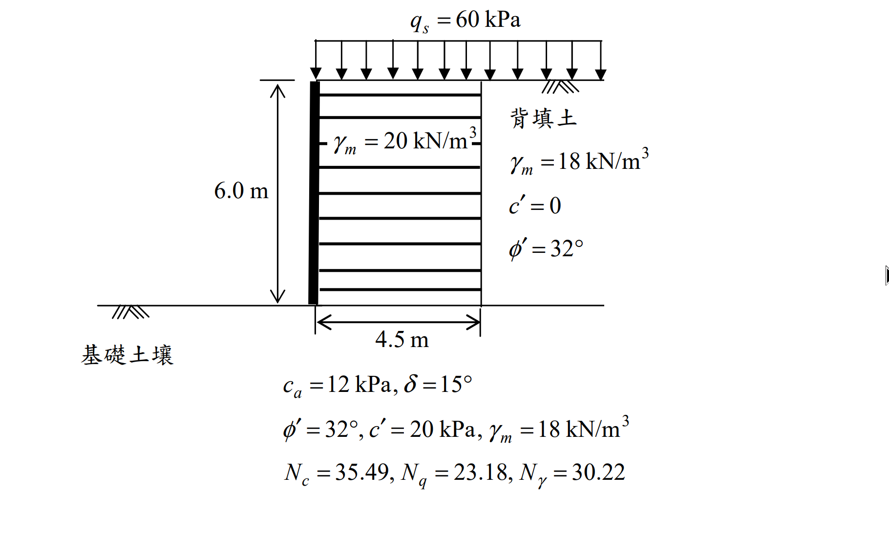

# 考題編號：SM-2016-3

**主分類：** `SM-U3-2` 擋土結構物穩定分析
**副分類：** `SM-U2-1` 淺基礎之支承力與沉陷量、`SM-U3-1` 側向土壓力理論
**分析法：** 有效應力法
**標籤：** `加勁擋土結構` `抗滑動` `抗傾覆` `承載力檢核` `偏心距` `Rankine主動土壓力` `超載重`
---

## 1. 原始題目重述 (Problem Restatement)
下圖所示為直立 6.0 m 高加勁擋土牆，加勁材埋入深度為 4.5 m，假設加勁土壤視為一剛體，單位重 $\gamma_m = 20 \text{ kN/m}^3$，背填土壤為砂質土壤，單位重為 $\gamma_b = 18 \text{ kN/m}^3$，背填土有效剪力強度參數 $\phi' = 32^\circ$、$c' = 0$；此背填土及加勁土體座落於某粘土質沉泥基礎土壤上，其與加勁土體間界面的剪力強度參數 $c_a = 12 \text{ kPa}$、$\delta = 15^\circ$，基礎土壤之有效剪力強度參數 $\phi' = 32^\circ$、$c' = 20 \text{ kPa}$，單位重 $\gamma_f = 18 \text{ kN/m}^3$，加勁土與背填土上方承受 $q_s = 60 \text{ kPa}$ 均佈荷載。

**(一) 試分析此加勁擋土牆之抗傾倒、抗滑安全係數為何與是否適宜？如不適宜，建議補救措施為何？（12 分）**
**(二) 請分析此加勁土體基礎承載力安全係數為何與是否適宜？如不適宜，建議補救措施為何？（8 分）**
**(三) 請說明加勁擋土牆系統設計與施工注意事項。（5 分）**

*圖說：加勁擋土牆高 $6.0\text{m}$，加勁體寬 $4.5\text{m}$，上方有 $60\text{kPa}$ 超載重，背填土為砂土 $(\phi'=32^\circ)$，基礎土為黏土質沉泥，並給定承載力係數。*

## 2. 考題核心精神與出題者意圖 (Core Concepts & Examiner's Intent)
本題測驗考生對於**加勁擋土牆外部穩定分析 (External Stability)** 的熟練度。
出題者期望考生將加勁土體視為一整體剛性區塊，計算背填土與超載重所造成之主動側向土壓力與傾覆力矩，並評估該剛體之抗滑、抗傾覆與承載能力。本題陷阱在於均佈超載重 $q_s$ 同時作用於「加勁土」與「背填土」上方，因此在計算驅動力時會產生側向推力，在計算抵抗力時亦會增加加勁體的正向垂直荷重，不可遺漏。

## 3. 解題戰略地圖與陷阱分析 (Strategic Roadmap & Trap Analysis)
1. **主動土壓力與推力計算**：利用 Rankine 理論求得背填土之 $K_a$。計算土壤自重及均佈超載所產生之側向推力 $P_h$ 與傾覆力矩 $M_O$。
2. **抗滑與抗傾倒檢核**：加總垂直荷重 $V$（包含加勁土重與上方超載）。利用底部界面參數 $(c_a, \delta)$ 計算抗滑力，求出 $FS_{SL}$ 與 $FS_{OT}$。
3. **承載力檢核**：由於合力偏心，利用合力矩與總垂直力求出偏心距 $e$。採用 Meyerhof 有效寬度法 $L' = L - 2e$ 求出基礎底面等值均佈應力 $q'_{max}$，並以此寬度計算極限承載力 $q_{ult}$，進而求出 $FS_{BC}$。
4. **改善措施與注意事項**：針對未達標的安全係數提出實務對策（如增加加勁長度、深埋等），並補充設計與施工之通則。

## 3.5 變數層次分析 (Variable Hierarchy Analysis)

### 最終目標
計算加勁擋土牆之抗滑、抗傾覆與基礎承載力安全係數，並針對不足項目提出改善對策。

### 本題關鍵公式（依計算順序）
- Step 1 主動土壓力係數：$K_a = \tan^2(45^\circ - \frac{\phi_b'}{2})$
- Step 2 水平推力：$P_h = \frac{1}{2}\boxed{K_a} \gamma_b H^2 + \boxed{K_a} q_s H$
- Step 3 傾覆力矩：$M_O = (\frac{1}{2}\boxed{K_a} \gamma_b H^2)\frac{H}{3} + (\boxed{K_a} q_s H)\frac{H}{2}$
- Step 4 總垂直力：$V = \gamma_m H L + q_s L$
- Step 5 穩定安全係數：$FS_{SL} = \frac{c_a L + \boxed{V} \tan\delta}{\boxed{P_h}}$, $FS_{OT} = \frac{\boxed{V}(L/2)}{\boxed{M_O}}$
- Step 6 合力偏心距與有效寬度：$e = \frac{L}{2} - \frac{\boxed{V}(L/2) - \boxed{M_O}}{\boxed{V}}$, $L' = L - 2\boxed{e}$
- Step 7 承載力安全係數：$q_{ult} = c_f' N_c + \frac{1}{2} \gamma_f \boxed{L'} N_\gamma$, $FS_{BC} = \frac{\boxed{q_{ult}}}{\boxed{V}/\boxed{L'}}$

### L1：題目直接給定
| 符號 | 數值 | 說明 |
|---|---|---|
| $H$ | 6.0 m | 加勁擋土牆高度 |
| $L$ | 4.5 m | 加勁材埋入深度（加勁體寬度） |
| $\gamma_m$ | 20 kN/m³ | 加勁土壤單位重 |
| $q_s$ | 60 kPa | 地表均佈超載重 |
| $\gamma_b$ | 18 kN/m³ | 背填土壤單位重 |
| $\phi_b'$ | 32° | 背填土有效內摩擦角 |
| $c_a$ | 12 kPa | 底部界面凝聚力 |
| $\delta$ | 15° | 底部界面摩擦角 |
| $c_f'$ | 20 kPa | 基礎土有效凝聚力 |
| $\gamma_f$ | 18 kN/m³ | 基礎土單位重 |
| $N_c, N_q, N_\gamma$ | 35.49, 23.18, 30.22 | 基礎土之 Meyerhof 承載力係數 |

### L2：需知識點推導
**外部水平推力與傾覆力矩**
| 符號 | 公式／來源 | 卡關? |
|---|---|---|
| $K_a$ | $\tan^2(45^\circ - \phi_b'/2)$ | |
| $P_h$ | $P_{a1} + P_{a2} = 0.5K_a\gamma_b H^2 + K_a q_s H$ | |
| $M_O$ | $P_{a1}(H/3) + P_{a2}(H/2)$ | |

**抗滑與抗傾覆分析**
| 符號 | 公式／來源 | 卡關? |
|---|---|---|
| $V$ | $\gamma_m H L + q_s L$ | |
| $FS_{SL}$ | $(c_a L + V \tan\delta) / P_h$ | |
| $FS_{OT}$ | $(V \times L/2) / M_O$ | |

**承載力分析 (Meyerhof 有效寬度法)**
| 符號 | 公式／來源 | 卡關? |
|---|---|---|
| $e$ | $L/2 - (M_R - M_O)/V$ | |
| $L'$ | $L - 2e$ | |
| $q'_{max}$ | $V / L'$ | |
| $q_{ult}$ | $c_f' N_c + 0.5 \gamma_f L' N_\gamma$ | |
| $FS_{BC}$ | $q_{ult} / q'_{max}$ | |

### L3：深層知識（不懂就卡住）
| 知識點 | 說明 | 卡關? |
|---|---|---|
| 剛體假設 | 加勁擋土牆外部穩定分析時，將加勁區 $(H \times L)$ 視為一完整剛體 | |
| 有效寬度法 | 承受偏心載重之基礎，應以 Meyerhof 有效寬度 $B' = B - 2e$ 計算極限承載力，並以 $q'_{max} = V/B'$ 檢核 | |
| 超載重之影響 | 均佈超載 $q_s$ 同時增加主動推力 (不利) 以及垂直正向力 (有利)，計算抵抗力矩與摩擦力時須包含之 | |

## 4. 步驟化詳細計算過程 (Step-by-Step Detailed Calculation)

### (一) 抗傾倒與抗滑安全係數分析

**1. 主動土壓力與驅動力矩**
背填土主動土壓力係數：
$$ K_a = \tan^2\left(45^\circ - \frac{32^\circ}{2}\right) = \tan^2(29^\circ) = 0.3073 $$
作用於加勁體後方之水平驅動力 $P_h$ 分為土壤自重與超載兩部分：
- 土壤自重推力：$P_{a1} = \frac{1}{2} K_a \gamma_b H^2 = \frac{1}{2} \times 0.3073 \times 18 \times 6.0^2 = 99.56 \text{ kN/m}$
  （作用於距牆底 $H/3 = 2.0 \text{ m}$ 處）
- 超載重推力：$P_{a2} = K_a q_s H = 0.3073 \times 60 \times 6.0 = 110.63 \text{ kN/m}$
  （作用於距牆底 $H/2 = 3.0 \text{ m}$ 處）

總驅動水平力：
$$ P_h = P_{a1} + P_{a2} = 99.56 + 110.63 = 210.19 \text{ kN/m} $$

傾覆力矩 $M_O$ (對牆趾取矩)：
$$ M_O = 99.56 \times 2.0 + 110.63 \times 3.0 = 199.12 + 331.89 = 531.01 \text{ kN-m/m} $$

**2. 垂直荷重與抵抗力矩**
加勁土體上方亦承受超載重，故總垂直力 $V$ 包含加勁土重與超載重：
$$ V = W_{soil} + W_{sur} = (\gamma_m \times H \times L) + (q_s \times L) $$
$$ V = (20 \times 6.0 \times 4.5) + (60 \times 4.5) = 540 + 270 = 810 \text{ kN/m} $$

抵抗力矩 $M_R$ (重心位於 $L/2 = 2.25 \text{ m}$ 處)：
$$ M_R = V \times \frac{L}{2} = 810 \times 2.25 = 1822.50 \text{ kN-m/m} $$

**3. 抗傾覆安全係數 $(FS_{OT})$**
$$ FS_{OT} = \frac{M_R}{M_O} = \frac{1822.50}{531.01} = \boxed{3.43} $$
**評估：** $FS_{OT} = 3.43 \ge 2.0$，抗傾覆**適宜 (安全)**。

**4. 抗滑安全係數 $(FS_{SL})$**
依據給定之加勁土與基礎土間界面參數 $(c_a = 12 \text{ kPa}, \delta = 15^\circ)$：
抗滑力 $F_R = c_a L + V \tan\delta$
$$ F_R = 12 \times 4.5 + 810 \times \tan(15^\circ) = 54 + 810 \times 0.2679 = 54 + 217.00 = 271.00 \text{ kN/m} $$
$$ FS_{SL} = \frac{F_R}{P_h} = \frac{271.00}{210.19} = \boxed{1.29} $$
**評估：** $FS_{SL} = 1.29 < 1.5$，抗滑**不適宜 (不安全)**。

**抗滑補救措施建議：**
1. **增加加勁材長度 $L$**：可同時增加結構自重 $V$ 與底部摩擦面積，有效提升抗滑力。
2. **牆底設置抗滑榫 (Shear Key)**：藉由抗滑榫伸入基礎土層中以激發被動土壓力抵抗滑動。
3. **增加牆基埋置深度**：增加牆趾前方之被動土壓力抗力。
4. **地盤改良**：置換或改良底部土壤，提高界面摩擦參數 $c_a, \delta$。

### (二) 基礎承載力安全係數分析

**1. 偏心距與有效寬度**
合力作用點至牆趾距離 $x = \frac{M_R - M_O}{V} = \frac{1822.50 - 531.01}{810} = \frac{1291.49}{810} = 1.594 \text{ m} $
偏心距 $e = \frac{L}{2} - x = 2.25 - 1.594 = 0.656 \text{ m} $
檢核：$e = 0.656 \text{ m} < \frac{L}{6} = 0.75 \text{ m}$，底面無拉應力。

Meyerhof 有效寬度 $L'$：
$$ L' = L - 2e = 4.5 - 2 \times 0.656 = 3.188 \text{ m} $$

**2. 等值最大承載壓力 $(q'_{max})$**
$$ q'_{max} = \frac{V}{L'} = \frac{810}{3.188} = 254.08 \text{ kPa} $$

**3. 極限承載力 $(q_{ult})$**
採用 Meyerhof 理論，無埋置深度 $(D_f = 0, q=0)$：
$$ q_{ult} = c_f' N_c + \frac{1}{2} \gamma_f L' N_\gamma $$
代入已知參數 ($c_f' = 20 \text{ kPa}, \gamma_f = 18 \text{ kN/m}^3, N_c = 35.49, N_\gamma = 30.22$)：
$$ q_{ult} = 20 \times 35.49 + \frac{1}{2} \times 18 \times 3.188 \times 30.22 $$
$$ q_{ult} = 709.80 + 866.91 = 1576.71 \text{ kPa} $$

**4. 承載力安全係數 $(FS_{BC})$**
$$ FS_{BC} = \frac{q_{ult}}{q'_{max}} = \frac{1576.71}{254.08} = \boxed{6.21} $$
**評估：** $FS_{BC} = 6.21 \ge 2.5 \sim 3.0$（規範容許值），基礎承載力**適宜 (非常安全)**。
*(註：由於已適宜，故無需補救措施。若未來有不適宜之情況，可採用增加加勁長度 $L$ 或地盤改良等措施)*

### (三) 加勁擋土牆系統設計與施工注意事項

**設計注意事項：**
1. **內部穩定分析 (Internal Stability)**：必須詳細檢核加勁材之「抗拉斷」及「抗拔出」安全係數，確保各層加勁材配置之長度、間距與抗拉強度充足。
2. **外部與整體穩定 (External & Overall Stability)**：除上述抗滑、傾覆與承載力外，遇坡地或軟弱地層時，必須執行整體圓弧滑動破壞之穩定性分析。
3. **排水系統設計 (Drainage Design)**：背填土區與加勁區後方應設置良好之排水設施 (如透水盲溝、排水管)，防止水壓累積而增加牆背推力並降低土壤強度。

**施工注意事項：**
1. **填土材料與夯實 (Backfill & Compaction)**：應選用排水性佳、級配良好之粒料作為加勁區與背填區土壤，並分層均勻滾壓至規定之壓實度。
2. **面版保護與重機管制 (Facing Protection)**：壓路機等大型夯實機具應與面版保持適當距離 (通常 $>1\text{m}$)，近面版處應改用小型夯實設備，以免推擠面版造成線形不平整或結構損壞。
3. **加勁材敷設 (Reinforcement Installation)**：加勁材鋪設時應保持平整並適度拉緊，確保與面版接合處穩固無鬆脫，再行覆土壓實。

## 5. 關鍵爭議點與進階探討 (Critical Issues & Advanced Discussion)
- **超載重之考量**：在台灣考題中，通常未特別區分超載重為活載重 (Live Load) 或靜載重 (Dead Load)，皆直接全數計入驅動力與抵抗力之計算。若考題特別聲明 $q_s$ 為活載重，則在進行保守設計時，計算抵抗傾覆力矩與底部摩擦力時會**忽略**作用於加勁區上方之活載重（即 $V$ 不計 $q_s \times L$），但推力計算仍包含其造成之主動土壓力。本解析依據常規考題慣例，將其視為均佈常設荷載全數列入。
- **承載力計算方法**：傳統做法可能採用偏心應力公式 $q_{max} = \frac{V}{L}(1+\frac{6e}{L})$ 配合原寬度計算 $FS$，但對於加勁擋土牆，現行主流設計規範（如 AASHTO、FHWA）強烈建議採用 Meyerhof 有效寬度法 ($L' = L - 2e$) 計算極限承載力，這更能真實反映基底應力集中之破壞模式，也是本解析採用的方法。
