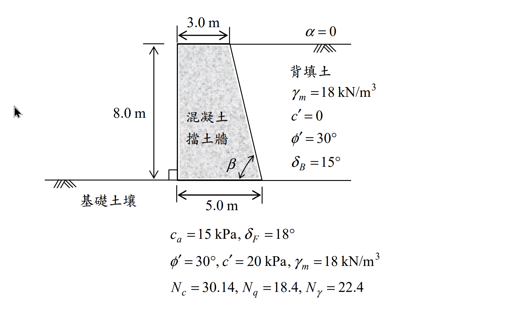

# 考題編號：SM-2016-4

**主分類：** `SM-U3` 擋土結構與邊坡穩定
**副分類：** `SM-U2` 淺基礎之支承力與沉陷量
**分析法：** 有效應力法
**標籤：** `Coulomb土壓力` `擋土牆穩定分析` `Meyerhof承載力` `Mononobe-Okabe動態土壓力`

---

## 1. 原始題目重述 (Problem Restatement)

下圖所示為 8.0 m 垂直高混凝土重力式擋土牆，水平背填土壤（$\alpha = 0$）為砂質土壤，其單位重為 $18 \text{ kN/m}^3$，排水剪力強度參數 $\phi' = 30^\circ$、$c' = 0$，背填土與混凝土擋土牆界面摩擦角 $\delta_B = 15^\circ$。
此擋土牆座落於某粘土質沉泥基礎土壤上，基礎土壤與混凝土擋土牆界面的剪力強度參數 $c_a = 15 \text{ kPa}$、$\delta_F = 18^\circ$。
基礎土壤之剪力強度參數 $\phi' = 30^\circ$、$c' = 20 \text{ kPa}$，單位重 $\gamma_m = 18 \text{ kN/m}^3$，混凝土單位重 $\gamma_c = 23.5 \text{ kN/m}^3$：

擋土牆幾何形狀：
- 牆高 $H = 8.0 \text{ m}$
- 頂寬 $3.0 \text{ m}$，底寬 $5.0 \text{ m}$
- 前方面板垂直，後方背填土面傾斜，傾角 $\beta$ 為背填土面與水平面之夾角。

**子問題：**
(一) 試以庫倫主動土壓力係數分析此重力擋土牆之抗傾倒、抗滑安全係數是否適宜？如不適宜，建議補救措施為何？（10 分）
(二) 請分析此擋土牆基礎承載力的安全係數是否適宜？如不適宜，建議補救措施為何？（10 分）
(三) 請以 Mononobe–Okabe 動態土壓力理論，分析此擋土牆承受水平及垂直方向的地震加速度分別為 0.15 g 及 0.05 g 的狀態下（$K_h = 0.15$ 及 $K_v = 0.05$），主動土壓力 $P_{ae}$ 的大小、方向與位置為何？（5 分）

*圖說：8.0 m 高混凝土擋土牆剖面圖，頂寬 3.0 m，底寬 5.0 m。背填土 $\gamma_m = 18 \text{ kN/m}^3, \phi' = 30^\circ, \delta_B = 15^\circ$。基礎土壤 $c_a = 15 \text{ kPa}, \delta_F = 18^\circ, \phi' = 30^\circ, c' = 20 \text{ kPa}, \gamma_m = 18 \text{ kN/m}^3$。*

## 2. 考題核心精神與出題者意圖 (Core Concepts & Examiner's Intent)

本題是擋土牆綜合設計分析的經典題型，考驗考生對以下四大核心概念的掌握：
1. **庫倫主動土壓力 (Coulomb Active Earth Pressure)**：理解傾斜牆背（非垂直）狀態下的 $\beta$ 角度定義，並能正確代入複雜的庫倫主動土壓力係數 $K_a$ 公式。
2. **擋土牆外部穩定性分析 (External Stability)**：正確計算土壓力的水平與垂直分量及其作用點，結合擋土牆自重計算抗傾倒與抗滑動安全係數。
3. **偏心載重下的淺基礎承載力 (Bearing Capacity with Eccentricity)**：將擋土牆底部視為承受偏心載重與傾斜載重的淺基礎，利用 Meyerhof 承載力公式（含傾斜修正係數）計算極限承載力，並檢核最大接地壓力的安全係數。
4. **地震動態土壓力 (Mononobe-Okabe Theory)**：理解地震慣性力對主動土壓力的影響，正確計算擬靜態角 $\theta'$ 與動態土壓力係數 $K_{ae}$，並掌握動態增量作用點的經驗法則（高度 $0.6H$）。

## 3. 解題戰略地圖與陷阱分析 (Strategic Roadmap & Trap Analysis)

**步驟化作戰計畫：**
1. **幾何與 $K_a$ 計算**：由牆高與頂底寬計算牆背傾角 $\beta$，代入公式求 $K_a$ 及主動土壓力 $P_a$。
2. **分力與力臂**：計算 $P_a$ 之水平、垂直分量，以及牆體自重。求取各力對牆趾（Toe）的力臂。
3. **穩定分析**：計算抗傾倒安全係數 $FS_{OT}$ 與抗滑動安全係數 $FS_{sl}$，並與規範值（通常 $FS_{OT} \ge 2.0$, $FS_{sl} \ge 1.5$）比較。
4. **承載力計算**：計算合力偏心距 $e$、有效底寬 $B'$，及最大接地壓力 $q_{max}$。利用 Meyerhof 公式搭配傾斜修正係數計算極限承載力 $q_u$，求得 $FS_{bc}$，若小於 3.0 則提出補救措施。
5. **M-O 動態土壓力**：計算 $\theta'$ 及 $K_{ae}$，求得總動態土壓力 $P_{ae}$，並依據「靜態力在 $H/3$、動態增量在 $0.6H$」之原則推算合力作用點位置。

**陷阱分析：**
- **陷阱一：牆背傾角 $\beta$ 的定義。** 庫倫公式中的 $\beta$ 是牆背與「水平面」的夾角。從幾何可得 $\tan\beta = 8/(5-3) = 4$，$\beta = 75.96^\circ$。不要誤用與垂直面的夾角。
- **陷阱二：土壓力作用方向。** $P_a$ 作用於傾斜牆背，與牆背法線夾角為 $\delta_B$。所以與水平面的夾角應為 $(90^\circ - \beta) + \delta_B = 14.04^\circ + 15^\circ = 29.04^\circ$。
- **陷阱三：承載力傾斜修正。** $q_u$ 的計算必須加入 Meyerhof 傾斜修正係數 $i_c, i_q, i_\gamma$，因為地基承受了來自土壓力的強大水平側力。
- **陷阱四：M-O 合力作用點。** $P_{ae}$ 不能單純設在 $H/3$。必須將其分為靜態 $P_a$ (作用於 $H/3$) 與動態增量 $\Delta P_{ae}$ (作用於 $0.6H$)，再利用力矩平衡求合力作用點 $\bar{z}$。

## 3.5 變數層次分析 (Variable Hierarchy Analysis)

### 最終目標
判定擋土牆抗滑、抗傾倒及承載力是否安全，並計算地震時之動態主動土壓力大小及位置。

### 本題關鍵公式（依計算順序）
- 牆背傾角：$\beta = \tan^{-1}(\frac{H}{B_{bottom} - B_{top}})$
- 庫倫主動土壓力：$P_a = \frac{1}{2}\gamma_m H^2 K_a$
- 抗傾倒與抗滑安全係數：$FS_{OT} = \frac{\Sigma M_R}{\Sigma M_O}$， $FS_{sl} = \frac{c_a B + \Sigma V \tan\delta_F}{\Sigma H}$
- 偏心距與有效寬度：$\bar{x} = \frac{\Sigma M_R - \Sigma M_O}{\Sigma V}$， $e = \frac{B}{2} - \bar{x}$， $B' = B - 2\boxed{e}$
- 最大接地壓力：$q_{max} = \frac{\Sigma V}{B}(1 + \frac{6\boxed{e}}{B})$
- 極限承載力 (Meyerhof)：$q_u = c' N_c F_{ci} + 0.5 \gamma_m B' N_\gamma F_{\gamma i}$
- 動態土壓力合力位置：$\bar{z} = \frac{P_a(H/3) + (\Delta P_{ae})(0.6H)}{P_{ae}}$

### L1：題目直接給定
- 符號 ∣ 數值 ∣ 說明
- $H$ ∣ $8.0 \text{ m}$ ∣ 擋土牆高度
- $B$ ∣ $5.0 \text{ m}$ ∣ 擋土牆底寬
- $\phi'$ ∣ $30^\circ$ ∣ 背填土摩擦角
- $\delta_B$ ∣ $15^\circ$ ∣ 牆背摩擦角
- $\gamma_m$ ∣ $18 \text{ kN/m}^3$ ∣ 土壤單位重
- $\gamma_c$ ∣ $23.5 \text{ kN/m}^3$ ∣ 混凝土單位重
- $c_a$ ∣ $15 \text{ kPa}$ ∣ 底面附著力
- $\delta_F$ ∣ $18^\circ$ ∣ 底面摩擦角
- $c', \phi'_f$ ∣ $20 \text{ kPa}, 30^\circ$ ∣ 基礎土剪力強度參數
- $N_c, N_q, N_\gamma$ ∣ $30.14, 18.4, 22.4$ ∣ 承載力係數

### L2：需知識點推導
**幾何與土壓力**
- 符號 ∣ 公式／來源 ∣ 卡關?
- $\beta$ ∣ $\tan^{-1}(8/2) = 75.964^\circ$ ∣
- $K_a$ ∣ 庫倫主動土壓力係數公式 ∣
- $\theta_{Pa}$ ∣ $(90^\circ - \beta) + \delta_B$ ∣
**穩定分析**
- $\Sigma V, \Sigma H$ ∣ 牆重與土壓力分力加總 ∣
- $FS_{OT}$ ∣ 抵抗力矩 / 傾覆力矩 ∣
- $FS_{sl}$ ∣ 抵抗滑動力 / 驅動水平力 ∣
**承載力計算**
- $e, B'$ ∣ 偏心距與有效寬度公式 ∣
- $F_{ci}, F_{\gamma i}$ ∣ Meyerhof 傾斜修正係數 ∣
- $FS_{bc}$ ∣ $q_u / q_{max}$ ∣
**動態土壓力**
- $\theta'$ ∣ $\tan^{-1}(K_h / (1-K_v))$ ∣
- $K_{ae}$ ∣ Mononobe-Okabe 係數公式 ∣
- $\bar{z}$ ∣ 動靜態成分力矩平衡點 ∣

### L3：深層知識（不懂就卡住）
- 知識點 ∣ 說明 ∣ 卡關?
- 傾斜角 $\beta$ 定義 ∣ 必須測量與水平面的夾角，不可誤用垂直夾角 ∣
- 承載力傾斜修正 ∣ 基礎承受水平力時，承載力會大幅折減，需代入傾斜因子 ∣
- 動態土壓力作用點 ∣ 總動態力需拆分為靜態 (作用於 $H/3$) 與動態增量 (作用於 $0.6H$) ∣

## 4. 步驟化詳細計算過程 (Step-by-Step Detailed Calculation)

### (一) 抗傾倒與抗滑安全係數分析

**Step 1：計算庫倫主動土壓力係數 $K_a$ 及土壓力 $P_a$**
由幾何條件可知，背填土面(牆背)的水平寬度為 $5.0 - 3.0 = 2.0 \text{ m}$，垂直高度 $H = 8.0 \text{ m}$。
牆背與水平面之夾角 $\beta$：
$$ \beta = \tan^{-1}\left(\frac{8.0}{2.0}\right) = 75.964^\circ $$
已知 $\phi'=30^\circ, \alpha=0^\circ, \delta_B=15^\circ$，代入題附庫倫主動土壓力係數公式：
$$ K_a = \frac{\sin^2(75.964^\circ+30^\circ)}{\sin^2(75.964^\circ)\sin(75.964^\circ-15^\circ)\left[1+\sqrt{\frac{\sin(30^\circ+15^\circ)\sin(30^\circ-0^\circ)}{\sin(75.964^\circ-15^\circ)\sin(0^\circ+75.964^\circ)}}\right]^2} $$
計算各項：
$\sin^2(105.964^\circ) = 0.9243$
$\sin^2(75.964^\circ) \cdot \sin(60.964^\circ) = 0.9412 \times 0.8743 = 0.8229$
根號內：$\frac{\sin(45^\circ)\sin(30^\circ)}{\sin(60.964^\circ)\sin(75.964^\circ)} = \frac{0.7071 \times 0.5}{0.8743 \times 0.9701} = 0.4169$
分母括號：$(1 + \sqrt{0.4169})^2 = (1 + 0.6457)^2 = 2.7083$
$$ K_a = \frac{0.9243}{0.8229 \times 2.7083} \approx 0.4148 $$
主動土壓力：
$$ P_a = \frac{1}{2} \gamma_m H^2 K_a = \frac{1}{2}(18)(8.0)^2(0.4148) = 238.92 \text{ kN/m} $$

**Step 2：力與力臂計算**
$P_a$ 作用於傾斜牆背，與牆背法線夾角為 $\delta_B=15^\circ$ (向下)。
牆背法線與水平面的夾角為 $90^\circ - 75.964^\circ = 14.036^\circ$。
故 $P_a$ 與水平面的總夾角 $\theta_{Pa} = 14.036^\circ + 15^\circ = 29.036^\circ$。
- 水平分力：$P_{ah} = 238.92 \cos(29.036^\circ) = 208.89 \text{ kN/m}$
- 垂直分力：$P_{av} = 238.92 \sin(29.036^\circ) = 115.97 \text{ kN/m}$
$P_a$ 作用於距底部 $H/3 = 2.667 \text{ m}$ 處。
其水平位置(距牆趾 Toe，即 $x=0$)：$x_{pa} = 5.0 - (2.667/8.0)\times 2.0 = 4.333 \text{ m}$。

牆體自重 (分為左側矩形 $W_1$ 與右側三角形 $W_2$)：
- $W_1 = 3.0 \times 8.0 \times 23.5 = 564.0 \text{ kN/m}$，力臂 $x_1 = 1.5 \text{ m}$
- $W_2 = \frac{1}{2} \times 2.0 \times 8.0 \times 23.5 = 188.0 \text{ kN/m}$，力臂 $x_2 = 3.0 + (2.0/3) = 3.667 \text{ m}$

總重直力：$\Sigma V = W_1 + W_2 + P_{av} = 564.0 + 188.0 + 115.97 = 867.97 \text{ kN/m}$
總水平力：$\Sigma H = P_{ah} = 208.89 \text{ kN/m}$

**Step 3：穩定安全係數計算**
抗傾倒力矩 (對牆趾)：
$$ \Sigma M_R = W_1 x_1 + W_2 x_2 + P_{av} x_{pa} = 564(1.5) + 188(3.667) + 115.97(4.333) = 846.0 + 689.4 + 502.5 = 2037.9 \text{ kN-m/m} $$
傾覆力矩：
$$ \Sigma M_O = P_{ah} \times (H/3) = 208.89 \times 2.667 = 557.1 \text{ kN-m/m} $$
**抗傾倒安全係數：**
$$ FS_{OT} = \frac{\Sigma M_R}{\Sigma M_O} = \frac{2037.9}{557.1} = \boxed{3.66} > 2.0 \quad (\text{適宜}) $$

底部抗滑力 ($c_a = 15 \text{ kPa}, \delta_F = 18^\circ$)：
$$ F_R = c_a B + \Sigma V \tan\delta_F = 15(5.0) + 867.97 \tan(18^\circ) = 75.0 + 282.0 = 357.0 \text{ kN/m} $$
**抗滑動安全係數：**
$$ FS_{sl} = \frac{F_R}{\Sigma H} = \frac{357.0}{208.89} = \boxed{1.71} > 1.5 \quad (\text{適宜}) $$

> **結論：** 抗傾倒與抗滑安全係數皆適宜，不需補救措施。

### (二) 基礎承載力安全係數分析

**Step 1：最大接地壓力 $q_{max}$**
合力作用點距牆趾距離：
$$ \bar{x} = \frac{\Sigma M_R - \Sigma M_O}{\Sigma V} = \frac{2037.9 - 557.1}{867.97} = 1.706 \text{ m} $$
偏心距 (自底面中心)：
$$ e = \frac{B}{2} - \bar{x} = 2.5 - 1.706 = 0.794 \text{ m} < \frac{B}{6} = 0.833 \text{ m} \quad (\text{無張力}) $$
最大接地壓力：
$$ q_{max} = \frac{\Sigma V}{B}\left(1 + \frac{6e}{B}\right) = \frac{867.97}{5.0}\left(1 + \frac{6(0.794)}{5.0}\right) = 173.59 \times 1.9528 = \boxed{339.0 \text{ kPa}} $$

**Step 2：極限承載力 $q_u$ (Meyerhof公式)**
有效寬度 $B' = B - 2e = 5.0 - 2(0.794) = 3.412 \text{ m}$。無埋置深度 ($D_f=0, q=0$)。
計算傾斜係數 (傾斜角 $\psi = \tan^{-1}(\Sigma H / \Sigma V) = \tan^{-1}(208.89 / 867.97) = 13.53^\circ$)：
$$ F_{ci} = \left(1 - \frac{\psi}{90^\circ}\right)^2 = \left(1 - \frac{13.53}{90}\right)^2 = 0.722 $$
$$ F_{\gamma i} = \left(1 - \frac{\psi}{\phi'}\right)^2 = \left(1 - \frac{13.53}{30}\right)^2 = 0.301 $$
極限承載力：
$$ q_u = c' N_c F_{ci} + 0.5 \gamma_m B' N_\gamma F_{\gamma i} = 20(30.14)(0.722) + 0.5(18)(3.412)(22.4)(0.301) $$
$$ q_u = 435.2 + 207.0 = 642.2 \text{ kPa} $$

**Step 3：承載力安全係數與補救措施**
$$ FS_{bc} = \frac{q_u}{q_{max}} = \frac{642.2}{339.0} = \boxed{1.89} < 3.0 \quad (\text{不適宜}) $$

> **建議補救措施：** 由於 $FS_{bc} = 1.89$ 不滿足常規標準 (3.0)，建議採取以下措施：
> 1. **加大基礎寬度 (增加 B)**：向趾部延伸底版，降低最大接地壓力。
> 2. **增加基礎埋置深度 (增加 $D_f$)**：將基礎深埋，利用土層覆土壓力 (提供 $q N_q$ 承載力)。
> 3. **地盤改良**：對基礎土壤進行夯實或拌合改良，提升其 $c'$ 與 $\phi'$ 值。
> 4. 改採深基礎 (如基樁) 將荷重傳遞至深層堅硬地層。

### (三) Mononobe–Okabe 動態土壓力分析

**Step 1：計算動態土壓力係數 $K_{ae}$**
已知 $K_h = 0.15, K_v = 0.05$。
擬靜態角 $\theta'$：
$$ \theta' = \tan^{-1}\left(\frac{K_h}{1-K_v}\right) = \tan^{-1}\left(\frac{0.15}{0.95}\right) = 8.973^\circ $$
代入題目給定的 M-O 公式，參數為：$\phi'=30^\circ, \beta=75.964^\circ, \delta_B=15^\circ, \alpha=0^\circ, \theta'=8.973^\circ$。
$$ K_{ae} = \frac{\sin^2(96.991^\circ)}{\cos(8.973^\circ)\sin^2(75.964^\circ)\sin(51.991^\circ)\left[1+\sqrt{\frac{\sin(45^\circ)\sin(21.027^\circ)}{\sin(51.991^\circ)\sin(75.964^\circ)}}\right]^2} $$
$$ K_{ae} = \frac{0.9852}{(0.9877)(0.9412)(0.7879)\left[1+\sqrt{\frac{(0.7071)(0.3588)}{(0.7879)(0.9701)}}\right]^2} $$
$$ K_{ae} = \frac{0.9852}{0.7323 \times (1 + \sqrt{0.3319})^2} = \frac{0.9852}{0.7323 \times 2.4842} \approx 0.5414 $$

**Step 2：計算 $P_{ae}$ 大小、方向與位置**
**大小：**
$$ P_{ae} = \frac{1}{2}\gamma_m H^2 (1-K_v) K_{ae} = 0.5(18)(8.0)^2(1-0.05)(0.5414) = \boxed{296.26 \text{ kN/m}} $$
**方向：**
與靜態相同，作用於擋土牆背面，且與背填土面法線夾角 $\delta_B = 15^\circ$ 朝下。（即與水平面夾角 $\theta_{P_{ae}} = 29.04^\circ$ 朝下）。
**位置 (作用點高度)：**
總動態土壓力 $P_{ae}$ = 靜態土壓力 $P_a$ + 動態增量 $\Delta P_{ae}$
$$ \Delta P_{ae} = P_{ae} - P_a = 296.26 - 238.92 = 57.34 \text{ kN/m} $$
靜態力 $P_a$ 作用於 $H/3$，動態增量 $\Delta P_{ae}$ 作用於 $0.6H$。對牆底取力矩平衡求總合力作用高度 $\bar{z}$：
$$ \bar{z} = \frac{P_a(H/3) + \Delta P_{ae}(0.6H)}{P_{ae}} = \frac{238.92(2.667) + 57.34(4.8)}{296.26} = \frac{637.2 + 275.2}{296.26} = \boxed{3.08 \text{ m}} $$
答：合力作用點位於距牆底 $3.08 \text{ m}$ 處（沿牆背高度）。

## 5. 關鍵爭議點與進階探討 (Critical Issues & Advanced Discussion)

1. **牆背傾角 $\beta$ 的判讀**
   許多教科書中，Rankine 理論推導是以垂直牆背為基礎，而 Coulomb 推導則允許傾斜牆背。圖中明確標示 $\beta$ 為背填土面與水平面的夾角。在考場上若將 $\beta$ 誤解為與垂直面的夾角，將導致 $K_a$ 數值嚴重偏差。幾何關係清晰指出 $\tan\beta=4$，為避免算錯，務必熟記公式符號的幾何意義。
2. **承載力計算中的傾斜修正**
   部分考生在計算承載力時，會忘記擋土牆基礎承受巨大的水平力（土壓力水平分力），直接代入 $N_c, N_q, N_\gamma$。這會高估基礎承載力。本題特別給定 $N_c, N_q, N_\gamma$ 且提示可使用 Meyerhof 理論，強烈暗示需進行傾斜修正，否則將失去核心分數。
3. **動態土壓力作用點位置 $\bar{z}$**
   傳統上有些工程師會將總動態力統一假設作用於 $H/2$ 處，但在國家考試標準解答中，依據 Seed & Whitman (1970) 的建議，將靜態與動態增量分開（$H/3$ 與 $0.6H$）加權計算合力位置，是更嚴謹且容易得分的做法。
