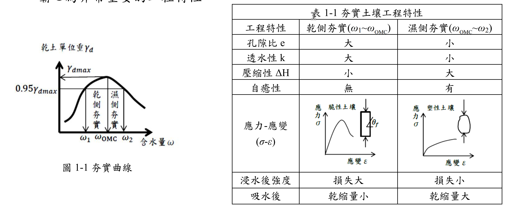

# 考題編號：SM-2017-1

**主分類：** `SM-U1-3` 土壤夯實及壓密
**副分類：** 無
**分析法：** 概念題
**標籤：** `夯實曲線` `最佳含水量` `乾側與濕側夯實` `夯實能量` `自癒性` `相對夯實度`
---

## 1. 原始題目重述 (Problem Restatement)

一、現場夯實土壤因日曬、風吹蒸發，土壤很難控制 $\omega_{OMC}$ 之含水量，故填土工程設計之工地密度為 $0.95$ 或 $0.98\gamma_{d(max)}$，試依夯實土壤工程特性（乾側、濕側夯實）如圖 1-1 及表 1-1 所示，請定出表 1-2 各工程夯實規範（需標準夯實或改良夯實、乾側含水量或濕側含水量及設計要求重點，如要求承載力、要求排水性、要求自癒性…）。（請繪表 1-2 作答）（20 分）

註 1：施工規範設計原則為依據下面特性而定：
1. 要求強度：則設計採改良型（高能量）夯實、乾側含水量。
2. 要求排水：則設計採乾側含水量。
3. 要求承載力：則設計採改良型（高能量）夯實、乾側含水量。
4. 怕過度夯實，土壤失去粘著力：則設計採標準型（低能量）夯實。
5. 要求粘土自癒性（Self healing）則設計採標準型（低能量）夯實規範、濕側含水量。

註 2：粘土自癒性（Self healing）為粘土在外力作用下產生微裂縫，可依粘土的粘著性而自行癒合的特性。但粘土必須存在塑性狀態，故含水量應在塑性限度與液性限度之間，即 $LL \ge \omega \ge PL$，而只有在濕側夯實粘土才有自癒性，其在粘土壩心為非常重要的工程特性。

*圖說：本題的兩項給定資料。*
*（一）**圖 1-1 夯實曲線**：縱軸為乾土單位重 $\gamma_d$、橫軸為含水量 $\omega$，曲線為開口向下之鐘形。圖上畫出 $\gamma_{d,max}$ 與 $0.95\gamma_{d,max}$ 兩條水平線；$0.95\gamma_{d,max}$ 水平線與夯實曲線相交於兩點，其含水量分別記為 $\omega_1$（峰值左側）與 $\omega_2$（峰值右側），峰值本身對應 $\omega_{OMC}$。因此 $\omega_1 \sim \omega_{OMC}$ 區間標註為「乾側夯實」、$\omega_{OMC} \sim \omega_2$ 區間標註為「濕側夯實」—— 這正是題幹「工地密度為 $0.95$ 或 $0.98\gamma_{d(max)}$」所對應的含水量容許帶。*

*（二）**表 1-1 夯實土壤工程特性**（乾側夯實 $\omega_1\sim\omega_{OMC}$ vs 濕側夯實 $\omega_{OMC}\sim\omega_2$）：*

| 工程特性 | 乾側夯實（$\omega_1 \sim \omega_{OMC}$） | 濕側夯實（$\omega_{OMC} \sim \omega_2$） |
|---|:---:|:---:|
| 孔隙比 $e$ | 大 | 小 |
| 透水性 $k$ | 大 | 小 |
| 壓縮性 $\Delta H$ | 小 | 大 |
| 自癒性 | 無 | 有 |
| 應力－應變 $(\sigma\text{-}\varepsilon)$ | **脆性土壤**：應力達尖峰後下降，試體出現明顯傾角 $\theta_f$ 之剪破面 | **塑性土壤**：應力持續緩升無明顯尖峰，試體呈鼓脹變形 |
| 浸水後強度 | 損失大 | 損失小 |
| 吸水後 | 乾縮量小 | 乾縮量大 |

*（本圖與本表即為作答表 1-2 所需的全部依據；配合題幹註 1 的五項設計原則即可完成填表。）*

## 2. 考題核心精神與出題者意圖 (Core Concepts & Examiner's Intent)
- **核心精神**：測驗考生對於不同土木工程結構物（如整地、道路、機場、擋土牆、土壩）對土壤工程性質（強度、承載力、排水性、自癒性）之需求差異，以及如何透過控制夯實能量與含水量來達成設計目標。
- **出題者意圖**：引導考生利用題目給定的「註 1」施工規範設計原則（共 5 點），邏輯對應至「表 1-2」中各項工程的實際需求，考驗工程實務上的判斷力。

## 3. 解題戰略地圖與陷阱分析 (Strategic Roadmap & Trap Analysis)
- **戰略地圖**：直接將題目給定的「施工規範設計原則（註 1 內之 1~5 項）」對應至各工程項目的功能需求。
  - 機場跑道需承受飛機起降重載，對應「要求承載力」。
  - 道路工程與土石壩殼為抵抗一般外力，對應「要求強度」。
  - 濾層砂與擋土牆背填土皆以排水為主要目的，對應「要求排水」。對於排水材料，為免過度夯實導致透水性下降或對擋土牆產生過大側向土壓，宜採標準型。
  - 一般整地工程若使用高能量過度夯實，容易在黏性土壤中產生剪力破壞面而失去粘著力，對應「怕過度夯實」。
- **陷阱分析**：對於排水層與背填土，題目之註 1 僅提到「乾側含水量」，未明示夯實能量。但基於工程常理，排水性材料若採用改良型高能量夯實會大幅降低孔隙率與滲透性，故應填「標準型」。

## 3.5 變數層次分析 (Variable Hierarchy Analysis)

### 最終目標
完成表 1-2，正確配對各工程項目的夯實規範（能量型式、含水量側、設計重點）。

### 本題關鍵公式（依計算順序）
*(本題為工程實務觀念配對題，無計算公式)*

### L1：題目直接給定
| 符號 | 數值/內容 | 說明 |
|-----|----------|-----|
| 註 1 | 5 項原則 | 題目提供之設計原則選項 |
| 註 2 | 自癒性定義 | 解釋壩心需濕側夯實之理由 |

### L2：需知識點推導
**工程項目需求配對**
| 工程項目 | 對應原則 / 需求 | 卡關? |
|---------|---------------|------|
| 機場跑道 | 需極高承載能力（選項 3） | |
| 道路工程 / 壩殼 | 需較高結構強度（選項 1） | |
| 擋土牆背填 / 濾層砂 | 需良好透水性避免水壓（選項 2） | |
| 粘土壩心 | 需防水並能自癒微裂縫（選項 5） | |
| 整地工程 | 避免重機具造成淺層破壞（選項 4） | |

### L3：深層知識（不懂就卡住）
| 知識點 | 說明 | 卡關? |
|-------|-----|------|
| 夯實含水量對微觀結構之影響 | 乾側夯實呈絮狀結構（強度高、滲透大）；濕側夯實呈分散狀結構（壓縮大、自癒性佳）。 | |
| 過度夯實 (Overcompaction) | 黏性土若在含水量稍高時使用高能量夯實，容易產生局部剪力破壞面（Slickensides），使粘著力下降。 | |

## 4. 步驟化詳細計算過程 (Step-by-Step Detailed Calculation)

根據題目「註 1」提供的 5 項施工規範設計原則，對應表 1-2 各工程項目的需求：

1. **整地工程**：一般整地回填不需極高之強度與承載力，最擔心重型機具過度夯實導致黏土產生剪力滑動面，進而失去粘著力。
   - 對應註 1 第 4 點：$\boxed{\text{標準型}}$ / $\boxed{\text{乾側}}$ / $\boxed{\text{怕過度夯實，土壤失去粘著力}}$
2. **道路工程**：做為路基材料，需要提供穩定的結構強度以承受反覆交通荷重。
   - 對應註 1 第 1 點：$\boxed{\text{改良型}}$ / $\boxed{\text{乾側}}$ / $\boxed{\text{要求強度}}$
3. **機場跑道**：飛機起降的輪軸載重極大，對基底承載力的要求比一般道路更為嚴苛。
   - 對應註 1 第 3 點：$\boxed{\text{改良型}}$ / $\boxed{\text{乾側}}$ / $\boxed{\text{要求承載力}}$
4. **擋土牆背填土**：背填土最重要的功能是順利排除地下水，以避免牆背產生過大的靜水壓力。同時，為避免夯實施工對牆體造成過大側向壓力，應避免高能量夯實。
   - 對應註 1 第 2 點：$\boxed{\text{標準型}}$ / $\boxed{\text{乾側}}$ / $\boxed{\text{要求排水}}$
5. **土壩**：
   - **粘土壩心**：目的為阻水，且需容許壩體變形而不致產生貫穿裂縫（管湧）。
     - 對應註 1 第 5 點：（標準型）/ $\boxed{\text{濕側}}$ / $\boxed{\text{要求粘土自癒性}}$
   - **壩殼**：為土石壩之主要結構體，需抵抗水壓與地震力等外力，故需高強度。
     - 對應註 1 第 1 點：$\boxed{\text{改良型}}$ / $\boxed{\text{乾側}}$ / $\boxed{\text{要求強度}}$
   - **濾層砂**：介於壩心與壩殼之間，純粹做為透水與防止壩心土壤流失之用。
     - 對應註 1 第 2 點：$\boxed{\text{標準型}}$ / $\boxed{\text{乾側}}$ / $\boxed{\text{要求排水}}$

**最終解答：表 1-2 填答結果**

| 工程項目 | 改良型/標準型 | 乾側/濕側 | 要求設計重點 |
|---------|-------------|---------|------------|
| 1. 整地工程 | **標準型** | **乾側** | **怕過度夯實，土壤失去粘著力** |
| 2. 道路工程 | **改良型** | **乾側** | **要求強度** |
| 3. 機場跑道 | **改良型** | **乾側** | **要求承載力** |
| 4. 擋土牆背填土 | **標準型** | **乾側** | **要求排水** |
| 5. 土壩 粘土壩心 | （標準型） | **濕側** | **要求粘土自癒性** |
| 　 壩殼 | **改良型** | **乾側** | **要求強度** |
| 　 濾層砂 | **標準型** | **乾側** | **要求排水** |

*(註：對於整地工程、背填土與濾層砂，若未特別要求高強度與承載力，為避免過度夯實破壞土體結構或降低滲透率，實務上皆填寫「標準型」；而一般無特殊防水自癒需求之夯實皆在「乾側」進行以獲取較佳之強度與穩定性。)*

## 5. 關鍵爭議點與進階探討 (Critical Issues & Advanced Discussion)
- **過度夯實的影響**：當土壤（尤其是黏性土）以重型機具進行高能量夯實時，若現場含水量偏高（即使只是略微偏向濕側），極易在土體內部產生局部剪力破壞（Shear failure），形成平滑的滑動面（Slickensides）。這會使得土體的巨觀粘著力與抗剪強度大幅下降。因此，在不要求極高承載力的整地工程中，寧可採用標準夯實以保護土壤結構。
- **微觀結構與自癒性**：黏土在乾側夯實時，因含水量少，水膜較薄，顆粒間以較強的引力結合成「絮狀結構（Flocculated structure）」，故具備高強度與高透水性，但性質較脆；而在濕側夯實時，顆粒重新排列呈平行的「分散狀結構（Dispersed structure）」，強度雖低且透水性極差，但具有良好的塑性與延展性。若土體產生微小裂縫，濕側夯實的黏土能藉由自身的塑性與遇水膨脹特性自行癒合，這對防止大壩滲漏破壞極為關鍵。
