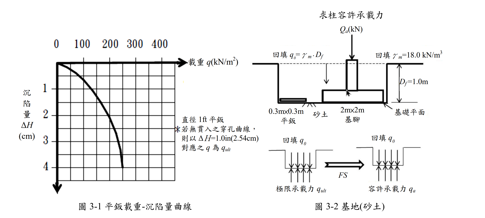

# 考題編號：[SM-2017-3]

**主分類：** `SM-U2-1` 淺基礎之支承力與沉陷量
**副分類：** `SM-U1-5` 土壤強度特性與變形性
**分析法：** 有效應力法
**標籤：** `平鈑載重試驗` `容許承載力` `沉陷量控制` `砂土`

---

## 1. 原始題目重述 (Problem Restatement)
某電子公司基地，欲建造精密廠房，經委由某試驗公司進行 $0.3\text{m} \times 0.3\text{m}$ 平鈑載重試驗，得平鈑載重曲線（圖 3-1）。精密廠房之基腳採用 $2\text{m} \times 2\text{m}$ 獨立基腳（圖 3-2），試以平鈑載重試驗曲線設計基礎承載力：
(一) 承載力控制設計，在 $FS=2$ 之下，廠房單柱之容許承載力 $Q_a$ ？與對應之沉陷量 $\Delta H$ ？
(二) 沉陷量控制設計，在沉陷量 $\Delta H=1\text{cm}$ 下，廠房之柱容許承載力 $Q_a$ ？
(三) 請製作比較表以供電子公司選擇。

*圖說：左圖為 0.3m×0.3m 平鈑之載重-沉陷量曲線（橫軸載重 $q$，縱軸沉陷量 $\Delta H$），圖中註記若無貫入穿孔曲線則以 $\Delta H = 2.54\text{cm}$ 對應之 $q$ 為 $q_{ult}$；右圖為 2m×2m 獨立基腳立面圖，基礎埋置深度 $D_f=1.0\text{m}$，回填土單位重 $\gamma_m=18.0\text{ kN/m}^3$，並附有極限承載力與容許承載力之計算邏輯圖。*

## 2. 考題核心精神與出題者意圖 (Core Concepts & Examiner's Intent)
本題主要測驗考生能否正確運用「平鈑載重試驗 (PLT)」之結果，推算實際尺寸基腳在砂土層中之承載力與沉陷量。出題者刻意將設計分為「承載力控制」與「沉陷量控制」兩種情況，意在引導考生發現：在砂土中，較大尺寸之淺基礎通常受限於「沉陷量」而非「剪力破壞」。此外，給定了一張拋物線型的載重-沉陷量曲線，考驗考生準確讀圖與建立數學模型的能力。

## 3. 解題戰略地圖與陷阱分析 (Strategic Roadmap & Trap Analysis)
**作戰計畫：**
1. **解析平鈑載重曲線：** 觀察圖表特徵點，找出數學方程式 $\Delta H_P = (q/150)^2$，以便精確求得對應數值（考場上亦可直接精確讀圖並線性內外插，但推導方程式最嚴謹）。
2. **承載力控制 (Part 1)：** 利用 $\Delta H_P = 2.54\text{cm}$ 求出平鈑極限承載力 $q_{ult(P)}$，依砂土承載力與寬度成正比的特性求出基腳 $q_{ult(F)}$，再依圖示扣除 $q_0$ 並除以 FS 得到 $q_{net,a}$ 及單柱荷重 $Q_a$；最後回推基腳在此淨載重下的極大沉陷量 $\Delta H_F$。
3. **沉陷量控制 (Part 2)：** 由基腳容許沉陷量 $\Delta H_F = 1.0\text{cm}$，利用 Terzaghi & Peck 沉陷量轉換公式回推平鈑對應之沉陷量 $\Delta H_P$，再由曲線方程式得出 $q_{net,a}$ 與 $Q_a$。

**關鍵陷阱：**
- **陷阱 1：砂土承載力尺寸效應。** 砂土之極限承載力 $q_{ult} \propto B$，不可直接令 $q_{ult(F)} = q_{ult(P)}$（此為黏土行為）。
- **陷阱 2：砂土沉陷量尺寸效應。** 不可使用線性比例，必須使用 Terzaghi & Peck 經驗公式 $S_F = S_P [2B_F / (B_F + B_P)]^2$。
- **陷阱 3：圖示中 $q_0$ 的處理。** 題目右下角明確定義 $q_a = (q_{ult} - q_0)/FS + q_0$，在求單柱容許荷重 $Q_a$ 時，應使用「淨容許承載力」 $q_{net,a}$ 乘上基腳面積。

## 3.5 變數層次分析 (Variable Hierarchy Analysis)

### 最終目標
`分別依承載力及沉陷量控制，求出廠房單柱容許承載力 Qa 及對應沉陷量 ΔH`

### 本題關鍵公式（依計算順序）
- 平鈑載重曲線方程式：$q = 150 \sqrt{\Delta H_P}$
- 基腳極限承載力（砂土）：$q_{ult(F)} = \boxed{q_{ult(P)}} \left(\frac{B_F}{B_P}\right)$
- 淨容許承載力（依題意圖示）：$q_{net,a} = \frac{\boxed{q_{ult(F)}} - q_0}{FS}$
- 廠房單柱容許承載力：$Q_a = \boxed{q_{net,a}} \times A$
- 砂土沉陷量尺寸修正（Terzaghi & Peck）：$\Delta H_F = \boxed{\Delta H_P} \left( \frac{2 B_F}{B_F + B_P} \right)^2$

### L1：題目直接給定
| 符號 | 數值 | 說明 |
|---|---|---|
| $B_P$ | $0.3\text{ m}$ | 平鈑寬度 |
| $B_F$ | $2.0\text{ m}$ | 基腳寬度 |
| $D_f$ | $1.0\text{ m}$ | 基礎埋置深度 |
| $\gamma_m$ | $18.0\text{ kN/m}^3$ | 回填土單位重 |
| $FS$ | $2$ | 安全係數 |

### L2：需知識點推導
**承載力控制推導**
| 符號 | 公式／來源 | 卡關? |
|---|---|---|
| $q_0$ | $q_0 = \gamma_m D_f$ | |
| $q_{ult(P)}$ | 曲線方程式代入 $\Delta H_P = 2.54\text{ cm}$ | |
| $q_{ult(F)}$ | $q_{ult(F)} = q_{ult(P)} (B_F/B_P)$ | |

**沉陷量控制推導**
| 符號 | 公式／來源 | 卡關? |
|---|---|---|
| $\Delta H_P$ | $\Delta H_P = \Delta H_F / [2B_F / (B_F + B_P)]^2$ | |

### L3：深層知識（不懂就卡住）
| 知識點 | 說明 | 卡關? |
|---|---|---|
| 砂土承載力尺寸效應 | 砂土之 $c=0$，承載力主要由 $0.5 \gamma B N_\gamma$ 控制，故極限承載力與寬度 $B$ 呈正比 | |
| 砂土沉陷量尺寸效應 | Terzaghi & Peck 針對同等淨壓力 $q$ 下之沉陷量經驗轉換公式 | |
| 曲線方程式建模 | 精確讀取圖表特徵點 $(150, 1)$ 與 $(300, 4)$ 並建立拋物線模型，可大幅提高計算精確度 | |

## 4. 步驟化詳細計算過程 (Step-by-Step Detailed Calculation)

### Step 1: 建立平鈑載重曲線數學模型
觀察圖 3-1 曲線，讀取特徵點：
- $q = 0\text{ kN/m}^2$, $\Delta H_P = 0\text{ cm}$
- $q = 150\text{ kN/m}^2$, $\Delta H_P = 1.0\text{ cm}$
- $q = 300\text{ kN/m}^2$, $\Delta H_P = 4.0\text{ cm}$

由此可看出曲線為一完美拋物線，方程式為：
$$ \Delta H_P = \left(\frac{q}{150}\right)^2 \quad \text{或} \quad q = 150 \sqrt{\Delta H_P} $$
（其中 $q$ 單位為 $\text{kN/m}^2$，$\Delta H_P$ 單位為 $\text{cm}$）

基腳底面之回填土覆土壓力為：
$$ q_0 = \gamma_m \cdot D_f = 18.0 \times 1.0 = 18.0 \text{ kN/m}^2 $$

---

### Step 2: (一) 承載力控制設計
依據題意圖 3-1 註記，若無明顯破壞，平鈑極限承載力取 $\Delta H_P = 2.54\text{ cm}$ 對應之載重：
$$ q_{ult(P)} = 150 \sqrt{2.54} = 150 \times 1.5937 = 239.1 \text{ kN/m}^2 $$

對於砂土，承載力與基礎寬度成正比，故基腳之極限承載力為：
$$ q_{ult(F)} = q_{ult(P)} \times \left( \frac{B_F}{B_P} \right) = 239.1 \times \left( \frac{2.0}{0.3} \right) = 1594.0 \text{ kN/m}^2 $$

依圖 3-2 給定之容許承載力邏輯，淨極限承載力為 $q_{ult(F)} - q_0$：
$$ q_{net,a} = \frac{q_{ult(F)} - q_0}{FS} = \frac{1594.0 - 18.0}{2} = 788.0 \text{ kN/m}^2 $$

廠房單柱容許承載力 $Q_a$（即基腳承擔之淨載重）：
$$ \boxed{ Q_a = q_{net,a} \times A = 788.0 \times (2.0 \times 2.0) = 3152.0 \text{ kN} } $$

> **策略註解**：此壓力 $q_{net,a} = 788.0\text{ kN/m}^2$ 遠高於平鈑試驗之最大載重，基腳將產生巨大沉陷。

求對應之基腳沉陷量 $\Delta H_F$：
先求平鈑在 $q = 788.0\text{ kN/m}^2$ 時之理論沉陷量 $\Delta H_P$：
$$ \Delta H_P = \left(\frac{788.0}{150}\right)^2 = 27.60 \text{ cm} $$
再依 Terzaghi & Peck 砂土沉陷量公式轉換至基腳：
$$ \Delta H_F = \Delta H_P \left( \frac{2 B_F}{B_F + B_P} \right)^2 = 27.60 \times \left( \frac{2 \times 2.0}{2.0 + 0.3} \right)^2 = 27.60 \times \left( \frac{4}{2.3} \right)^2 $$
$$ \boxed{ \Delta H_F = 27.60 \times 3.0246 = 83.5 \text{ cm} } $$

---

### Step 3: (二) 沉陷量控制設計
已知基腳容許沉陷量為 $\Delta H_F = 1.0\text{ cm}$。
利用 Terzaghi & Peck 公式逆推平鈑在同等淨壓力下之沉陷量 $\Delta H_P$：
$$ 1.0 = \Delta H_P \left( \frac{4}{2.3} \right)^2 \implies \Delta H_P = 1.0 \times \left( \frac{2.3}{4} \right)^2 = 0.3306 \text{ cm} $$

將 $\Delta H_P = 0.3306\text{ cm}$ 代入平鈑載重曲線方程式求淨壓力 $q_{net,a}$：
$$ q_{net,a} = 150 \sqrt{0.3306} = 150 \times 0.575 = 86.25 \text{ kN/m}^2 $$

廠房單柱容許承載力 $Q_a$：
$$ \boxed{ Q_a = q_{net,a} \times A = 86.25 \times 4.0 = 345.0 \text{ kN} } $$

---

### Step 4: (三) 製作比較表供電子公司選擇
根據上述計算結果製作比較表 3-1：

| 比較項目 | (一) 承載力控制設計 | (二) 沉陷量控制設計 |
| :--- | :--- | :--- |
| **容許承載力 $Q_a$** | $\boxed{3152 \text{ kN}}$ | $\boxed{345 \text{ kN}}$ |
| **預期沉陷量 $\Delta H_F$** | $\boxed{83.5 \text{ cm}}$ | $\boxed{1.0 \text{ cm}}$ |
| **工程評估建議** | 沉陷量達 83.5cm，遠超一般精密廠房容許值，將導致結構嚴重破壞，**不可採用**。 | 沉陷量控制在 1cm 安全範圍內，符合精密廠房需求，**建議採用**。 |

## 5. 關鍵爭議點與進階探討 (Critical Issues & Advanced Discussion)
- **圖表讀取的精確度爭議**：考場上若未能看出曲線為 $\Delta H = (q/150)^2$ 的拋物線，而直接用肉眼讀圖，可能會讀得 $q_{ult(P)} \approx 240\sim 250\text{ kN/m}^2$，導致 $Q_a$ 落在 $3100\sim 3300\text{ kN}$ 之間；而對於超出圖表範圍的沉陷量，若採線性外插亦會得到數十公分的結果。只要觀念正確（承載力按 $B$ 放大，沉陷量按 Terzaghi & Peck 公式轉換），即使數值因讀圖誤差或外插假設不同而略有差異，通常仍可獲得大部分分數。
- **砂土設計的本質**：本題完美示範了大地工程在砂土淺基礎設計中的核心觀念：**「砂土基礎的設計幾乎總是受限於沉陷量，而非承載力破壞」**。承載力控制給出的 $Q_a$ 雖大，但其伴隨的沉陷量是不切實際的。
