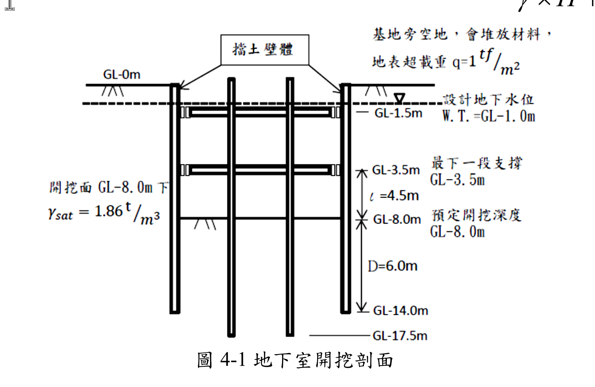
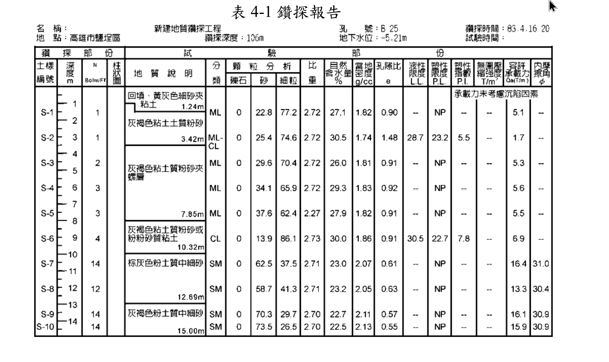
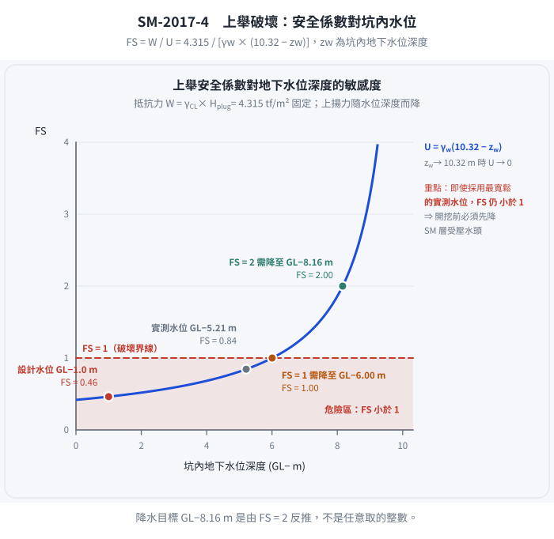
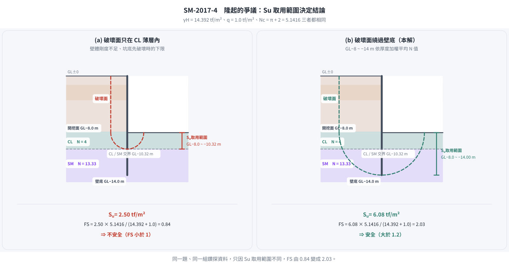

# 考題編號：SM-2017-4

**主分類：** `SM-U2-3` 開挖之穩定性分析
**副分類：** `SM-U1-2` 土壤滲透、`SM-U1-5` 土壤強度特性與變形性
**分析法：** 混合
**標籤：** `開挖穩定性` `管湧` `臨界水力坡降` `上舉破壞` `基盤隆起` `板樁` `不排水剪力強度` `安全係數`
---

## 1. 原始題目重述 (Problem Restatement)
某地下室開挖剖面如下圖所示，擋土壁使用打擊式 FSP IV 鋼版樁（長度 15.0 m，打至 GL-14.0 m），預定開挖深度為 GL-8.0 m。基地旁為空地並堆放材料，地表超載重 $q = 1 \text{ tf/m}^2$。地下水位設計在 GL-1.0 m。鑽探報告顯示表層為極軟弱之 ML/CL 土層（N=1~4），深層為 SM 砂土層（N=14）。已知 $\gamma_w = 1 \text{ tf/m}^3$。

本題要求分析以下四個問題：
1. 打樁時是否會振動、液化損鄰？說明打擊式鋼版樁與土壤 N 值特性與深度的關係。為避免損鄰，應做哪些應變措施？
2. 以擋土壁最高流線分析管湧安全係數。($FS = i_c/i$ , $i_c = \gamma_{sub}/\gamma_w$)
3. 分析上舉破壞（土湧）安全係數。若要求 FS=2，基坑內地下水位應降至 GL-？m。
4. 已知土壤短期不排水剪力強度 $S_u = \frac{10N}{16}$（砂土、粘土皆可用），分析隆起之安全係數。($FS = \frac{S_u \times (\pi + 2)}{\gamma \times H + q}$)

*圖說：開挖深度 GL-8.0m，擋土壁深至 GL-14.0m。設計地下水位 GL-1.0m。右側地表有超載 q=1 tf/m²。*

*圖說：GL-0~10.32m 主要為 ML 及 CL，N值介於 1~4，濕密度約 1.74~1.86 g/cc。GL-10.32m 以下為 SM，N值為 14，濕密度約 2.05~2.13 g/cc。*

## 2. 考題核心精神與出題者意圖 (Core Concepts & Examiner's Intent)
本題綜合測驗開挖工程常見的各項穩定性與施工問題：
1. **施工影響評估**：測驗對土層特性（極軟弱、無塑性 ML 及高敏感 CL）與打擊式工法交互作用的理解。
2. **管湧 (Piping)**：測驗滲流路徑長度計算與臨界水力坡降的觀念。
3. **上舉破壞 (Uplift/Heave)**：測驗透水層上覆位不透水層時，自重與上揚水壓力的抗衡。
4. **隆起 (Basal Heave)**：測驗總應力法下，以 N 值推算 $S_u$ 並應用於底部隆起承載力公式的計算。

出題者刻意給定一個分層明顯的地質（淺層軟弱黏土/粉土，深層中等堅硬砂土），要求考生能根據破壞模式正確選取對應深度區間的土壤參數（如平均單位重、平均 N 值等）。

## 3. 解題戰略地圖與陷阱分析 (Strategic Roadmap & Trap Analysis)
- **(一) 振動與液化評估**：直接觀察 N 值與土壤分類。0~8m 的 ML 層 N=1~3 且 NP（無塑性），極易發生極大超孔隙水壓及液化現象。需提出低振動的替代工法（如靜壓植樁）。
- **(二) 管湧分析**：
  - **陷阱**：「最高流線」指的是緊貼擋土壁的最短滲流路徑。流徑長度 $L = D_{out} + D_{in} = (14-1) + (14-8) = 19 \text{ m}$。
  - $i_c$ 需使用出水處（GL-8.0m 附近）之有效單位重。
- **(三) 上舉破壞**：
  - **陷阱**：需找出不透水層（CL）與透水層（SM）的交界。從鑽探表可知交界在 GL-10.32m。
  - 抵抗力為 GL-8.0m 至 GL-10.32m 之 CL 覆土重；驅動力為 GL-10.32m 處之受壓水頭。
- **(四) 隆起分析**：
  - 上覆壓力 $\gamma H$ 需精確計算 GL-0~8.0m 各層土壤自重之加總平均。
  - $S_u$ 需取擋土壁貫入深度（GL-8.0~14.0m）範圍內土層的加權平均 N 值來換算，因滑動面會經過此區域。

## 3.5 變數層次分析 (Variable Hierarchy Analysis)

### 最終目標
分別檢核打樁施工性、管湧安全係數、上舉破壞安全係數及所需降水深度、以及底部隆起安全係數。

### 本題關鍵公式（依計算順序）
- 管湧水力坡降：$i = \frac{\Delta H}{L}$
- 管湧安全係數：$FS = \frac{i_c}{\boxed{i}}$
- 上舉破壞抵抗力：$W = \Sigma (\gamma_t \times H_{plug})$
- 上舉破壞上揚力：$U = \gamma_w \times h_w$
- 隆起總覆土壓：$\sigma_v = \Sigma (\gamma_{t,i} \times h_i)$
- 隆起安全係數：$FS = \frac{\boxed{S_u} \times (\pi + 2)}{\boxed{\sigma_v} + q}$

### L1：題目直接給定
| 符號 | 數值 | 說明 |
|---|---|---|
| $H$ | 8.0 m | 預定開挖深度 |
| $D_{tip}$ | 14.0 m | 鋼版樁打設深度 |
| $q$ | 1.0 tf/m² | 地表超載重 |
| $\text{GL}_{WT}$ | -1.0 m | 設計地下水位 |

### L2：需知識點推導
**管湧分析**
| 符號 | 公式／來源 | 卡關? |
|---|---|---|
| $L$ | $L = (14.0 - 1.0) + (14.0 - 8.0)$ | |
| $\Delta H$ | $\Delta H = 8.0 - 1.0$ | |
| $i$ | $i = \Delta H / L$ | |
| $i_c$ | $i_c = (\gamma_{t} - \gamma_w) / \gamma_w$ (取底面土層) | |

**上舉破壞分析**
| 符號 | 公式／來源 | 卡關? |
|---|---|---|
| $H_{plug}$ | $H_{plug} = 10.32 - 8.0$ (CL層剩餘厚度) | |
| $W$ | $W = \gamma_{CL} \times H_{plug}$ | |
| $h_w$ | $h_w = 10.32 - 1.0$ (SM層頂部之水頭) | |
| $U$ | $U = \gamma_w \times h_w$ | |

**隆起分析**
| 符號 | 公式／來源 | 卡關? |
|---|---|---|
| $\gamma H$ | $\Sigma_{0}^{8.0} (\gamma_{t,i} \times h_i)$ | |
| $N_{avg}$ | 深度 8.0~14.0m 之 N 值加權平均 | |
| $S_u$ | $S_u = 10 \times N_{avg} / 16$ | |

### L3：深層知識（不懂就卡住）
| 知識點 | 說明 | 卡關? |
|---|---|---|
| 擋土壁最高流線 | 指緊貼擋土壁兩側的最短滲流路徑，決定了平均最大水力坡降。 | |
| 上舉破壞地層判定 | 必須從鑽探報告判別何處為不透水層（CL）與透水層（SM）的交界，以此作為受壓面。 | |
| 隆起區間平均參數 | 基礎隆起破壞面會向下延伸至版樁底部附近，故 $S_u$ 應取開挖面至樁底的加權平均。 | |

## 4. 步驟化詳細計算過程 (Step-by-Step Detailed Calculation)

### (一) 施工影響與應變措施
**1. 振動與液化損鄰評估：**
由鑽探報告（表 4-1）可知，GL-0m ~ GL-10.32m 地層主要為粉土（ML）及黏土（CL），且 N 值極低（N=1~4），含水量高（26~30.5%），屬於**極軟弱且具高敏感性之土壤**。
特別在深度 0~8m 的 ML 層，其塑性指數標示為 NP（無塑性），這類疏鬆且無塑性的粉土在打擊式鋼版樁的強烈動態振動下，**極易發生液化**或產生極大的超孔隙水壓，導致土壤承載力瞬間喪失；周邊軟弱黏土亦會因擠壓而產生側向變形及後續的壓密沉陷。
深度 GL-10.32m 以下雖為中等堅硬之 SM（N=14），但上部軟弱層的反應已足以造成嚴重的損鄰事件。
**結論：打擊式鋼版樁會產生嚴重振動，極可能導致液化與損鄰。**

**2. 應變措施：**
為避免損鄰，應採取以下措施：
- **工法變更**：將「打擊式」改為「靜壓植樁工法（Silent Piler）」，以無振動、無噪音方式壓入鋼版樁。若經費允許，可改用剛度更大、振動更小的地下連續壁或 SMW 工法。
- **輔助工法**：若堅持使用鋼版樁，應搭配「預鑽孔」或「水沖法」以降低打擊阻力與振動能量。
- **監測系統**：施工前落實鄰房現況鑑定，並密集配置沉陷觀測點、傾斜管、以及水壓計以嚴密監控施工影響。

---

### (二) 管湧安全係數

*圖 1　三個檢核用的是三個不同的面。攔的是「用同一個深度或同一組參數做完三題」：管湧沿壁面（$L = 13 + 6 = 19 \text{ m}$）、上舉在 CL/SM 交界（$\text{GL}-10.32 \text{ m}$，與開挖面差 $2.32 \text{ m}$）、隆起繞過壁底（$\text{GL}-8.0 \sim -14.0 \text{ m}$）；找錯面，三個安全係數就全錯。*

### (二) 管湧安全係數
依題意，使用「最高流線」（緊貼擋土壁之最短路徑）進行分析。
- 擋土壁外側水位：GL-1.0 m
- 開挖面水位：GL-8.0 m
- 擋土壁底端：GL-14.0 m

1. **計算滲流路徑長度 ($L$) 與水頭差 ($\Delta H$)**：
   外側下行路徑 $D_{out} = 14.0 - 1.0 = 13.0 \text{ m}$
   內側上行路徑 $D_{in} = 14.0 - 8.0 = 6.0 \text{ m}$
   總滲流路徑 $L = D_{out} + D_{in} = 13.0 + 6.0 = 19.0 \text{ m}$
   總水頭差 $\Delta H = 8.0 - 1.0 = 7.0 \text{ m}$
   平均水力坡降 $i = \frac{\Delta H}{L} = \frac{7.0}{19.0} = 0.3684$

2. **計算臨界水力坡降 ($i_c$)**：
   出水點（開挖面 GL-8.0m 附近）土壤為 CL（深度 7.85~10.32m），其 $\gamma_t = 1.86 \text{ tf/m}^3$。
   $\gamma_{sub} = \gamma_t - \gamma_w = 1.86 - 1.0 = 0.86 \text{ tf/m}^3$
   $i_c = \frac{\gamma_{sub}}{\gamma_w} = \frac{0.86}{1.0} = 0.86$

3. **計算安全係數 ($FS$)**：
   $$ FS = \frac{i_c}{i} = \frac{0.86}{0.3684} = 2.334 $$
   答：管湧安全係數為 $\boxed{2.33}$。

---

### (三) 上舉破壞（土湧）安全係數與降水設計
上舉破壞檢核面上方為不透水層，下方為受壓透水層。
查鑽探報告，GL-7.85~10.32m 為 CL（黏土，不透水），GL-10.32m 以下為 SM（砂土，透水）。因此上舉受壓面在 **GL-10.32 m** 處。

1. **分析上舉破壞安全係數**：
   - 抵抗力 (Downward weight $W$)：為開挖面 (GL-8.0m) 至受壓面 (GL-10.32m) 間之土重。
     $H_{plug} = 10.32 - 8.0 = 2.32 \text{ m}$
     $W = \gamma_{CL} \times H_{plug} = 1.86 \times 2.32 = 4.315 \text{ tf/m}^2$
   - 上揚力 (Uplift pressure $U$)：由 GL-1.0m 的設計地下水位連通至 SM 層產生。
     SM層頂部之水頭 $h_w = 10.32 - 1.0 = 9.32 \text{ m}$
     $U = \gamma_w \times h_w = 1.0 \times 9.32 = 9.32 \text{ tf/m}^2$
   - 安全係數 $FS$：
     $$ FS = \frac{W}{U} = \frac{4.315}{9.32} = 0.463 $$
     答：上舉破壞安全係數為 $\boxed{0.46}$（極不安全）。

2. **計算 FS=2 之降水深度**：
   - 目標 $FS = 2.0 = \frac{W}{U_{req}}$
   - 容許上揚力 $U_{req} = \frac{W}{2.0} = \frac{4.315}{2.0} = 2.1575 \text{ tf/m}^2$
   - 對應之受壓水頭 $h_{req} = \frac{U_{req}}{\gamma_w} = 2.1575 \text{ m}$
   - 水位高程應降至受壓面上方 $2.1575 \text{ m}$ 處：
     降水後地下水位深度 $= 10.32 - 2.1575 = 8.1625 \text{ m}$
     答：為防止發生上舉破壞，基坑內（抽水井）地下水位應降至 $\boxed{\text{GL}-8.16 \text{ m}}$。

*圖 2　降水高程是反推出來的，不是隨手取的整數。攔的是「用實測水位就沒事了」的僥倖：即使改用最寬鬆的 $\text{GL}-5.21 \text{ m}$，$FS$ 也只有 $0.84$，仍然小於 $1$；要達到 $FS = 2$ 必須降到 $\text{GL}-8.16 \text{ m}$——這正是題目把設計水位訂在 $\text{GL}-1.0 \text{ m}$ 的用意。*

---

### (四) 隆起之安全係數
公式：$FS = \frac{S_u \times (\pi + 2)}{\gamma \times H + q}$ （註：考卷原稿或文字辨識中之 $2\alpha$ 應為 $2)$ 括號之誤植，標準承載力係數 $N_c = \pi + 2 \approx 5.14$）

1. **計算開挖面以上總平均覆土壓力 ($\gamma H$)**：
   根據各深度之 $\gamma_t$ 累加計算 (GL-0~8.0m)：
   - 0.00~1.24m (ML): $1.24 \times 1.82 = 2.257$
   - 1.24~3.42m (ML-CL): $2.18 \times 1.74 = 3.793$
   - 3.42~7.85m (ML): 取平均 $\gamma_t = (1.81+1.83+1.82)/3 = 1.82$
     $4.43 \times 1.82 = 8.063$
   - 7.85~8.00m (CL): $0.15 \times 1.86 = 0.279$
   總上覆壓力 $\gamma H = 2.257 + 3.793 + 8.063 + 0.279 = 14.392 \text{ tf/m}^2$

2. **計算開挖面以下之平均不排水剪力強度 ($S_u$)**：
   破壞面涵蓋開挖面至擋土壁底端（GL-8.0~14.0m），依厚度計算加權平均 N 值。
   **N 值須逐個試驗值讀取，不可整層取同一個數**——鑽探報告在 10.32~14.00 m 之間有三個試驗值：
   S-7（$\approx$10.5 m）$N=14$、S-8（$\approx$12 m）$N=12$、S-9（$\approx$13.5 m）$N=14$，平均 $13.333$。
   - $8.00 \sim 10.32 \text{ m}$（CL，$2.32 \text{ m}$ 厚）：$N = 4$（S-6）
   - $10.32 \sim 14.00 \text{ m}$（SM，$3.68 \text{ m}$ 厚）：$N = (14+12+14)/3 = 13.333$

   $$N_{avg} = \frac{4 \times 2.32 + 13.333 \times 3.68}{6.0} = \frac{9.28 + 49.07}{6.0} = 9.724$$
   $$S_u = \frac{10 N_{avg}}{16} = \frac{10 \times 9.724}{16} = 6.078 \text{ tf/m}^2$$

3. **計算隆起安全係數 ($FS$)**：
   超載 $q = 1 \text{ tf/m}^2$
   $$ FS = \frac{S_u \times (\pi + 2)}{\gamma H + q} = \frac{6.078 \times (\pi + 2)}{14.392 + 1} $$
   $$ FS = \frac{6.078 \times 5.1416}{15.392} = \frac{31.251}{15.392} = 2.030 $$
   答：隆起之安全係數為 $\boxed{2.03}$。
   （若把 SM 層一律當 $N = 14$，$S_u = 6.333$、$FS = 2.12$；差 $4\%$，不影響「大於 1.2 尚屬安全」的結論。
   但 $S_u$ 的**取用範圍**才是真正會翻盤的爭議，見 §5。）

## 5. 關鍵爭議點與進階探討 (Critical Issues & Advanced Discussion)
- **隆起公式的 $2\alpha$ 問題**：部分考卷掃描或排版會將 $S_u \times (\pi + 2)$ 錯植為 $S_u \times (\pi + 2\alpha)$，此公式源自 Prandtl 的剛塑性承載力理論，其條形基礎極限承載力係數 $N_c = \pi + 2$。解題時直接將其視為 $N_c = 5.14$ 即可。
- **⚠ 隆起 $S_u$ 的取用範圍：兩種取法差 2.5 倍，結論完全相反（本題最大的爭議點）**

  | 取法 | $S_u$ (tf/m²) | $FS$ | 結論 |
  |---|---|---|---|
  | 只取開挖面**正下方**的 CL（$N=4$，厚 $2.32$ m） | $2.50$ | $\mathbf{0.84}$ | **不安全** |
  | 開挖面至壁底（$8 \sim 14$ m）加權平均（本解） | $6.08$ | $\mathbf{2.03}$ | 安全 |

  兩者的差別在於**破壞面到底穿不穿過下方的 SM 層**。本解採後者，理由有二：
  ① 題目特別註明「本案砂土、粘土皆可用」這個 $S_u$ 相關式——若不打算把砂土納入平均，這句話沒有作用；
  ② 擋土壁貫入到 GL-14.0 m，隆起破壞面必須繞過壁底，勢必穿過 SM 層。
  但**軟弱的 CL 只有 $2.32$ m 厚**，若破壞面被局限在這一薄層內（例如壁體剛度不足、
  破壞先在坑底發生），$FS$ 就只剩 $0.84$。作答時應把兩個數字都列出來並說明取用理由，
  這比直接寫一個 $2.03$ 有價值得多。

*圖 3　同一組鑽探資料、兩個相反的結論。攔的是「只寫一個 $FS$ 就交卷」：分母完全相同，差別只在 $S_u$ 的取用範圍——破壞面若被局限在 $2.32 \text{ m}$ 厚的 CL 內，$FS$ 只剩 $0.84$。作答時應把兩個數字都列出並說明取用理由。*

- **⚠ 設計水位 GL-1.0 m 與鑽探實測水位 GL-5.21 m 的落差**：
  鑽探報告表頭載明「地下水位：$-5.21$ m」，但題目要求以**設計水位 GL-1.0 m** 分析——
  這是保守設計（考慮豐水期、鄰地補注、施工降水失效）的標準做法。若改以實測水位計算：

  | 項目 | 設計水位 GL-1.0 m | 實測水位 GL-5.21 m |
  |---|---|---|
  | 管湧 $\Delta H$ / $L$ / $i$ | $7.0$ / $19.0$ / $0.3684$ | $2.79$ / $14.79$ / $0.1886$ |
  | 管湧 $FS = i_c/i$ | $2.33$ | $4.56$ |
  | 上舉 $U$ (tf/m²) | $9.32$ | $5.11$ |
  | 上舉 $FS = W/U$ | $\mathbf{0.46}$ | $\mathbf{0.84}$ |

  值得注意的是：**即使用最寬鬆的實測水位，上舉安全係數仍然小於 1**。
  也就是說「開挖到 GL-8.0 m 前必須先降 SM 層的受壓水頭」這個結論，
  不因水位假設而改變——這正是本題把設計水位訂在 GL-1.0 m 的用意。

- **混合地層的隆起檢核**：傳統隆起（Basal Heave）多針對純軟弱黏土層。但本題特意聲明「砂土、粘土皆可用此 $S_u$ 轉換公式」，代表出題者希望考生突破單一土層的思維，計算破壞影響區（開挖底面至樁底）內的等效加權平均剪力強度來進行檢核。
- **上舉破壞的水位設定**：本題計算指出 $FS=0.46$ 極其危險。實務上，開挖至此深度前，必定需先在坑內施打「深井（Deep Well）」抽排 SM 層的受壓地下水，確保坑底 CL 層不被沖毀。這也是第(三)子題要求算出「降水高程」的實務意義。

---

*解析日期：見 `wiki/log.md`　｜　圖解補繪：2026-08-29（向量 SVG，程式繪製，腳本 `gen_SM-2017-4.py` 可重跑；同名 2× PNG 供簡報／影片管線使用）*
