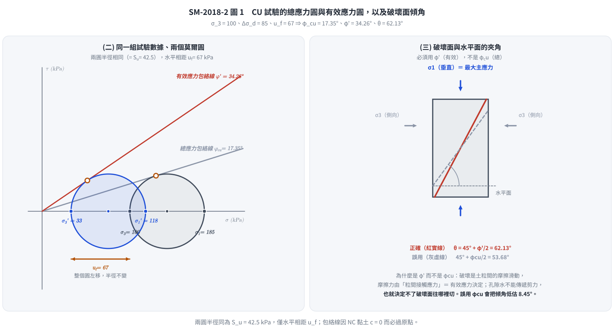
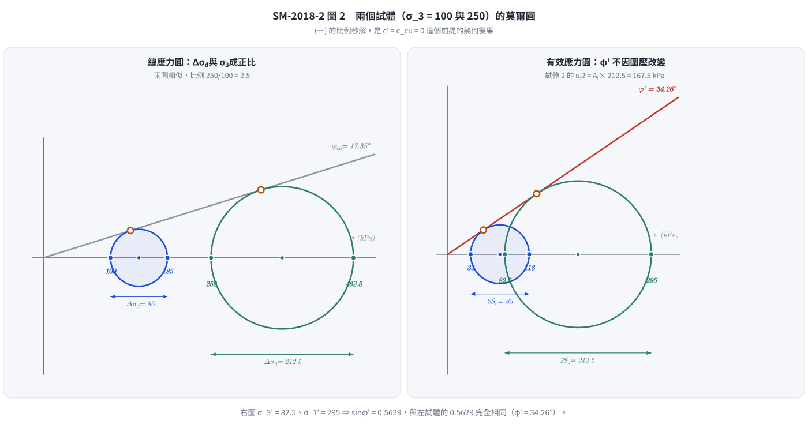

# 考題編號：SM-2018-2

**主分類：** `SM-U1-5` 土壤強度特性與變形性
**副分類：** 無
**分析法：** 有效應力法
**標籤：** `CU試驗` `三軸試驗` `正常壓密` `有效應力內摩擦角` `Mohr-Coulomb破壞準則` `孔隙水壓參數Af` `破壞面傾角`

---

## 1. 原始題目重述 (Problem Restatement)
某正常壓密之飽和黏土試體進行壓密不排水（CU）三軸壓縮試驗，施加之圍壓為 100 kPa，在施加軸差應力為 85 kPa 時，試體發生破壞，此時試體之孔隙水壓為 67 kPa。在相同土層取得的第二個黏土試體，也進行壓密不排水三軸試驗，施加之圍壓為 250 kPa，試求：
(一) 第二個試體破壞時之軸差應力。（5 分）
(二) 此黏土之總應力內摩擦角（$\phi_{cu}$）及有效應力內摩擦角。（10 分）
(三) 試體破壞面與水平面的夾角。（5 分）
(四) 黏土破壞時之水壓參數（$A_f$）。（5 分）

## 2. 考題核心精神與出題者意圖 (Core Concepts & Examiner's Intent)
- **正常壓密黏土特性：** 測驗考生是否知道正常壓密黏土（NC Clay）的有效凝聚力 $c'=0$ 及總應力凝聚力 $c_{cu}=0$。
- **總應力與有效應力分析：** 測驗從 CU 試驗結果中，分別利用總應力與有效應力繪製莫爾圓，求取 $\phi_{cu}$ 及 $\phi'$ 的能力。
- **NC 黏土的比例性質：** 測驗考生是否了解對於 NC 黏土，破壞時的軸差應力與圍壓成正比。
- **破壞面角度：** 測驗破壞面角度是由「有效」應力內摩擦角 $\phi'$ 決定的基本力學觀念（$\theta = 45^\circ + \phi'/2$），而非總應力內摩擦角。
- **Skempton 孔隙水壓參數：** 測驗 $A_f$ 參數的定義及計算，飽和黏土 $B=1$，在軸差應力階段 $\Delta u = A_f \Delta\sigma_d$。

## 3. 解題戰略地圖與陷阱分析 (Strategic Roadmap & Trap Analysis)
- **戰略地圖：**
  1. 首先判斷 NC 黏土條件，得知 $c' = 0$、$c_{cu} = 0$。
  2. 計算第一試體的總主應力與有效主應力。
  3. 利用 $\sin\phi = \frac{\sigma_1 - \sigma_3}{\sigma_1 + \sigma_3}$ 分別求出 $\phi_{cu}$ 與 $\phi'$（解答第二小題）。
  4. 利用第一試體的應力比例關係（或 $\phi_{cu}$ 公式），計算第二試體破壞時的軸差應力（解答第一小題）。
  5. 根據有效應力內摩擦角求破壞面夾角（解答第三小題）。
  6. 利用 $\Delta u = A_f \Delta\sigma_d$ 求解 $A_f$（解答第四小題）。
- **陷阱分析：**
  - **陷阱 1：破壞面夾角誤用 $\phi_{cu}$：** 破壞是由土體骨架間的摩擦決定，故必須使用有效應力內摩擦角 $\phi'$ 來計算 $45^\circ + \phi'/2$。
  - **陷阱 2：公式中忘記 NC 黏土凝聚力為零：** 若未設定 $c'=0$ 則無法從單一試驗求得內摩擦角。
  - **陷阱 3：孔隙水壓參數 $A_f$ 定義：** 需要知道在飽和狀況下 $B=1$，而在常規三軸試驗的剪切階段圍壓不變，所以 $\Delta u = A_f \Delta\sigma_d$。

## 3.5 變數層次分析 (Variable Hierarchy Analysis)

### 最終目標
求出第二個試體的破壞軸差應力，及該黏土的內摩擦角、破壞面夾角與孔隙水壓參數。

### 本題關鍵公式（依計算順序）
- 總應力內摩擦角：$\sin \phi_{cu} = \frac{\Delta\sigma_d}{\sigma_1 + \sigma_3}$
- 有效主應力：$\sigma_3' = \sigma_3 - u_f$ 及 $\sigma_1' = \sigma_1 - u_f$
- 有效應力內摩擦角：$\sin \phi' = \frac{\sigma_1' - \sigma_3'}{\sigma_1' + \sigma_3'}$
- 第二試體軸差應力：$\frac{(\Delta\sigma_d)_2}{(\sigma_3)_2} = \frac{(\Delta\sigma_d)_1}{(\sigma_3)_1}$
- 破壞面夾角：$\theta = 45^\circ + \frac{\boxed{\phi'}}{2}$
- Skempton 孔隙水壓參數：$A_f = \frac{\Delta u}{\Delta\sigma_d}$

### L1：題目直接給定
| 符號 | 數值 | 說明 |
|---|---|---|
| $(\sigma_3)_1$ | 100 kPa | 第一試體圍壓 |
| $(\Delta\sigma_d)_1$ | 85 kPa | 第一試體破壞軸差應力 |
| $u_f$ | 67 kPa | 第一試體破壞時孔隙水壓 |
| $(\sigma_3)_2$ | 250 kPa | 第二試體圍壓 |

### L2：需知識點推導
**應力與強度參數**
| 符號 | 公式／來源 | 卡關? |
|---|---|---|
| $(\sigma_1)_1$ | $(\sigma_1)_1 = (\sigma_3)_1 + (\Delta\sigma_d)_1$ |  |
| $(\sigma_3')_1$ | $(\sigma_3)_1 - u_f$ |  |
| $(\sigma_1')_1$ | $(\sigma_1)_1 - u_f$ |  |
| $\phi_{cu}$ | $\sin \phi_{cu} = \frac{(\sigma_1)_1 - (\sigma_3)_1}{(\sigma_1)_1 + (\sigma_3)_1}$ |  |
| $\phi'$ | $\sin \phi' = \frac{(\sigma_1')_1 - (\sigma_3')_1}{(\sigma_1')_1 + (\sigma_3')_1}$ |  |
| $(\Delta\sigma_d)_2$ | $(\sigma_3)_2 \times \frac{(\Delta\sigma_d)_1}{(\sigma_3)_1}$ |  |
| $\theta$ | $45^\circ + \frac{\phi'}{2}$ |  |
| $A_f$ | $\frac{u_f}{(\Delta\sigma_d)_1}$ |  |

### L3：深層知識（不懂就卡住）
| 知識點 | 說明 | 卡關? |
|---|---|---|
| NC 黏土特性 | 正常壓密黏土其 $c' = 0$ 且 $c_{cu} = 0$，故莫爾破壞包絡線過原點。 |  |
| 破壞面夾角控制條件 | 土壤的剪力破壞行為受有效應力控制，故理論破壞面夾角必須帶入 $\phi'$ 計算。 |  |
| 飽和黏土的 Skempton 參數 | 飽和黏土 $B=1$，三軸試驗剪切階段 $\Delta\sigma_3=0$，故誘發水壓 $\Delta u = A_f \Delta\sigma_d$。 |  |

## 4. 步驟化詳細計算過程 (Step-by-Step Detailed Calculation)

### (二) 總應力內摩擦角及有效應力內摩擦角
> 策略註解：正常壓密黏土 $c' = 0, c_{cu} = 0$，莫爾圓切線過原點。先算這題較順。
對於試體 1：
圍壓 $\sigma_3 = 100 \text{ kPa}$
破壞時軸差應力 $\Delta\sigma_d = 85 \text{ kPa}$
總大主應力 $\sigma_1 = \sigma_3 + \Delta\sigma_d = 100 + 85 = 185 \text{ kPa}$

總應力內摩擦角 $\phi_{cu}$：
$$ \sin \phi_{cu} = \frac{\sigma_1 - \sigma_3}{\sigma_1 + \sigma_3} = \frac{185 - 100}{185 + 100} = \frac{85}{285} \approx 0.2982 $$
$$ \phi_{cu} = \arcsin(0.2982) = \boxed{17.35^\circ} $$

破壞時孔隙水壓 $u_f = 67 \text{ kPa}$
有效小主應力 $\sigma_3' = \sigma_3 - u_f = 100 - 67 = 33 \text{ kPa}$
有效大主應力 $\sigma_1' = \sigma_1 - u_f = 185 - 67 = 118 \text{ kPa}$

有效應力內摩擦角 $\phi'$：
$$ \sin \phi' = \frac{\sigma_1' - \sigma_3'}{\sigma_1' + \sigma_3'} = \frac{118 - 33}{118 + 33} = \frac{85}{151} \approx 0.5629 $$
$$ \phi' = \arcsin(0.5629) = \boxed{34.26^\circ} $$

*圖 1　CU 試驗的兩個莫爾圓是同一個圓左右平移 $u_f$ 的結果——半徑（$= S_u$）完全相同，只有位置不同，所以才會生出兩個差很多的摩擦角。這張圖攔的是第 (三) 小題最常見的錯誤：拿總應力包絡線的 $\phi_{cu}$ 去算破壞面傾角，會把 $62.13^\circ$ 低估成 $53.68^\circ$。*

### (一) 第二個試體破壞時之軸差應力
> 策略註解：對於相同土層的 NC 黏土，破壞時的軸差應力與圍壓成正比。
方法一：利用比例關係
$$ \frac{(\Delta\sigma_d)_2}{(\sigma_3)_2} = \frac{(\Delta\sigma_d)_1}{(\sigma_3)_1} $$
$$ (\Delta\sigma_d)_2 = 250 \times \frac{85}{100} = \boxed{212.5 \text{ kPa}} $$

（驗證）方法二：利用總應力強度參數
$$ (\sigma_1)_2 = (\sigma_3)_2 \tan^2\left(45^\circ + \frac{\phi_{cu}}{2}\right) = 250 \times \tan^2(45^\circ + \frac{17.35^\circ}{2}) \approx 250 \times 1.850 = 462.5 \text{ kPa} $$
$$ (\Delta\sigma_d)_2 = 462.5 - 250 = \boxed{212.5 \text{ kPa}} $$

*圖 2　比例秒解不是背來的口訣，而是 $c' = c_{cu} = 0$ 時「包絡線過原點 ⇒ 兩個破壞圓幾何相似」的必然結果。這張圖攔的是把比例關係亂用到有凝聚力的土壤上（對照 [[SM-2024-1]] 圖 2）；右圖同時驗證了第二試體算出的 $\sin\phi' = 212.5/377.5 = 0.5629$ 與第一試體一模一樣。*

### (三) 試體破壞面與水平面的夾角
> 策略註解：破壞機制受有效應力控制，故需用有效應力內摩擦角 $\phi'$ 來決定破壞面與大主應力面（水平面）之夾角。
$$ \theta = 45^\circ + \frac{\phi'}{2} = 45^\circ + \frac{34.26^\circ}{2} = \boxed{62.13^\circ} $$

### (四) 黏土破壞時之水壓參數 $A_f$
> 策略註解：CU試驗在施加軸差應力階段，圍壓不變（$\Delta\sigma_3 = 0$）。對飽和黏土 $B=1$。
根據 Skempton 孔隙水壓方程式：
$$ \Delta u = B[\Delta\sigma_3 + A_f(\Delta\sigma_1 - \Delta\sigma_3)] $$
$$ u_f = 1 \times [0 + A_f(\Delta\sigma_d)] $$
$$ A_f = \frac{u_f}{\Delta\sigma_d} = \frac{67}{85} \approx \boxed{0.788} $$

## 5. 關鍵爭議點與進階探討 (Critical Issues & Advanced Discussion)
- **破壞面角度使用的摩擦角：** 在 CU 試驗中，雖然我們可以畫出總應力的莫爾圓與包絡線並求得 $\phi_{cu}$，但真實土體的破壞面是由有效應力所主導。因此計算破壞面角度 $\theta$ 時，務必使用有效內摩擦角 $\phi'$，這是一個常見的考試陷阱，很多考生會誤用 $\phi_{cu}$。
- **不必畫圖的閉合檢核（$\phi'$ 與 $A_f$ 必須互相自洽）：** 把 $u_f = A_f \Delta\sigma_d$ 代入有效應力破壞準則 $\sigma_1' = \sigma_3' K_p'$，可解出
  $$\Delta\sigma_d = \frac{\sigma_3 (K_p' - 1)}{1 - A_f + A_f K_p'}, \qquad K_p' = \frac{1 + \sin\phi'}{1 - \sin\phi'} = 3.5758$$
  代入 $\sigma_3 = 100$、$A_f = 0.7882$：$\Delta\sigma_d = \frac{100 \times 2.5758}{1 - 0.7882 + 0.7882 \times 3.5758} = \frac{257.58}{3.030} = 85.0 \text{ kPa}$，與題目給的 85 kPa 完全吻合。這條式子把 (二) 與 (四) 兩個小題綁在一起——只要 $\phi'$ 或 $A_f$ 有一個算錯，這裡就對不上。
- **第二試體的完整破壞狀態（順手驗證比例關係）：** 若第二試體的 $A_f$ 相同，則 $u_{f2} = 0.7882 \times 212.5 = 167.5 \text{ kPa}$，
  $(\sigma_3')_2 = 250 - 167.5 = 82.5$、$(\sigma_1')_2 = 462.5 - 167.5 = 295 \text{ kPa}$，
  $\sin\phi' = \frac{295 - 82.5}{295 + 82.5} = \frac{212.5}{377.5} = 0.5629$ —— 與第一試體算出的 $\phi' = 34.26^\circ$ **一模一樣**。這證明「軸差應力與圍壓成正比」不是背來的口訣，而是 $c' = 0$ 時整組應力（含孔隙水壓與有效應力）等比例放大的必然結果。
- **$\phi' = 34.26^\circ$ 偏高是題目數據的必然結果：** 正常壓密黏土的 $\phi'$ 常見範圍約 $20^\circ \sim 30^\circ$，本題算出 $34.26^\circ$ 偏高，成因是 $u_f = 67 \text{ kPa}$ 佔了圍壓的 67%（$A_f = 0.79$ 屬 NC 黏土正常值，但配上僅 85 kPa 的軸差應力，把有效小主應力壓到只剩 33 kPa）。這是命題給定值的結果，**不需要也不應該**把它「修正」成 30 度；作答時照算即可，若行有餘力可加註一句說明。
- **正常壓密黏土的幾何比例：** NC 黏土的 $c'=0$、$c_{cu}=0$，這使得不論是有效應力莫爾圓還是總應力莫爾圓，其包絡線都通過原點。此特性的延伸即為「對同一 NC 黏土，破壞時的剪應力、軸差應力與水壓均會與施加的圍壓成正比例」。掌握這個觀念，可以秒解第一小題，不必重新代入三角函數。

---

*解析日期：見 `wiki/log.md`　｜　圖解補繪：2026-08-28（向量 SVG，程式繪製，腳本 `gen_SM-2018-2.py` 可重跑；同名 2× PNG 供簡報／影片管線使用）*
