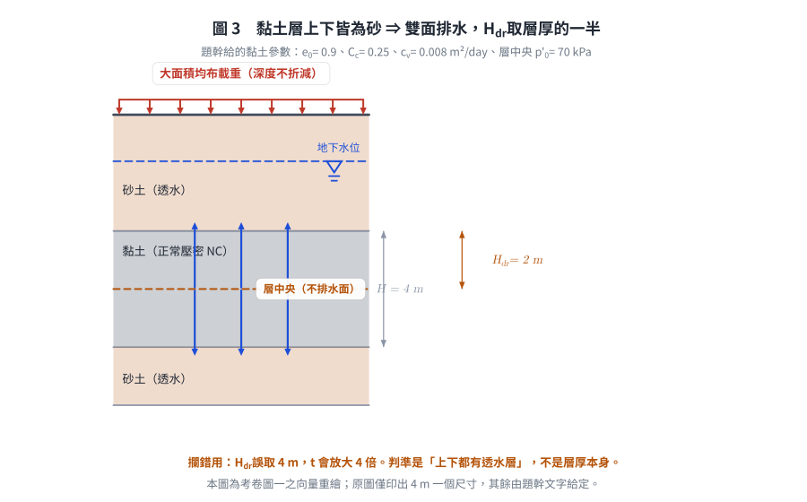
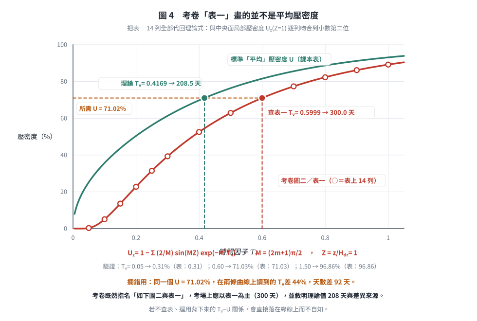
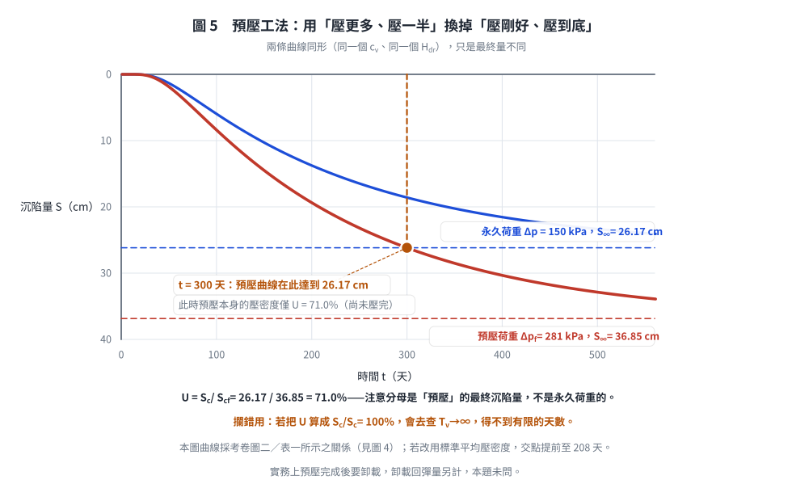

# 考題編號：SM-2019-2

**主分類：** `SM-U1-3` 土壤夯實及壓密
**副分類：** `SM-U2-5` 地層改良方法
**分析法：** 有效應力法
**標籤：** `Terzaghi壓密理論` `壓密沉陷` `壓縮指數Cc` `壓密係數Cv` `時間因數Tv` `預壓法` `正常壓密`
---

## 1. 原始題目重述 (Problem Restatement)
某大型營建工程擬建築於如下圖一的地層之地表上，該地層含 4 m 厚的軟弱正常壓密黏土（normally consolidated clay），黏土層上、下皆為排水砂層。此營建工程完工後，構造物預期作用於黏土層的平均永久荷重增加 150 kPa。施工前黏土層中間的平均有效覆土壓力為 70 kPa，且初始孔隙比 0.9，壓縮指數（compression index, $C_c$）0.25，壓密係數（coefficient of consolidation, $c_v$）0.008 m²/day。時間因子 $T_v$ 與平均壓密度 $U$ 之關係如下圖二與表一。

(一) 試求此黏土層在此永久荷重下的主要壓密沉陷量。（10 分）
(二) 若採用預壓工法（precompression）加速壓密沉陷，擬於地表加載均布荷重 281 kPa，需幾天可達到與(一)相同的主要壓密沉陷量？（10 分）

*圖說（圖一，地層剖面）：*
*・**地表**：繪五支等距向下箭頭，代表大面積**均布載重**（故各深度之 $\Delta\sigma$ 不折減）。*
*・**地下水位**：以水平虛線加水位符號繪於地表下方、位於上層砂土之中。*
*・**地層**：由上而下為「砂土」→「黏土」（尺寸線標註 **4 m**，為圖上唯一印出的尺寸）→「砂土」。黏土層**上、下皆為砂土**，故屬雙面排水，$H_{dr} = 4/2 = 2$ m。*
*・黏土層參數（由題幹文字給定，圖上未標）：$e_0 = 0.9$、$C_c = 0.25$、$c_v = 0.008 \text{ m}^2/\text{day}$，施工前層中央有效覆土壓力 $p_0' = 70$ kPa。*

*圖說（圖二，$U$–$T_v$ 查圖）：考卷提供的標準一維壓密平均壓密度關係曲線，用於由 $T_v$ 查 $U$ 或反查。*
*・**橫軸**：時間因子 $T_v$，置於圖頂，**對數刻度**，標註刻度為 0.1、0.3、0.5、1.0（實測刻度間距符合 $\log_{10}$ 等比，非線性刻度）。*
*・**縱軸**：平均壓密度 $U$（%），**自頂端 0% 向下遞增至底端 100%**（壓密工程慣用之倒置座標），主格線每 10% 一條。*
*・**曲線形狀**：自左上向右下單調遞降並在右下趨平，即 $U$ 隨 $T_v$ 增大而增大、且愈接近 100% 愈慢。*
*・**數值基準**：本圖與同頁「表一」一致（表一全文見下），例如 $T_v = 0.30 \Rightarrow U \approx 39\%$、$T_v = 0.50 \Rightarrow U \approx 63\%$、$T_v = 1.00 \Rightarrow U \approx 89\%$，與表值逐點吻合。*
*・**⚠️ 本圖與表一標示為「平均壓密度」，但實際上並不是。** 把表一 14 列全部代回理論式檢核，與**中央面局部壓密度** $U_z(Z=1)$ 逐列吻合到小數第二位，而與平均壓密度 $U$ 完全不合（例：$T_v = 0.05$ 時平均壓密度理論值為 25.2%，表上是 0.31%）。詳見 §5 之爭議點討論與下方圖 4。*

*・**題幹「表一」全文**（逐列轉錄自考卷第 3-2 頁）：*

| $T_v$ | 0.05 | 0.10 | 0.15 | 0.20 | 0.25 | 0.30 | 0.40 |
|:---|:---:|:---:|:---:|:---:|:---:|:---:|:---:|
| $U$ (%) | 0.31 | 5.07 | 13.58 | 22.77 | 31.46 | 39.32 | **52.55** |

| $T_v$ | 0.50 | 0.60 | 0.70 | 0.80 | 0.90 | 1.00 | 1.50 |
|:---|:---:|:---:|:---:|:---:|:---:|:---:|:---:|
| $U$ (%) | **62.92** | **71.03** | 77.36 | 82.31 | 86.18 | 89.2 | 96.86 |

## 2. 考題核心精神與出題者意圖 (Core Concepts & Examiner's Intent)
本題測驗兩個核心觀念：
1. **正常壓密黏土之主要壓密沉陷量計算**：測驗考生是否熟練使用 $S_c = \frac{C_c H}{1+e_0} \log \frac{p_0' + \Delta p}{p_0'}$ 求解沉陷量。
2. **預壓工法（Precompression）的壓密度與時間計算**：測驗考生是否理解預壓工法的原理，即利用較大的預載重（$\Delta p_f > \Delta p$）產生較大的最終沉陷量（$S_{cf} > S_c$），使得在較短時間內（壓密度 $U < 100\%$）即可達到永久荷重所對應的最終沉陷量。並配合查表或公式計算對應的時間因子 $T_v$ 與時間 $t$。

## 3. 解題戰略地圖與陷阱分析 (Strategic Roadmap & Trap Analysis)
- **第一步：計算永久荷重下的最終壓密沉陷量**
  代入正常壓密黏土沉陷量公式，求出 $S_c$。
- **第二步：計算預壓荷重下的最終壓密沉陷量**
  同第一步公式，將荷重增量改為預壓荷重 281 kPa，求出預壓最終沉陷量 $S_{cf}$。
- **第三步：計算所需壓密度 $U$**
  令預壓過程中的沉陷量達到永久荷重最終沉陷量，即 $U = \frac{S_c}{S_{cf}} \times 100\%$。
- **第四步：推算時間 $t$**
  利用表一內插求出對應之 $T_v$，再由雙面排水條件 $H_{dr} = H/2$，代入 $t = \frac{T_v H_{dr}^2}{c_v}$ 解得天數。

**陷阱分析：**
1. **排水路徑長度（$H_{dr}$）**：黏土層上下皆為砂層，代表「雙面排水」，$H_{dr}$ 必須取為層厚的一半（$4 \text{ m} / 2 = 2 \text{ m}$），若直接代 $4 \text{ m}$ 會導致時間計算錯誤放大四倍。
2. **預壓荷重增量之深度折減**：題目敘述「地表加載均布荷重」，對於大面積均布載重，黏土層深度處的應力增量不折減，即等於地表載重，故 $\Delta p_f = 281 \text{ kPa}$。

*圖 3　考卷圖一之向量重繪。它攔的是排水路徑取錯：判準是「上下都有透水層」，不是層厚本身；$H_{dr}$ 誤取 4 m 會讓時間放大 4 倍。原圖僅印出 4 m 一個尺寸，其餘參數由題幹文字給定。*

## 3.5 變數層次分析 (Variable Hierarchy Analysis)

### 最終目標
`求出正常壓密黏土在永久荷重下的主要壓密沉陷量，以及施加預壓荷重達到該沉陷量所需的天數。`

### 本題關鍵公式（依計算順序）
1. 永久荷重下之主要壓密沉陷量：
   $$ S_c = \frac{C_c H}{1 + e_0} \log_{10} \frac{p_0' + \Delta p}{p_0'} $$
2. 預壓荷重下之最終壓密沉陷量：
   $$ S_{cf} = \frac{C_c H}{1 + e_0} \log_{10} \frac{p_0' + \Delta p_f}{p_0'} $$
3. 目標壓密度：
   $$ U = \frac{\boxed{S_c}}{\boxed{S_{cf}}} \times 100\% $$
4. 預壓所需時間：
   $$ t = \frac{T_v \cdot H_{dr}^2}{c_v} $$

### L1：題目直接給定
| 符號 | 數值 | 說明 |
| --- | --- | --- |
| $H$ | 4 m | 黏土層厚度 |
| $p_0'$ | 70 kPa | 施工前黏土層中間之有效覆土壓力 |
| $\Delta p$ | 150 kPa | 構造物永久荷重增加量 |
| $\Delta p_f$ | 281 kPa | 預壓均布荷重增加量 |
| $e_0$ | 0.9 | 初始孔隙比 |
| $C_c$ | 0.25 | 壓縮指數 |
| $c_v$ | 0.008 m²/day | 壓密係數 |

### L2：需知識點推導
**沉陷量計算**
| 符號 | 公式／來源 | 卡關? |
| --- | --- | --- |
| $S_c$ | $S_c = \frac{C_c H}{1 + e_0} \log_{10} \frac{p_0' + \Delta p}{p_0'}$ | |
| $S_{cf}$ | $S_{cf} = \frac{C_c H}{1 + e_0} \log_{10} \frac{p_0' + \Delta p_f}{p_0'}$ | |

**時間與壓密度計算**
| 符號 | 公式／來源 | 卡關? |
| --- | --- | --- |
| $H_{dr}$ | $H_{dr} = H / 2$ (雙面排水) | |
| $U$ | $U = \frac{S_c}{S_{cf}} \times 100\%$ | |
| $T_v$ | **內插考卷表一**（本題採用）；理論近似式 $T_v = 1.781 - 0.933\log_{10}(100-U)$ 給出不同值，兩者差異見 §5 | |
| $t$ | $t = \frac{T_v H_{dr}^2}{c_v}$ | |

### L3：深層知識（不懂就卡住）
| 知識點 | 說明 | 卡關? |
| --- | --- | --- |
| 預壓工法原理 | 藉由施加較大的預壓荷重（$\Delta p_f > \Delta p$），使土壤提早達到永久荷重下之預期最終沉陷量 $S_c$，即要求預壓沉陷量 $S(t) = S_c$。 | |
| 雙面排水路徑長度 | 當黏土層上下皆為高透水性地層（如砂層）時，超額孔隙水壓可向上與向下消散，最大排水路徑為層厚之一半（$H_{dr} = H/2$）。 | |

## 4. 步驟化詳細計算過程 (Step-by-Step Detailed Calculation)

### (一) 此黏土層在永久荷重下的主要壓密沉陷量
依題意，黏土為正常壓密（Normally Consolidated, NC），已知條件如下：
- $H = 4 \text{ m}$
- $e_0 = 0.9$
- $C_c = 0.25$
- $p_0' = 70 \text{ kPa}$
- $\Delta p = 150 \text{ kPa}$

代入正常壓密黏土之單向壓密沉陷量公式：
$$ S_c = \frac{C_c H}{1 + e_0} \log_{10} \left( \frac{p_0' + \Delta p}{p_0'} \right) $$
$$ S_c = \frac{0.25 \times 4}{1 + 0.9} \log_{10} \left( \frac{70 + 150}{70} \right) $$
$$ S_c = \frac{1.0}{1.9} \log_{10} \left( \frac{220}{70} \right) = 0.5263 \times \log_{10}(3.1429) $$
$$ S_c \approx 0.5263 \times 0.4973 = 0.2617 \text{ m} = 26.17 \text{ cm} $$

$\boxed{S_c = 26.17 \text{ cm}}$

### (二) 達到相同主要壓密沉陷量所需之預壓天數
**1. 計算預壓荷重下的最終壓密沉陷量 ($S_{cf}$)**
地表加載均布荷重 281 kPa，故預壓應力增量 $\Delta p_f = 281 \text{ kPa}$。
預壓荷重下之最終主要沉陷量為：
$$ S_{cf} = \frac{C_c H}{1 + e_0} \log_{10} \left( \frac{p_0' + \Delta p_f}{p_0'} \right) $$
$$ S_{cf} = \frac{0.25 \times 4}{1.9} \log_{10} \left( \frac{70 + 281}{70} \right) $$
$$ S_{cf} = \frac{1.0}{1.9} \log_{10} \left( \frac{351}{70} \right) = 0.5263 \times \log_{10}(5.0143) $$
$$ S_{cf} \approx 0.5263 \times 0.7002 = 0.3685 \text{ m} = 36.85 \text{ cm} $$

**2. 計算目標壓密度 ($U$)**
欲使預壓期間達到的沉陷量等於 (一) 的永久荷重沉陷量：
$$ U = \frac{S(t)}{S_{cf}} \times 100\% = \frac{S_c}{S_{cf}} \times 100\% $$
$$ U = \frac{0.2617}{0.3685} \times 100\% = 71.02\% $$

**3. 求對應之時間因子 ($T_v$)**
題幹明示「時間因子 $T_v$ 與平均壓密度 $U$ 之關係如下圖二與表一」，故**以考卷所附表一為準**。表一全文如下：

| $T_v$ | 0.05 | 0.10 | 0.15 | 0.20 | 0.25 | 0.30 | 0.40 |
|:---|:---:|:---:|:---:|:---:|:---:|:---:|:---:|
| $U$ (%) | 0.31 | 5.07 | 13.58 | 22.77 | 31.46 | 39.32 | **52.55** |

| $T_v$ | 0.50 | 0.60 | 0.70 | 0.80 | 0.90 | 1.00 | 1.50 |
|:---|:---:|:---:|:---:|:---:|:---:|:---:|:---:|
| $U$ (%) | **62.92** | **71.03** | 77.36 | 82.31 | 86.18 | 89.2 | 96.86 |

$U = 71.02\%$ 落在 $T_v = 0.50$（62.92%）與 $T_v = 0.60$（71.03%）兩列之間，線性內插：
$$ T_v = 0.50 + (0.60 - 0.50) \times \frac{71.02 - 62.92}{71.03 - 62.92} $$
$$ T_v = 0.50 + 0.10 \times \frac{8.10}{8.11} = 0.50 + 0.0999 = 0.5999 \approx 0.600 $$

*(所需壓密度幾乎正好落在表一 $T_v = 0.60$ 那一列上，內插量極小。)*

**4. 計算所需預壓時間 ($t$)**
由題意知黏土層上下皆為排水砂層，故為「雙面排水」條件。
最大排水路徑 $H_{dr} = \frac{H}{2} = \frac{4}{2} = 2 \text{ m}$。
壓密係數 $c_v = 0.008 \text{ m}^2/\text{day}$。

$$ t = \frac{T_v \cdot H_{dr}^2}{c_v} = \frac{0.600 \times (2)^2}{0.008} = \frac{2.400}{0.008} = 300.0 \text{ days} $$

$\boxed{t \approx 300 \text{ 天}}$

**5. 對照：若不查表、改用標準平均壓密度理論式**
$$ T_v = 1.781 - 0.933\log_{10}(100 - 71.02) = 0.4169
\quad\Rightarrow\quad t = \frac{0.4169 \times 4}{0.008} = 208.5 \text{ days} $$

兩者相差 **92 天**（44%）。**這不是內插誤差，而是兩條不同的曲線**——考卷表一畫的並不是平均壓密度。
詳見 §5 之第一項爭議點，以及下方圖 4。作答時兩個數字都應寫出並敘明理由。

*圖 4　考卷「表一」畫的並不是平均壓密度。表上 14 列全部落在 $U_z(Z=1)$ 曲線上（圓圈），與標準平均壓密度曲線（綠線）相去甚遠。它攔的是憑記憶查表：同一個 $U = 71.02\%$，兩條曲線讀到的 $T_v$ 差 44%、天數差 92 天，而若不翻考卷、直接用背下來的 $T_v$–$U$ 關係，會落在綠線上而完全不自知。*

*圖 5　預壓工法為什麼能縮短時間：用「壓更多、只壓到 71%」換掉「壓剛好、壓到 100%」。它攔的是壓密度的分母取錯——$U = S_c / S_{cf}$ 的分母是**預壓**荷重的最終沉陷量 36.85 cm，不是永久荷重的 26.17 cm；分母若取成後者會得 $U = 100\%$、$T_v \to \infty$，根本解不出有限的天數。*

## 5. 關鍵爭議點與進階探討 (Critical Issues & Advanced Discussion)
- **⚠️ 首要爭議點：考卷「圖二／表一」標為平均壓密度，實為中央面局部壓密度 $U_z(Z=1)$**
  - **證據**：把表一 14 列全部代回 Terzaghi 一維壓密理論檢核，逐列吻合到小數第二位的並不是平均壓密度 $U$，而是
    $$ U_z = 1 - \sum_{m=0}^{\infty}\frac{2}{M}\sin(MZ)\,e^{-M^2 T_v},\qquad M = \frac{(2m+1)\pi}{2},\qquad Z = \frac{z}{H_{dr}} = 1 $$
    逐列對照（表值／$U_z(Z{=}1)$／平均 $U$）：
      $T_v=0.05$：0.31／0.31／25.23　｜　$T_v=0.20$：22.77／22.77／50.41　｜　$T_v=0.50$：62.92／62.92／76.40
      $T_v=0.60$：71.03／71.03／81.56　｜　$T_v=1.00$：89.2／89.20／93.13　｜　$T_v=1.50$：96.86／96.86／98.00
    14 列全數如此，不可能是巧合；委員應是誤取了 $U_z$–$T_v$–$Z$ 圖上 $Z=1$ 的那一條等時線。
  - **後果**：同一個所需壓密度 $U = 71.02\%$，查表一得 $T_v = 0.600 \Rightarrow t = 300$ 天；用平均壓密度理論式得 $T_v = 0.4169 \Rightarrow t = 208.5$ 天。**兩者差 92 天，不是四捨五入的差別。**
  - **考場上該怎麼寫**：題幹既然指名「如下圖二與表一」，主答案應以表一為準（**300 天**），這也是與試卷內部一致的答案；同時加註「若採標準平均壓密度關係則為 208.5 天」，並簡述兩者差異來源。兩個數字都寫、並說明依據，是本題最安全的作答策略。
  - **給複習者的提醒**：這題的真正教訓不是壓密公式，而是**考卷給了表就一定要真的去查**。憑記憶把課本的平均 $U$ 表寫上去，數字看起來合理、算式也完全正確，卻整整錯 92 天。
- **排水條件判定**：預壓工法常搭配垂直排水帶（如 PVD）加速壓密，但本題未特別提及地盤改良有打設排水帶，故只算垂直向之壓密沉陷，此為標準的一維壓密考題。判斷雙面排水條件（上下皆為砂層）是得分的防呆關鍵，若忽略將導致推估時間倍增。

---

*解析日期：見 `wiki/log.md`　｜　圖解補繪：2026-08-28（向量 SVG，程式繪製，腳本 `gen_SM-2019-2.py` 可重跑；同名 2× PNG 供簡報／影片管線使用）*
