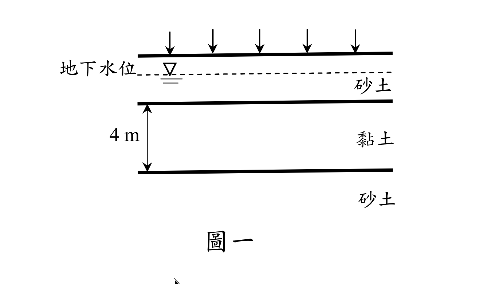
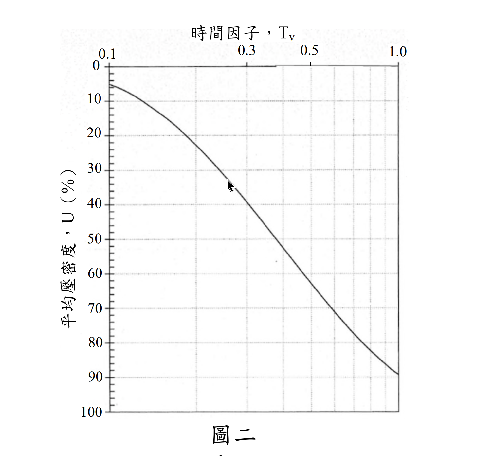

# 考題編號：SM-2019-2

**主分類：** `SM-U1-3` 土壤夯實及壓密
**分析法：** 有效應力法
**標籤：** `正常壓密黏土`, `壓密沉陷量`, `預壓工法`, `壓密度`

---

## 1. 原始題目重述 (Problem Restatement)
某大型營建工程擬建築於如下圖一的地層之地表上，該地層含 4 m 厚的軟弱正常壓密黏土（normally consolidated clay），黏土層上、下皆為排水砂層。此營建工程完工後，構造物預期作用於黏土層的平均永久荷重增加 150 kPa。施工前黏土層中間的平均有效覆土壓力為 70 kPa，且初始孔隙比 0.9，壓縮指數（compression index, $C_c$）0.25，壓密係數（coefficient of consolidation, $c_v$）0.008 m²/day。時間因子 $T_v$ 與平均壓密度 $U$ 之關係如下圖二與表一。

(一) 試求此黏土層在此永久荷重下的主要壓密沉陷量。（10 分）
(二) 若採用預壓工法（precompression）加速壓密沉陷，擬於地表加載均布荷重 281 kPa，需幾天可達到與(一)相同的主要壓密沉陷量？（10 分）

*圖說（圖一，地層剖面）：*
*・**地表**：繪五支等距向下箭頭，代表大面積**均布載重**（故各深度之 $\Delta\sigma$ 不折減）。*
*・**地下水位**：以水平虛線加水位符號繪於地表下方、位於上層砂土之中。*
*・**地層**：由上而下為「砂土」→「黏土」（尺寸線標註 **4 m**，為圖上唯一印出的尺寸）→「砂土」。黏土層**上、下皆為砂土**，故屬雙面排水，$H_{dr} = 4/2 = 2$ m。*
*・黏土層參數（由題幹文字給定，圖上未標）：$e_0 = 0.9$、$C_c = 0.25$、$c_v = 0.008 \text{ m}^2/\text{day}$，施工前層中央有效覆土壓力 $p_0' = 70$ kPa。*

*圖說（圖二，$U$–$T_v$ 查圖）：考卷提供的標準一維壓密平均壓密度關係曲線，用於由 $T_v$ 查 $U$ 或反查。*
*・**橫軸**：時間因子 $T_v$，置於圖頂，**對數刻度**，標註刻度為 0.1、0.3、0.5、1.0（實測刻度間距符合 $\log_{10}$ 等比，非線性刻度）。*
*・**縱軸**：平均壓密度 $U$（%），**自頂端 0% 向下遞增至底端 100%**（壓密工程慣用之倒置座標），主格線每 10% 一條。*
*・**曲線形狀**：自左上向右下單調遞降並在右下趨平，即 $U$ 隨 $T_v$ 增大而增大、且愈接近 100% 愈慢。*
*・**數值基準**：本圖與題幹「表一」及理論近似式一致。表一可查得之控制點為 $T_v = 0.40 \Rightarrow U = 69.8\%$、$T_v = 0.50 \Rightarrow U = 76.4\%$；兩者代入 $U \ge 60\%$ 之近似式 $T_v = 1.781 - 0.933\log_{10}(100-U\%)$ 均完全吻合（分別得 0.4000、0.5000），可據此確認查圖與公式互為印證。*
*・**使用建議**：原圖為掃描件、格線較細，逐點目視查讀有內插誤差；本題以表一線性內插得 $T_v = 0.4185$（見 §4），若改用上述近似式得 $T_v = 0.4169$，兩者算出的天數分別為 209.25 與 208.45 天，皆屬合理。*

*（**尚缺**：題幹提及的「表一」目前無對應截圖存於本題資料夾；其可查得之兩個控制點已於上方圖說與 §4 計算中完整記錄，計算過程可重現，惟表格原件仍待補。）*

## 2. 考題核心精神與出題者意圖 (Core Concepts & Examiner's Intent)
本題測驗兩個核心觀念：
1. **正常壓密黏土之主要壓密沉陷量計算**：測驗考生是否熟練使用 $S_c = \frac{C_c H}{1+e_0} \log \frac{p_0' + \Delta p}{p_0'}$ 求解沉陷量。
2. **預壓工法（Precompression）的壓密度與時間計算**：測驗考生是否理解預壓工法的原理，即利用較大的預載重（$\Delta p_f > \Delta p$）產生較大的最終沉陷量（$S_{cf} > S_c$），使得在較短時間內（壓密度 $U < 100\%$）即可達到永久荷重所對應的最終沉陷量。並配合查表或公式計算對應的時間因子 $T_v$ 與時間 $t$。

## 3. 解題戰略地圖與陷阱分析 (Strategic Roadmap & Trap Analysis)
- **第一步：計算永久荷重下的最終壓密沉陷量**
  代入正常壓密黏土沉陷量公式，求出 $S_c$。
- **第二步：計算預壓荷重下的最終壓密沉陷量**
  同第一步公式，將荷重增量改為預壓荷重 281 kPa，求出預壓最終沉陷量 $S_{cf}$。
- **第三步：計算所需壓密度 $U$**
  令預壓過程中的沉陷量達到永久荷重最終沉陷量，即 $U = \frac{S_c}{S_{cf}} \times 100\%$。
- **第四步：推算時間 $t$**
  利用表一內插求出對應之 $T_v$，再由雙面排水條件 $H_{dr} = H/2$，代入 $t = \frac{T_v H_{dr}^2}{c_v}$ 解得天數。

**陷阱分析：**
1. **排水路徑長度（$H_{dr}$）**：黏土層上下皆為砂層，代表「雙面排水」，$H_{dr}$ 必須取為層厚的一半（$4 \text{ m} / 2 = 2 \text{ m}$），若直接代 $4 \text{ m}$ 會導致時間計算錯誤放大四倍。
2. **預壓荷重增量之深度折減**：題目敘述「地表加載均布荷重」，對於大面積均布載重，黏土層深度處的應力增量不折減，即等於地表載重，故 $\Delta p_f = 281 \text{ kPa}$。

## 3.5 變數層次分析 (Variable Hierarchy Analysis)

### 最終目標
`求出正常壓密黏土在永久荷重下的主要壓密沉陷量，以及施加預壓荷重達到該沉陷量所需的天數。`

### 本題關鍵公式（依計算順序）
1. 永久荷重下之主要壓密沉陷量：
   $$ S_c = \frac{C_c H}{1 + e_0} \log_{10} \frac{p_0' + \Delta p}{p_0'} $$
2. 預壓荷重下之最終壓密沉陷量：
   $$ S_{cf} = \frac{C_c H}{1 + e_0} \log_{10} \frac{p_0' + \Delta p_f}{p_0'} $$
3. 目標壓密度：
   $$ U = \frac{\boxed{S_c}}{\boxed{S_{cf}}} \times 100\% $$
4. 預壓所需時間：
   $$ t = \frac{T_v \cdot H_{dr}^2}{c_v} $$

### L1：題目直接給定
| 符號 | 數值 | 說明 |
| --- | --- | --- |
| $H$ | 4 m | 黏土層厚度 |
| $p_0'$ | 70 kPa | 施工前黏土層中間之有效覆土壓力 |
| $\Delta p$ | 150 kPa | 構造物永久荷重增加量 |
| $\Delta p_f$ | 281 kPa | 預壓均布荷重增加量 |
| $e_0$ | 0.9 | 初始孔隙比 |
| $C_c$ | 0.25 | 壓縮指數 |
| $c_v$ | 0.008 m²/day | 壓密係數 |

### L2：需知識點推導
**沉陷量計算**
| 符號 | 公式／來源 | 卡關? |
| --- | --- | --- |
| $S_c$ | $S_c = \frac{C_c H}{1 + e_0} \log_{10} \frac{p_0' + \Delta p}{p_0'}$ | |
| $S_{cf}$ | $S_{cf} = \frac{C_c H}{1 + e_0} \log_{10} \frac{p_0' + \Delta p_f}{p_0'}$ | |

**時間與壓密度計算**
| 符號 | 公式／來源 | 卡關? |
| --- | --- | --- |
| $H_{dr}$ | $H_{dr} = H / 2$ (雙面排水) | |
| $U$ | $U = \frac{S_c}{S_{cf}} \times 100\%$ | |
| $T_v$ | 內插表一或代入 $T_v = 1.781 - 0.933\log_{10}(100-U)$ | |
| $t$ | $t = \frac{T_v H_{dr}^2}{c_v}$ | |

### L3：深層知識（不懂就卡住）
| 知識點 | 說明 | 卡關? |
| --- | --- | --- |
| 預壓工法原理 | 藉由施加較大的預壓荷重（$\Delta p_f > \Delta p$），使土壤提早達到永久荷重下之預期最終沉陷量 $S_c$，即要求預壓沉陷量 $S(t) = S_c$。 | |
| 雙面排水路徑長度 | 當黏土層上下皆為高透水性地層（如砂層）時，超額孔隙水壓可向上與向下消散，最大排水路徑為層厚之一半（$H_{dr} = H/2$）。 | |

## 4. 步驟化詳細計算過程 (Step-by-Step Detailed Calculation)

### (一) 此黏土層在永久荷重下的主要壓密沉陷量
依題意，黏土為正常壓密（Normally Consolidated, NC），已知條件如下：
- $H = 4 \text{ m}$
- $e_0 = 0.9$
- $C_c = 0.25$
- $p_0' = 70 \text{ kPa}$
- $\Delta p = 150 \text{ kPa}$

代入正常壓密黏土之單向壓密沉陷量公式：
$$ S_c = \frac{C_c H}{1 + e_0} \log_{10} \left( \frac{p_0' + \Delta p}{p_0'} \right) $$
$$ S_c = \frac{0.25 \times 4}{1 + 0.9} \log_{10} \left( \frac{70 + 150}{70} \right) $$
$$ S_c = \frac{1.0}{1.9} \log_{10} \left( \frac{220}{70} \right) = 0.5263 \times \log_{10}(3.1429) $$
$$ S_c \approx 0.5263 \times 0.4973 = 0.2617 \text{ m} = 26.17 \text{ cm} $$

$\boxed{S_c = 26.17 \text{ cm}}$

### (二) 達到相同主要壓密沉陷量所需之預壓天數
**1. 計算預壓荷重下的最終壓密沉陷量 ($S_{cf}$)**
地表加載均布荷重 281 kPa，故預壓應力增量 $\Delta p_f = 281 \text{ kPa}$。
預壓荷重下之最終主要沉陷量為：
$$ S_{cf} = \frac{C_c H}{1 + e_0} \log_{10} \left( \frac{p_0' + \Delta p_f}{p_0'} \right) $$
$$ S_{cf} = \frac{0.25 \times 4}{1.9} \log_{10} \left( \frac{70 + 281}{70} \right) $$
$$ S_{cf} = \frac{1.0}{1.9} \log_{10} \left( \frac{351}{70} \right) = 0.5263 \times \log_{10}(5.0143) $$
$$ S_{cf} \approx 0.5263 \times 0.7002 = 0.3685 \text{ m} = 36.85 \text{ cm} $$

**2. 計算目標壓密度 ($U$)**
欲使預壓期間達到的沉陷量等於 (一) 的永久荷重沉陷量：
$$ U = \frac{S(t)}{S_{cf}} \times 100\% = \frac{S_c}{S_{cf}} \times 100\% $$
$$ U = \frac{0.2617}{0.3685} \times 100\% = 71.02\% $$

**3. 求對應之時間因子 ($T_v$)**
根據表一之 $T_v$ 與 $U$ 的關係：
- $T_v = 0.40$ 時，$U = 69.8\%$
- $T_v = 0.50$ 時，$U = 76.4\%$

利用線性內插法求 $U = 71.02\%$ 時之 $T_v$：
$$ T_v = 0.40 + (0.50 - 0.40) \times \frac{71.02 - 69.8}{76.4 - 69.8} $$
$$ T_v = 0.40 + 0.10 \times \frac{1.22}{6.60} = 0.40 + 0.0185 = 0.4185 $$

*(註：若採用經驗公式 $T_v = 1.781 - 0.933\log_{10}(100-U)$，當 $U > 60\%$ 時：$T_v = 1.781 - 0.933\log_{10}(100-71.02) = 0.4169$。本解答以表格內插值 0.4185 為主繼續計算。)*

**4. 計算所需預壓時間 ($t$)**
由題意知黏土層上下皆為排水砂層，故為「雙面排水」條件。
最大排水路徑 $H_{dr} = \frac{H}{2} = \frac{4}{2} = 2 \text{ m}$。
壓密係數 $c_v = 0.008 \text{ m}^2/\text{day}$。

$$ t = \frac{T_v \cdot H_{dr}^2}{c_v} $$
$$ t = \frac{0.4185 \times (2)^2}{0.008} = \frac{1.674}{0.008} = 209.25 \text{ days} $$

*(若採公式值 $T_v = 0.4169$ 計算，天數為 $208.45 \text{ days}$。)*

$\boxed{t \approx 209.3 \text{ 天}}$

## 5. 關鍵爭議點與進階探討 (Critical Issues & Advanced Discussion)
- **$T_v$ 求解方式的選擇**：題目有提供表格，一般情況下優先以表格數據進行線性內插，符合工程實務概估習慣；但若考量壓密理論之精確曲線，代入 $T_v$ 理論公式也可接受。考場上可將兩種方式稍作敘明，並以內插值為主，兩種算出來的時間約在 208~209 天之間，皆屬合理。
- **排水條件判定**：預壓工法常搭配垂直排水帶（如 PVD）加速壓密，但本題未特別提及地盤改良有打設排水帶，故只算垂直向之壓密沉陷，此為標準的一維壓密考題。判斷雙面排水條件（上下皆為砂層）是得分的防呆關鍵，若忽略將導致推估時間倍增。
