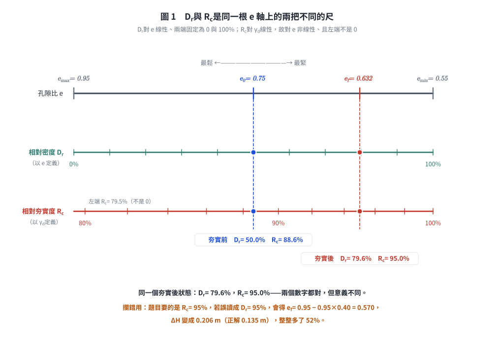
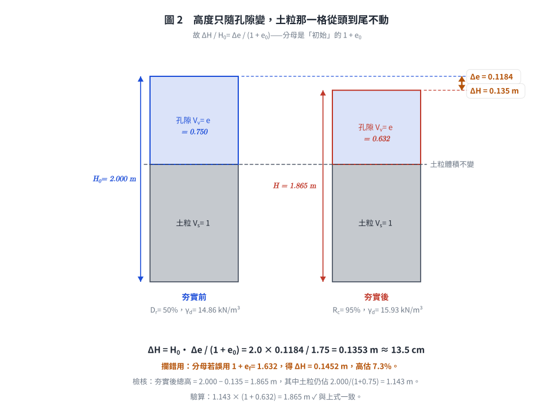

# 考題編號：SM-2019-3

**主分類：** `SM-U1-3` 土壤夯實及壓密
**副分類：** `SM-U1-1` 土壤基本性質
**分析法：** 混合
**標籤：** `相對夯實度` `相對密度` `孔隙比` `三相關係` `乾土單位重` `體積變化`
---

## 1. 原始題目重述 (Problem Restatement)

三、某施工場址於回填 2 m 厚的砂質土壤後進行夯實，夯實前回填土之相對密度為 50%。該回填土壤於實驗室試驗獲得最大孔隙比 0.95，最小孔隙比 0.55，土壤顆粒比重 2.65。施工規範要求回填土壤的夯實需達到相對夯實度（relative compaction）95%，試求：
(一)夯實前、後回填土的乾土單位重（kN/m³）。（15 分）
(二)夯實後回填土減低多少高度（m）。（10 分）

（註：假設 $\gamma_w = 9.81 \text{ kN/m}^3$）

## 2. 考題核心精神與出題者意圖 (Core Concepts & Examiner's Intent)

本題主要測驗考生對於**土壤基本物理性質**與**夯實度指標**之間關係的理解。
核心觀念包含：
1. **相對密度（Relative Density, $D_r$）**與孔隙比的關係。
2. **相對夯實度（Relative Compaction, $R_c$）**的定義，以及其與乾單位重的關係。
3. **夯實前後的體積變化（Settlement）**計算，利用「固體顆粒體積不變」的原理，透過孔隙比變化推求沉陷量或高度減少量。
出題者意圖確保考生能精準區分「相對密度」與「相對夯實度」，並能靈活運用三相圖公式進行體積與孔隙比之換算。

## 3. 解題戰略地圖與陷阱分析 (Strategic Roadmap & Trap Analysis)

**戰略地圖：**
1. 藉由初始相對密度 $D_{r0}$ 與極值孔隙比（$e_{max}, e_{min}$），求出夯實前之初始孔隙比 $e_0$。
2. 根據 $e_0$ 結合比重 $G_s$，算出夯實前初始乾單位重 $\gamma_{d0}$。
3. 利用最小孔隙比 $e_{min}$ 算出土壤的最大乾單位重 $\gamma_{d,max}$。
4. 依據相對夯實度 $R_c = 95\%$ 要求，求出夯實後之乾單位重 $\gamma_{df}$。
5. 由 $\gamma_{df}$ 回推夯實後之孔隙比 $e_f$。
6. 運用一維體積應變公式（$\Delta H / H_0 = \Delta e / (1+e_0)$）求出減少的高度 $\Delta H$。

**陷阱分析：**
1. **相對密度（$D_r$）與相對夯實度（$R_c$）的混淆**：
   - 相對密度是基於「孔隙比」定義：$D_r = (e_{max} - e)/(e_{max} - e_{min})$。
   - 相對夯實度是基於「乾單位重」定義：$R_c = \gamma_d / \gamma_{d,max}$。若將兩者公式搞混，將導致整題算錯。
2. **沉陷量公式的分母**：
   - 減少高度 $\Delta H = H_0 \cdot \frac{e_0 - e_f}{1 + e_0}$，分母必須是初始狀態的 $1 + e_0$，若誤用 $1 + e_f$ 會導致計算錯誤。
3. **$\gamma_{d,max}$ 的對應孔隙比**：
   - 最大乾單位重對應的是「最小孔隙比 $e_{min}$」，非最大孔隙比，須注意帶入正確數值。

*圖 1　$D_r$ 與 $R_c$ 是同一根 $e$ 軸上的兩把不同的尺。它攔的是本題最致命的混淆：同一個夯實後狀態，$D_r = 79.6\%$ 而 $R_c = 95.0\%$，兩個數字都對但意義不同；若把題目要求的 $R_c = 95\%$ 誤讀成 $D_r = 95\%$，會得 $e_f = 0.570$、$\Delta H = 0.206$ m，比正解多 52%。*

## 3.5 變數層次分析 (Variable Hierarchy Analysis)

### 最終目標
求出夯實前、後的乾單位重（$\gamma_{d0}, \gamma_{df}$）以及回填土夯實後減少的高度（$\Delta H$）。

### 本題關鍵公式（依計算順序）
Step 1: 由相對密度求初始孔隙比
$e_0 = e_{max} - D_{r0}(e_{max} - e_{min})$

Step 2: 初始乾單位重
$\gamma_{d0} = \frac{G_s \gamma_w}{1 + \boxed{e_0}}$

Step 3: 最大乾單位重
$\gamma_{d,max} = \frac{G_s \gamma_w}{1 + e_{min}}$

Step 4: 夯實後乾單位重
$\gamma_{df} = R_c \cdot \boxed{\gamma_{d,max}}$

Step 5: 夯實後孔隙比
$e_f = \frac{G_s \gamma_w}{\boxed{\gamma_{df}}} - 1$

Step 6: 夯實減少高度
$\Delta H = H_0 \frac{\boxed{e_0} - \boxed{e_f}}{1 + \boxed{e_0}}$

### L1：題目直接給定
| 符號 | 數值 | 說明 |
|---|---|---|
| $H_0$ | $2 \text{ m}$ | 夯實前土壤厚度 |
| $D_{r0}$ | $0.50$ (50%) | 夯實前相對密度 |
| $e_{max}$ | $0.95$ | 最大孔隙比 |
| $e_{min}$ | $0.55$ | 最小孔隙比 |
| $G_s$ | $2.65$ | 固體顆粒比重 |
| $R_c$ | $0.95$ (95%) | 要求之相對夯實度 |
| $\gamma_w$ | $9.81 \text{ kN/m}^3$ | 水的單位重 |

### L2：需知識點推導
**夯實前狀態計算**
| 符號 | 公式／來源 | 卡關? |
|---|---|---|
| $e_0$ | $D_r = \frac{e_{max} - e}{e_{max} - e_{min}}$ | |
| $\gamma_{d0}$ | $\gamma_d = \frac{G_s \gamma_w}{1+e}$ | |

**夯實後狀態計算**
| 符號 | 公式／來源 | 卡關? |
|---|---|---|
| $\gamma_{d,max}$ | $\gamma_{d,max} = \frac{G_s \gamma_w}{1+e_{min}}$ | |
| $\gamma_{df}$ | $R_c = \frac{\gamma_{d}}{\gamma_{d,max}}$ | |
| $e_f$ | $e = \frac{G_s \gamma_w}{\gamma_{d}} - 1$ | |

**沉陷量計算**
| 符號 | 公式／來源 | 卡關? |
|---|---|---|
| $\Delta H$ | $\frac{\Delta H}{H_0} = \frac{\Delta e}{1+e_0}$ | |

### L3：深層知識（不懂就卡住）
| 知識點 | 說明 | 卡關? |
|---|---|---|
| 相對密度與孔隙比的關係 | 定義為 $D_r = \frac{e_{max} - e}{e_{max} - e_{min}}$，衡量孔隙比在極值間的相對位置。 | |
| 相對夯實度定義 | 工程上定義為現場乾土單位重與**室內標準夯實（Proctor）試驗**最大乾土單位重之比值：$R_c = \frac{\gamma_d}{\gamma_{d,max}}$。 | |
| $\gamma_{d,max}$ 的代用 | 本題未給 Proctor 試驗結果，只給 $e_{min}$，故以**最緊密狀態**（$e = e_{min}$）之 $\gamma_d$ 代替 Proctor $\gamma_{d,max}$。這是題目條件所迫的代用，不是定義本身，詳見 §5。 | |
| 一維體積應變推導 | 土壤受到一維壓縮時，固體顆粒體積 $V_s$ 不變，故總體積變化比等於孔隙比變化比：$\frac{\Delta V}{V} = \frac{\Delta H}{H_0} = \frac{\Delta e}{1+e_0}$。 | |

## 4. 步驟化詳細計算過程 (Step-by-Step Detailed Calculation)

### (一) 夯實前、後回填土的乾土單位重

**Step 1: 計算夯實前初始孔隙比 $e_0$**
依據相對密度（$D_r$）的定義：
$$ D_{r0} = \frac{e_{max} - e_0}{e_{max} - e_{min}} $$
帶入數值：
$$ 0.50 = \frac{0.95 - e_0}{0.95 - 0.55} = \frac{0.95 - e_0}{0.40} $$
$$ e_0 = 0.95 - 0.50 \times 0.40 = 0.75 $$

**Step 2: 計算夯實前之乾土單位重 $\gamma_{d0}$**
利用土壤三相圖公式計算乾土單位重：
$$ \gamma_{d0} = \frac{G_s \gamma_w}{1 + e_0} = \frac{2.65 \times 9.81}{1 + 0.75} = \frac{25.9965}{1.75} = 14.855 \text{ kN/m}^3 $$
> 策略註解：求出現場原狀（或初始狀態）的乾單位重，此即為「夯實前乾土單位重」。

**Step 3: 計算最大乾土單位重 $\gamma_{d,max}$**
最大乾單位重對應於最小孔隙比 $e_{min}$ 的狀態：
$$ \gamma_{d,max} = \frac{G_s \gamma_w}{1 + e_{min}} = \frac{2.65 \times 9.81}{1 + 0.55} = \frac{25.9965}{1.55} = 16.772 \text{ kN/m}^3 $$

**Step 4: 計算夯實後之乾土單位重 $\gamma_{df}$**
依據相對夯實度（$R_c$）的要求：
$$ R_c = \frac{\gamma_{df}}{\gamma_{d,max}} = 95\% = 0.95 $$
$$ \gamma_{df} = 0.95 \times 16.772 = 15.933 \text{ kN/m}^3 $$

**第一小題答案：**
$$ \text{夯實前乾土單位重 } \gamma_{d0} = \boxed{14.86 \text{ kN/m}^3} $$
$$ \text{夯實後乾土單位重 } \gamma_{df} = \boxed{15.93 \text{ kN/m}^3} $$

---

### (二) 夯實後回填土減低多少高度

**Step 5: 計算夯實後之孔隙比 $e_f$**
由夯實後乾土單位重回推：
$$ \gamma_{df} = \frac{G_s \gamma_w}{1 + e_f} $$
$$ 15.933 = \frac{25.9965}{1 + e_f} $$
$$ 1 + e_f = \frac{25.9965}{15.933} = 1.6316 $$
$$ e_f = 0.6316 $$
*(亦可由相對夯實度公式直接推導：$R_c = \frac{1+e_{min}}{1+e_f} \Rightarrow 1+e_f = \frac{1.55}{0.95} = 1.6316$)*

**Step 6: 計算減低的高度 $\Delta H$**
利用固體顆粒體積不變原理，高度變化量與孔隙比變化量成正比：
$$ \frac{\Delta H}{H_0} = \frac{\Delta e}{1 + e_0} = \frac{e_0 - e_f}{1 + e_0} $$
$$ \Delta H = 2.0 \times \frac{0.75 - 0.6316}{1 + 0.75} = 2.0 \times \frac{0.1184}{1.75} = 0.1353 \text{ m} $$
> 策略註解：公式分母必須使用「初始狀態」的 $(1 + e_0)$。

**第二小題答案：**
$$ \text{夯實後減低高度 } \Delta H = \boxed{0.135 \text{ m}} \text{ (約 13.5 cm)} $$

*圖 2　高度只隨孔隙變，土粒那一格從頭到尾不動。它攔的是分母取錯：因為變的是 $\Delta e$ 而基準是「初始」總體積 $1+e_0$，分母若誤用 $1+e_f = 1.632$ 會得 $\Delta H = 0.1452$ m，高估 7.3%。*

## 5. 關鍵爭議點與進階探討 (Critical Issues & Advanced Discussion)

- **相對密度與相對夯實度之經驗轉換**：
  工程上常用 Lee & Singh (1971) 提出的經驗公式 $R_c \approx 80 + 0.2 D_r$ 進行概估。若代入本題夯實後計算得到的相對密度：
  $D_{rf} = \frac{0.95 - 0.6316}{0.95 - 0.55} = \frac{0.3184}{0.40} = 79.6\%$
  使用經驗公式預估 $R_c \approx 80 + 0.2(79.6) = 95.92\%$，與題目要求之 $95\%$ 相近。但考場上**必須**依據基本定義公式從頭推導精確數值，切勿直接使用該經驗公式計算，否則不予計分。
- **本題的 $\gamma_{d,max}$ 並不是 Proctor 的 $\gamma_{d,max}$**：
  相對夯實度 $R_c$ 的標準定義中，分母是**標準夯實試驗**（ASTM D698／CNS 11777）求得的最大乾單位重；
  而本題只給了相對密度試驗的 $e_{max}$、$e_{min}$，因此 Step 3 用的是 $e_{min}$ 對應的
  **最緊密狀態乾單位重** $\dfrac{G_s\gamma_w}{1+e_{min}} = 16.77 \text{ kN/m}^3$。
  兩者在物理上不同：$e_{min}$ 來自振動台／夯搗的乾砂最緊密堆積，Proctor 則是含水量最佳時的動力夯實，
  砂質土的 Proctor $\gamma_{d,max}$ 通常**略低於** $e_{min}$ 對應值。
  題目既然只給這組參數，用 $e_{min}$ 是唯一可行且閱卷預期的作法，
  但作答時宜寫一句「因題目未提供標準夯實試驗結果，以 $e_{min}$ 對應之最大乾單位重代之」，
  以示觀念清楚——這句話不寫不會扣分，寫了是加分項。
- **計算精度控制**：
  此類三相圖推演題型，中間過程（例如 $\gamma_{d,max}, e_f$ 等）建議至少保留小數點後 3 到 4 位，到最後一步再四捨五入至小數點後第 2 或第 3 位，避免累積的捨入誤差（round-off error）造成最後答案偏差。

---

*解析日期：見 `wiki/log.md`　｜　圖解補繪：2026-08-28（向量 SVG，程式繪製，腳本 `gen_SM-2019-3.py` 可重跑；同名 2× PNG 供簡報／影片管線使用）*
