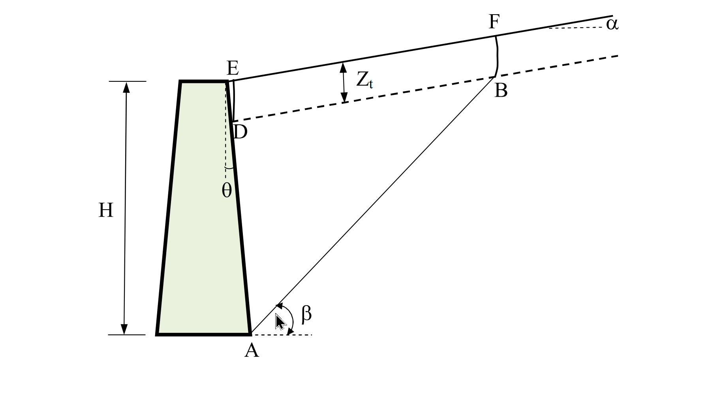

# 考題編號：SM-2019-4

**主分類：** `SM-3` 側向土壓力理論
**副分類：** `SM-3` 擋土結構物穩定分析
**分析法：** 概念題 / 有效應力法
**標籤：** `Coulomb土壓力` `張力裂縫` `力多邊形` `極大值觀念`

---

## 1. 原始題目重述 (Problem Restatement)

某擋土牆如下圖所示，背填土坡度角 $\alpha$，土壤單位重 $\gamma$，土壤凝聚力與摩擦角分別為 $c$ 與 $\phi$，牆背與鉛直線夾 $\theta$ 角，土壤與牆面間的凝聚力與摩擦角分別為 $c_a$ 與 $\delta$。考慮張力裂縫（線段 DE 與 BF），但縫內無水，並假設主動狀態之破壞面（線段 AB）與水平線夾 $\beta$ 角。

(一) 試求張力裂縫的最大深度 $Z_t$。（5 分）
(二) 畫出以庫倫（Coulomb）法求解主動狀態時作用於破壞土楔的力多邊形。答案需描述各已知力的計算及各力與水平或鉛直線的夾角。（15 分）
(三) 如何求得作用於牆背的主動推力。（5 分）

*圖說：擋土牆背填土坡面為 $\alpha$，牆背與鉛直線夾角 $\theta$（向背填土傾斜），破壞面傾角 $\beta$。DE 與 BF 為垂直張力裂縫，深度為 $Z_t$。*

## 2. 考題核心精神與出題者意圖 (Core Concepts & Examiner's Intent)

本題旨在測驗考生對於**庫倫（Coulomb）主動土壓力理論**之深刻理解。有別於直接套用現成的公式，出題者透過加入張力裂縫（Tension Crack）以及複雜幾何（傾斜背填土、傾斜牆背），要求考生回歸土壓力理論的基本假設：
1. 將破壞區視為剛體土楔。
2. 進行靜力平衡分析（力多邊形閉合）。
3. 尋找產生最大推力的臨界滑動面。
這測驗了考生是否具備推導極限平衡狀態的基礎能力，且對於張力裂縫處邊界條件（零抗拉強度、無水）的處理是否清晰。

## 3. 解題戰略地圖與陷阱分析 (Strategic Roadmap & Trap Analysis)

- **步驟一：確立張力裂縫深度**
  - **戰略**：回歸應力狀態的觀念，在地表附近水平應力為零處即為裂縫臨界深度。
  - **陷阱**：勿死背傾斜地表面之複雜修正公式，以裂縫表面為垂直主應力面的基礎莫爾圓觀念推導最為穩妥。
- **步驟二：建構土楔受力圖（力多邊形）**
  - **戰略**：識別土楔邊界為 A-B-F-E-D。因 DE、BF 為裂縫且無水，不產生作用力。作用力僅在土楔自重、AB面、AD面。
  - **陷阱**：各作用力與水平/鉛直線的夾角極易出錯。特別是反力 $R$ 與 $P$ 皆偏離法線一個摩擦角（$\phi$ 或 $\delta$），偏轉方向取決於滑動方向，需牢記主動狀態下「土楔向下滑，阻力皆向上」。
- **步驟三：推導主動土壓力**
  - **戰略**：寫出極值條件。
  - **陷阱**：主動土壓力必須是所有可能破壞面中產生推力之**極大值**（$\max P$），被動土壓力才是極小值，觀念不可顛倒。

## 3.5 變數層次分析 (Variable Hierarchy Analysis)

### 最終目標
`透過剛體土楔力平衡原理與極值分析，找出最大張力裂縫深度並描述作用力特徵，最終求得主動土壓力。`

### 本題關鍵公式（依計算順序）
$$ Z_t = \frac{2c}{\gamma} \tan\left(45^\circ + \frac{\phi}{2}\right) $$
*(由莫爾圓主應力關係求出張力裂縫深度)*

$$ \sum F_x = 0, \quad \sum F_y = 0 \quad \Rightarrow \quad \vec{W} + \vec{C} + \vec{C_a} + \vec{R} + \vec{P} = 0 $$
*(土楔力多邊形閉合，求解 P(\beta))*

$$ P_a = \max_{\beta} P(\beta) $$
*(庫倫主動土壓力之極值條件)*

### L1：題目直接給定
| 符號 | 數值 | 說明 |
|---|---|---|
| $\gamma$ | 給定 | 土壤單位重 |
| $c, \phi$ | 給定 | 破壞面土壤凝聚力與摩擦角 |
| $c_a, \delta$ | 給定 | 牆背土壤附著力與摩擦角 |
| $\alpha, \theta$ | 給定 | 背填土坡度角與牆背傾角 |
| $\beta$ | 給定 | 假設之破壞面夾角 |

### L2：需知識點推導
**力多邊形元素計算**
| 符號 | 公式／來源 | 卡關? |
|---|---|---|
| $W$ | $\gamma \times \text{Area(ABFDE)}$ | |
| $C$ | $c \times \overline{AB}$ | |
| $C_a$ | $c_a \times \overline{AD}$ | |
| $Z_t$ | $\frac{2c}{\gamma}\tan(45^\circ+\frac{\phi}{2})$ | |

### L3：深層知識（不懂就卡住）
| 知識點 | 說明 | 卡關? |
|---|---|---|
| 主動狀態摩擦力偏轉方向 | 土楔向下滑，故 $R$ 與 $P$ 皆偏離法線方向朝上（抵抗滑動） | |
| 極值搜尋觀念 | 主動狀態是讓擋土牆「最危險」的狀態，故 $P_a$ 必須是所有可能破壞面造成的推力極大值 | |

## 4. 步驟化詳細計算過程 (Step-by-Step Detailed Calculation)

### (一) 張力裂縫最大深度 $Z_t$
張力裂縫之產生，係因地表淺層土壤之側向有效應力轉為拉應力，而土壤本身無法承受拉伸所致。
在垂直張力裂縫之斷面上，水平方向不受拉力（應力為零），故為一主應力面，此處的水平最小主應力 $\sigma_3 = 0$。
對應的垂直最大主應力為土壤自重 $\sigma_1 = \gamma Z_t$。
代入莫爾-庫倫（Mohr-Coulomb）破壞準則公式：
$$ \sigma_1 = \sigma_3 \tan^2\left(45^\circ + \frac{\phi}{2}\right) + 2c \tan\left(45^\circ + \frac{\phi}{2}\right) $$
將 $\sigma_3 = 0$ 與 $\sigma_1 = \gamma Z_t$ 代入：
$$ \gamma Z_t = 2c \tan\left(45^\circ + \frac{\phi}{2}\right) $$
解得張力裂縫最大深度為：
$$ \boxed{ Z_t = \frac{2c}{\gamma} \tan\left(45^\circ + \frac{\phi}{2}\right) } $$
> **策略註解：** 亦可表述為 $Z_t = \frac{2c}{\gamma \sqrt{K_a}}$（此處 $K_a = \tan^2(45^\circ - \phi/2)$ 為 Rankine 理論之主動土壓力係數），兩者數學與物理意義相同。

### (二) 作用於破壞土楔的力多邊形
在邊界 DE 與 BF 皆發生張力裂縫，且內部無水（無水壓力），因此土楔 A-B-F-E-D 僅受到以下 5 個力的作用。
為繪製閉合之「力多邊形」，依靜力平衡條件可知此 5 力構成封閉迴圈，各力之大小與夾角特徵計算如下：

1. **土楔自重 $W$** (已知力)
   - **計算：** $W = \gamma \times (\text{多邊形 ABFDE 之面積})$
   - **夾角：** 垂直向下作用（與鉛直線夾 $0^\circ$，或與水平線夾 $90^\circ$）。
2. **破壞面 AB 上之凝聚力 $C$** (已知力)
   - **計算：** $C = c \times \overline{AB}$ （其中 $\overline{AB}$ 為扣除張力裂縫區後之有效破壞面長度）
   - **夾角：** 沿破壞面 AB 向上抵抗滑動，與水平線夾 $\beta$ 角。
3. **牆背 AD 上之附著力 $C_a$** (已知力)
   - **計算：** $C_a = c_a \times \overline{AD}$ （其中 $\overline{AD}$ 為扣除裂縫後與牆面實際接觸長度）
   - **夾角：** 沿牆背 AD 向上抵抗滑動，因牆背與鉛直線夾 $\theta$ 角，故此力作用線與鉛直線夾 $\theta$ 角（斜向左上）。
4. **破壞面 AB 上之反力 $R$** (大小未知，方向已知)
   - **說明：** 由正向力與摩擦力合成。
   - **夾角：** 主動狀態下土楔向下滑動，故摩擦力方向沿滑動面向上。合力 $R$ 會由破壞面法線方向逆著滑動方向偏轉 $\phi$ 角。因破壞面法線與鉛直線夾 $\beta$ 角，故 $R$ 作用線與鉛直線夾角為 $\beta - \phi$ （偏向左上）。
5. **牆背作用於土楔之反力 $P$** (大小未知，方向已知)
   - **說明：** 由牆面正向力與牆面摩擦力合成（為求牆背推力之反作用力）。
   - **夾角：** 土楔相對於牆面向下滑動，牆面給予土楔之摩擦力沿牆面向上。合力 $P$ 由牆背法線方向向上偏轉 $\delta$ 角。因牆背法線與水平線夾 $\theta$ 角，故 $P$ 與水平線夾角為 $\theta + \delta$ （偏向右上）。

**力多邊形繪製規則：**
將上述五力以向量首尾相連（如 $W \rightarrow C \rightarrow C_a \rightarrow R \rightarrow P \rightarrow 回到起點$），由於僅有 $R$ 與 $P$ 的大小為未知數，在平面共點力平衡體系中，給定角度後即可透過幾何關係或弦定理唯一決定該閉合多邊形並解出 $P$。

### (三) 如何求得作用於牆背的主動推力
利用上述庫倫試誤法（Trial Wedge Method）之觀念求得：
1. **假設滑動面：** 設定數個不同之滑動面傾角 $\beta_i$。
2. **解算推力：** 針對每一個假設的 $\beta_i$，依據上述第(二)小題之力多邊形閉合條件（$\sum F_x = 0$, $\sum F_y = 0$），解出維持該特定土楔平衡所需要的牆背反力 $P_i$。
3. **取極值：** 在主動狀態下，擋土牆必須能支撐所有可能發生滑動的土楔中，對牆背產生最大推力的那一個。因此，對於所有假設之 $\beta$ 所對應的 $P(\beta)$ 關係，取其**極大值 (Maximum)**，即為實際作用於牆背的主動推力 $P_a$。
   $$ \boxed{ P_a = \max_{\beta} P(\beta) } $$

## 5. 關鍵爭議點與進階探討 (Critical Issues & Advanced Discussion)
- **破壞面形狀假設：** 庫倫土壓力理論假設破壞面為平面（線段 AB），雖然在考慮牆面摩擦角 $\delta$ 時，真實破壞面下半部會略呈曲面（如對數螺旋面），但對主動狀態而言，平面假設之誤差極小（通常小於 10%），偏向保守且易於計算，為工程實務與考試所普遍採用。
- **張力裂縫之影響：** 考慮張力裂縫後，不僅破壞面上半部（BF）喪失抗剪能力，牆背上半部（DE）亦無土壓力及附著力貢獻。若遇雨水滲入裂縫（本題註明無水），還需在力多邊形中額外加入裂縫內的靜水壓力推力，這將顯著增加擋土牆之受力，設計上須特別注重背填土表面排水。
