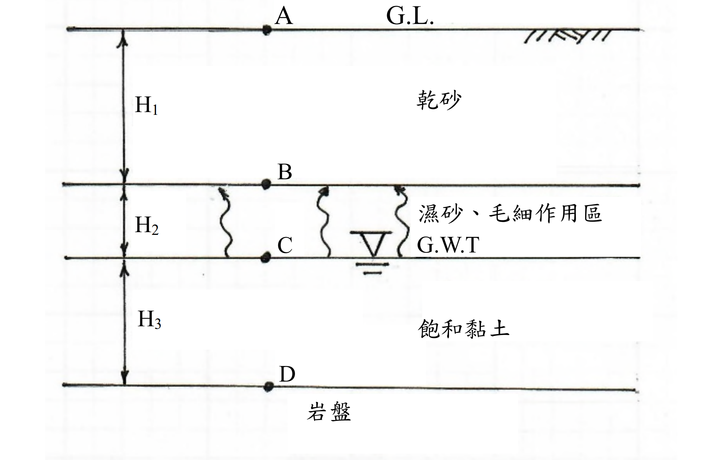

# 考題編號：[SM-2020-1]

**主分類：** `SM-1` 土壤基本性質與分類
**副分類：** `SM-4` 土體內應力
**分析法：** 有效應力法
**標籤：** `毛細現象` `有效應力` `三相關係`

---

## 1. 原始題目重述 (Problem Restatement)

一、某工址之土層剖面如下圖所示。已知頂層厚度 $H_1 = 2.1$ m（乾砂），比重 $G_s = 2.65$，孔隙比 $e = 0.5$。第二層厚度 $H_2 = 0.9$ m（濕砂、毛細作用區），比重 $G_s = 2.65$，孔隙比 $e = 0.5$，飽和度 $S = 50\%$。第三層厚度 $H_3 = 1.9$ m（飽和黏土），比重 $G_s = 2.71$，含水量 $w = 42\%$。(25 分)
(一)試計算 A、B、C、D 點之垂直總應力 $\sigma$、水壓力 $u$ 及垂直有效應力 $\sigma'$。
(二)請繪出垂直總應力、水壓力 $u$、及垂直有效應力隨深度之分布。

*圖說：土層剖面圖。地表為 A 點。頂層為乾砂，厚度 2.1m；其底為 B 點。第二層為濕砂（毛細作用區），厚度 0.9m；其底為 C 點（地下水位面 GWT）。第三層為飽和黏土，厚度 1.9m；其底為 D 點。*

## 2. 考題核心精神與出題者意圖 (Core Concepts & Examiner's Intent)
1. **三相關係換算**：測驗考生能否利用基本物理量（$G_s, e, S, w$）正確計算出各土層之單位重（乾單位重 $\gamma_d$、濕單位重 $\gamma_m$、飽和單位重 $\gamma_{sat}$）。
2. **毛細現象對應力的影響**：測驗對於毛細區內孔隙水壓（負水壓）的認知。當飽和度 $S < 100\%$ 時，有效應力原理中的孔隙水壓貢獻應以 $u = -S \cdot \gamma_w \cdot h_c$ 計算，並理解其如何提升土體的有效應力。
3. **應力分布圖繪製**：確認考生能否將計算結果視覺化，並正確呈現各層斜率變化。

## 3. 解題戰略地圖與陷阱分析 (Strategic Roadmap & Trap Analysis)
- **步驟 1：三相關係轉換**。分別計算三層土壤的單位重。特別注意第三層黏土需利用 $S \cdot e = w \cdot G_s$ 先求出孔隙比 $e$，再求飽和單位重。
- **步驟 2：總應力計算**。由上往下積分（累加）各層土體自重 $\sigma = \sum \gamma_i \cdot \Delta z_i$。
- **步驟 3：孔隙水壓計算**。
  - A 到 B（乾土）：$u = 0$
  - B 到 C（毛細區）：因 $S = 50\%$，等效孔隙水壓力 $u = -S \gamma_w z'$（$z'$ 為距水位的垂直高度），在 B 點達到最大負值。
  - C 點以下（地下水位下）：靜水壓力 $u = \gamma_w z_w$。
- **步驟 4：有效應力計算**。利用 Terzaghi 有效應力原理：$\sigma' = \sigma - u$ 計算。
- **步驟 5：繪製分布圖**。確保 $\sigma, u, \sigma'$ 的線段在交界處的折點位置正確標示。

**⚠️ 陷阱分析：**
1. **毛細區負水壓的折減**：很多考生在毛細區會直接使用 $u = -\gamma_w h_c$，忽略了毛細區土壤並非完全飽和（$S=50\%$）。根據 Bishop 有效應力公式，非飽和土孔隙水壓的貢獻為 $u_{eq} = u_a - \chi (u_a - u_w)$，其中 $\chi \approx S$ 且大氣壓力 $u_a = 0$，故等效孔隙水壓應為 $u = -S \cdot \gamma_w h_c$。
2. **第三層孔隙比未給定**：需透過飽和狀態 $S=100\%$，利用 $S \cdot e = w \cdot G_s$ 關係式求出 $e$。

## 3.5 變數層次分析 (Variable Hierarchy Analysis)

### 最終目標
`求出深度剖面各特徵點的總應力、孔隙水壓及有效應力，並繪製分布圖。`

### 本題關鍵公式（依計算順序）
- 乾土單位重：$\gamma_d = \frac{G_s}{1+e}\gamma_w$
- 濕土單位重：$\gamma_m = \frac{G_s + Se}{1+e}\gamma_w$
- 孔隙比關係式（飽和時 $S=1$）：$e = w G_s$
- 飽和單位重：$\gamma_{sat} = \frac{G_s + \boxed{e}}{1+\boxed{e}}\gamma_w$
- 總應力：$\sigma_z = \sum \boxed{\gamma_i} \cdot \Delta z_i$
- 非飽和毛細區孔隙水壓：$u = -S \gamma_w h_c$
- 有效應力：$\sigma' = \boxed{\sigma} - \boxed{u}$

### L1：題目直接給定
| 符號 | 數值 | 說明 |
|---|---|---|
| $H_1$ | 2.1 m | 頂層乾砂厚度 |
| $H_2$ | 0.9 m | 中層毛細區濕砂厚度 |
| $H_3$ | 1.9 m | 底層飽和黏土厚度 |
| $G_{s1}$ | 2.65 | 乾砂與濕砂比重 |
| $e_1$ | 0.5 | 乾砂與濕砂孔隙比 |
| $S_2$ | 50% | 毛細區濕砂飽和度 |
| $G_{s3}$ | 2.71 | 飽和黏土比重 |
| $w_3$ | 42% | 飽和黏土含水量 |

### L2：需知識點推導
**1. 單位重計算**
| 符號 | 公式／來源 | 卡關? |
|---|---|---|
| $\gamma_d$ | $\frac{G_{s1}}{1+e_1}\gamma_w$ | |
| $\gamma_m$ | $\frac{G_{s1} + S_2 e_1}{1+e_1}\gamma_w$ | |
| $e_3$ | $w_3 \times G_{s3}$ (因為 $S=1$) | |
| $\gamma_{sat}$ | $\frac{G_{s3} + e_3}{1+e_3}\gamma_w$ | |

**2. 應力計算**
| 符號 | 公式／來源 | 卡關? |
|---|---|---|
| $\sigma$ | 各層土壤自重累加 $\sum \gamma \Delta z$ | |
| $u$ | 地下水位以下為 $\gamma_w z$，毛細區為 $-S \gamma_w h_c$ | |
| $\sigma'$ | $\sigma - u$ | |

### L3：深層知識（不懂就卡住）
| 知識點 | 說明 | 卡關? |
|---|---|---|
| 非飽和毛細區孔隙水壓 | 非飽和土的等效孔隙水壓需乘以 $\chi$ 參數（一般取 $\chi = S$）作折減。 | |
| 飽和度隱含條件 | 地下水位以下的黏土層，若無特別說明，視為 $S=100\%$。 | |

## 4. 步驟化詳細計算過程 (Step-by-Step Detailed Calculation)
令水的單位重 $\gamma_w = 9.81 \text{ kN/m}^3$。

**Step 1：計算各土層單位重**

1. **第一層（乾砂）**：
   $$ \gamma_d = \frac{G_s}{1+e}\gamma_w = \frac{2.65}{1 + 0.5} \times 9.81 = 17.33 \text{ kN/m}^3 $$

2. **第二層（濕砂、毛細作用區）**：
   $$ \gamma_m = \frac{G_s + S \cdot e}{1+e}\gamma_w = \frac{2.65 + 0.5 \times 0.5}{1 + 0.5} \times 9.81 = \frac{2.90}{1.5} \times 9.81 = 18.97 \text{ kN/m}^3 $$

3. **第三層（飽和黏土）**：
   由三相關係 $S \cdot e = w \cdot G_s$，且地下水位以下 $S = 100\% = 1.0$：
   $$ e = 0.42 \times 2.71 = 1.138 $$
   $$ \gamma_{sat} = \frac{G_s + e}{1+e}\gamma_w = \frac{2.71 + 1.138}{1 + 1.138} \times 9.81 = \frac{3.848}{2.138} \times 9.81 = 17.65 \text{ kN/m}^3 $$

**Step 2：計算各點之總應力、水壓力與有效應力**

- **A 點 (地表面, $z = 0$ m)**
  - 總應力 $\sigma_A = \boxed{0 \text{ kPa}}$
  - 水壓力 $u_A = \boxed{0 \text{ kPa}}$
  - 有效應力 $\sigma'_A = \sigma_A - u_A = \boxed{0 \text{ kPa}}$

- **B 點 (毛細區頂部, $z = 2.1$ m)**
  - 總應力 $\sigma_B = \gamma_d \times 2.1 = 17.33 \times 2.1 = \boxed{36.39 \text{ kPa}}$
  - 水壓力：根據非飽和土等效孔隙水壓概念 $u = -S \gamma_w h_c$
    $u_B = -0.5 \times 9.81 \times 0.9 = \boxed{-4.41 \text{ kPa}}$
  - 有效應力 $\sigma'_B = \sigma_B - u_B = 36.39 - (-4.41) = \boxed{40.80 \text{ kPa}}$

- **C 點 (地下水位面, $z = 3.0$ m)**
  - 總應力 $\sigma_C = \sigma_B + \gamma_m \times 0.9 = 36.39 + 18.97 \times 0.9 = 36.39 + 17.07 = \boxed{53.46 \text{ kPa}}$
  - 水壓力 $u_C = \boxed{0 \text{ kPa}}$
  - 有效應力 $\sigma'_C = \sigma_C - u_C = 53.46 - 0 = \boxed{53.46 \text{ kPa}}$

- **D 點 (黏土層底, $z = 4.9$ m)**
  - 總應力 $\sigma_D = \sigma_C + \gamma_{sat} \times 1.9 = 53.46 + 17.65 \times 1.9 = 53.46 + 33.54 = \boxed{87.00 \text{ kPa}}$
  - 水壓力 $u_D = \gamma_w \times 1.9 = 9.81 \times 1.9 = \boxed{18.64 \text{ kPa}}$
  - 有效應力 $\sigma'_D = \sigma_D - u_D = 87.00 - 18.64 = \boxed{68.36 \text{ kPa}}$

**Step 3：繪製分布圖**
*(實際繪圖以折線圖呈現，座標點如下表所列)*
| 點位 | 深度 z (m) | 總應力 $\sigma$ (kPa) | 水壓力 $u$ (kPa) | 有效應力 $\sigma'$ (kPa) |
|---|---|---|---|---|
| A | 0.0 | 0.00 | 0.00 | 0.00 |
| B | 2.1 | 36.39 | -4.41 | 40.80 |
| C | 3.0 | 53.46 | 0.00 | 53.46 |
| D | 4.9 | 87.00 | 18.64 | 68.36 |

*圖說：總應力 $\sigma$、水壓力 $u$、有效應力 $\sigma'$ 隨深度 $z$ 分布之折線圖，橫軸為應力 (kPa)、縱軸為深度 z (m)，四個控制點座標為 A(0, 0, 0)、B(2.1m, σ=36.39, u=−4.41, σ'=40.80)、C(3.0m, σ=53.46, u=0, σ'=53.46)、D(4.9m, σ=87.00, u=18.64, σ'=68.36)。其中 A→B 段 u 為負值（毛細區負孔隙水壓），B→C 段 u 由負值回升至 0（地下水位面），C→D 段 u 依靜水壓力線性增加；σ' 曲線在 B 點出現因負孔隙水壓造成的局部峰值。*

## 5. 關鍵爭議點與進階探討 (Critical Issues & Advanced Discussion)
- **非飽和毛細區孔隙水壓的處理方法**：
  學術上，完全飽和 ($S=100\%$) 毛細區的孔隙水壓為負值 ($u = -\gamma_w h_c$)。然而，當 $S < 100\%$ 時，實際水壓力依然為 $u_w = -\gamma_w h_c$（相對於空氣壓力），但在計算「有效應力」時，水壓的貢獻會受飽和度折減（即 Bishop 等效孔隙水壓力 $u_{eq} = -S \gamma_w h_c$）。
  多數國家考試與解題標準，在遇到非飽和毛細區時，會將表格中的 $u$ 直接以 $u_{eq} = -S \gamma_w h_c$ 表示，以維持有效應力 $\sigma' = \sigma - u$ 這條最核心定律的直觀性。本解題過程採用此安全作法。
- **有效單位重 $\gamma'$ 的驗證**：
  在毛細區內，有效應力的增加率其實對應於「有效單位重」。我們可計算毛細區的等效有效單位重：
  $\gamma'_{cap} = \gamma_m - \frac{\Delta u}{\Delta z} = 18.97 - \frac{0 - (-4.41)}{0.9} = 18.97 - 4.90 = 14.07 \text{ kN/m}^3$。
  由此可再次驗證：$\sigma'_C = \sigma'_B + \gamma'_{cap} \times 0.9 = 40.80 + 14.07 \times 0.9 = 40.80 + 12.66 = 53.46 \text{ kPa}$，與總應力減水壓力的結果完全一致，證明計算邏輯正確。
