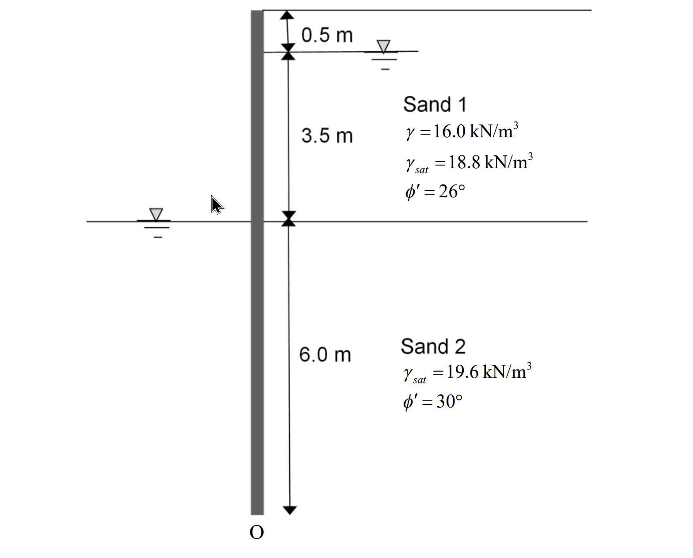

# 考題編號：SM-2020-2

**主分類：** `SM-U2` 淺基礎與深基礎
**副分類：** `SM-U3` 擋土結構與邊坡
**分析法：** 有效應力法
**標籤：** `懸臂式版樁` `滲流效應` `抗砂湧安全係數` `建築物基礎構造設計規範`

---

## 1. 原始題目重述 (Problem Restatement)
二、某共同管溝工程採用明挖覆蓋工法，基地地層主要層為砂土，如下圖所示。開挖深度為 4 m，設計長度 10 m 之懸臂式版樁作為開挖之擋土設施。請繪製作用於版樁兩側之土壓力隨深度變化圖及淨水壓力隨深度變化圖，並在相關深度標示數值？請以簡化法（以土壓力對 O 點之力矩值）估算此擋土壁之破壞安全係數？請估算此開挖擋土設施之抗砂湧安全係數，並請依據「建築物基礎構造設計規範」之規定說明此項安全係數是否符合規範需求？（25 分）

*圖說：本題為懸臂式版樁擋土設施。版樁總長度 10.0 m，開挖深度 4.0 m（版樁尖端為 O 點）。主動側地下水位位於地表下 0.5 m 處。被動側（開挖面）地下水位位於開挖面。土層包含兩層：Sand 1（深度 0~4.0 m）為 $\gamma = 16.0 \text{ kN/m}^3$、$\gamma_{sat} = 18.8 \text{ kN/m}^3$、$\phi' = 26^\circ$；Sand 2（深度 4.0~10.0 m）為 $\gamma_{sat} = 19.6 \text{ kN/m}^3$、$\phi' = 30^\circ$。*

## 2. 考題核心精神與出題者意圖 (Core Concepts & Examiner's Intent)
1. **滲流對土壓力與水壓力的影響：** 本題主被動側水位不同（水頭差 $\Delta H = 3.5\text{ m}$），水流將由主動側往下繞過樁尖流向被動側。出題者刻意要求繪製「淨水壓力圖」與「土壓力圖」，並詢問「抗砂湧安全係數」，強烈暗示必須考慮**穩定滲流（Steady Seepage）**對有效單位重與水壓力分布的修正。
2. **懸臂式版樁的簡化法穩定檢核：** 測驗考生是否熟悉擋土壁破壞安全係數的定義（$FS = M_R / M_O$），並能正確計算各分層土壓力的合力與對樁尖 O 點之力臂。
3. **規範標準的熟稔度：** 測驗考生是否知悉《建築物基礎構造設計規範》中，抗砂湧（Boiling）的安全係數要求為 $FS \ge 1.5$。

## 3. 解題戰略地圖與陷阱分析 (Strategic Roadmap & Trap Analysis)
**戰略地圖：**
1. **滲流分析：** 建立近似流線，計算平均水力坡降 $i$。
2. **修正單位重：** 主動側水流向下（增加有效單位重），被動側水流向上（減小有效單位重）。
3. **計算側向壓力：** 分段計算各深度之有效覆土壓力 $\sigma_v'$、主動/被動土壓力 $p_a$、$p_p$ 及淨水壓力 $u_{net}$。
4. **力矩計算：** 以 O 點為支點，計算主動側推覆力矩 $M_O$ 與被動側抵抗力矩 $M_R$，求出 $FS = M_R / M_O$。
5. **砂湧檢核：** 以臨界水力坡降 $i_{cr}$ 與最大出口坡降 $i_{exit}$ 計算 $FS_{boiling}$ 並與規範比對。

**陷阱分析：**
- **陷阱 1：忽略滲流效應直接用靜水壓力。** 若將淨水壓力算成常數，不但無法反映繞流現象，在計算被動側土壤有效應力時也會高估抵抗力矩，導致不保守。
- **陷阱 2：土層與水位交界的分段錯誤。** Sand 1 的下邊界剛好在開挖面（深度 4.0 m），計算深度 4.0 m 的土壓力時，需區分 $4.0^-$（Sand 1, $K_{a1}$）與 $4.0^+$（Sand 2, $K_{a2}$）。

## 3.5 變數層次分析 (Variable Hierarchy Analysis)

### 最終目標
`繪製淨水壓力與土壓力分布圖，計算對 O 點力矩的破壞安全係數，並檢核抗砂湧安全係數是否合規。`

### 本題關鍵公式（依計算順序）
1. 平均水力坡降：$i = \frac{\Delta H}{L_{flow}}$
2. 滲流修正之有效單位重：$\gamma'_{A} = \gamma_{sub} + \boxed{i}\gamma_w$（主動側向下）、$\gamma'_{P} = \gamma_{sub} - \boxed{i}\gamma_w$（被動側向上）
3. 側向土壓力：$p_a = K_a \boxed{\sigma_v'}$、$p_p = K_p \boxed{\sigma_v'}$
4. 淨水壓力：$u_{net} = u_A - u_P = \gamma_w z_{wA}(1-\boxed{i}) - \gamma_w z_{wP}(1+\boxed{i})$
5. 破壞安全係數：$FS_{wall} = \frac{\sum M_R}{\sum M_O}$
6. 抗砂湧安全係數：$FS_{boiling} = \frac{i_{cr}}{\boxed{i_{max}}}$

### L1：題目直接給定
| 符號 | 數值 | 說明 |
|---|---|---|
| $H$ | $4.0 \text{ m}$ | 開挖深度 |
| $D$ | $6.0 \text{ m}$ | 版樁貫入深度（總長 10 m - 開挖 4 m） |
| $\Delta H$ | $3.5 \text{ m}$ | 主被動側水位落差（4.0 m - 0.5 m） |
| $\gamma_{w}$ | $9.81 \text{ kN/m}^3$ | 水的單位重 |

### L2：需知識點推導
**Phase 1: 滲流與單位重修正**
| 符號 | 公式／來源 | 卡關? |
|---|---|---|
| $i$ | $i = \Delta H / (H_{wA} + 2D)$（簡化平均坡降） | |
| $\gamma'_{A}$ | $\gamma_{sat} - \gamma_w + i\gamma_w$ | |
| $\gamma'_{P}$ | $\gamma_{sat} - \gamma_w - i\gamma_w$ | |

**Phase 2: 土壓力與淨水壓力**
| 符號 | 公式／來源 | 卡關? |
|---|---|---|
| $K_a$ | $\tan^2(45^\circ - \phi'/2)$ | |
| $K_p$ | $\tan^2(45^\circ + \phi'/2)$ | |
| $u_{net}$ | 主動側與被動側水壓力之差 | |

**Phase 3: 穩定分析**
| 符號 | 公式／來源 | 卡關? |
|---|---|---|
| $FS_{wall}$ | $M_R / M_O$（對 O 點取矩） | |
| $FS_{boiling}$ | $i_{cr} / i_{avg}$ | |

### L3：深層知識（不懂就卡住）
| 知識點 | 說明 | 卡關? |
|---|---|---|
| 滲流方向對有效應力之影響 | 水流向下會產生向下之滲流力，增加土體有效單位重；反之則減輕。 | |
| 版樁淨水壓力簡化分布 | 考慮滲流時，淨水壓力在開挖面達最大，並在樁尖處降至 0。 | |
| 《建築物基礎構造設計規範》 | 砂湧安全係數要求 $FS \ge 1.5$。 | |

## 4. 步驟化詳細計算過程 (Step-by-Step Detailed Calculation)

### Step 1：滲流分析與水力坡降計算
主動側水深 $H_{wA} = 4.0 - 0.5 = 3.5 \text{ m}$
版樁貫入深度 $D = 10.0 - 4.0 = 6.0 \text{ m}$
總水頭差 $\Delta H = 3.5 \text{ m}$
依據簡化穩定滲流分析，水流沿版樁兩側繞行，總流徑 $L \approx H_{wA} + D + D = 3.5 + 6.0 \times 2 = 15.5 \text{ m}$
平均水力坡降：
$$ i = \frac{\Delta H}{L} = \frac{3.5}{15.5} = 0.2258 $$

### Step 2：修正有效單位重與土壓力係數
水的單位重取 $\gamma_w = 9.81 \text{ kN/m}^3$。滲流力 $i\gamma_w = 0.2258 \times 9.81 = 2.215 \text{ kN/m}^3$。

**Sand 1 (深度 0 ~ 4.0 m)：**
- $\phi' = 26^\circ \implies K_{a1} = \tan^2(45^\circ - 26^\circ/2) = 0.390$
- 深度 0 ~ 0.5 m (乾土)：$\gamma = 16.0 \text{ kN/m}^3$
- 深度 0.5 ~ 4.0 m (主動側水下，水流向下)：
  $$ \gamma'_{A1} = (\gamma_{sat1} - \gamma_w) + i\gamma_w = (18.8 - 9.81) + 2.215 = 11.205 \text{ kN/m}^3 $$

**Sand 2 (深度 4.0 ~ 10.0 m)：**
- $\phi' = 30^\circ \implies K_{a2} = \tan^2(45^\circ - 30^\circ/2) = 0.333$
- $\phi' = 30^\circ \implies K_{p2} = \tan^2(45^\circ + 30^\circ/2) = 3.0$
- 主動側水下 (水流向下)：
  $$ \gamma'_{A2} = (\gamma_{sat2} - \gamma_w) + i\gamma_w = (19.6 - 9.81) + 2.215 = 12.005 \text{ kN/m}^3 $$
- 被動側水下 (水流向上)：
  $$ \gamma'_{P2} = (\gamma_{sat2} - \gamma_w) - i\gamma_w = (19.6 - 9.81) - 2.215 = 7.575 \text{ kN/m}^3 $$

### Step 3：各深度之應力與壓力值計算
**A. 有效垂直應力 $\sigma_v'$**
- $z = 0 \text{ m}$：$0$
- $z = 0.5 \text{ m}$：$16.0 \times 0.5 = 8.0 \text{ kPa}$
- $z = 4.0 \text{ m}$ (主動側)：$8.0 + 3.5 \times 11.205 = 47.218 \text{ kPa}$
- $z = 10.0 \text{ m}$ (主動側)：$47.218 + 6.0 \times 12.005 = 119.248 \text{ kPa}$
- $z = 10.0 \text{ m}$ (被動側)：開挖面起算，$6.0 \times 7.575 = 45.450 \text{ kPa}$

**B. 側向土壓力 ($p_a, p_p$)**
- **主動側 $p_a$：**
  - $z = 0.5 \text{ m}$：$p_a = 0.390 \times 8.0 = 3.12 \text{ kPa}$
  - $z = 4.0 \text{ m}$ (Sand 1)：$p_a = 0.390 \times 47.218 = 18.41 \text{ kPa}$
  - $z = 4.0 \text{ m}$ (Sand 2)：$p_a = 0.333 \times 47.218 = 15.74 \text{ kPa}$
  - $z = 10.0 \text{ m}$：$p_a = 0.333 \times 119.248 = 39.75 \text{ kPa}$
- **被動側 $p_p$：**
  - $z = 4.0 \text{ m}$：$0$
  - $z = 10.0 \text{ m}$：$p_p = 3.0 \times 45.450 = 136.35 \text{ kPa}$

**C. 淨水壓力 $u_{net}$**
- 水壓公式：$u_A = \gamma_w z_{wA}(1-i)$、$u_P = \gamma_w z_{wP}(1+i)$
- $z = 0.5 \text{ m}$：$u_A = 0 \implies u_{net} = 0$
- $z = 4.0 \text{ m}$：$u_A = 9.81 \times 3.5 \times (1 - 0.2258) = 26.58 \text{ kPa}$，$u_P = 0 \implies u_{net} = 26.58 \text{ kPa}$
- $z = 10.0 \text{ m}$：$u_A = 9.81 \times 9.5 \times 0.7742 = 72.15 \text{ kPa}$，$u_P = 9.81 \times 6.0 \times 1.2258 = 72.15 \text{ kPa} \implies u_{net} = 0$

> **作圖回答：**
> 1. 主動土壓力由 0 (z=0) 增至 3.12 (z=0.5)，再增至 18.41 (z=4.0 上)，突降至 15.74 (z=4.0 下)，再增至 39.75 (z=10.0)。
> 2. 被動土壓力由 0 (z=4.0) 增至 136.35 (z=10.0)。
> 3. 淨水壓力由 0 (z=0.5) 增至 26.58 (z=4.0)，再線性遞減至 0 (z=10.0)。

### Step 4：對 O 點取矩求破壞安全係數
將土壓力及水壓力分布拆解為三角形與矩形，計算合力 ($P$) 及對 O 點的力臂 ($y$)：

**推覆力矩 $M_O$ (主動側)：**
1. $z = 0 \sim 0.5$ (土, 三角)：$P = 0.5 \times 0.5 \times 3.12 = 0.78 \text{ kN/m}$，$y = 9.833 \text{ m}$，$M = 7.67 \text{ kN-m/m}$
2. $z = 0.5 \sim 4.0$ (土, 矩)：$P = 3.5 \times 3.12 = 10.92 \text{ kN/m}$，$y = 7.75 \text{ m}$，$M = 84.63 \text{ kN-m/m}$
3. $z = 0.5 \sim 4.0$ (土, 三角)：$P = 0.5 \times 3.5 \times (18.41 - 3.12) = 26.76 \text{ kN/m}$，$y = 7.167 \text{ m}$，$M = 191.83 \text{ kN-m/m}$
4. $z = 4.0 \sim 10.0$ (土, 矩)：$P = 6.0 \times 15.74 = 94.44 \text{ kN/m}$，$y = 3.0 \text{ m}$，$M = 283.32 \text{ kN-m/m}$
5. $z = 4.0 \sim 10.0$ (土, 三角)：$P = 0.5 \times 6.0 \times (39.75 - 15.74) = 72.03 \text{ kN/m}$，$y = 2.0 \text{ m}$，$M = 144.06 \text{ kN-m/m}$
6. $z = 0.5 \sim 4.0$ (淨水, 三角)：$P = 0.5 \times 3.5 \times 26.58 = 46.52 \text{ kN/m}$，$y = 7.167 \text{ m}$，$M = 333.41 \text{ kN-m/m}$
7. $z = 4.0 \sim 10.0$ (淨水, 三角)：$P = 0.5 \times 6.0 \times 26.58 = 79.74 \text{ kN/m}$，$y = 4.0 \text{ m}$，$M = 318.96 \text{ kN-m/m}$
   - **總推覆力矩 $\sum M_O = 1363.88 \text{ kN-m/m}$**

**抵抗力矩 $M_R$ (被動側)：**
8. $z = 4.0 \sim 10.0$ (土, 三角)：$P = 0.5 \times 6.0 \times 136.35 = 409.05 \text{ kN/m}$，$y = 2.0 \text{ m}$
   - **總抵抗力矩 $\sum M_R = 818.10 \text{ kN-m/m}$**

**破壞安全係數：**
$$ \boxed{FS_{wall} = \frac{\sum M_R}{\sum M_O} = \frac{818.10}{1363.88} = 0.60} $$

### Step 5：抗砂湧安全係數與規範檢核
砂土層（Sand 2）之臨界水力坡降：
$$ i_{cr} = \frac{\gamma_{sub2}}{\gamma_w} = \frac{19.6 - 9.81}{9.81} = 0.998 $$
版樁旁被動側之平均向上出口水力坡降即為 $i = 0.2258$：
$$ \boxed{FS_{boiling} = \frac{i_{cr}}{i} = \frac{0.998}{0.2258} = 4.42} $$
依據《建築物基礎構造設計規範》第 5.3.3 節規定，防止砂湧發生之安全係數應大於或等於 1.5。
**結論：** $\boxed{4.42 \ge 1.5 \text{，故符合規範需求。}}$

## 5. 關鍵爭議點與進階探討 (Critical Issues & Advanced Discussion)
1. **靜水壓力 vs. 滲流壓力：** 在部分簡化考題中，考生可能會忽略滲流效應而採用「靜水壓力」假定。若採用靜水壓力，開挖面以下的淨水壓力將呈現 $3.5\gamma_w$ 的常數分布（矩形）。但本題明確在後續子題詢問「砂湧」，證明土體中必然存在水頭差造成的滲流網，因此採用繞流折減水壓與修正有效單位重是嚴謹且被期望的解法。
2. **破壞安全係數偏低：** 本題計算所得 $FS \approx 0.60 < 1.0$，代表懸臂式版樁在此開挖條件下是不穩定的。實務上在砂土中開挖 4 m 深度，懸臂式擋土的變形量過大且極易產生傾覆破壞，通常需設置內支撐（Strut）或地錨（Anchor）才能確保穩定。此計算結果反映了工程實務的限制。
