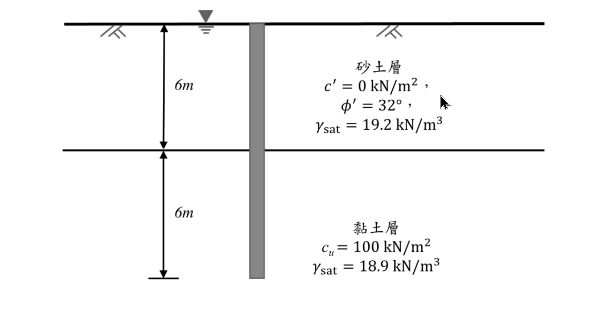

# 考題編號：SM-2021-3

**主分類：** `SM-U2-2 深基礎之支承力與沉陷量`
**分析法：** 有效應力法與總應力法混合
**標籤：** `容許支承力` `拉拔力` `α法` `β法` `有效重量`

---

## 1. 原始題目重述 (Problem Restatement)

有一長度 12 m，直徑 60 cm 之圓形預鑄混凝土基樁，貫入於 6 m 厚之砂土層及其下之黏土層中，地下水位於地表面。已知土壤與基樁參數如下：
- **砂土層** (0~6 m)：$c'= 0 \text{ kN/m}^2$，$ \phi'= 32^\circ $，$ \gamma_{\text{sat}} = 19.2 \text{ kN/m}^3 $
- **黏土層** (6~12 m)：$c_u = 100 \text{ kN/m}^2$，$ \gamma_{\text{sat}} = 18.9 \text{ kN/m}^3 $
- **基樁參數**：長度 $L = 12 \text{ m}$，直徑 $D = 0.6 \text{ m}$，混凝土單位重 $\gamma_c = 24 \text{ kN/m}^3$
- **相關係數與附註**：
  1. 側向土壓力係數 $K = 1.4 K_o$
  2. 砂土與混凝土基樁之介面摩擦角 $\delta' = 0.8 \phi'$
  3. 黏土層之附著力係數 $\alpha = 0.65$
  4. 黏土層之基樁承載值因數 $N_c^* = 9$ (於 $\phi=0^\circ$ 時)
  5. 設計安全係數 $FS = 3$

**求解：**
(一) 計算此基樁之容許垂直支承力。
(二) 計算此基樁之容許拉拔力。

*圖說：基樁直徑 60 cm，總長 12 m。上半部 6 m 位於砂土層，下半部 6 m 位於黏土層，地下水位於地表。*

## 2. 考題核心精神與出題者意圖 (Core Concepts & Examiner's Intent)

本題旨在測驗考生對於**深基礎（基樁）垂直承載力與拉拔力**的綜合計算能力，包含：
1. **分層土壤之摩擦力計算**：砂土層需使用有效應力法（$\beta$ 法之變形，利用給定的 $K$ 與 $\delta'$），而黏土層需使用總應力法（$\alpha$ 法）。
2. **基樁端點承載力**：辨識出樁尖位於黏土層中，需使用不排水抗剪強度 $c_u$ 計算端點承載力。
3. **拉拔力與自重效應**：計算拉拔力時，基樁的**有效重量**（浮力扣除後之重量）為抗拉拔之可靠來源，此為提供混凝土單位重的核心意圖。

## 3. 解題戰略地圖與陷阱分析 (Strategic Roadmap & Trap Analysis)

**解題策略：**
1. **幾何與基本參數**：先計算基樁之斷面積 $A_p$、周長 $p$、體積 $V_p$ 及有效單位重。
2. **樁身摩擦力 ($Q_s$)**：
   - **砂土層 ($Q_{s1}$)**：計算深度 0~6 m 處的有效覆土壓力 $\sigma_v'$，求出平均有效應力 $\bar{\sigma}_v'$，再代入 $f_s = K \bar{\sigma}_v' \tan\delta'$ 求解。
   - **黏土層 ($Q_{s2}$)**：直接利用 $\alpha$ 法，$f_s = \alpha c_u$ 求解。
3. **樁端承載力 ($Q_p$)**：利用 $q_p = c_u N_c^*$ 求解。
4. **容許垂直支承力**：將總極限承載力除以安全係數 $FS=3$。
5. **容許拉拔力**：極限拉拔力為總摩擦力 $Q_s$ 加上基樁之有效重量 $W_p'$。通常自重為常數不折減，故 $T_a = Q_s/FS + W_p'$。

**陷阱分析：**
- **陷阱 1：地下水位影響（浮力）**。水位在地表，全區土壤及基樁均在水下，所有單位重均需扣除水的單位重（$\gamma_w = 9.81 \text{ kN/m}^3$）轉為有效單位重。
- **陷阱 2：黏土層之 $\gamma_{\text{sat}}$ 用途**。黏土層的摩擦力採用 $\alpha$ 法，與有效應力無關；端點承載力 $q_{p,\text{net}} = c_u N_c^*$ 亦與有效應力無關。因此，$\gamma_{\text{sat}} = 18.9 \text{ kN/m}^3$ 在淨承載力算法中為多餘資訊（Distractor）。若採用總承載力法才需要用到。
- **陷阱 3：拉拔力之安全係數應用**。基樁自重 $W_p'$ 屬於重力抵抗，其值確定性高，實務上通常不除以安全係數，即 $T_a = (Q_s/FS) + W_p'$，而非 $(Q_s + W_p')/FS$。

## 3.5 變數層次分析 (Variable Hierarchy Analysis)

### 最終目標
計算基樁的容許垂直支承力 $Q_{a,\text{comp}}$ 與容許拉拔力 $Q_{a,\text{uplift}}$。

### 本題關鍵公式（依計算順序）
1. 砂土層底部有效應力：
   $$ \sigma'_{v,6m} = (\gamma_{\text{sat,sand}} - \gamma_w) \cdot L_{\text{sand}} $$
2. 砂土層樁身摩擦力：
   $$ Q_{s1} = K \cdot \left(\frac{0 + \boxed{\sigma'_{v,6m}}}{2}\right) \cdot \tan\delta' \cdot (\pi D) \cdot L_{\text{sand}} $$
3. 黏土層樁身摩擦力：
   $$ Q_{s2} = \alpha \cdot c_u \cdot (\pi D) \cdot L_{\text{clay}} $$
4. 樁端淨承載力：
   $$ Q_p = c_u \cdot N_c^* \cdot \frac{\pi}{4} D^2 $$
5. 容許垂直支承力：
   $$ Q_{a,\text{comp}} = \frac{\boxed{Q_{s1}} + \boxed{Q_{s2}} + \boxed{Q_p}}{FS} $$
6. 基樁有效重量：
   $$ W'_p = (\gamma_{\text{pile}} - \gamma_w) \cdot \frac{\pi}{4} D^2 \cdot L_{\text{total}} $$
7. 容許拉拔力：
   $$ Q_{a,\text{uplift}} = \frac{\boxed{Q_{s1}} + \boxed{Q_{s2}}}{FS} + \boxed{W'_p} $$

### L1：題目直接給定
| 符號 | 數值 | 說明 |
|---|---|---|
| $D$ | $0.6 \text{ m}$ | 基樁直徑 |
| $L_{\text{sand}}$ | $6 \text{ m}$ | 砂土層中樁長 |
| $L_{\text{clay}}$ | $6 \text{ m}$ | 黏土層中樁長 |
| $\gamma_{\text{sat,sand}}$ | $19.2 \text{ kN/m}^3$ | 砂土層飽和單位重 |
| $\phi'$ | $32^\circ$ | 砂土有效摩擦角 |
| $c_u$ | $100 \text{ kN/m}^2$ | 黏土不排水抗剪強度 |
| $FS$ | $3$ | 安全係數 |
| $K$ | $1.4 K_o$ | 側向土壓力係數 |
| $\delta'$ | $0.8 \phi'$ | 樁-土介面摩擦角 |
| $\alpha$ | $0.65$ | 黏土附著力係數 |
| $N_c^*$ | $9$ | 黏土層基樁承載值因數 |
| $\gamma_{\text{pile}}$ | $24 \text{ kN/m}^3$ | 混凝土單位重 |

### L2：需知識點推導
**砂土層參數與摩擦力**
| 符號 | 公式／來源 | 卡關? |
|---|---|---|
| $K_o$ | $1 - \sin\phi'$ | |
| $\sigma'_{v,6m}$ | $(\gamma_{\text{sat,sand}} - \gamma_w) \cdot L_{\text{sand}}$ | |
| $f_{s1}$ | $K \cdot \bar{\sigma}'_v \cdot \tan\delta'$ | |

**拉拔力與自重**
| 符號 | 公式／來源 | 卡關? |
|---|---|---|
| $W'_p$ | $V_p \cdot (\gamma_{\text{pile}} - \gamma_w)$ | |

### L3：深層知識（不懂就卡住）
| 知識點 | 說明 | 卡關? |
|---|---|---|
| **浮力效應** | 地下水位在地表，所有土壤與基樁自重皆需使用「有效單位重（$\gamma'$）」計算。 | |
| **拉拔力折減邏輯** | 極限拉拔力包含土壤摩擦力與基樁有效自重，但安全係數通常只折減土壤摩擦力，自重為恆載不折減。 | |

## 4. 步驟化詳細計算過程 (Step-by-Step Detailed Calculation)

本題計算統一取水的單位重 $\gamma_w = 9.81 \text{ kN/m}^3$。

### Step 1：基樁幾何性質計算
- 樁截面積：$A_p = \frac{\pi}{4} D^2 = \frac{\pi}{4} \times (0.6)^2 = 0.2827 \text{ m}^2$
- 樁周長：$p = \pi D = \pi \times 0.6 = 1.8850 \text{ m}$
- 樁總長度：$L = L_{\text{sand}} + L_{\text{clay}} = 6 + 6 = 12 \text{ m}$
- 樁總體積：$V_p = A_p \times L = 0.2827 \times 12 = 3.3929 \text{ m}^3$
- 基樁有效重量：
  $$ W_p' = V_p \times (\gamma_{\text{pile}} - \gamma_w) = 3.3929 \times (24 - 9.81) = 3.3929 \times 14.19 = 48.15 \text{ kN} $$

### Step 2：計算砂土層之樁身摩擦力 ($Q_{s1}$)
深度區間：$0 \sim 6 \text{ m}$
- 砂土有效單位重：$\gamma'_{s} = 19.2 - 9.81 = 9.39 \text{ kN/m}^3$
- 靜止土壓力係數（Jaky 經驗公式）：$K_o = 1 - \sin(32^\circ) = 1 - 0.5299 = 0.4701$
- 側向土壓力係數：$K = 1.4 \times K_o = 1.4 \times 0.4701 = 0.6581$
- 介面摩擦角：$\delta' = 0.8 \times 32^\circ = 25.6^\circ$ ($\tan 25.6^\circ = 0.4791$)
- 砂土層底部 ($z=6\text{m}$) 之有效覆土壓力：
  $$ \sigma'_{v,6} = \gamma'_{s} \times 6 = 9.39 \times 6 = 56.34 \text{ kN/m}^2 $$
- 砂土層平均單位摩擦力：
  $$ f_{s1} = K \cdot \bar{\sigma}'_v \cdot \tan\delta' = 0.6581 \times \left(\frac{0 + 56.34}{2}\right) \times 0.4791 = 8.88 \text{ kN/m}^2 $$
- 砂土層摩擦力：
  $$ Q_{s1} = f_{s1} \cdot p \cdot L_{\text{sand}} = 8.88 \times 1.8850 \times 6 = 100.46 \text{ kN} $$

### Step 3：計算黏土層之樁身摩擦力 ($Q_{s2}$)
深度區間：$6 \sim 12 \text{ m}$
- 黏土層單位摩擦力（$\alpha$ 法）：
  $$ f_{s2} = \alpha \cdot c_u = 0.65 \times 100 = 65 \text{ kN/m}^2 $$
- 黏土層摩擦力：
  $$ Q_{s2} = f_{s2} \cdot p \cdot L_{\text{clay}} = 65 \times 1.8850 \times 6 = 735.15 \text{ kN} $$
> **策略註解**：總樁身摩擦力 $Q_s = Q_{s1} + Q_{s2} = 100.46 + 735.15 = 835.61 \text{ kN}$。

### Step 4：計算樁端承載力 ($Q_p$)
樁端位於深度 $12 \text{ m}$ 處（黏土層中）。
- 單位淨端點承載力：
  $$ q_p = c_u \cdot N_c^* = 100 \times 9 = 900 \text{ kN/m}^2 $$
- 樁端淨承載力：
  $$ Q_p = q_p \cdot A_p = 900 \times 0.2827 = 254.43 \text{ kN} $$

### Step 5：(一) 計算容許垂直支承力 ($Q_{a,\text{comp}}$)
極限淨垂直承載力 $Q_{u,\text{net}}$ 等於總摩擦力加端點淨承載力：
$$ Q_{u,\text{net}} = Q_s + Q_p = 835.61 + 254.43 = 1090.04 \text{ kN} $$
容許垂直支承力：
$$ Q_{a,\text{comp}} = \frac{Q_{u,\text{net}}}{FS} = \frac{1090.04}{3} = \boxed{363.35 \text{ kN}} $$

### Step 6：(二) 計算容許拉拔力 ($Q_{a,\text{uplift}}$)
極限拉拔力 $T_u$ 由土壤側摩擦力與基樁有效自重共同抵抗：
$$ T_u = Q_s + W_p' $$
> **策略註解**：考量基樁自重屬於確定性高的重力抵抗，實務上安全係數通常僅針對「土壤抗力（摩擦力）」進行折減。
容許拉拔力：
$$ Q_{a,\text{uplift}} = \frac{Q_s}{FS} + W_p' = \frac{835.61}{3} + 48.15 = 278.54 + 48.15 = \boxed{326.69 \text{ kN}} $$

## 5. 關鍵爭議點與進階探討 (Critical Issues & Advanced Discussion)

1. **淨承載力與總承載力之差異**：
   - 本解析採用**淨承載力法（Net Bearing Capacity）**，即視 $c_u N_c^*$ 為淨抗力，並忽略基樁有效重量與被開挖土壤有效重量之間的差異，此為深基礎分析最常被接受的作法。
   - 若採用**總承載力法（Gross Bearing Capacity）**，端點總承載力為 $q_{p,\text{gross}} = c_u N_c^* + \sigma'_{v,\text{tip}}$。此時 $\sigma'_{v,\text{tip}} = 6 \times 9.39 + 6 \times (18.9 - 9.81) = 110.88 \text{ kPa}$。這解釋了題目給定黏土層 $\gamma_{\text{sat}} = 18.9 \text{ kN/m}^3$ 的可能用途。然而，若以總承載力除以 FS 後再扣除基樁重量求容許結構載重（$P_{\text{allow}} = Q_{u,\text{gross}}/FS - W_p'$），概念上會將上覆土重帶入折減，學理上並不完全合理，故推薦使用淨承載力法。

2. **拉拔力安全係數折減對象**：
   - 本文採用 $T_a = (Q_s / FS) + W_p'$，將安全係數僅施加於不確定性較高的土壤摩擦力。
   - 某些考場解法可能採用較保守的整體折減公式 $T_a = (Q_s + W_p') / FS$。若採此法，容許拉拔力為 $(835.61 + 48.15) / 3 = 294.59 \text{ kN}$。考場上強烈建議寫出算式以明示自身採用的折減邏輯，通常前者的工程學理基礎更為堅實。

3. **水單位重的選用**：
   - 本題未指明水的單位重，採 $\gamma_w = 9.81 \text{ kN/m}^3$ 或 $10 \text{ kN/m}^3$ 皆屬合理範圍。若採 $\gamma_w = 10 \text{ kN/m}^3$，求得之 $Q_{a,\text{comp}} \approx 362.7 \text{ kN}$、$Q_{a,\text{uplift}} \approx 325.4 \text{ kN}$，差異均在 1% 內，不影響給分。
