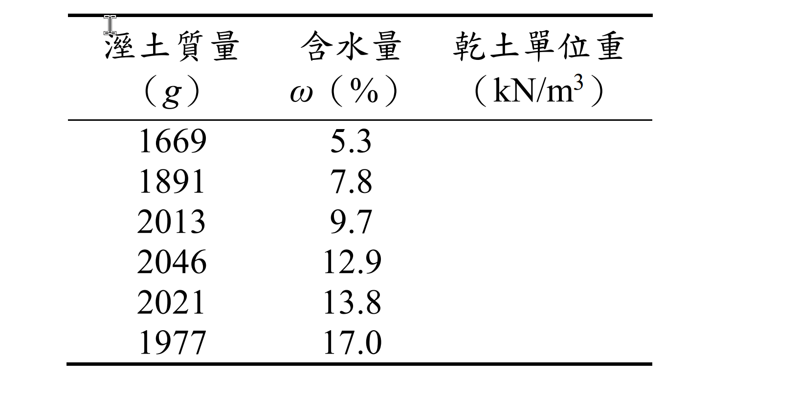
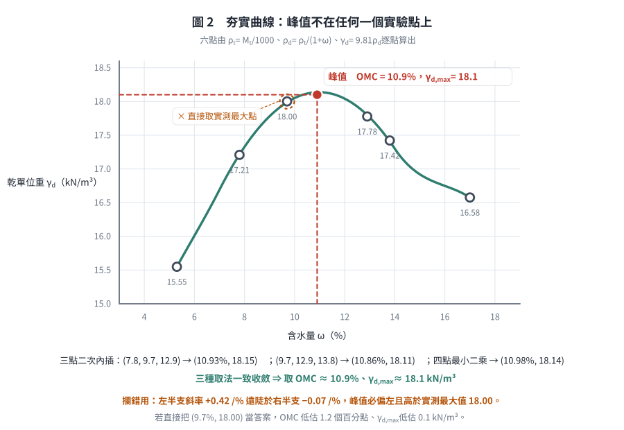
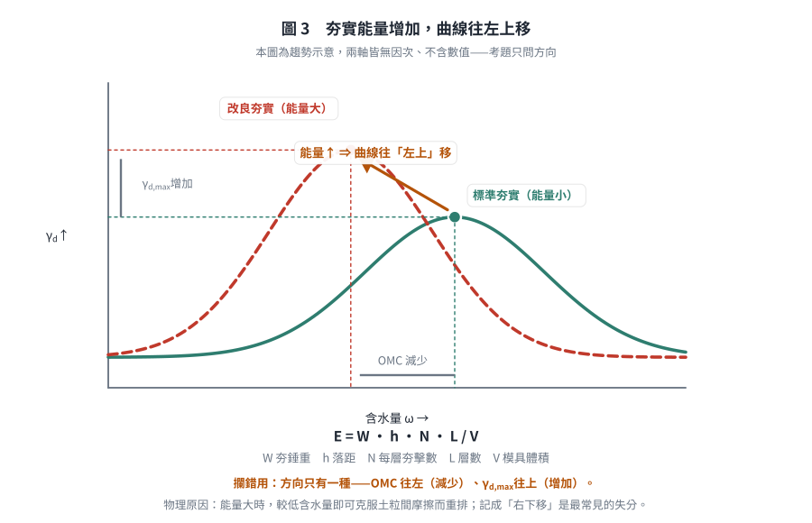

# 考題編號：SM-2022-1

**主分類：** `SM-U1-3` 土壤夯實及壓密
**副分類：** 無
**分析法：** 混合
**標籤：** `夯實試驗` `最佳含水量` `最大乾單位重` `夯實能量` `夯實曲線`
---

## 1. 原始題目重述 (Problem Restatement)
一、請回答下列關於夯實試驗的問題：
(一) 請敘明土壤夯實的原理。（5 分）
(二) 標準夯實試驗模具體積為 1000 $\text{cm}^3$ 時，請依下表實驗結果繪製標準夯實曲線圖，並標明最大乾單位重及最佳含水量值。（5 分）

| 溼土質量(g) | 1669 | 1891 | 2013 | 2046 | 2021 | 1977 |
|:---:|:---:|:---:|:---:|:---:|:---:|:---:|
| 含水量 $\omega$(%) | 5.3 | 7.8 | 9.7 | 12.9 | 13.8 | 17.0 |

(三) 請敘明影響夯實能量的相關參數，（5 分）若夯實能量增加對夯實曲線、最佳含水量及最大乾單位重的影響為何？（10 分）

*圖說：考卷第（二）小題的原始表格。與上方本解析轉錄之表格內容完全一致，但原表為**直式三欄**排列：*

| 溼土質量 (g) | 含水量 $\omega$ (%) | 乾土單位重 (kN/m³) |
|:---:|:---:|:---:|
| 1669 | 5.3 | （留空待填） |
| 1891 | 7.8 | （留空待填） |
| 2013 | 9.7 | （留空待填） |
| 2046 | 12.9 | （留空待填） |
| 2021 | 13.8 | （留空待填） |
| 1977 | 17.0 | （留空待填） |

*關鍵訊息：原表**第三欄「乾土單位重 (kN/m³)」為空白欄**，且欄位單位已明訂為 $\text{kN/m}^3$。這代表出題者要求考生（1）自行由溼土質量與含水量推算乾土單位重、（2）填入該欄、（3）再據以繪製夯實曲線；同時也確認了作答單位應為 $\text{kN/m}^3$（即需乘上重力加速度），而非僅停留在 $\text{g/cm}^3$ —— 此點與 §5 關於單位選擇的討論直接相關。*

## 2. 考題核心精神與出題者意圖 (Core Concepts & Examiner's Intent)
- **夯實原理與目的**：測驗考生是否了解夯實是藉由排除空氣來增加土壤密實度。
- **實驗數據處理**：測驗考生是否熟悉如何從溼質量和含水量推算乾單位重，並尋求最大值。
- **夯實能量影響**：測驗考生對不同夯實能量（如標準夯實與改良夯實）下，最佳含水量與最大乾單位重變化趨勢的掌握。

## 3. 解題戰略地圖與陷阱分析 (Strategic Roadmap & Trap Analysis)
- **第一步**：清楚說明夯實是「排出空氣」而非「排出水分」（排出水分為壓密）。
- **第二步**：利用公式 $\gamma_t = \frac{W}{V}$ 及 $\gamma_d = \frac{\gamma_t}{1 + \omega}$ 計算各點乾單位重。
- **第三步**：繪製或說明夯實曲線的趨勢，並在曲線上內插找出 $\gamma_{d,max}$ 與最佳含水量 $\omega_{opt}$。
- **第四步**：列出夯實能量的計算公式 $E = \frac{W \cdot h \cdot N \cdot L}{V}$，並說明能量增加時曲線左上移。
- **陷阱**：計算乾單位重時，需注意單位換算（$\text{g/cm}^3$ 換算為 $\text{kN/m}^3$ 時，常取重力加速度 $g = 9.81 \text{ m/s}^2$）。

## 3.5 變數層次分析 (Variable Hierarchy Analysis)

### 最終目標
`計算並繪製夯實曲線，並說明夯實原理與能量影響。`

### 本題關鍵公式（依計算順序）
1. 溼密度計算：
$$ \rho_t = \frac{M_t}{V} $$
2. 乾密度計算：
$$ \rho_d = \frac{\boxed{\rho_t}}{1 + \omega} $$
3. 乾單位重計算（若需換算至 $\text{kN/m}^3$）：
$$ \gamma_d = \boxed{\rho_d} \cdot g $$
4. 夯實能量公式：
$$ E = \frac{W \cdot h \cdot N \cdot L}{V} $$

### L1：題目直接給定
- $V$ ∣ $1000 \text{ cm}^3$ ∣ 試驗用模具體積
- $M_t$ ∣ 各組不同 ∣ 溼土質量
- $\omega$ ∣ 各組不同 ∣ 含水量

### L2：需知識點推導
- **溼密度 $\rho_t$** ∣ $\rho_t = \frac{M_t}{V}$ ∣ 
- **乾密度 $\rho_d$** ∣ $\rho_d = \frac{\rho_t}{1 + \omega}$ ∣ 
- **乾單位重 $\gamma_d$** ∣ $\gamma_d = \rho_d \cdot 9.81$ ∣ 

### L3：深層知識（不懂就卡住）
- **夯實機制** ∣ 夯實是瞬間動能作用，主要排除土壤中的「空氣」，與壓密排除「水分」不同。 ∣ 
- **能量影響趨勢** ∣ 能量增加會使曲線向「左上方」移動。 ∣ 

## 4. 步驟化詳細計算過程 (Step-by-Step Detailed Calculation)

### (一) 土壤夯實的原理
土壤夯實（Compaction）是藉由施加機械能量（如重錘敲擊、滾壓或震動），迫使土粒重新排列並相互緊密靠攏，在此過程中**排除土壤孔隙中的空氣**，從而增加土壤密度與單位重的過程。
**主要目的**：增加土壤的抗剪強度、降低其壓縮性（減少後續沉陷量）、降低滲透性，以及減少液化潛能。

### (二) 實驗結果計算與夯實曲線繪製
1. **計算公式**：
   - 溼密度 $\rho_t = \frac{M_t}{V} \text{ (g/cm}^3\text{)}$
   - 乾密度 $\rho_d = \frac{\rho_t}{1 + \omega} \text{ (g/cm}^3\text{)}$
   - 乾單位重 $\gamma_d = \rho_d \times 9.81 \text{ (kN/m}^3\text{)}$

2. **計算表格**：

| 試驗點 | 含水量 $\omega$ (%) | 溼土質量 $M_t$ (g) | 溼密度 $\rho_t$ ($\text{g/cm}^3$) | 乾密度 $\rho_d$ ($\text{g/cm}^3$) | 乾單位重 $\gamma_d$ ($\text{kN/m}^3$) |
|:---:|:---:|:---:|:---:|:---:|:---:|
| 1 | 5.3 | 1669 | 1.669 | 1.585 | 15.55 |
| 2 | 7.8 | 1891 | 1.891 | 1.754 | 17.21 |
| 3 | 9.7 | 2013 | 2.013 | 1.835 | 18.00 |
| 4 | 12.9 | 2046 | 2.046 | 1.812 | 17.78 |
| 5 | 13.8 | 2021 | 2.021 | 1.776 | 17.42 |
| 6 | 17.0 | 1977 | 1.977 | 1.690 | 16.58 |

3. **夯實曲線與最佳值判斷**：
   - 根據表格數據，可繪製以含水量 $\omega$ 為橫軸、乾單位重 $\gamma_d$ 為縱軸的關係曲線（為一開口向下的拋物線）。
   - 資料點在 $\omega = 9.7\%$ 時 $\gamma_d = 18.00 \text{ kN/m}^3$，在 $\omega = 12.9\%$ 時 $\gamma_d = 17.78 \text{ kN/m}^3$。
   - 峰值不落在任何一個實驗點上，須內插。取峰值附近三點作二次（拋物線）內插，
     以頂點 $\omega_{opt} = -\dfrac{b}{2a}$ 求得（$\gamma_d = a\omega^2 + b\omega + c$）：

| 取用之三點 $\omega$(%) | $\omega_{opt}$ (%) | $\gamma_{d,max}$ (kN/m³) |
|:---:|:---:|:---:|
| 7.8、9.7、12.9 | 10.93 | 18.15 |
| 9.7、12.9、13.8 | 10.86 | 18.11 |
| 7.8、9.7、12.9、13.8（最小二乘） | 10.98 | 18.14 |

   - 三種取法一致收斂，故推估結果為：
     - **最佳含水量（OMC）**：約 $\boxed{10.9 \%}$
     - **最大乾單位重（$\gamma_{d,max}$）**：約 $\boxed{18.1 \text{ kN/m}^3} \text{ (或 } 1.85 \text{ g/cm}^3\text{)}$
   - 與 §5 所述一致：峰值（18.1）確實高於實測最大值（$\omega = 9.7\%$ 時的 18.00），
     且落在 9.7% 與 12.9% 之間偏左側——因為左半支斜率（$+0.42$ /%）遠陡於右半支（$-0.07$ /%）。

*圖 2　夯實曲線與峰值內插。它攔的是把 $\gamma_{d,max}$ 直接取在實測最大點 $(9.7\%,\ 18.00)$：左半支斜率 $+0.42$ /% 遠陡於右半支 $-0.07$ /%，峰值必定偏左且高於實測最大值，三種內插取法（兩組三點、一組四點最小二乘）一致收斂到 $\omega_{opt} \approx 10.9\%$、$\gamma_{d,max} \approx 18.1$ kN/m³。*

### (三) 影響夯實能量的相關參數及能量增加的影響

1. **影響夯實能量的參數**：
   以實驗室夯實試驗為例，施加於單位體積土壤之夯實能量 $E$ 的公式為：
   $$ E = \frac{W \cdot h \cdot N \cdot L}{V} $$
   相關參數包含：
   - $W$：夯錘重量
   - $h$：夯錘落距
   - $N$：每一層的夯擊次數
   - $L$：土壤分層夯實的層數
   - $V$：模具體積

2. **夯實能量增加的影響**：
   若夯實能量增加（例如從標準夯實改為改良式夯實），對夯實特性的影響如下：
   - **對夯實曲線的影響**：整條曲線會向**左上方**移動。
   - **最佳含水量（OMC）**：會**減少**（曲線向左移）。因為較高的能量能在較低含水量下，提早克服土粒間的摩擦力達到密實。
   - **最大乾單位重（$\gamma_{d,max}$）**：會**增加**（曲線向上移）。因為更大的能量可使土粒排列更緊密，進一步降低孔隙比。

*圖 3　夯實能量增加時曲線的移動方向（趨勢示意，兩軸無因次、不含數值）。它攔的是把方向記反：能量增加只有一種結果 —— OMC 往左（減少）、$\gamma_{d,max}$ 往上（增加），記成「右下移」是本小題最常見的失分。*

## 5. 關鍵爭議點與進階探討 (Critical Issues & Advanced Discussion)
- **單位的選擇**：在國家考試中，單位重 $\gamma_d$ 經常直接使用 $\text{g/cm}^3$ 或 $\text{t/m}^3$ 計算（即將密度視為單位重）。若考場時間不足，標註 $\text{g/cm}^3$ 並繪圖即可；嚴格物理定義下，建議乘上重力加速度轉換為 $\text{kN/m}^3$ 或標明是乾密度 $\rho_d$。
- **曲線頂點內插**：考試時需手繪平滑曲線。因為最高點（即 OMC）通常不會剛好落在試驗測出的數據點上，必須根據兩側斜率來合理畫出頂部平滑的拋物線，通常最大點會略高於實驗所量測到的最大數據值。

---

*解析日期：見 `wiki/log.md`　｜　圖解補繪：2026-08-28（向量 SVG，程式繪製，腳本 `gen_SM-2022-1.py` 可重跑；同名 2× PNG 供簡報／影片管線使用）*
