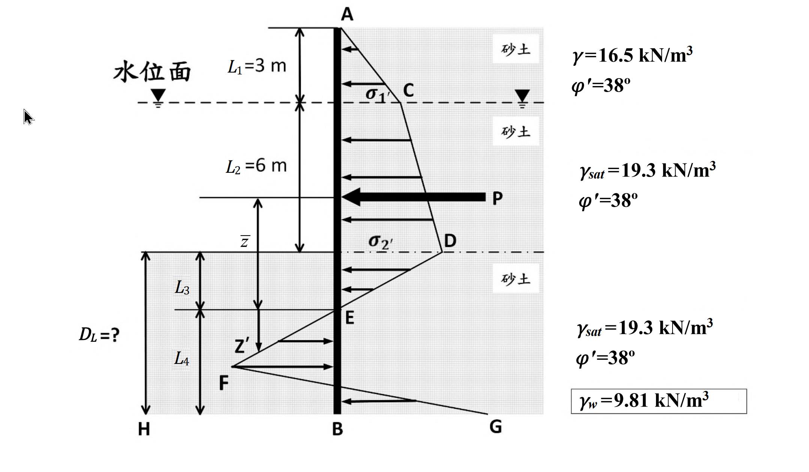

# 考題編號：[SM-2022-4]

**主分類：** `SM-U3` 側向土壓力與擋土結構物
**副分類：** `SM-U3-2` 擋土結構物穩定分析
**分析法：** 有效應力法
**標籤：** `鋼板樁` `懸臂式擋土牆` `側向土壓力` `淨壓力法`

---

## 1. 原始題目重述 (Problem Restatement)
本題要求計算懸臂式鋼板樁貫入至砂土層時，在安全係數為 1 ($FS=1$) 時的最小臨界貫入深度 $D_L$。

題目給定條件：
- **頂層土壤（地下水位以上）**：厚度 $L_1 = 3\text{ m}$，濕砂土，單位重 $\gamma = 16.5\text{ kN/m}^3$，有效摩擦角 $\phi' = 38^\circ$。
- **第二層土壤（地下水位至開挖面）**：厚度 $L_2 = 6\text{ m}$，飽和砂土，飽和單位重 $\gamma_{sat} = 19.3\text{ kN/m}^3$，$\phi' = 38^\circ$。
- **第三層土壤（開挖面以下）**：同第二層，飽和砂土，$\gamma_{sat} = 19.3\text{ kN/m}^3$，$\phi' = 38^\circ$。
- **水**：單位重 $\gamma_w = 9.81\text{ kN/m}^3$。
- 鋼板樁貫入開挖面以下的深度為 $D_L$。

考卷並提供了一系列淨土壓力法（Net Pressure Method）分析鋼板樁深度的參考公式，包含土壓力係數 $K_a$、$K_p$，以及決定零淨壓力點以下深度 $L_4$ 的四次方方程式參數 $A_1 \sim A_4$。

*圖說：懸臂式鋼板樁之**淨土壓力分布圖**，同時定義了後續四次方程式所有符號的幾何位置。*

***點位定義（由上而下）**：*
*・**A**＝鋼板樁頂端（地表）；*
*・**C**＝地下水位面，位於 A 點下方 $L_1 = 3$ m，該處淨主動壓力記為 $\sigma_1'$；*
*・**D**＝開挖面（挖掘底面），位於 C 點下方 $L_2 = 6$ m，該處淨主動壓力記為 $\sigma_2'$（為 A→D 全段的壓力最大值）；*
*・**E**＝**零淨壓力點**，位於 D 點下方 $L_3$，此點淨土壓力為 0（主動與被動抵銷）；*
*・**F**／**G**＝樁底附近被動側壓力分布的控制點，位於 E 點下方 $L_4$；*
*・**B**＝鋼板樁底端。*

***尺寸定義**：$\bar{z}$ 為 A→E 段主動土壓力合力 $P$ 的作用點至 **E 點**的距離（圖中以自 P 作用線量至 E 之尺寸線標示）；$z'$ 為 E→B 段的局部深度座標。待求的**貫入深度** $D_L = L_3 + L_4$（自開挖面 D 量至樁底 B）。*

***壓力分布形狀**：A→C→D 為向左（開挖側）逐段遞增的主動側折線分布，在 D 點達 $\sigma_2'$；粗箭頭 $P$ 標示該段主動壓力之合力。D→E 段壓力由 $\sigma_2'$ 線性遞減至 E 點的 0。E→B 段壓力反向（指向右／擋土側）並線性增大，於樁底 B 點達最大值 G。*

***土層參數（圖右側標註）**：水位面以上濕砂 $\gamma = 16.5$ kN/m³、$\phi' = 38^\circ$；水位面至開挖面之飽和砂 $\gamma_{sat} = 19.3$ kN/m³、$\phi' = 38^\circ$；開挖面以下之飽和砂同為 $\gamma_{sat} = 19.3$ kN/m³、$\phi' = 38^\circ$；框註 $\gamma_w = 9.81$ kN/m³。三層 $\phi'$ 相同，故 $K_a$、$K_p$ 全深度共用同一組值。*

## 2. 考題核心精神與出題者意圖 (Core Concepts & Examiner's Intent)
- **核心觀念**：懸臂式鋼板樁於砂土中的穩定性分析（淨壓力分布法）。懸臂板樁在開挖面下因旋轉行為，兩側發生主被動土壓力互換。
- **出題者意圖**：測驗考生是否熟悉如何計算淨土壓力分布、主動土壓力合力 $P$ 及其作用點位置 $\bar{z}$，並能正確代入懸臂板樁平衡推導出的四次方程式來求解貫入深度 $D_L$。

## 3. 解題戰略地圖與陷阱分析 (Strategic Roadmap & Trap Analysis)
1. **計算土壤參數與壓力係數**：各層有效單位重與 $K_a, K_p$。
2. **計算開挖面以上側向力**：求出開挖面上方兩側土層的主動土壓力分布。注意水位以下需使用有效應力計算土壓力，且開挖面兩側水壓力因相互抵消不產生淨水壓。
3. **定位零淨壓力點 ($L_3$)**：開挖面下，主動與被動土壓力相互抵消處即為淨壓力等於零的位置，該深度為 $L_3$。
4. **計算合力 $P$ 與力臂 $\bar{z}$**：將開挖面以上至零淨壓力點上方的主動土壓力合力 $P$ 算出，並對零淨壓力點取矩求合力作用點距離 $\bar{z}$。
5. **求解四次方程式 ($L_4$)**：將算出之變數代入題目提供的 $A_1 \sim A_4$ 中，並解四次方方程式取得 $L_4$。
6. **最終貫入深度**：求出 $D_L = L_3 + L_4$。

**陷阱分析：**
- ⚠ **有效應力計算**：水位以下必須扣除水壓使用有效單位重 $\gamma'$，若誤用飽和單位重 $\gamma_{sat}$ 會導致全錯。
- ⚠ **合力力臂基準點**：$\bar{z}$ 是對「零淨壓力點」取矩計算，不可誤對開挖面取矩。
- ⚠ **方程式常數極長**：四次方程參數 $A_1 \sim A_4$ 的算式複雜，計算極易發生按錯計算機的失誤，應將各項中間變數先求出再代入。

## 3.5 變數層次分析 (Variable Hierarchy Analysis)

### 最終目標
求出滿足靜力平衡之板樁貫入深度 $D_L$。

### 本題關鍵公式（依計算順序）
$$K_a = \tan^2(45^\circ - \phi'/2) \quad ; \quad K_p = \tan^2(45^\circ + \phi'/2)$$
$$p_{a2} = \gamma L_1 K_a \quad ; \quad p_{a3} = (\gamma L_1 + \gamma' L_2) K_a$$
$$L_3 = \frac{\boxed{p_{a3}}}{\gamma'(K_p - K_a)}$$
$$P = \Sigma P_i \quad \text{（零壓力點以上的淨主動壓力合力）}$$
$$M = \Sigma P_i \cdot z_i \quad ; \quad \bar{z} = \frac{\boxed{M}}{\boxed{P}}$$
$$L_4^4 + A_1 L_4^3 - A_2 L_4^2 - A_3 L_4 - A_4 = 0 \quad \text{（求 } L_4 \text{）}$$
$$D_L = \boxed{L_3} + \boxed{L_4}$$

### L1：題目直接給定
| 符號 | 數值 | 說明 |
|---|---|---|
| $L_1$ | $3\text{ m}$ | 地下水位以上土層厚度 |
| $L_2$ | $6\text{ m}$ | 地下水位至開挖面土層厚度 |
| $\gamma$ | $16.5\text{ kN/m}^3$ | 頂層濕單位重 |
| $\gamma_{sat}$ | $19.3\text{ kN/m}^3$ | 開挖面下飽和單位重 |
| $\phi'$ | $38^\circ$ | 土壤有效摩擦角 |

### L2：需知識點推導
**參數準備**
| 符號 | 公式／來源 | 卡關? |
|---|---|---|
| $\gamma'$ | $\gamma_{sat} - \gamma_w$ | |
| $K_a$ | $\tan^2(45^\circ - \phi'/2)$ | |
| $K_p$ | $\tan^2(45^\circ + \phi'/2)$ | |
| $p_{a2}$ | $\gamma L_1 K_a$ (深度 3m 處主動土壓力) | |
| $p_{a3}$ | $(\gamma L_1 + \gamma' L_2) K_a$ (開挖面主動土壓力) | |
| $L_3$ | $p_{a3} / [\gamma'(K_p - K_a)]$ | |

**力系平衡計算**
| 符號 | 公式／來源 | 卡關? |
|---|---|---|
| $P$ | 從地表至零淨壓力點（深 $L_1+L_2+L_3$）的淨側向主動土壓力分布面積總和 | |
| $\bar{z}$ | $P$ 之合力對零淨壓力點取矩的力臂 | |
| $L_4$ | 題目提供之四次方程式正實根 | |

### L3：深深層知識（不懂就卡住）
| 知識點 | 說明 | 卡關? |
|---|---|---|
| 淨壓力分布與零淨壓力點 | 懸臂板樁的開挖面以下，樁體會被擠向被動側，被動壓力從零開始隨深度增加而增加。在某一深度處被動壓力與主動壓力相等，淨壓力為零，該深度即 $L_3$。 | |
| $\bar{z}$ 的定義點 | 所有合力都是對「零淨壓力點」取矩求得力臂，而非開挖底面。 | |

## 4. 步驟化詳細計算過程 (Step-by-Step Detailed Calculation)

**Step 1：基本參數計算**
水下有效單位重：
$\gamma' = \gamma_{sat} - \gamma_w = 19.3 - 9.81 = 9.49 \text{ kN/m}^3$

主、被動土壓力係數：
$K_a = \tan^2(45^\circ - 38^\circ/2) = \tan^2(26^\circ) \approx 0.2379$
$K_p = \tan^2(45^\circ + 38^\circ/2) = \tan^2(64^\circ) \approx 4.2037$

$K_p - K_a = 4.2037 - 0.2379 = 3.9658$

**Step 2：求零淨壓力點深度 $L_3$**
地下水位處 ($z=3\text{m}$) 之有效垂直應力：
$\sigma_{v(3m)}' = \gamma L_1 = 16.5 \times 3 = 49.5 \text{ kN/m}^2$
該處的主動土壓力：
$p_{a2} = \sigma_{v(3m)}' K_a = 49.5 \times 0.2379 = 11.776 \text{ kN/m}^2$

開挖面處 ($z=9\text{m}$) 之有效垂直應力：
$\sigma_{v(9m)}' = 49.5 + \gamma' L_2 = 49.5 + 9.49 \times 6 = 106.44 \text{ kN/m}^2$
開挖面處的主動土壓力：
$p_{a3} = \sigma_{v(9m)}' K_a = 106.44 \times 0.2379 = 25.322 \text{ kN/m}^2$

開挖面以下，被動阻力逐漸增加，淨壓力變化率為 $\gamma'(K_p - K_a)$。
因此零淨壓力點的深度 $L_3$ 為：
$L_3 = \frac{p_{a3}}{\gamma'(K_p - K_a)} = \frac{25.322}{9.49 \times 3.9658} = \frac{25.322}{37.635} = 0.6728 \text{ m}$

**Step 3：計算合力 $P$ 與力臂 $\bar{z}$**
計算零淨壓力點以上所有主動土壓力之合力 $P$，劃分為三塊計算：
- **$P_1$ (地下水位以上三角形)**：
  $P_1 = \frac{1}{2} \times 3 \times 11.776 = 17.664 \text{ kN/m}$
  力臂 $z_1 = 6 + 0.6728 + \frac{3}{3} = 7.6728 \text{ m}$（對零淨壓力點取距）

- **$P_2$ (水位與開挖面間梯形)**：
  拆為矩形與三角形：
  $P_{2a} (\text{矩形}) = 11.776 \times 6 = 70.656 \text{ kN/m}$
  力臂 $z_{2a} = 0.6728 + \frac{6}{2} = 3.6728 \text{ m}$
  $P_{2b} (\text{三角形}) = \frac{1}{2} \times 6 \times (25.322 - 11.776) = 3 \times 13.546 = 40.638 \text{ kN/m}$
  力臂 $z_{2b} = 0.6728 + \frac{6}{3} = 2.6728 \text{ m}$
  總 $P_2 = 70.656 + 40.638 = 111.294 \text{ kN/m}$

- **$P_3$ (開挖面至零淨壓力點三角形)**：
  頂部寬度 $25.322$，底部為 $0$。
  $P_3 = \frac{1}{2} \times 0.6728 \times 25.322 = 8.518 \text{ kN/m}$
  力臂 $z_3 = \frac{2}{3} \times 0.6728 = 0.4485 \text{ m}$

總主動土壓力合力：
$P = 17.664 + 111.294 + 8.518 = 137.476 \text{ kN/m}$

對零淨壓力點取矩求合力力臂 $\bar{z}$：
$M = P_1 z_1 + P_{2a} z_{2a} + P_{2b} z_{2b} + P_3 z_3$
$M = (17.664 \times 7.6728) + (70.656 \times 3.6728) + (40.638 \times 2.6728) + (8.518 \times 0.4485)$
$M = 135.532 + 259.505 + 108.617 + 3.820 = 507.474 \text{ kN-m/m}$

$\bar{z} = \frac{M}{P} = \frac{507.474}{137.476} = 3.6914 \text{ m}$

**Step 4：求解四次方方程式常數**
根據題意提供之常數公式代入計算：
- $A_1 = \frac{(\gamma L_1 + \gamma' L_2)K_p + \gamma' L_3(K_p - K_a)}{\gamma'(K_p - K_a)}$
  $A_1 = \frac{106.44 \times 4.2037 + 9.49 \times 0.6728 \times 3.9658}{37.635} = \frac{447.442 + 25.322}{37.635} = 12.562$

- $A_2 = \frac{8P}{\gamma'(K_p - K_a)}$
  $A_2 = \frac{8 \times 137.476}{37.635} = 29.223$

- $A_3 = \frac{6P[\gamma'(K_p - K_a)(2\bar{z} + L_3) + (\gamma L_1 + \gamma' L_2)K_p]}{[\gamma'(K_p - K_a)]^2}$
  $A_3 = \frac{6 \times 137.476 \times [37.635 \times (2 \times 3.6914 + 0.6728) + 106.44 \times 4.2037]}{37.635^2}$
  $A_3 = \frac{824.856 \times [37.635 \times 8.0556 + 447.442]}{1416.39} = \frac{824.856 \times 750.612}{1416.39} = 437.22$

- $A_4 = \frac{P[6\bar{z}(\gamma L_1 + \gamma' L_2)K_p + 6\bar{z}\gamma' L_3(K_p - K_a) + 4P]}{[\gamma'(K_p - K_a)]^2}$
  $A_4 = \frac{137.476 \times [6 \times 3.6914 \times 447.442 + 6 \times 3.6914 \times 25.322 + 4 \times 137.476]}{1416.39}$
  $A_4 = \frac{137.476 \times [9910.15 + 560.84 + 549.90]}{1416.39} = \frac{137.476 \times 11020.89}{1416.39} = 1069.69$

**Step 5：求解 $L_4$ 與 $D_L$**
四次方程式：$L_4^4 + 12.562 L_4^3 - 29.223 L_4^2 - 437.22 L_4 - 1069.69 = 0$

利用數值法或計算機解根：
當 $L_4 = 6.45 \text{ m}$ 時：
$(6.45)^4 + 12.562(6.45)^3 - 29.223(6.45)^2 - 437.22(6.45) - 1069.69$
$= 1730.13 + 3371.18 - 1215.75 - 2819.82 - 1069.69 \approx -3.95 \approx 0$
（計算機精確求解約為 $L_4 = 6.452\text{ m}$）

最小臨界深度 $D_L$ 為：
$D_L = L_3 + L_4 = 0.673 + 6.452 = 7.125 \text{ m}$

$$\boxed{D_L \approx 7.13 \text{ m}}$$

## 5. 關鍵爭議點與進階探討 (Critical Issues & Advanced Discussion)
- **實務折減係數**：本題計算 $FS = 1$ 的臨界深度 $D_L \approx 7.13\text{ m}$。實務設計中懸臂式鋼板樁通常會將最後設計的貫入深度乘以增加係數（如 1.2~1.4）來確保安全度。
- **公式複雜度的風險**：若在考場遇到這類方程式參數複雜度極高的題目，務必小心運算 $M$、$\bar{z}$ 等參數，一點錯誤即會影響常數而使 $L_4$ 求錯。可考慮分塊檢查或以矩形估算驗證數量級。
