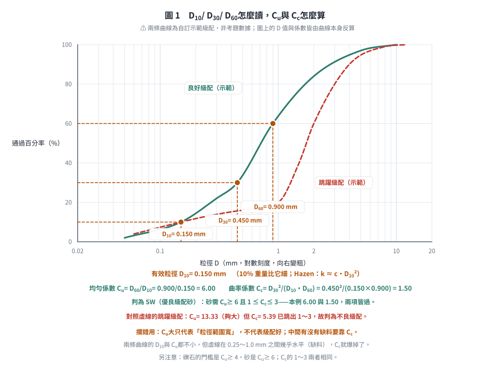

# 考題編號：SM-2023-1

**主分類：** `SM-U1-1` 土壤基本性質
**副分類：** `SM-U1-3` 土壤夯實及壓密
**分析法：** 概念題
**標籤：** `名詞解釋` `塑性指數` `有效粒徑` `相對密度` `曲率係數` `壓縮指數`
---

## 1. 原始題目重述 (Problem Restatement)
一、請試述下列名詞之意涵：（25 分）
(一) 塑性指數（Plasticity Index）
(二) 有效粒徑（Effective grain size）
(三) 相對密度（Relative Density）
(四) 曲率係數（Coefficient of curvature）
(五) 壓縮指數（Compression index）

*本題為純文字名詞解釋題，無附圖。*

## 2. 考題核心精神與出題者意圖 (Core Concepts & Examiner's Intent)
本題旨在測驗考生對於土壤力學中最基本的物理性質與力學參數定義之熟悉度。出題者希望確認考生不僅能寫出公式，更要能說明這些參數在工程實務上的物理意義與應用情境（例如用於分類、透水性評估、夯實程度或沉陷量計算）。

## 3. 解題戰略地圖與陷阱分析 (Strategic Roadmap & Trap Analysis)
對於名詞解釋題，作答時應包含三層次：
1. **定義與公式**：寫出精確定義及數學公式。
2. **符號說明**：解釋公式中各項符號之意義。
3. **工程意義與應用**：說明該參數在工程上的用途或物理意義。

**陷阱分析：**
- 僅寫公式而未解釋物理意義，可能會被扣分。
- 對於壓縮指數，應特別註明是在 $e - \log p'$ 曲線上的正常壓密段斜率。
- 對於有效粒徑，應說明為何取 $D_{10}$（與透水性有關）。

## 3.5 變數層次分析 (Variable Hierarchy Analysis)

### 最終目標
`清晰闡述五個基礎土壤參數的定義、公式及工程意義`

### 本題關鍵公式（依計算順序）
（本題為名詞解釋，無計算步驟，列出相關定義公式）
- 塑性指數：$PI = LL - PL$
- 相對密度：$D_r = \frac{e_{\max} - e}{e_{\max} - e_{\min}} \times 100\%$
- 曲率係數：$C_c = \frac{(D_{30})^2}{D_{10} \cdot D_{60}}$
- 壓縮指數：$C_c = \frac{\Delta e}{\Delta \log p'}$ （正常壓密段）

### L1：題目直接給定
| 符號 | 數值 | 說明 |
| --- | --- | --- |
| 無 | 無 | 本題為概念解釋題 |

### L2：需知識點推導
**名詞定義**
| 符號 | 公式／來源 | 卡關? |
| --- | --- | --- |
| PI | $PI = LL - PL$ | |
| $D_{10}$ | 粒徑分布曲線上通過百分率為 10% 的粒徑 | |
| $D_r$ | $D_r = \frac{e_{\max} - e}{e_{\max} - e_{\min}} \times 100\%$ | |
| $C_c$ | $C_c = \frac{(D_{30})^2}{D_{10} \cdot D_{60}}$ | |
| $C_c$ | $C_c = \frac{\Delta e}{\log(p_2'/p_1')}$ | |

### L3：深層知識（不懂就卡住）
| 知識點 | 說明 | 卡關? |
| --- | --- | --- |
| 物理意義 | 每個參數所代表的土壤力學行為（如可塑性範圍、級配優劣、沉陷量大小等） | |

## 4. 步驟化詳細計算過程 (Step-by-Step Detailed Calculation)
本題為名詞解釋題，無計算過程。以下為各名詞之詳細意涵說明：

### (一) 塑性指數（Plasticity Index, PI）
**1. 定義與公式：**
塑性指數是指土壤呈現塑性狀態的含水量範圍。公式為：
$$PI = LL - PL$$
其中：
- $LL$：液限（Liquid Limit），土壤由塑性態轉變為液性態之界限含水量。
- $PL$：塑限（Plastic Limit），土壤由半固態轉變為塑性態之界限含水量。

**2. 工程意義：**
- $PI$ 值越大，表示土壤中黏土礦物含量越高，可塑性範圍越廣，土壤在加水後越容易發生顯著體積變化（膨脹與收縮）或剪力強度喪失。
- 在統一土壤分類法（USCS）中，利用 $PI$ 與 $LL$ 繪製塑性圖（A-line），作為細粒土壤（黏土 $C$ 與粉土 $M$）分類的重要依據。

*圖 2　塑性指數是「一條軸上的一段」，塑性圖則是它的分類用途。它攔的是只寫 $PI$ 不寫 $LL$：同一個 $PI$ 落在 A 線上下分屬黏土與粉土，$LL = 50$ 再分低塑性與高塑性，少一個數字就分不出類。U 線是經驗上界，試驗點若落在它上方代表試驗有誤。（SL / PL / LL 為自訂示範值；A 線與 U 線為 ASTM D2487 規範式。）*

### (二) 有效粒徑（Effective grain size, $D_{10}$）
**1. 定義：**
在土壤粒徑分布曲線（篩分析）中，對應於通過百分率為 10%（即有 10% 重量的土壤顆粒小於此直徑）之粒徑，以 $D_{10}$ 表示。

**2. 工程意義：**
- $D_{10}$ 常被用來代表粗粒土壤中的細顆粒部分，因細顆粒對土壤的透水性與毛細現象影響最大。
- 海森（Hazen）經驗公式即利用有效粒徑來估算潔淨砂土的透水係數：$k = c \cdot (D_{10})^2$。
- 同時為計算統一係數（$C_u = D_{60}/D_{10}$）與曲率係數（$C_c$）的基準參數。

### (三) 相對密度（Relative Density, $D_r$）
**1. 定義與公式：**
相對密度用來表示無凝聚性土壤（如砂土、礫石）在自然狀態下或壓實後的緻密程度。公式為：
$$D_r = \frac{e_{\max} - e}{e_{\max} - e_{\min}} \times 100\%$$
或以乾單位重表示：
$$D_r = \frac{\gamma_{d} - \gamma_{d(\min)}}{\gamma_{d(\max)} - \gamma_{d(\min)}} \times \frac{\gamma_{d(\max)}}{\gamma_{d}} \times 100\%$$
其中：
- $e$：土壤目前之孔隙比。
- $e_{\max}$：土壤在最鬆散狀態下之最大孔隙比。
- $e_{\min}$：土壤在最密實狀態下之最小孔隙比。

**2. 工程意義：**
- $D_r$ 介於 0% 到 100% 之間，數值越大表示土壤越密實。
- 用於評估砂土層的工程性質，如承載力、受震液化潛能與沉陷量。通常 $D_r > 70\%$ 視為密實，不易液化；$D_r < 30\%$ 視為極鬆散，極易發生液化。

### (四) 曲率係數（Coefficient of curvature, $C_c$ 或 $C_z$）
**1. 定義與公式：**
曲率係數是用於描述土壤粒徑分布曲線形狀的參數，反映粒徑分布是否平順、有無特定粒徑缺失。公式為：
$$C_c = \frac{(D_{30})^2}{D_{10} \cdot D_{60}}$$
其中：
- $D_{60}$、$D_{30}$、$D_{10}$ 分別為通過百分率為 60%、30%、10% 對應的粒徑。

**2. 工程意義：**
- 在統一土壤分類法（USCS）中，用以判定粗粒土（礫石與砂）的級配優劣。
- 優良級配（Well-graded）的條件為：
  - 礫石（$GW$）：$C_u \ge 4$ 且 $1 \le C_c \le 3$
  - 砂土（$SW$）：$C_u \ge 6$ 且 $1 \le C_c \le 3$
- 若 $C_c < 1$ 或 $C_c > 3$，則表示粒徑分佈不均勻（如跳躍級配），屬於不良級配（Poorly-graded）。

*圖 1　$D_{10}$／$D_{30}$／$D_{60}$ 怎麼讀、$C_u$ 與 $C_c$ 怎麼算。它攔的是「$C_u$ 大就是級配好」：實線 $C_u = 6.00$、$C_c = 1.50$ 兩項皆過而判為 SW；虛線 $C_u = 13.33$ 更大，但中間缺料使 $C_c = 5.39$ 跳出 1～3，仍是不良級配。（兩條曲線為自訂示範級配、非考題數據，圖上的 $D$ 值與係數皆由曲線本身反算。）*

### (五) 壓縮指數（Compression index, $C_c$）
**1. 定義與公式：**
壓縮指數是描述正常壓密土壤（或過壓密土壤應力超過預壓密應力後）在受壓時，孔隙比隨有效應力對數值變化之遞減率。在 $e - \log p'$ 曲線（孔隙比對有效應力對數圖）上，正常壓密直線段的斜率即為壓縮指數。公式為：
$$C_c = \frac{e_1 - e_2}{\log p_2' - \log p_1'} = \frac{-\Delta e}{\Delta \log p'}$$

**2. 工程意義：**
- $C_c$ 是計算黏土層主壓密沉陷量（Primary consolidation settlement）的最關鍵參數。
- $C_c$ 值越大，表示土壤的壓縮性越高，在外加載重下會產生較大的沉陷量。
- 對於未干擾黏土，常使用 Skempton 經驗公式估算：$C_c = 0.009(LL - 10)$。

## 5. 關鍵爭議點與進階探討 (Critical Issues & Advanced Discussion)
- **曲率係數符號**：在部分教科書中，曲率係數可能記為 $C_z$ 以避免與壓縮指數 $C_c$ 混淆。在答題時可以同時寫出，展現周延性。
- **相對密度 vs. 壓實度**：需區分相對密度（$D_r$）與相對壓實度（$R_c = \gamma_d / \gamma_{d(\max)}$）。$D_r$ 專用於無凝聚性土壤，以極限孔隙比定義；$R_c$ 則用於所有土壤，通常以夯實試驗的最大乾單位重定義。在實務上兩者有經驗關係式（如李氏公式 $R_c = 80 + 0.2 D_r$）。
- **作答策略**：國家考試中，解釋名詞題若能配合作圖（如塑性圖簡圖、粒徑分佈曲線圖、$e-\log p'$ 曲線圖），將能顯著提高閱卷委員的印象分數，屬於「寫得越多、越完整，得分越高」的送分題。

---

*解析日期：見 `wiki/log.md`　｜　圖解補繪：2026-08-28（向量 SVG，程式繪製，腳本 `gen_SM-2023-1.py` 可重跑；同名 2× PNG 供簡報／影片管線使用）*
