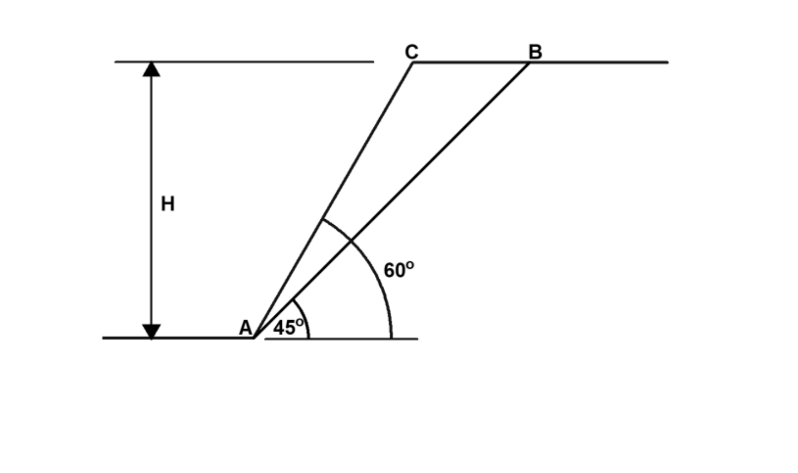

# 考題編號：[SM-2023-2]

**主分類：** `SM-U3-3` 坡地工程
**分析法：** 有效應力法
**標籤：** `邊坡穩定` `抗滑安全係數` `平面滑動` `雨水入滲`

---

## 1. 原始題目重述 (Problem Restatement)
二、如下圖所示邊坡之高 H=8 m，土壤單位重 $\gamma$ = 20 $\text{kN/m}^3$，
(一) 請問假設破壞面 AB 之土壤強度參數 $c$ = 50（kPa）及 $\phi$ = 36° 條件下之抗滑安全係數為何？（15 分）
(二) 若考慮雨水入滲而降低假設破壞面之土壤強度參數 $c$ = 5（kPa），但 $\phi$ 仍然維持 36°，則其抗滑安全係數為何？（10 分）

*圖說：邊坡高度 H=8m，坡面傾角 $\alpha$ = 60°，破壞面 AB 傾角 $\theta$ = 45°。滑動土體為一楔形體。*

## 2. 考題核心精神與出題者意圖 (Core Concepts & Examiner's Intent)
- **平面滑動分析 (Planar Failure Analysis)**：評估楔形破壞土體的自重、滑動力與抗滑力。
- **抗滑安全係數定義**：理解安全係數 $FS = \frac{\text{抗滑力 (Resisting Force)}}{\text{驅動力 (Driving Force)}}$。
- **降雨對邊坡穩定之影響**：測驗考生是否了解雨水入滲會弱化土壤（特別是表觀凝聚力 $c$ 的喪失或降低），並評估此強烈弱化效應對安全係數的直接影響。

## 3. 解題戰略地圖與陷阱分析 (Strategic Roadmap & Trap Analysis)
1. **幾何計算**：先計算滑動土體（楔形體）的面積與重量 $W$，以及破壞面長度 $L$。需注意坡面角與破壞面角的幾何關係。
2. **力學分解**：將土體重量 $W$ 分解為平行於破壞面的滑動力（驅動力 $T_d$）與垂直於破壞面的正向力 $N$。
3. **抗滑力計算**：運用庫倫破壞準則，抗滑力 $T_r = cL + N\tan\phi$。
4. **安全係數計算**：分別代入兩種情況的土壤參數求出 $FS$。

**陷阱分析**：
- **陷阱一**：幾何面積計算錯誤。楔形體頂部寬度應為水平投影距離之差，即 $H\cot(45^\circ) - H\cot(60^\circ)$。
- **陷阱二**：題意解讀偏差。第 (二) 小題提到「雨水入滲」，實務上雨水入滲會產生孔隙水壓，導致有效正向力降低。但題目已明確指示「降低假設破壞面之土壤強度參數 $c=5 \text{ kPa}$」，且未給定地下水位或滲流條件。因此依題意直接使用新的 $c$ 值計算即可，不宜過度臆測孔隙水壓而導致無法計算。

## 3.5 變數層次分析 (Variable Hierarchy Analysis)

### 最終目標
`求出在原條件與雨水入滲導致凝聚力降低兩種情況下，破壞面之抗滑安全係數 FS`

### 本題關鍵公式（依計算順序）
1. 滑動楔形體面積：$A = \frac{1}{2} H (H\cot\theta - H\cot\alpha)$
2. 滑動體總重：$W = \boxed{A} \cdot \gamma$
3. 破壞面長度：$L = \frac{H}{\sin\theta}$
4. 破壞面正向力與驅動力：$N = \boxed{W} \cos\theta, \quad T_d = \boxed{W} \sin\theta$
5. 抗滑力：$T_r = c \boxed{L} + \boxed{N} \tan\phi$
6. 安全係數：$FS = \frac{\boxed{T_r}}{\boxed{T_d}}$

### L1：題目直接給定
| 符號 | 數值 | 說明 |
|---|---|---|
| $H$ | 8 m | 邊坡高度 |
| $\gamma$ | 20 $\text{kN/m}^3$ | 土壤單位重 |
| $\alpha$ | 60° | 坡面傾角 |
| $\theta$ | 45° | 破壞面傾角 |
| $c_1, \phi_1$ | 50 kPa, 36° | 情況(一)之強度參數 |
| $c_2, \phi_2$ | 5 kPa, 36° | 情況(二)之強度參數 |

### L2：需知識點推導
**幾何與自重計算**
| 符號 | 公式／來源 | 卡關? |
|---|---|---|
| $A$ | $A = \frac{1}{2} H^2 (\cot\theta - \cot\alpha)$ | |
| $W$ | $W = A \cdot \gamma$ | |
| $L$ | $L = H / \sin\theta$ | |

**力學分解與安全係數**
| 符號 | 公式／來源 | 卡關? |
|---|---|---|
| $N$ | $N = W \cos\theta$ | |
| $T_d$ | $T_d = W \sin\theta$ | |
| $T_r$ | $T_r = cL + N\tan\phi$ | |
| $FS$ | $FS = T_r / T_d$ | |

### L3：深層知識（不懂就卡住）
| 知識點 | 說明 | 卡關? |
|---|---|---|
| 幾何關係 | 楔形體的面積為上底乘高除二，上底等於兩斜面之水平投影距離差 $H\cot\theta - H\cot\alpha$。 | |
| 抗滑力組成 | 庫倫定律中凝聚力作用於整個破壞面上，故需乘上破壞面長度 $L$；摩擦力則由總正向力 $N$ 乘上 $\tan\phi$ 貢獻。 | |

## 4. 步驟化詳細計算過程 (Step-by-Step Detailed Calculation)

**Step 1：計算滑動楔形體幾何特徵與重量**
- 坡高 $H = 8 \text{ m}$
- 坡角 $\alpha = 60^\circ$
- 破壞面角 $\theta = 45^\circ$
- 破壞面長度 $L = \frac{H}{\sin\theta} = \frac{8}{\sin 45^\circ} = \frac{8}{0.7071} = 11.314 \text{ m}$

滑動體上方寬度（水平距離差）：
$$ b = H\cot\theta - H\cot\alpha = 8\cot 45^\circ - 8\cot 60^\circ = 8(1) - 8\left(\frac{1}{\sqrt{3}}\right) = 8 - 4.619 = 3.381 \text{ m} $$
滑動體積（每單位寬度）：
$$ A = \frac{1}{2} \times b \times H = \frac{1}{2} \times 3.381 \times 8 = 13.525 \text{ m}^2 $$
滑動體總重 $W$：
$$ W = A \cdot \gamma = 13.525 \times 20 = 270.50 \text{ kN/m} $$

**Step 2：力學分解 (求驅動力與正向力)**
- 驅動力（平行破壞面分量）：
  $$ T_d = W \sin\theta = 270.50 \times \sin 45^\circ = 270.50 \times 0.7071 = 191.27 \text{ kN/m} $$
- 正向力（垂直破壞面分量）：
  $$ N = W \cos\theta = 270.50 \times \cos 45^\circ = 270.50 \times 0.7071 = 191.27 \text{ kN/m} $$

**Step 3：計算第(一)小題安全係數**
已知 $c = 50 \text{ kPa}$, $\phi = 36^\circ$
- 抗滑力 $T_{r1}$：
  $$ T_{r1} = cL + N\tan\phi = 50 \times 11.314 + 191.27 \times \tan 36^\circ $$
  $$ T_{r1} = 565.70 + 191.27 \times 0.7265 = 565.70 + 138.97 = 704.67 \text{ kN/m} $$
- 安全係數 $FS_1$：
  $$ FS_1 = \frac{T_{r1}}{T_d} = \frac{704.67}{191.27} = 3.684 $$
> $\boxed{FS_1 = 3.68}$

**Step 4：計算第(二)小題安全係數**
已知雨水入滲後 $c = 5 \text{ kPa}$, $\phi = 36^\circ$
- 抗滑力 $T_{r2}$：
  $$ T_{r2} = cL + N\tan\phi = 5 \times 11.314 + 191.27 \times \tan 36^\circ $$
  $$ T_{r2} = 56.57 + 138.97 = 195.54 \text{ kN/m} $$
- 安全係數 $FS_2$：
  $$ FS_2 = \frac{T_{r2}}{T_d} = \frac{195.54}{191.27} = 1.022 $$
> $\boxed{FS_2 = 1.02}$

## 5. 關鍵爭議點與進階探討 (Critical Issues & Advanced Discussion)
- **雨水入滲對孔隙水壓之影響**：實務上，雨水入滲除了弱化土壤結構導致有效凝聚力 $c'$ 下降外，最主要的力學影響是產生超額孔隙水壓或使水位上升，這會降低破壞面上的有效正向力 $N'$，進一步大幅降低抗滑力中摩擦力之貢獻（$N'\tan\phi'$）。本題並未給定地下水面條件或孔隙水壓參數，僅單純指示 $c$ 值降至 5 kPa，為避免假設過度而失分，依題意直接以降低後的 $c$ 值計算即可，符合多數國家考試此類題目的預期解答邏輯。
- **凝聚力對邊坡穩定之重要性**：從計算結果可知，當 $c$ 由 50 kPa 降至 5 kPa，安全係數從 3.68 驟降至 1.02（瀕臨破壞狀態）。這凸顯了淺層邊坡或小型邊坡穩定度極度仰賴土壤的「表觀凝聚力」（常由基質吸力或植物根系提供），一旦暴雨導致飽和使表觀凝聚力消失，邊坡極易發生淺層滑動破壞。
