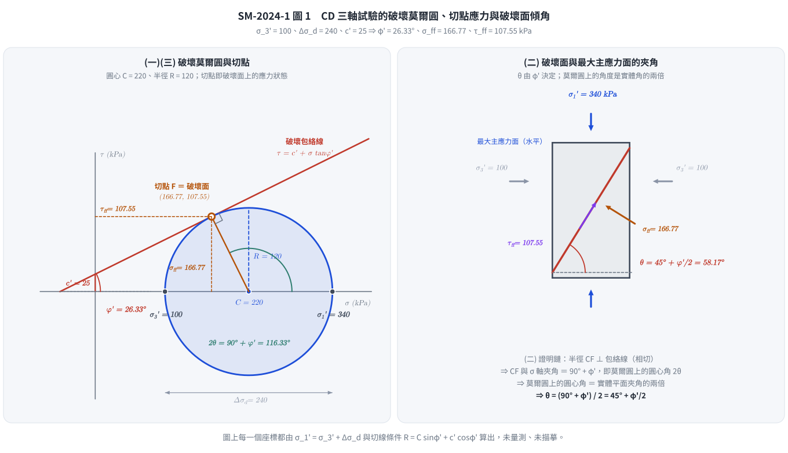
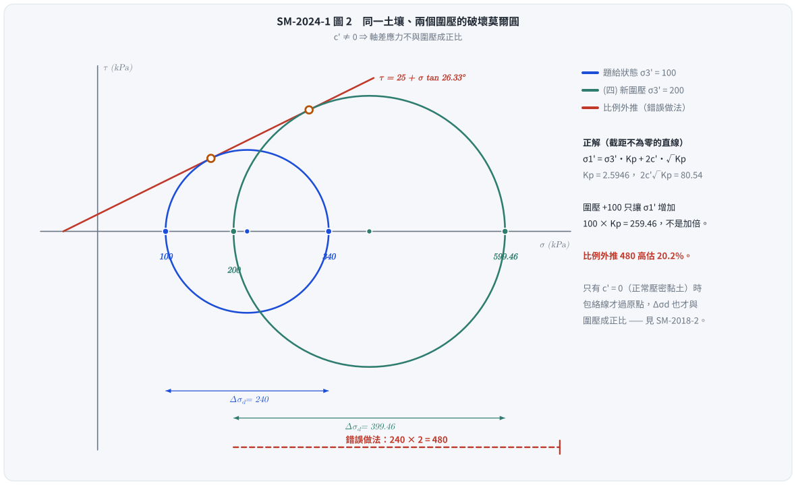

# 考題編號：SM-2024-1

**主分類：** `SM-U1-5` 土壤強度特性與變形性
**副分類：** 無
**分析法：** 有效應力法
**標籤：** `三軸試驗` `CD試驗` `莫爾圓` `Mohr-Coulomb破壞準則` `破壞面` `摩擦角`

---

## 1. 原始題目重述 (Problem Restatement)
一、某土壤經壓密排水三軸試驗，圍壓為 100 kPa、破壞時軸差應力為 240 kPa，假設此土壤凝聚力為 25 kPa。
(一)請繪圖出破壞時的莫爾圓，並計算該土壤的摩擦角 $\phi$。（5 分）
(二)請證明土壤試體破壞面與最大主應力面的夾角為 $45^\circ + \phi/2$。（5 分）
(三)破壞面上的正向應力（normal stress）與剪應力。（10 分）
(四)請問圍壓 200 kPa 時，土壤試體破壞時所需施加的軸差應力是多少 kPa？（5 分）

## 2. 考題核心精神與出題者意圖 (Core Concepts & Examiner's Intent)
- **莫爾圓與破壞包絡線之幾何關係：** 測驗考生能否熟悉莫爾圓的基本參數（圓心、半徑），並推導或計算出強度參數（摩擦角 $\phi$）。
- **破壞面夾角證明：** 藉由圖形幾何關係，測驗考生是否清楚莫爾圓上的角度 $2\theta$ 與實體破壞面角度 $\theta$ 的對應關係。
- **破壞面應力狀態：** 將莫爾圓上的幾何投影回物理面，求出特定破壞面上之正向應力及剪應力，考驗應力轉換觀念。
- **強度包絡線之線性延伸（主應力關係式）：** 測驗考生對於 $\sigma_1 = \sigma_3 \tan^2(45^\circ+\phi/2) + 2c \tan(45^\circ+\phi/2)$ 的應用能力。

## 3. 解題戰略地圖與陷阱分析 (Strategic Roadmap & Trap Analysis)
- **第一步：建立應力狀態。** 給定圍壓與軸差應力，求出最大主應力 $\sigma_1'$。由 $\sigma_1'$ 與 $\sigma_3'$ 求得莫爾圓之圓心 $C$ 與半徑 $R$。
- **第二步：由幾何關係解 $\phi$。** 利用主應力關係式（解一元二次方程式），反解求出摩擦角 $\phi$。
- **第三步：幾何證明。** 描述莫爾圓與破壞包絡線之相切點，藉由直角三角形之幾何特性證明實體面上破壞面夾角 $\theta$。
- **第四步：計算破壞面應力。** 利用莫爾圓圓心與半徑之幾何關係，求出切點座標 $(\sigma_{ff}, \tau_{ff})$。
- **第五步：外推其他圍壓狀態。** 將求得的參數 $K_p$ 代回主應力關係式，求得新圍壓 $\sigma_3 = 200 \text{ kPa}$ 下的 $\sigma_1$，最後扣除圍壓得到新的軸差應力 $\Delta\sigma_d$。

**陷阱分析：**
1. **軸差應力 vs 最大主應力：** 題目給的 240 kPa 是軸差應力 $\Delta\sigma_d$，需加上圍壓 100 kPa 才是大主應力 $\sigma_1$ (340 kPa)。若誤將 240 kPa 當作 $\sigma_1$，則全題皆錯。
2. **角度 $2\theta$ 與 $\theta$ 的混淆：** 莫爾圓上的角度為實體平面夾角的兩倍，證明與計算時須清楚標定基準面。
3. **有效應力與總應力的混淆：** 本題為 CD（排水）試驗，全程無超額孔隙水壓產生（$u=0$），故試驗加載之總應力即為有效應力。
4. **$c' \neq 0$ 時，軸差應力不與圍壓成正比：** 第 (四) 小題若用「圍壓加倍 $\Rightarrow$ 軸差應力加倍」硬套，會得到 $480 \text{ kPa}$，比正解 $399.46 \text{ kPa}$ 高出 20%。比例關係只在 $c' = 0$（如正常壓密黏土，見 [[SM-2018-2]]）時才成立；只要 $c' \neq 0$，$\sigma_1' = \sigma_3' K_p + 2c'\sqrt{K_p}$ 是一條**截距不為零**的直線，斜率是 $K_p$ 而不是 $\sigma_1'/\sigma_3'$。

## 3.5 變數層次分析 (Variable Hierarchy Analysis)

### 最終目標
`求出摩擦角、證明破壞面夾角、計算破壞面上之正向與剪應力，並推算不同圍壓下之破壞軸差應力。`

### 本題關鍵公式（依計算順序）
1. 最大主應力：$\sigma_1' = \sigma_3' + \Delta\sigma_d$
2. 莫爾圓圓心與半徑：$C = \frac{\sigma_1' + \sigma_3'}{2}$， $R = \frac{\sigma_1' - \sigma_3'}{2}$
3. 強度包絡線關係式求 $\phi$：$\sigma_1' = \sigma_3' K_p + 2c'\sqrt{K_p}$ 或 $R = C\sin\phi + c'\cos\phi$
4. 破壞面正向應力：$\sigma_{ff} = \boxed{C} - \boxed{R} \sin\phi$
5. 破壞面剪應力：$\tau_{ff} = \boxed{R} \cos\phi$
6. 新圍壓下最大主應力：$\sigma_1' = \sigma_3' \boxed{K_p} + 2c'\boxed{\sqrt{K_p}}$

### L1：題目直接給定
| 符號 | 數值 | 說明 |
|---|---|---|
| $\sigma_3'$ | 100 kPa | 排水試驗，圍壓即為有效小主應力 |
| $\Delta\sigma_d$ | 240 kPa | 破壞時之軸差應力 |
| $c'$ | 25 kPa | 土壤之有效凝聚力 |

### L2：需知識點推導
**莫爾圓基礎參數**
| 符號 | 公式／來源 | 卡關? |
|---|---|---|
| $\sigma_1'$ | $\sigma_1' = \sigma_3' + \Delta\sigma_d$ | |
| $C$ | $C = \frac{\sigma_1' + \sigma_3'}{2}$ | |
| $R$ | $R = \frac{\sigma_1' - \sigma_3'}{2}$ | |

**強度參數與破壞面應力**
| 符號 | 公式／來源 | 卡關? |
|---|---|---|
| $K_p$ | $\sigma_1' = \sigma_3' K_p + 2c'\sqrt{K_p}$ | |
| $\phi$ | $K_p = \tan^2(45^\circ + \phi/2)$ | |
| $\sigma_{ff}$ | $\sigma_{ff} = C - R \sin\phi$ | |
| $\tau_{ff}$ | $\tau_{ff} = R \cos\phi$ | |

### L3：深層知識（不懂就卡住）
| 知識點 | 說明 | 卡關? |
|---|---|---|
| CD 試驗之有效應力 | 壓密排水試驗中 $u=0$，故外部施加之總應力即為土體受力之有效應力。 | |
| 破壞面包絡線切點幾何 | 需理解莫爾圓上點的座標即代表特定傾角平面上的正向應力與剪應力，且圓上切點角度為實體夾角兩倍。 | |

## 4. 步驟化詳細計算過程 (Step-by-Step Detailed Calculation)

### (一) 繪圖出破壞時的莫爾圓，並計算該土壤的摩擦角 $\phi$
**1. 建立應力狀態：**
已知為壓密排水試驗（CD test），無超額孔隙水壓（$u=0$），故總應力等於有效應力。
- 有效小主應力（圍壓）：$\sigma_3' = 100 \text{ kPa}$
- 軸差應力：$\Delta\sigma_d = 240 \text{ kPa}$
- 有效大主應力：$\sigma_1' = \sigma_3' + \Delta\sigma_d = 100 + 240 = 340 \text{ kPa}$

莫爾圓圓心 $C$ 與半徑 $R$ 分別為：
$$C = \frac{\sigma_1' + \sigma_3'}{2} = \frac{340 + 100}{2} = 220 \text{ kPa}$$
$$R = \frac{\sigma_1' - \sigma_3'}{2} = \frac{340 - 100}{2} = 120 \text{ kPa}$$

**2. 計算摩擦角 $\phi$：**
根據 Mohr-Coulomb 破壞準則及主應力關係：
$$\sigma_1' = \sigma_3' \tan^2\left(45^\circ + \frac{\phi}{2}\right) + 2c' \tan\left(45^\circ + \frac{\phi}{2}\right)$$
令 $y = \tan\left(45^\circ + \frac{\phi}{2}\right)$，代入已知數值：
$$340 = 100 y^2 + 2(25) y$$
$$100 y^2 + 50 y - 340 = 0$$
除以 10 簡化方程式：
$$10 y^2 + 5 y - 34 = 0$$
利用公式解求 $y$：
$$y = \frac{-5 \pm \sqrt{5^2 - 4(10)(-34)}}{2(10)} = \frac{-5 \pm \sqrt{25 + 1360}}{20} = \frac{-5 \pm \sqrt{1385}}{20}$$
取正根（負根不合物理意義）：
$$y = \frac{-5 + 37.2156}{20} \approx 1.61078$$
解出摩擦角 $\phi$：
$$\tan\left(45^\circ + \frac{\phi}{2}\right) = 1.61078$$
$$45^\circ + \frac{\phi}{2} = \tan^{-1}(1.61078) \approx 58.17^\circ$$
$$\frac{\phi}{2} = 13.17^\circ \implies \phi = 26.34^\circ$$
$$\boxed{\phi = 26.3^\circ}$$

*(註：破壞莫爾圓為一半徑 $R=120$、圓心位在 $C=220$ 之圓，並有一條截距為 $25$、斜率角為 $26.3^\circ$ 之破壞包絡線與之相切於圓之上半部。建議於答案卷上繪出此示意圖。)*

*圖 1　(一)(二)(三) 三小題其實是同一張圖的三種讀法：切點 F 的座標就是破壞面上的 $(\sigma_{ff}, \tau_{ff})$，切點對應的圓心角就是 $2\theta$。這張圖攔的是「把莫爾圓上的角度直接當成實體傾角」——圓上量到 $116.33^\circ$，實體只有它的一半 $58.17^\circ$；同時也攔「把 240 kPa 當成 $\sigma_1$」，圖上 $\Delta\sigma_d$ 是一段長度、不是一個端點。*

### (二) 證明土壤試體破壞面與最大主應力面的夾角為 $45^\circ + \phi/2$
**證明過程：**
1. 繪製莫爾圓，圓心為 $C$，並畫出 Mohr-Coulomb 破壞包絡線 $\tau = c + \sigma \tan\phi$。
2. 破壞時，莫爾圓與破壞包絡線相切，設切點為 $F$（即代表破壞面上的應力狀態）。
3. 連接圓心 $C$ 與切點 $F$，根據幾何原理，半徑 $\overline{CF}$ 必垂直於相切的破壞包絡線。
4. 破壞包絡線與水平軸（$\sigma$ 軸）之夾角為 $\phi$。由直角三角形外角關係，可知連接切點 $F$ 之半徑與垂直線的夾角亦為 $\phi$，故切點 $F$ 相對於大主應力平面（即莫爾圓最右側極點起算之水平夾角對應的圓心角）的角度為 $90^\circ + \phi$。
5. 在莫爾圓中，任意平面的應力狀態在圓上的圓心角，為實體空間夾角的兩倍。設實體中破壞面與大主應力面（水平面）之夾角為 $\theta$，則有：
   $$2\theta = 90^\circ + \phi$$
   $$\theta = \frac{90^\circ + \phi}{2} = 45^\circ + \frac{\phi}{2}$$
   證明完畢。
$$\boxed{\theta = 45^\circ + \phi/2}$$

### (三) 破壞面上的正向應力與剪應力
利用切點 $F$ 的莫爾圓幾何座標計算：
- 圓心角 $2\theta = 90^\circ + \phi$
- 正向應力 $\sigma_{ff} = C + R \cos(2\theta) = C + R \cos(90^\circ + \phi) = C - R \sin\phi$
- 剪應力 $\tau_{ff} = R \sin(2\theta) = R \sin(90^\circ + \phi) = R \cos\phi$

代入數值：
$$\sin\phi = \sin(26.33^\circ) \approx 0.44361$$
$$\cos\phi = \cos(26.33^\circ) \approx 0.89622$$
正向應力：
$$\sigma_{ff} = 220 - 120 \times 0.44361 = 220 - 53.23 = 166.77 \text{ kPa}$$
剪應力：
$$\tau_{ff} = 120 \times 0.89622 = 107.55 \text{ kPa}$$

*(驗算：$\tau_{ff} = c' + \sigma_{ff}\tan\phi = 25 + 166.77 \times \tan(26.33^\circ) = 25 + 166.77 \times 0.49504 = 107.55 \text{ kPa}$，兩者完全吻合)*

$$\boxed{\text{破壞面正向應力 } \sigma_{ff} = 166.77 \text{ kPa}}$$
$$\boxed{\text{破壞面剪應力 } \tau_{ff} = 107.55 \text{ kPa}}$$

### (四) 圍壓 200 kPa 時，破壞所需之軸差應力
利用相同土壤之主應力關係式：
$$\sigma_1' = \sigma_3' K_p + 2c'\sqrt{K_p}$$
其中由第 (一) 小題已知：
$$\sqrt{K_p} = y = 1.61078$$
$$K_p = (1.61078)^2 \approx 2.5946$$

當新圍壓 $\sigma_3' = 200 \text{ kPa}$：
$$\sigma_1' = 200 \times 2.5946 + 2(25) \times 1.61078$$
$$\sigma_1' = 518.92 + 80.54 = 599.46 \text{ kPa}$$

所需施加之軸差應力 $\Delta\sigma_d$ 為：
$$\Delta\sigma_d = \sigma_1' - \sigma_3' = 599.46 - 200 = 399.46 \text{ kPa}$$

$$\boxed{\text{所需軸差應力 } \Delta\sigma_d = 399.46 \text{ kPa}}$$

*圖 2　把兩個圍壓的破壞圓畫在同一條包絡線上，就看得出「圍壓加倍、軸差應力不會加倍」。這張圖攔的是把 $c' \neq 0$ 的土壤硬套比例關係：$240 \times 2 = 480$ 比正解 $399.46$ 高估 20.2%，錯誤來源是忽略了 $2c'\sqrt{K_p} = 80.54$ 這個不隨 $\sigma_3'$ 放大的截距項。*

## 5. 關鍵爭議點與進階探討 (Critical Issues & Advanced Discussion)
- **有效應力與總應力：** 題目明示為「壓密排水試驗（CD）」，故加載過程極為緩慢，孔隙水有充分時間排出，超額孔隙水壓 $u = 0$。因此所施加之總圍壓與軸差應力直接等於有效應力。考場上若為「壓密不排水（CU）」，則必須額外給定孔隙水壓數值才能求得有效應力參數。
- **計算精度的保留：** 在解一元二次方程式得出 $y = 1.61078$ 後，建議將該數值保留在計算機中或記錄多位小數點，直接用以計算第四題之 $K_p$ 與 $\sqrt{K_p}$，以避免先求 $\phi$ 再算 $K_p$ 時因為角度進位造成數 kPa 的誤差。
- **不必先求 $\phi$ 的一行檢核（切線條件）：** 莫爾圓與包絡線相切等價於「圓心到直線的距離 = 半徑」，即 $R = C\sin\phi + c'\cos\phi$。代入本題：$220 \times 0.44361 + 25 \times 0.89622 = 97.59 + 22.41 = 120.00 = R$，與半徑一字不差。這條式子可以在不解一元二次方程式的情況下直接反解 $\phi$（$120 = 220\sin\phi + 25\cos\phi$），也是考場上檢查 $\phi$ 有沒有算錯最快的一招。
- **線性主應力公式驗算技巧：** 主應力關係 $\sigma_1 = \sigma_3 \cdot K_p + C_{const}$ 為線性關係。已知 $\sigma_3=100 \implies \sigma_1=340$，當 $\sigma_3$ 增加 100 時，$\sigma_1$ 必定增加 $100 \times K_p = 100 \times 2.5946 = 259.46$。故新應力狀態 $\sigma_1 = 340 + 259.46 = 599.46 \text{ kPa}$，此為考場上快速驗算的實用技巧。

---

*解析日期：見 `wiki/log.md`　｜　圖解補繪：2026-08-28（向量 SVG，程式繪製，腳本 `gen_SM-2024-1.py` 可重跑；同名 2× PNG 供簡報／影片管線使用）*
