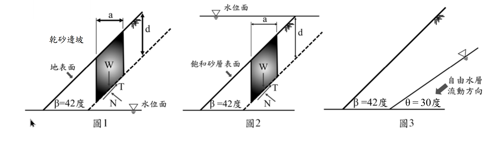

# 考題編號：SM-2024-2

**主分類：** `SM-U3` 坡地工程
**副分類：** 
**分析法：** 有效應力法
**標籤：** `無限邊坡分析` `浸水邊坡` `水力坡降` `安全係數`

---

## 1. 原始題目重述 (Problem Restatement)
二、砂性土壤邊坡若以無限邊坡方式分析淺層滑動，邊坡傾斜角($\beta$) 42 度，土壤摩擦角($\phi$) 35 度，請依圖回答下列問題：
(一) 請計算圖 1 乾砂邊坡之安全係數。（8 分）
(二) 邊坡若全浸於水面下，請計算如圖 2 浸水邊坡之安全係數。（8 分）
(三) 若邊坡中有滲流的自由水層自右至左（如圖 3）並與水平夾角 $\theta$ = 30 度流動，請計算自由水層之水力波降 $i$。（9 分）

*圖說：圖 1 為乾砂邊坡，地表面傾角 $\beta=42^\circ$；圖 2 為飽和浸水邊坡，水平靜水位面位於地表之上；圖 3 為邊坡內部有一自由水層，沿 $\theta=30^\circ$ 傾角自右向左滲流。*

## 2. 考題核心精神與出題者意圖 (Core Concepts & Examiner's Intent)
- **無限邊坡基礎理論**：測驗對於無限邊坡（Infinite Slope）穩定分析基本公式的掌握，特別是無凝聚力土壤（$c=0$）的抗滑力與滑動力計算。
- **靜水浮力對邊坡的影響**：測驗「完全浸水且無滲流」情況下，邊坡安全係數是否與乾砂狀態不同。出題者想確認考生是否明白，靜止水壓同時且等比例地降低了有效正向應力與驅動剪應力，因此安全係數不變。
- **水力坡降定義**：測驗「自由水層（Unconfined Aquifer）」發生傾斜滲流時，水力坡降的計算原理（$i = \sin\theta$）。第三題刻意不問安全係數，而是問水力坡降，用以測試考生是否能跳脫死背公式的框架，回歸滲流理論的基本定義。
- **考場心理測驗**：給定的角度為 $\beta = 42^\circ > \phi = 35^\circ$，這意味著無論是乾砂或浸水，安全係數皆會小於 1（處於滑動狀態）。考官給這組數字可能是想測試考生是否會因為算出 $FS < 1$ 而懷疑自己的計算並亂套公式。

## 3. 解題戰略地圖與陷阱分析 (Strategic Roadmap & Trap Analysis)
- **第一步：乾砂邊坡 FS 計算**
  利用摩擦角與邊坡角的正切值比值 $FS = \tan\phi / \tan\beta$ 直接求解。
- **第二步：浸水邊坡 FS 計算**
  分析靜水條件下之有效應力。土壤有效重量變為 $\gamma'$，但因為只受浮力而無滲流力，故公式形式不變，FS 依舊為 $\tan\phi / \tan\beta$。
- **第三步：滲流水力坡降計算**
  依據水頭定義，自由水面壓力為零，總水頭即為高程。沿水流方向每前進距離 $L$，高程下降 $L\sin\theta$，故水頭損失為 $L\sin\theta$，水力坡降即為 $\sin\theta$。

**⚠️ 陷阱分析：**
1. **錯把靜水當滲流**：圖 2 是「完全浸於水面下」，水面水平代表無水頭差、無滲流。若誤套用平行坡面滲流的公式（含有 $\gamma' / \gamma_{sat}$ 折減），將導致嚴重錯誤。
2. **誤讀第三小題所求**：圖 3 中出現了滲流，很多考生可能會直覺開始計算滲流邊坡的「安全係數」，但題目僅要求計算「水力坡降 $i$」，這是典型的文不對題陷阱。
3. **坡降角度混淆**：圖 3 中同時給了邊坡角 $\beta=42^\circ$ 與水流角 $\theta=30^\circ$。水力坡降是由水流本身的幾何決定，必須使用 $\theta=30^\circ$，若誤用 $\beta=42^\circ$ 則代表觀念不清。

## 3.5 變數層次分析 (Variable Hierarchy Analysis)

### 最終目標
分別求出乾砂邊坡之安全係數、完全浸水邊坡之安全係數，以及傾斜滲流自由水層之水力坡降。

### 本題關鍵公式（依計算順序）
- **乾砂邊坡安全係數**：
  $$FS_{\text{dry}} = \frac{\tan\phi}{\tan\beta}$$
- **完全浸水邊坡安全係數**：
  $$FS_{\text{sub}} = \frac{\tan\phi}{\tan\beta}$$
- **自由水層水力坡降**：
  $$i = \frac{\Delta h}{L} = \sin\theta$$

### L1：題目直接給定
| 符號 | 數值 | 說明 |
|---|---|---|
| $\beta$ | $42^\circ$ | 邊坡傾斜角 |
| $\phi$ | $35^\circ$ | 土壤摩擦角 |
| $\theta$ | $30^\circ$ | 自由水層流動方向與水平夾角 |
| $c$ | $0$ | 砂性土壤，假設凝聚力為零 |

### L2：需知識點推導
**一、邊坡安全係數**
| 符號 | 公式／來源 | 卡關? |
|---|---|---|
| $FS_{\text{dry}}$ | $FS_{\text{dry}} = \frac{\tan\phi}{\tan\beta}$ | |
| $FS_{\text{sub}}$ | 靜水位浸沒：$FS_{\text{sub}} = \frac{\tan\phi}{\tan\beta}$ | |

**二、水力坡降**
| 符號 | 公式／來源 | 卡關? |
|---|---|---|
| $i$ | $i = \sin\theta$ | |

### L3：深層知識（不懂就卡住）
| 知識點 | 說明 | 卡關? |
|---|---|---|
| 浸水邊坡力學行為 | 靜水浮力同時且等比例降低有效正向力與滑動剪力，故 FS 與乾砂相同，不可套用平行滲流公式。 | |
| 水力坡降物理意義 | 沿自由水面（壓力為大氣壓）流動，水頭損失即為高程下降量 $\Delta z = L\sin\theta$，故單位長度水頭損失 $i = \sin\theta$。 | |

## 4. 步驟化詳細計算過程 (Step-by-Step Detailed Calculation)

### (一) 圖 1 乾砂邊坡之安全係數
對於無凝聚力（$c=0$）的乾砂無限邊坡，取深度 $z$ 之滑動面分析：
滑動面上的總正向應力與有效正向應力相等：$\sigma' = \gamma z \cos^2\beta$
驅動剪應力：$\tau_d = \gamma z \sin\beta \cos\beta$
土壤抗剪強度：$\tau_f = \sigma' \tan\phi = \gamma z \cos^2\beta \tan\phi$
安全係數為抗剪強度與驅動剪應力之比：
$$FS_{\text{dry}} = \frac{\tau_f}{\tau_d} = \frac{\gamma z \cos^2\beta \tan\phi}{\gamma z \sin\beta \cos\beta} = \frac{\tan\phi}{\tan\beta}$$

代入數值 $\phi = 35^\circ$、$\beta = 42^\circ$：
$$FS_{\text{dry}} = \frac{\tan 35^\circ}{\tan 42^\circ} = \frac{0.7002}{0.9004} = 0.7777 \approx 0.78$$

> **策略註解**：計算結果 $FS < 1$，代表此邊坡在實際中處於不穩定狀態。但考場上只需如實寫出計算結果即可，不需懷疑。

$$\boxed{FS_{\text{dry}} = 0.78}$$

### (二) 圖 2 浸水邊坡之安全係數
當邊坡完全浸沒於靜止水面下時（無滲流），採用「有效重量法」進行分析最為直觀。水不承受剪應力，故所有的剪應力皆由土壤骨架（有效重量 $\gamma'$）產生：
有效正向應力：$\sigma' = \gamma' z \cos^2\beta$
驅動剪應力：$\tau_d = \gamma' z \sin\beta \cos\beta$
土壤抗剪強度：$\tau_f = \sigma' \tan\phi = \gamma' z \cos^2\beta \tan\phi$
安全係數為：
$$FS_{\text{sub}} = \frac{\tau_f}{\tau_d} = \frac{\gamma' z \cos^2\beta \tan\phi}{\gamma' z \sin\beta \cos\beta} = \frac{\tan\phi}{\tan\beta}$$

代入數值：
$$FS_{\text{sub}} = \frac{\tan 35^\circ}{\tan 42^\circ} \approx 0.78$$

> **策略註解**：靜止水體產生的浮力，等比例折減了正向力（貢獻摩擦力）與下滑力，兩者相除後水的影響被消去，因此完全浸沒邊坡的安全係數與乾砂邊坡完全相同。

$$\boxed{FS_{\text{sub}} = 0.78}$$

### (三) 圖 3 自由水層之水力波降 $i$
依題意，自由水層流動方向與水平夾角為 $\theta = 30^\circ$。
對於「自由水層」，其頂面（即地下水位面）壓力與大氣相通，故壓力水頭為零（$u/\gamma_w = 0$）。
任意點之總水頭 $h$ 完全由高程水頭 $z$ 決定（$h = z$）。
沿著水流方向取一段長度為 $L$ 的流動路徑，起點與終點的高程差為：
$$\Delta z = L \cdot \sin\theta$$
因此，水頭損失 $\Delta h$ 等於高程差 $\Delta z$：
$$\Delta h = L \cdot \sin\theta$$
水力坡降 $i$ 定義為單位流動長度的水頭損失：
$$i = \frac{\Delta h}{L} = \frac{L \sin\theta}{L} = \sin\theta$$

代入數值 $\theta = 30^\circ$：
$$i = \sin 30^\circ = 0.5$$

> **策略註解**：水力坡降僅與地下水面本身的傾角 $\theta$ 有關，與地表邊坡角 $\beta$ 無關。

$$\boxed{i = 0.5}$$

## 5. 關鍵爭議點與進階探討 (Critical Issues & Advanced Discussion)
- **關於安全係數小於 1 的探討**：在實務上，無凝聚力土壤的自然安息角（Angle of Repose）即為摩擦角 $\phi$。本題 $\beta(42^\circ) > \phi(35^\circ)$，意味著這個邊坡在乾砂或浸水狀態下都會發生破壞而無法維持。這是一個常見的考試心理戰，目的是測驗考生對力學公式是否有足夠信心。作答時只要清楚寫出推導與數字即可。
- **靜水與滲流之差異**：如果圖 2 的水位面是「與坡面齊平」且「順著坡面往下流動（平行滲流）」，那滑動面上的有效正向應力不變，但驅動剪應力會由飽和單位重 $\gamma_{sat}$ 提供，此時安全係數公式將變為 $FS = (\gamma' / \gamma_{sat}) \cdot (\tan\phi / \tan\beta)$，安全係數會大幅下降。本題為「靜水浸没」，故不套用滲流修正公式。
- **審題的細心度**：第三小題提供了邊坡角與水流角，卻只問「水力坡降」。考官預期一定會有考生「自動補完」去算滲流下的安全係數。精準回答題目所問的項目，是避免無謂失分的關鍵。
