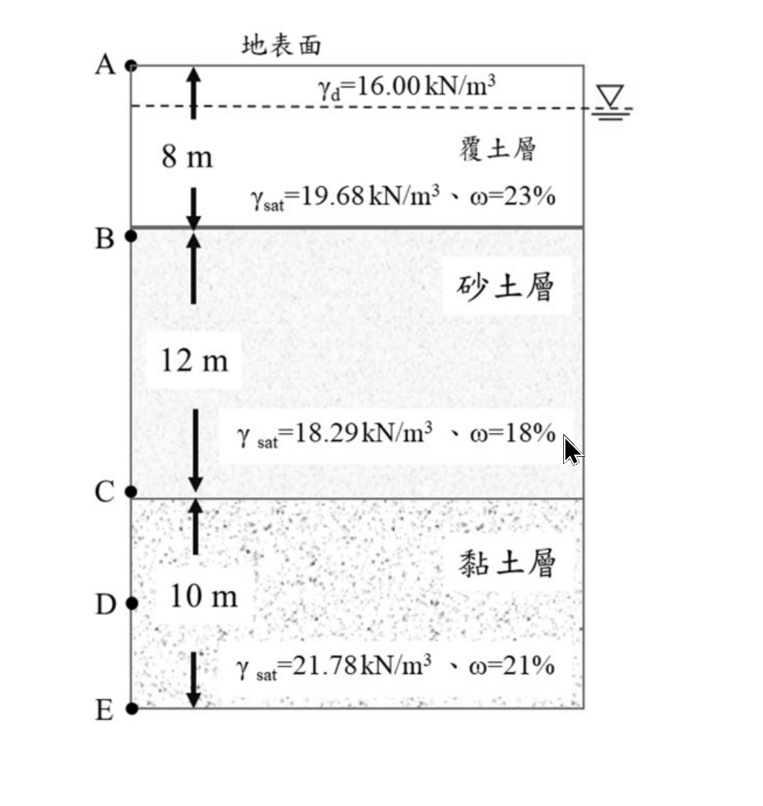

# 考題編號：SM-2024-3

**主分類：** `SM-U1-3` 土壤夯實及壓密
**副分類：** `SM-U1-4` 土體內應力
**分析法：** 有效應力法
**標籤：** `壓密沉陷` `有效應力` `地下水位下降` `過壓密黏土` `Casagrande法`

---

## 1. 原始題目重述 (Problem Restatement)
三、鑽探後簡化之土層如下圖，分為覆土層（$\gamma_{sat} = 19.68$ kN/m³、$\gamma_d = 16.00$ kN/m³、飽和含水量 $\omega = 23\%$）、砂土層（$\gamma_{sat} = 18.29$ kN/m³、飽和含水量 $\omega = 18\%$）、黏土層（$\gamma_{sat} = 21.78$ kN/m³、飽和含水量 $\omega = 21\%$），黏土層下方為不透水層。初始地下水位在地表下 2 公尺，請問：
(一) 若因施工降水使地下水位降至地表下 18 公尺，請問 C 點的有效應力增加或減少多少？（5 分）
(二) 若黏土層為正常壓密黏土（$e_0 = 0.9$、壓密指數 $C_c = 0.15$），請問黏土層因為地下水位下降引致的壓密沉陷量是多少？（5 分）
(三) 請問如何在土壤壓密曲線上找出預壓密應力？（5 分）
(四) 若黏土層為過壓密黏土（$e_0 = 0.9$、$C_c = 0.15$、回脹指數 $C_s = 0.02$），其預壓密應力為 300 kPa，請問黏土層因為地下水位下降引致的壓密沉陷量是多少？（10 分）

*圖說：簡化土層剖面圖。地表為 0m；覆土層深度 0~8m；砂土層深度 8~20m；黏土層深度 20~30m，底下為不透水層。初始地下水位位於地表下 2m 處。C 點位於砂土與黏土交界面，即深度 20m 處。*

## 2. 考題核心精神與出題者意圖 (Core Concepts & Examiner's Intent)
本題主要測驗考生對**地下水位變動與有效應力關係**的理解，以及**壓密沉陷量之計算**。核心精神包含：
1. **單位重推演能力**：降水導致上方土層變乾，需利用基本物理性質（$\gamma_{sat}$ 與 $\omega$）推求未給定的乾單位重 $\gamma_d$。
2. **有效應力原理**：準確計算降水前後總應力與孔隙水壓的變化。
3. **Casagrande 預壓密應力作圖法**：測驗對室內壓密試驗 $e-\log \sigma'$ 曲線基本特性的熟悉度。
4. **沉陷量公式應用**：正確判斷並選用正常壓密 (NC) 與過壓密 (OC) 狀態下的沉陷量計算公式，並以黏土層中央深度作為代表點。

## 3. 解題戰略地圖與陷阱分析 (Strategic Roadmap & Trap Analysis)

- **作戰計畫**：
  1. 檢驗並計算地下水位以上土層（覆土層與砂土層）排水後之乾單位重 $\gamma_d$。
  2. 計算初始水位 (深度 2m) 與最終水位 (深度 18m) 下，C 點 (深度 20m) 的有效應力，求其差值解答 (一)。
  3. 針對黏土層中央 (深度 25m)，計算初始與最終有效應力。
  4. 代入正常壓密沉陷公式解答 (二)。
  5. 條列說明 Casagrande 作圖法步驟解答 (三)。
  6. 判斷過壓密狀態下初始與最終應力的區間，以雙段式公式計算解答 (四)。

- **關鍵陷阱**：
  - **陷阱1：乾單位重之推求**。題目刻意未給定砂土層之 $\gamma_d$，僅給定 $\gamma_{sat}$ 與飽和含水量 $\omega$。若未意識到 $\gamma_d = \gamma_{sat} / (1+\omega)$ 的關係，將無法正確計算降水後之應力。
  - **陷阱2：代表點之選取**。計算 C 點應力增量僅用於回答第(一)小題；在計算第(二)、(四)小題之黏土層沉陷時，**必須重新計算黏土層中央 (深度 25m) 之有效應力**，不可直接使用 C 點之應力代入沉陷公式。
  - **陷阱3：過壓密狀態之跨越**。在第(四)題中，最終有效應力大於預壓密應力 ($p_c'$=300 kPa)，故沉陷量包含沿回脹曲線 ($C_s$) 壓縮與沿原生壓密曲線 ($C_c$) 壓密兩部分，切勿只用單一斜率計算。

## 3.5 變數層次分析 (Variable Hierarchy Analysis)

### 最終目標
計算因地下水位下降所增加之有效應力，並評估正常壓密與過壓密狀態下之黏土層沉陷量。

### 本題關鍵公式（依計算順序）
1. 乾單位重計算：
   $\gamma_d = \frac{\gamma_{sat}}{1+\omega}$
2. 初始與最終有效應力：
   $\sigma_v' = \sum (\gamma \cdot \Delta z) - u$
3. 黏土層中央有效應力增量：
   $\Delta\sigma' = \boxed{\sigma_{vf}'} - \boxed{\sigma_{v0}'}$
4. 正常壓密沉陷量：
   $S_c = \frac{C_c H}{1+e_0} \log \frac{\boxed{\sigma_{v0}'} + \boxed{\Delta\sigma'}}{\boxed{\sigma_{v0}'}}$
5. 過壓密沉陷量：
   $S_c = \frac{C_s H}{1+e_0} \log \frac{p_c'}{\boxed{\sigma_{v0}'}} + \frac{C_c H}{1+e_0} \log \frac{\boxed{\sigma_{vf}'}}{p_c'}$

### L1：題目直接給定
| 符號 | 數值 | 說明 |
| --- | --- | --- |
| $H_c$ | 10 m | 黏土層厚度 (20m~30m) |
| $e_0$ | 0.9 | 黏土層初始孔隙比 |
| $C_c$ | 0.15 | 黏土層壓密指數 |
| $C_s$ | 0.02 | 黏土層回脹指數 |
| $p_c'$ | 300 kPa | 過壓密黏土預壓密應力 |
| $\gamma_{sat,sand}$ | 18.29 kN/m³ | 砂土層飽和單位重 |
| $\omega_{sat,sand}$ | 18% | 砂土層飽和含水量 |

### L2：需知識點推導
**有效應力計算**
| 符號 | 公式／來源 | 卡關? |
| --- | --- | --- |
| $\gamma_{d,sand}$ | $\frac{\gamma_{sat,sand}}{1+\omega_{sat,sand}}$ | |
| $\sigma_{v0}'$ | $\sum \gamma \cdot \Delta z - \gamma_w z_w$ (降水前) | |
| $\sigma_{vf}'$ | $\sum \gamma \cdot \Delta z - \gamma_w z_w$ (降水後) | |

**沉陷量計算**
| 符號 | 公式／來源 | 卡關? |
| --- | --- | --- |
| $S_{c,NC}$ | $\frac{C_c H_c}{1+e_0} \log \frac{\sigma_{vf}'}{\sigma_{v0}'}$ | |
| $S_{c,OC}$ | $\frac{C_s H_c}{1+e_0} \log \frac{p_c'}{\sigma_{v0}'} + \frac{C_c H_c}{1+e_0} \log \frac{\sigma_{vf}'}{p_c'}$ | |

### L3：深層知識（不懂就卡住）
| 知識點 | 說明 | 卡關? |
| --- | --- | --- |
| 飽和度與單位重轉換 | 降水後原飽和土層排水，需由 $\gamma_{sat}$ 與 $\omega$ 推求 $\gamma_d$ 進行總應力計算。 | |
| 沉陷量代表深度選取 | 計算整層沉陷量時，應取分層中央點（深度 25m）作為代表點計算平均有效應力。 | |

## 4. 步驟化詳細計算過程 (Step-by-Step Detailed Calculation)

> **基本假設與參數準備**
> 1. 假設水單位重 $\gamma_w = 9.81$ kN/m³。
> 2. 檢核覆土層 $\gamma_d$：題目給定 $\gamma_{sat} = 19.68$ kN/m³、$\omega = 23\%$，由基本公式 $\gamma_d = \frac{\gamma_{sat}}{1+\omega} = \frac{19.68}{1+0.23} = 16.00$ kN/m³，與題目給定之 $16.00$ 完全吻合，印證此關係式為本題核心。
> 3. 推求砂土層 $\gamma_d$：$\gamma_{sat} = 18.29$ kN/m³、$\omega = 18\%$，可得 $\gamma_d = \frac{18.29}{1+0.18} = 15.50$ kN/m³。

### (一) C 點有效應力增加量

C 點位於深度 20m。

**1. 降水前 (GWT = 2m)**
- 總應力：
  0~2m (覆土層乾土)：$16.00 \times 2 = 32.00$ kPa
  2~8m (覆土層飽和)：$19.68 \times 6 = 118.08$ kPa
  8~20m (砂土層飽和)：$18.29 \times 12 = 219.48$ kPa
  $\sigma_{v0,C} = 32.00 + 118.08 + 219.48 = 369.56$ kPa
- 孔隙水壓：
  $u_{0,C} = (20 - 2) \times 9.81 = 176.58$ kPa
- 初始有效應力：
  $\sigma_{v0,C}' = 369.56 - 176.58 = 192.98$ kPa

**2. 降水後 (GWT = 18m)**
- 總應力：
  0~8m (覆土層變乾)：$16.00 \times 8 = 128.00$ kPa
  8~18m (砂土層變乾)：$15.50 \times 10 = 155.00$ kPa
  18~20m (砂土層飽和)：$18.29 \times 2 = 36.58$ kPa
  $\sigma_{vf,C} = 128.00 + 155.00 + 36.58 = 319.58$ kPa
- 孔隙水壓：
  $u_{f,C} = (20 - 18) \times 9.81 = 19.62$ kPa
- 最終有效應力：
  $\sigma_{vf,C}' = 319.58 - 19.62 = 299.96$ kPa

**3. 有效應力增加量**
$\Delta\sigma_C' = 299.96 - 192.98 = \boxed{106.98 \text{ kPa}}$ (增加)

### (二) 正常壓密黏土沉陷量

> **策略註解**：計算沉陷量應取黏土層(20~30m)之中央深度（$z=25\text{m}$）作為代表點。地下水位以上應力變化對深度的影響為定值，故 $\Delta\sigma_{mid}' = \Delta\sigma_C' = 106.98 \text{ kPa}$。

**1. 代表點初始有效應力 (z = 25m)**
黏土層有效單位重 $\gamma'_{clay} = 21.78 - 9.81 = 11.97$ kN/m³
$\sigma_{v0,mid}' = \sigma_{v0,C}' + 11.97 \times 5 = 192.98 + 59.85 = 252.83$ kPa

**2. 代表點最終有效應力**
$\sigma_{vf,mid}' = 252.83 + 106.98 = 359.81$ kPa

**3. 正常壓密沉陷量計算**
代入 NC 沉陷量公式：
$S_{c,NC} = \frac{C_c H_c}{1+e_0} \log_{10}\left(\frac{\sigma_{vf,mid}'}{\sigma_{v0,mid}'}\right)$
$S_{c,NC} = \frac{0.15 \times 10}{1 + 0.9} \log_{10}\left(\frac{359.81}{252.83}\right) = \frac{1.5}{1.9} \times 0.15324 = 0.1210\text{ m}$
故沉陷量為 $\boxed{12.10 \text{ cm}}$

### (三) Casagrande 法尋找預壓密應力

利用 Casagrande 幾何作圖法，在 $e-\log \sigma'$ 壓密曲線上找出預壓密應力 $p_c'$ 的步驟如下：
1. **找尋曲率最大點**：在 $e-\log \sigma'$ 曲線上，以目視找出曲率半徑最小（即彎曲程度最大）的點，設為 $A$ 點。
2. **作水平線**：過 $A$ 點畫一條水平向右的直線，設為 $L_1$。
3. **作切線**：過 $A$ 點畫一條與該處曲線相切的直線，設為 $L_2$。
4. **作角平分線**：畫出水平線 $L_1$ 與切線 $L_2$ 所夾內角之角平分線，設為 $L_3$。
5. **延伸原生壓密線**：將壓密曲線後半段較平直的部分（原生壓密段）向左上方直線延伸，設為 $L_4$。
6. **求交點**：直線 $L_4$ 與角平分線 $L_3$ 的交點所對應的有效應力值（橫坐標），即為所求之預壓密應力 $\sigma_c'$ (或 $p_c'$)。

### (四) 過壓密黏土沉陷量

**1. 應力狀態判斷**
- 初始有效應力：$\sigma_{v0,mid}' = 252.83$ kPa
- 最終有效應力：$\sigma_{vf,mid}' = 359.81$ kPa
- 預壓密應力：$p_c' = 300$ kPa
因為 $\sigma_{v0,mid}' < p_c' < \sigma_{vf,mid}'$，黏土層由過壓密狀態跨越至正常壓密狀態，需使用兩段式公式。

**2. 沉陷量計算**
$S_{c,OC} = \frac{C_s H_c}{1+e_0} \log_{10}\left(\frac{p_c'}{\sigma_{v0,mid}'}\right) + \frac{C_c H_c}{1+e_0} \log_{10}\left(\frac{\sigma_{vf,mid}'}{p_c'}\right)$

分別計算兩部分：
- 沿回脹曲線壓縮段：
  $\frac{0.02 \times 10}{1.9} \log_{10}\left(\frac{300}{252.83}\right) = 0.10526 \times 0.07429 = 0.0078\text{ m}$
- 沿原生壓密曲線壓密段：
  $\frac{0.15 \times 10}{1.9} \log_{10}\left(\frac{359.81}{300}\right) = 0.78947 \times 0.07895 = 0.0623\text{ m}$

總沉陷量：
$S_{c,OC} = 0.0078 + 0.0623 = 0.0701\text{ m}$
故沉陷量為 $\boxed{7.01 \text{ cm}}$ (保留兩位小數計算為 $7.02\text{ cm}$)

## 5. 關鍵爭議點與進階探討 (Critical Issues & Advanced Discussion)

- **土壤含水量與單位重的關聯設計**
  本題最精妙的設計在於覆土層的參數給定。考官給了 $\gamma_{sat} = 19.68$、$\gamma_d = 16.00$ 與 $\omega = 23\%$。考生若將 $19.68 / (1+0.23)$ 計算，會發現完美等於 $16.00$。這形同提供了一個**公式提示**，暗示考生「對於沒有給乾單位重的砂土層，請用相同的 $\gamma_{sat} = \gamma_d(1+\omega)$ 邏輯推算」。這展現了出題者極高的命題水準與嚴謹度。
- **水單位重 $\gamma_w$ 假設的影響**
  本解析採用 $\gamma_w = 9.81$ kN/m³ 計算。若採用 $\gamma_w = 10$ kN/m³ 進行計算，有效應力增量 $\Delta\sigma'$ 將為 $110.02$ kPa，最終算出的 NC 沉陷量會變為約 $12.57$ cm，OC 沉陷量為 $6.96$ cm。由於差距不小，考試作答時**務必清楚寫下 $\gamma_w = 9.81$ kN/m³ 之假設**。
- **排水與毛細現象之簡化**
  實際工程中，地下水位下降後，原水位上的土層不一定會瞬間完全變乾，可能會有毛細水帶（Capillary zone）或維持在特定之田間容水量（Field capacity）。但本題並未給予此類進階參數，因此直接依據「完全排水轉為乾土」之常規考題假設進行分析為標準安全解法。
