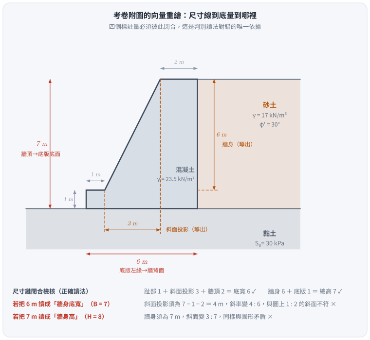
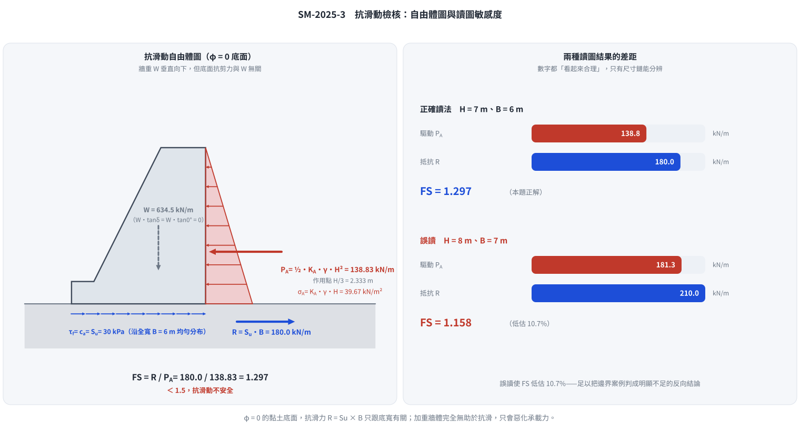

# 考題編號：SM-2025-3

**主分類：** `SM-U3-2` 擋土結構物穩定分析
**副分類：** `SM-U3-1` 側向土壓力理論
**分析法：** 總應力法
**標籤：** `重力式擋土牆` `抗滑動` `Rankine主動土壓力` `不排水剪力強度` `φ=0分析` `安全係數`

---

## 1. 原始題目重述 (Problem Restatement)
請評估圖中所示之重力式擋土牆抗滑動之安全係數。（25 分）
附註：地表呈水平，牆背面垂直，可不考慮牆面摩擦，主動土壓力係數可用：$K_A = \tan^2[45^\circ - \frac{\phi}{2}]$

- **幾何形狀（依圖上四個標註量）：** 牆頂寬 $2 \text{ m}$、牆背面垂直；左側「$7 \text{ m}$」尺寸線由牆頂拉到**底版底面**，即**牆總高 $H = 7 \text{ m}$（已含 $1 \text{ m}$ 厚底版）**；「$6 \text{ m}$」為**底版全寬 $B = 6 \text{ m}$（已含 $1 \text{ m}$ 趾部突出）**；底版厚 $1 \text{ m}$、趾部突出 $1 \text{ m}$。
- **幾何自洽檢核：** 趾部 $1$ ＋ 牆身斜面水平投影 $3$ ＋ 牆頂 $2$ ＝ 底寬 $6$ ✓；牆身 $6$ ＋ 底版 $1$ ＝ 總高 $7$ ✓。
- **背填土 (Sand)：** $\gamma = 17 \text{ kN/m}^3$，$\phi' = 30^\circ$，地表水平且與牆頂齊高。
- **基礎土 (Clay)：** $S_u = 30 \text{ kPa}$，黏土面與底版底面齊高（趾部前方**無覆土**）。
- **混凝土 (Concrete)：** $\gamma = 23.5 \text{ kN/m}^3$。

*圖說：重力式擋土牆座落於黏土基礎（$S_u = 30$ kPa）上，右側背填砂土（$\gamma = 17$ kN/m³、$\phi' = 30^\circ$），混凝土 $\gamma = 23.5$ kN/m³。牆背面垂直、牆頂寬 $2$ m、前面為斜面。左側「$7$ m」尺寸線的兩個箭頭分別落在牆頂與底版底面，故 $7$ m 是**總高**；圖下方「$6$ m」箭頭由底版左緣拉到牆背面，故 $6$ m 是**底版全寬**；另兩個「$1$ m」分別標示底版厚度與趾部突出量。牆前地表與底版底面同高，故無被動側覆土；背填砂土厚度即 $7$ m，其下亦為黏土。*

## 2. 考題核心精神與出題者意圖 (Core Concepts & Examiner's Intent)
本題為最基本之擋土牆滑動穩定性檢核，但把兩個鑑別點藏在看似平凡的題面裡：

1. **$\phi = 0$ 底面的抗滑機制**：出題者刻意只給基礎黏土的不排水剪力強度 $S_u$（不給 $\phi$）。
   在純凝聚力（$\phi_u = 0$）的不排水狀態下，底面極限剪應力 $\tau_f = S_u$ 是**常數**，
   與正向力無關，故抗滑力 $= c_a \times B$，**與擋土牆自重完全脫鉤**。
   這與砂土基礎的 $W\tan\delta$ 是兩種截然不同的機制。
2. **尺寸線該讀到哪裡**：全題只有四個數字，且沒有一個是「牆身高度」或「牆身底寬」——
   $7 \text{ m}$ 與 $6 \text{ m}$ 都是**含底版／含趾部的總量**。
   能不能正確判讀，直接決定 $P_A$ 與 $R$ 兩個量，也就是整題的成敗。

## 3. 解題戰略地圖與陷阱分析 (Strategic Roadmap & Trap Analysis)
**戰略地圖：**
- **Step 1:** 釐清幾何關係，判斷擋土牆承受側向土壓力的總高度 $H$ 以及擋土牆與基礎接觸的底面寬度 $B$。用「尺寸鏈是否閉合」交叉驗證讀圖結果。
- **Step 2:** 計算滑動驅動力（主動土壓力 $P_A$）。利用給定的公式計算 $K_A$，再代入三角形土壓力分布公式求得水平推力。
- **Step 3:** 計算滑動抵抗力（底部抗滑力 $R$）。因基礎為黏土，僅具不排水剪力強度 $S_u$（即 $\phi = 0$ 分析），採用純凝聚力滑動模型，抗滑力為基底寬度乘上黏著力（一般假定基礎與黏土之最大黏著力 $c_a = S_u$）。
- **Step 4:** 計算安全係數 $FS = R / P_A$。

**陷阱分析：**
1. **多餘資訊陷阱（重量的干擾）：** 題目給了混凝土單位重 $\gamma = 23.5$，許多考生會習慣性地去切割牆體計算各區塊重量 $W$。但在基礎為純黏土（$\phi = 0$）的滑動檢核中，垂直載重不會增加抗滑摩擦力（即 $W\tan\delta = 0$）。若花大量時間算牆重，不僅白費功夫，還可能暴露觀念不清而被扣分。（牆重在**抗傾覆**與**承載力**檢核中才派得上用場，見 §5。）
2. **⚠ 尺寸線的起訖點（本題最容易失分處）：** 左側「$7 \text{ m}$」的下箭頭落在**底版底面**而非底版頂面，故 $H = 7 \text{ m}$，**不是** $7 + 1 = 8 \text{ m}$；圖下方「$6 \text{ m}$」的左箭頭落在**底版左緣**而非牆身，故 $B = 6 \text{ m}$，**不是** $1 + 6 = 7 \text{ m}$。誤讀成 $H = 8$、$B = 7$ 會得到 $FS = 1.158$，與正解 $1.297$ 相差 $11\%$。判別方法只有一個：**檢查尺寸鏈是否閉合**——趾部 $1$ ＋ 斜面投影 $3$ ＋ 頂寬 $2$ 必須等於底寬，若讀成 $7$ 就湊不出來。
3. **被動土壓力的取捨：** 牆前地表與底版底面同高，趾部前方沒有任何覆土，故被動土壓力為零；即使有，實務上表土也容易受擾動或掏刷流失，忽略是正確且偏保守的做法。
4. **$K_A$ 用 $\phi'$ 而非基礎黏土的參數：** $K_A$ 屬於**背填砂土**的性質（$\phi' = 30^\circ$），$S_u = 30 \text{ kPa}$ 是**基礎黏土**的性質，兩者恰好都是「30」，切勿混用。

## 3.5 變數層次分析 (Variable Hierarchy Analysis)

> 複習提示：第一次解題後，在每個卡住的知識點旁標記 `⚠`；第二次複習時只看有 `⚠` 的項目。

### 最終目標
`評估重力式擋土牆在純黏土基礎上的抗滑動安全係數 (FS)。`

### 本題關鍵公式（依計算順序）

$$\text{Step 1: } H = 7 \text{ m}, \quad B = 6 \text{ m} \quad (\text{由圖上尺寸鏈判定})$$

$$\text{Step 2: } K_A = \tan^2\!\left(45^\circ - \frac{\phi'}{2}\right)$$

$$\text{Step 3: } P_A = \tfrac{1}{2}\,\boxed{K_A}\,\gamma_{sand}\,\boxed{H}^2$$

$$\text{Step 4: } R = c_a \times \boxed{B} = S_u \times \boxed{B}$$

$$\text{Step 5: } FS = \frac{\boxed{R}}{\boxed{P_A}}$$

### L1：題目直接給定
_看到題目就能讀出的數字，不需要任何公式。_

| 符號 | 數值 | 說明 |
|---|---|---|
| $H$ | 7 m | 牆總高（含底版），左側尺寸線由牆頂至底版底面 |
| $B$ | 6 m | 底版全寬（含趾部），下方尺寸線由底版左緣至牆背面 |
| $t_{base}$ | 1 m | 底版厚度 |
| $B_{toe}$ | 1 m | 趾部突出量 |
| $b_{top}$ | 2 m | 牆頂寬度 |
| $\gamma_{sand}$ | 17 kN/m³ | 背填砂土單位重（無地下水） |
| $\phi'$ | 30° | 背填砂土內摩擦角 |
| $S_u$ | 30 kPa | 基礎黏土不排水剪力強度 |
| $\gamma_{conc}$ | 23.5 kN/m³ | 混凝土單位重（本小題用不到，見 §5） |

### L2：需知識點推導
_需要知道公式名稱與適用條件，套入 L1 即可算出。_

**第一階段：計算滑動驅動力 $P_A$**

| 符號 | 公式／來源 | 卡關? |
|---|---|:---:|
| $K_A$ | $\tan^2(45^\circ - 30^\circ/2) = 1/3$ | |
| $P_A$ | $\frac{1}{2}K_A\gamma_{sand}H^2$（$\delta = 0$，故全為水平向） | |
| $\bar{y}_A$ | $H/3$（三角形分布的形心，供傾覆檢核用） | |

**第二階段：計算滑動抵抗力 $R$**

| 符號 | 公式／來源 | 卡關? |
|---|---|:---:|
| $c_a$ | $= \alpha S_u$，未特別註明則取黏著係數 $\alpha = 1$ | |
| $R$ | $c_a \times B$（$\phi = 0$，與正向力無關） | |
| $P_p$ | $= 0$（趾部前方無覆土） | |

**第三階段：計算安全係數 $FS$**

| 符號 | 公式／來源 | 卡關? |
|---|---|:---:|
| $FS$ | $R / P_A$ | |

### L3：深層知識（不懂就卡住）
_L2 中某些公式本身需要背景概念才能正確應用的知識點。_

| 知識點 | 說明 | 卡關? |
|---|---|:---:|
| 純凝聚力滑動觀念 | 在 $\phi = 0$ 的黏土上，極限抗剪力 $\tau_f = S_u$ 為常數，與正向力（牆重）大小無關；故牆再重也不會更抗滑，只會更容易發生**承載力**破壞。 | |
| 牆面摩擦角 $\delta$ 的影響 | 題目明示「可不考慮牆面摩擦」，故 $\delta = 0$，主動土壓力 $P_A$ 呈完全水平向，且 Rankine 與 Coulomb 結果一致。 | |
| 尺寸鏈閉合檢核 | 工程圖的尺寸標註必須自洽：分段量之和 = 總量。讀圖有兩種可能時，用這個條件淘汰錯的那一種。 | |

## 4. 步驟化詳細計算過程 (Step-by-Step Detailed Calculation)

**Step 1：確認擋土牆幾何尺寸**

由圖上尺寸線的箭頭落點判定：

$$H = 7 \text{ m （牆頂至底版底面，已含 1 m 底版）}$$
$$B = 6 \text{ m （底版左緣至牆背面，已含 1 m 趾部）}$$

> *策略註解：用尺寸鏈交叉驗證——牆頂寬 $2$、趾部 $1$，兩者之間即牆身斜面的水平投影 $6 - 1 - 2 = 3 \text{ m}$，配合牆身高 $7 - 1 = 6 \text{ m}$，斜面坡度為 $3:6 = 1:2$，與圖上目視一致。若誤把 $B$ 讀成 $7 \text{ m}$，斜面投影會變成 $7 - 1 - 2 = 4 \text{ m}$，與圖形不符。*

*圖 1　尺寸線到底量到哪裡。攔的正是本題最大的失分點——把 $7 \text{ m}$ 當成牆身（$H = 8$）、把 $6 \text{ m}$ 當成牆身底寬（$B = 7$）。判別依據只有尺寸鏈閉合：$1 + 3 + 2 = 6$、$6 + 1 = 7$；若 $B = 7$，斜面投影須為 $4 \text{ m}$，坡度變 $4:6$，與圖上 $1:2$ 的斜面不符。*

**Step 2：計算滑動驅動力（主動土壓力 $P_A$）**

背填土為砂土（$\phi' = 30^\circ$）、地表水平、牆背面垂直、無地下水。
依題目公式計算主動土壓力係數 $K_A$：

$$K_A = \tan^2\left(45^\circ - \frac{30^\circ}{2}\right) = \tan^2(30^\circ) = \frac{1}{3}$$

由於「不考慮牆面摩擦」（$\delta = 0$），土壓力完全呈水平向，沿牆背面呈三角形分布，
牆底處的最大值為 $\sigma_A = K_A\gamma_{sand}H = \frac{1}{3}(17)(7) = 39.67 \text{ kN/m}^2$。
單位牆長之總主動推力為：

$$P_A = \frac{1}{2}K_A\gamma_{sand}H^2 = \frac{1}{2}\times\frac{1}{3}\times 17 \times 7^2 = \frac{17 \times 49}{6} = 138.83 \text{ kN/m}$$

作用點位於底版底面上方 $H/3 = 2.333 \text{ m}$ 處。

**Step 3：計算滑動抵抗力（底部抗剪力 $R$）**

基礎為黏土，僅給定不排水剪力強度 $S_u = 30 \text{ kPa}$。
此為不排水條件之純凝聚力滑動（$\phi = 0$ 分析），底部極限剪應力等於黏著力 $c_a$，
通常假設場鑄混凝土與黏土完全貼合且無折減，取 $c_a = \alpha S_u = S_u$（$\alpha = 1$）。

*(策略註解：因為 $\phi = 0$，正向力（即牆體自重）不會貢獻任何摩擦阻力，$W\tan\delta_{base} = W\tan 0^\circ = 0$。故題目給定的混凝土單位重在本小題為干擾資訊，不需要花時間計算牆重。)*

單位牆長之底部最大抗滑力為：

$$R = c_a \times B = 30 \times 6 = 180 \text{ kN/m}$$

牆前無覆土，被動土壓力 $P_p = 0$，不計入抵抗力。

**Step 4：計算抗滑動安全係數**

$$FS = \frac{\Sigma F_R}{\Sigma F_D} = \frac{R}{P_A} = \frac{180}{138.83} = 1.2965$$

$$\boxed{FS \approx 1.30\;(<1.5，抗滑動不安全)}$$

*圖 2　$\phi = 0$ 底面的自由體圖與讀圖敏感度。攔兩種錯：一是把牆重算進抗滑力（灰色箭頭旁已寫明 $W\tan\delta = W\tan 0^\circ = 0$），二是尺寸誤讀讓 $FS$ 低估 $10.7\%$。*

## 5. 關鍵爭議點與進階探討 (Critical Issues & Advanced Discussion)

1. **⚠ 讀圖：兩個數字都不是「分段量」**
   本題全部的計算風險集中在 Step 1。把 $7 \text{ m}$ 讀成牆身（再加底版得 $H = 8$）、
   把 $6 \text{ m}$ 讀成牆身底寬（再加趾部得 $B = 7$），是最自然也最常見的誤讀，會得到：
   $$P_A = \tfrac{1}{2}(\tfrac{1}{3})(17)(8^2) = 181.33,\quad R = 30 \times 7 = 210,\quad FS = 1.158$$
   數字看起來同樣「合理」，卻低估了 $11\%$ 的安全係數。
   兩種讀法的唯一判別依據是**尺寸鏈閉合**：$1 + 3 + 2 = 6$（若底寬是 $7$ 則斜面投影須為 $4$，與圖形不符）、
   $6 + 1 = 7$（若總高是 $8$ 則牆身須為 $7$，圖上斜面會變成 $3:7$）。
   考場上遇到只給四個數字的圖，第一件事就是把它們加起來看能不能閉合。

2. **干擾資訊的取捨，以及 $\gamma_{conc}$ 真正的用處**
   出題老師給出 $\gamma = 23.5 \text{ kN/m}^3$，許多考生會反射性地切割牆體算重量與重心。
   在純凝聚力基礎的**抗滑動**分析中，正向力確實完全無用武之地；但同一組數字在另外兩項檢核中是必要的：

   - 牆體斷面積：底版 $6 \times 1 = 6$；牆身（上底 $2$、下底 $5$、高 $6$ 的梯形）$= 21$；合計 $A = 27 \text{ m}^2$。
   - 牆重 $W = 27 \times 23.5 = 634.5 \text{ kN/m}$，形心距牆趾 $\bar{x} = \frac{6(3) + 12(5) + 9(3)}{27} = 3.889 \text{ m}$。
   - **抗傾覆**：$M_R = 634.5 \times 3.889 = 2467 \text{ kN·m/m}$，$M_O = 138.83 \times 2.333 = 323.9 \text{ kN·m/m}$，
     $FS_{OT} = 7.6 \gg 2.0$，非常安全。
   - **承載力**：合力距牆趾 $\frac{2467 - 323.9}{634.5} = 3.378 \text{ m}$，偏心距 $e = 3.378 - 3.0 = 0.378 \text{ m} < B/6 = 1.0$（合力仍在中三分點內）。
     以 Meyerhof 有效寬度 $B' = B - 2e = 5.24 \text{ m}$ 計，$q = 634.5/5.24 = 121 \text{ kPa}$；
     $\phi = 0$、$D_f = 0$ 之極限承載力 $q_{ult} = 5.14S_u = 154 \text{ kPa}$，$FS_{BC} \approx 1.27$。
   - **結論：三項檢核中，抗滑動（$1.30$）與承載力（$1.27$）都不合格，抗傾覆綽綽有餘。**
     這正是「牆重不能救抗滑」的直接後果——加重牆體只會讓承載力更吃緊。

3. **若基礎是砂土，答案會完全不同**
   假設把基礎換成 $\phi = 30^\circ$ 的砂土、取 $\delta = \frac{2}{3}\phi = 20^\circ$：
   $$FS = \frac{W\tan\delta}{P_A} = \frac{634.5 \times 0.3640}{138.83} = 1.66$$
   同一面牆、同樣的推力，只因底面材料不同，$FS$ 由 $1.30$ 變成 $1.66$。
   這個對照最能說明「先判斷底面是 $\phi = 0$ 還是 $c = 0$」為什麼是本題的第一道關卡。

4. **安全係數偏低時的補強手段**
   $FS = 1.30$ 低於一般擋土牆規範對滑動的要求（通常 $\ge 1.5$）。可行對策依成本排序：
   ① 底版下方增設**止滑榫（shear key）**，強迫滑動面下移至較深、$S_u$ 較高的黏土層，
      並讓榫前的被動抗力參與抵抗；
   ② **加寬底版**（$R = S_u B$ 與 $B$ 成正比，$B$ 加大到 $7.0 \text{ m}$ 即可得 $FS = 1.51$），
      但同時會改變自重與承載力，須重新檢核；
   ③ 底版加深埋置以取得被動土壓力（本題地表齊平，需另行開挖回填）。
   注意「加厚牆體」在 $\phi = 0$ 底面上**完全無效**，這是本題最反直覺、也最值得記住的一點。

5. **$c_a = S_u$ 的保守性**
   實務上場鑄混凝土與黏土的界面黏著力常取 $c_a = \alpha S_u$，$\alpha$ 隨 $S_u$ 增大而遞減
   （軟弱黏土 $\alpha \approx 1.0$，堅硬黏土可低至 $0.5$）。本題 $S_u = 30 \text{ kPa}$ 屬軟至中等黏土，
   取 $\alpha = 1.0$ 合理；但若閱卷者期待 $\alpha = 0.7$，$FS$ 會降到 $0.91$，結論（不安全）更明確。
   考場上寫明「取 $\alpha = 1$，若考慮界面折減則 $FS$ 更低」即可兩面兼顧。

---

*解析日期：見 `wiki/log.md`　｜　圖解補繪：2026-08-29（向量 SVG，程式繪製，腳本 `gen_SM-2025-3.py` 可重跑；同名 2× PNG 供簡報／影片管線使用）*
