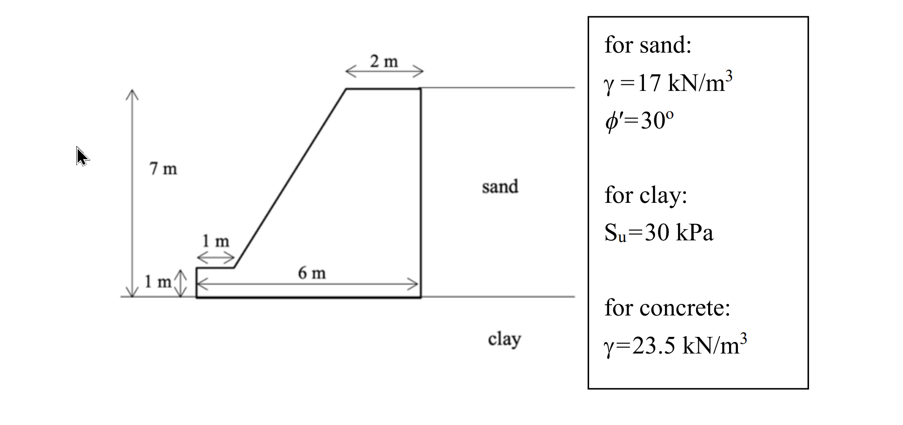

# 考題編號：SM-2025-3

**主分類：** `SM-U3` 側向土壓力與擋土結構物
**副分類：** `SM-U3-2` 擋土結構物穩定分析
**分析法：** 總應力法
**標籤：** `重力式擋土牆` `抗滑動` `主active土壓力` `凝聚力` `不排水剪力強度`

---

## 1. 原始題目重述 (Problem Restatement)
請評估圖中所示之重力式擋土牆抗滑動之安全係數。（25 分）
附註：地表呈水平，牆背面垂直，可不考慮牆面摩擦，主動土壓力係數可用：$K_A = \tan^2[45^\circ - \frac{\phi}{2}]$
- **幾何形狀：** 牆頂寬 2m，牆背面垂直，牆高 7m（扣除底版）。底版於趾部突出 1m，高度 1m。牆底版總寬為 1m (趾部) + 6m (牆身) = 7m。總牆高為 7m + 1m = 8m。
- **背填土 (Sand)：** $\gamma = 17 \text{ kN/m}^3, \phi' = 30^\circ$
- **基礎土 (Clay)：** $S_u = 30 \text{ kPa}$
- **混凝土 (Concrete)：** $\gamma = 23.5 \text{ kN/m}^3$

*圖說：重力式擋土牆座落於黏土基礎（$S_u=30$ kPa）上，右側背填砂土（$\gamma=17$ kN/m³, $\phi'=30^\circ$）。牆身垂直背填土，牆頂寬 2m，總高 8m，底寬 7m。*

## 2. 考題核心精神與出題者意圖 (Core Concepts & Examiner's Intent)
本題為最基本之擋土牆滑動穩定性檢核。主要測驗考生是否清楚「滑動驅動力」與「滑動抵抗力」的來源。出題者特別設定基礎土壤為黏土（僅給不排水剪力強度 $S_u$），這是一個重要的暗示：在純凝聚力（$\phi=0$）的不排水狀態下，底部的抗滑力完全取決於基礎底面積與黏著力，與擋土牆本身的自重無關。

## 3. 解題戰略地圖與陷阱分析 (Strategic Roadmap & Trap Analysis)
**戰略地圖：**
- **Step 1:** 釐清幾何關係，判斷擋土牆承受側向土壓力的總高度 $H$ 以及擋土牆與基礎接觸的底面積寬度 $B$。
- **Step 2:** 計算滑動驅動力（主動土壓力 $P_A$）。利用給定的公式計算 $K_A$，再代入三角形土壓力分布公式求得水平推力。
- **Step 3:** 計算滑動抵抗力（底部抗滑力 $R$）。因基礎為黏土，僅具不排水剪力強度 $S_u$（即 $\phi=0$ 分析），採用純凝聚力滑動模型，抗滑力為基底寬度乘上黏著力（一般假定基礎與黏土之最大黏著力 $c_a = S_u$）。
- **Step 4:** 計算安全係數 $FS = R / P_A$。

**陷阱分析：**
1. **多餘資訊陷阱（重量的干擾）：** 題目給了混凝土單位重 $\gamma = 23.5$，許多考生會習慣性地去切割牆體計算各區塊重量 $W$。但在基礎為純黏土（$\phi=0$）的滑動檢核中，垂直載重不會增加抗滑摩擦力（即 $W \tan\delta = 0$）。若花大量時間算牆重，不僅白費功夫，還可能暴露觀念不清而被扣分。
2. **總高度判讀：** 擋土牆背填土的受壓面高度為總高（牆身 7m + 底版 1m = 8m），若僅取 7m 算土壓力會導致極大的低估錯誤。
3. **被動土壓力的取捨：** 牆趾部分高度僅 1m，且題目圖示並未標出趾部前方有任何覆土，故保守起見（且通常規範允許）不計算被動土壓力提供之抗滑抵抗。

## 3.5 變數層次分析 (Variable Hierarchy Analysis)

### 最終目標
`評估重力式擋土牆在純黏土基礎上的抗滑動安全係數 (FS)。`

### 本題關鍵公式（依計算順序）
$$ K_A = \tan^2(45^\circ - \phi'/2) $$
$$ P_A = \frac{1}{2} K_A \gamma_{sand} H^2 $$
$$ R = S_u \times B $$
$$ FS = \frac{\boxed{R}}{\boxed{P_A}} $$

### L1：題目直接給定
| 符號 | 數值 | 說明 |
|---|---|---|
| $H_{stem}$ | 7 m | 擋土牆牆身高度 |
| $H_{base}$ | 1 m | 擋土牆底版高度 |
| $B_{toe}$ | 1 m | 趾部寬度 |
| $B_{stem}$ | 6 m | 底版跟部與牆身底部對應寬度 |
| $\gamma_{sand}$ | 17 kN/m³ | 砂土單位重 |
| $\phi'$ | 30° | 砂土內摩擦角 |
| $S_u$ | 30 kPa | 黏土不排水剪力強度 |

### L2：需知識點推導
| 符號 | 公式／來源 | 卡關? |
|---|---|---|
| **第一階段：計算滑動驅動力 $P_A$** | | |
| $H$ | $H_{stem} + H_{base} = 7 + 1$ | |
| $K_A$ | $\tan^2(45^\circ - 30^\circ/2)$ | |
| $P_A$ | $0.5 \times K_A \times \gamma_{sand} \times H^2$ | |
| **第二階段：計算滑動抵抗力 $R$** | | |
| $B$ | $B_{toe} + B_{stem} = 1 + 6$ | |
| $c_a$ | $S_u$ (未特別註明則取黏著係數 $\alpha=1$) | |
| $R$ | $c_a \times B$ | |
| **第三階段：計算安全係數 $FS$** | | |
| $FS$ | $R / P_A$ | |

### L3：深層知識
| 知識點 | 說明 | 卡關? |
|---|---|---|
| 純凝聚力滑動觀念 | 在 $\phi=0$ 的黏土上，極限抗剪力 $\tau_f = S_u$，與正向力 (牆重) 大小無關。 | |
| 牆面摩擦角 $\delta$ 的影響 | 題目明示「可不考慮牆面摩擦」，故 $\delta=0$，主動土壓力 $P_A$ 呈完全水平向。 | |

## 4. 步驟化詳細計算過程 (Step-by-Step Detailed Calculation)

**Step 1：確認擋土牆幾何尺寸**
背填土側（右側）承受主動土壓力的總垂直高度 $H$ 為：
$$ H = 7 \text{ m (牆身)} + 1 \text{ m (底版)} = 8 \text{ m} $$
擋土牆與基礎接觸之底寬 $B$ 為（依圖示箭頭標示判定）：
$$ B = 1 \text{ m (左側趾部)} + 6 \text{ m (剩餘底座)} = 7 \text{ m} $$

**Step 2：計算滑動驅動力（主動土壓力 $P_A$）**
背填土為砂土（$\phi' = 30^\circ$），地表水平，且牆背面垂直。
依題目公式計算主動土壓力係數 $K_A$：
$$ K_A = \tan^2\left(45^\circ - \frac{30^\circ}{2}\right) = \tan^2(30^\circ) = \frac{1}{3} $$
由於「不考慮牆面摩擦」($\delta=0$)，土壓力完全呈水平向。單位寬度之總主動土壓力推力為：
$$ P_A = \frac{1}{2} K_A \gamma_{sand} H^2 = \frac{1}{2} \times \left(\frac{1}{3}\right) \times 17 \times (8)^2 = \frac{1}{6} \times 17 \times 64 = \frac{1088}{6} \approx 181.33 \text{ kN/m} $$

**Step 3：計算滑動抵抗力（底部抗剪力 $R$）**
基礎為黏土，僅給定不排水剪力強度 $S_u = 30 \text{ kPa}$。
此為不排水條件之純凝聚力滑動（$\phi=0$ 分析），底部極限剪應力等於黏著力 $c_a$。通常假設基底與土壤完全貼合且無額外折減，取 $c_a = S_u$。
*(策略註解：因為 $\phi=0$，正向力（即牆體自重）不會貢獻任何摩擦阻力。故題目給定的混凝土單位重為干擾資訊，不需要花時間計算牆重。)*
單位寬度之底部最大抗滑力為：
$$ R = c_a \times B = S_u \times B = 30 \times 7 = 210 \text{ kN/m} $$

**Step 4：計算抗滑動安全係數**
$$ FS = \frac{\Sigma F_R}{\Sigma F_D} = \frac{R}{P_A} = \frac{210}{181.33} \approx 1.158 $$

$$ \boxed{ FS \approx 1.158 } $$

## 5. 關鍵爭議點與進階探討 (Critical Issues & Advanced Discussion)
1. **干擾資訊的取捨：** 本題最精華的考點就是「不計算牆重」。出題老師給出混凝土單位重 $\gamma=23.5$，許多考生會反射性地將牆體分割為矩形與三角形計算重量與重心。這在抗傾覆分析或砂土底盤分析時是必要的，但在純凝聚力基礎的抗滑動分析中，正向力完全無用武之地，花費大量時間算重量可能暴露觀念不清。
2. **安全係數偏低：** 算出的 FS=1.158 低於一般擋土牆設計規範的滑動安全係數要求（通常至少 1.5）。這表示該牆在實際工程中是不安全的，可能需要加深埋置深度利用被動土壓力，或在底版下方增設止滑榫 (Shear key) 以強迫滑動面穿過深層土壤，從而增加抗滑力。
3. **被動土壓力的保守性：** 題圖左側趾部前方沒有畫出覆土，實務上開挖區表土也容易受擾動或掏刷流失，因此忽略被動土壓力的貢獻是正確且偏保守的設計做法。
