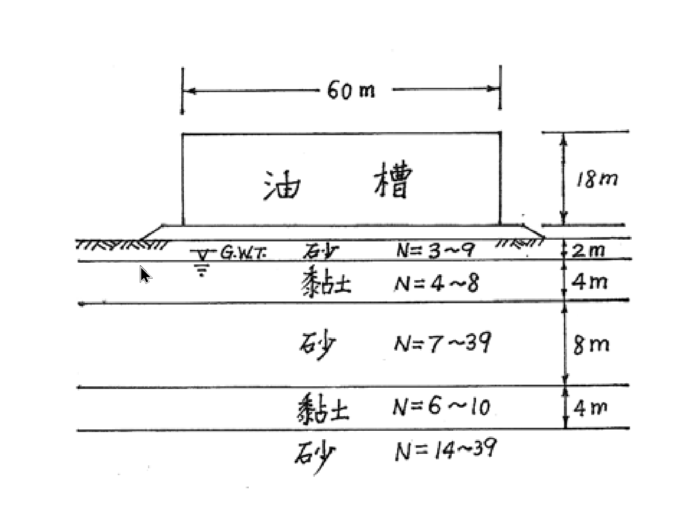

# SM-2004-4 — 預壓法、基地調查、監測儀器配置

**來源：** 結構工程技師高考 · 土壤力學與基礎設計 · 第4題
**考年：** 2004（民國93年）
**主分類：** [[SM-U2-4]] 基礎型式之選擇與評估
**副分類：** [[SM-U2-5]] 地層改良方法、[[SM-U1-3]] 土壤夯實及壓密、[[SM-U2-1]] 淺基礎之支承力與沉陷量
**分析法：** 概念題
**標籤：** `預壓法` `基地調查` `監測儀器配置` `壓密沉陷` `差異沉陷` `液化評估` `承載力檢核`
**驗證狀態：** ⏳ unverified

---

## 題幹摘要

於台灣某處建造如下圖之大型儲油槽，油槽下方為軟弱且具壓縮性之軟弱黏土及砂土層。
(一) 試詳細說明油槽設計者必須考慮之各項大地工程問題。（9 分）
(二) 工址調查應進行那些現地調查及實驗室試驗項目？為甚麼需要這些項目？（8 分）
(三) 若採用預壓（preloading）工法改良地盤，為確保施工安全及瞭解改良成效，在現地應進行那些監測項目？（8 分）

*圖說：地表建造一直徑 60m、高 18m 之大型儲油槽。地下水位位於地表下 2m 處。土層由上而下分別為：0~2m 為砂土 (N=3~9)，2~6m 為黏土 (N=4~8)，6~14m 為砂土 (N=7~39)，14~18m 為黏土 (N=6~10)，18m 以下為砂土 (N=14~39)。*

## 核心考點

- 本題為典型之大型儲油槽基礎設計與地盤改良綜合概念題。
- 測驗考生對於「大面積柔性載重」於「互層軟弱地盤」上所引發的各類大地工程問題（承載力、沉陷、液化等）之整體評估能力。
- 測驗對於工址調查（現地與室內試驗）如何針對特定工程問題獲取所需參數的對應關係。
- 測驗預壓工法（地盤改良）的施工監測儀器配置，評估考生是否具備將理論落實於實務安全及成效管控之能力。

## 解題關鍵步驟

- **戰略一（大地問題）**：從載重特性（大面積、重載）與地層特性（軟黏土、地下水位高、砂土層可能疏鬆）出發。油槽載重極大，首要考量承載力（尤其局部破壞或基礎邊緣剪力破壞）；此外，下方有兩層黏土，長期壓密沉陷量必然驚人，且差異沉陷會導致油槽本體或管線破壞；位於台灣且有飽和砂土（0-2m部分未飽和，但2m以下有砂土層N=7~39，淺層N值偏低）則需檢核地震液化潛能。
- **戰略二（工址調查）**：需對應第一點的大地問題。要算承載力/沉陷/液化，分別需要什麼參數？
  - 現地：標準貫入試驗(SPT)、圓錐貫入試驗(CPT)、十字鑽管試驗(Vane shear，針對軟黏土)、地下水位觀測。
  - 室內：物理性質（阿太堡限度、比重、單位重）、力學性質（一維壓密試驗求 $C_c, C_v$、三軸試驗求 $c, \phi$、單軸壓縮試驗求 $S_u$）。
- **戰略三（預壓監測）**：預壓會產生巨大超載，首要防止施工期間地盤剪力破壞（側向擠壓）及掌握壓密進度（何時可移除預壓載重）。對應儀器為：水壓計（孔隙水壓消散）、沉陷板/地表沉陷點（垂直變形）、傾斜管（側向變形）、隆起標（周圍地表隆起）。

## 用到的公式

_(無獨立公式，詳見完整解析)_

## 涉及陷阱

- **陷阱分析**：
  - 忽視台灣為地震帶的特性，未提到砂土液化問題。
  - 籠統列舉試驗，未明確指出「為什麼需要」（對應何種設計參數）。
  - 預壓監測未區分「安全」（側向位移、隆起）與「成效」（沉陷量、孔壓消散）。

## 圖形（如有）

_(無)_

## 手寫補充（如有）

_(無)_

## 相關題目

- [[SM-2019-2]] — Terzaghi壓密理論、壓密沉陷、壓縮指數Cc
- [[SM-2015-1]] — 壓密沉陷、預壓法、壓密度
- [[SM-2003-1]] — 基地調查、鑽探深度、不擾動土樣
- [[SM-2024-3]] — 地下水位下降、有效應力原理、正常壓密
- [[SM-2021-2]] — Terzaghi壓密理論、正常壓密、壓密沉陷
