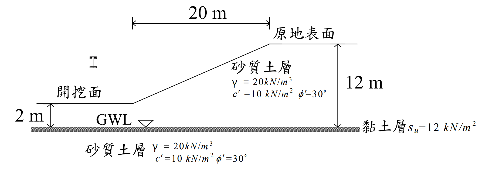

# SM-2006-3 — 側向滑動、Rankine主動土壓力、Rankine被動土壓力

**來源：** 結構工程技師高考 · 土壤力學與基礎設計 · 第3題
**考年：** 2006（民國95年）
**主分類：** [[SM-U3-3]] 坡地工程
**副分類：** [[SM-U3-1]] 側向土壓力理論、[[SM-U2-3]] 開挖之穩定性分析
**分析法：** 混合
**標籤：** `側向滑動` `Rankine主動土壓力` `Rankine被動土壓力` `張力裂縫` `孔隙水壓` `不排水剪力強度` `安全係數`
**驗證狀態：** ⏳ unverified

---

## 題幹摘要

三、有一地下室工程擬採島式開挖施工，其邊坡採 V：H = 1：2 之邊坡開挖如下圖所示。邊坡主要為砂質土層，其單位體積總重在常時與飽和狀態時均為 $\gamma = 20 \text{ kN/m}^3$，且 $c' = 10 \text{ kN/m}^2$，$ \phi' = 30^\circ$。今假設開挖面下夾有一薄層軟弱黏土（如圖中之斜線區所示），厚度約 10 cm，其不排水剪力強度為 $s_u = 12 \text{ kN/m}^2$：

(一) 假設常時地下水位位於軟弱黏土層表面，當邊坡開挖深度達 10m 時（即下圖所示情況），試以合理方法估計其產生側向滑動之安全係數。（15 分）
(二) 若遇豪雨使地下水位分別上升至沿原地表面、沿邊坡面以及沿開挖面分布時，其產生側向滑動之安全係數變為何？（10 分）

*圖說：剖面圖顯示右側為原地表面，左側為開挖面。開挖面距下方薄層軟弱黏土為 2m，原地表面距黏土層為 12m（即開挖深度 10m）。邊坡 V:H = 1:2，水平投影長度為 20m。砂土層參數 $\gamma = 20 \text{ kN/m}^3, c' = 10 \text{ kN/m}^2, \phi' = 30^\circ$；黏土層參數 $s_u = 12 \text{ kN/m}^2$。*

---

## 核心考點

1. **側向滑動分析（Sliding Block Method）：** 考驗考生是否能將邊坡沿水平弱面滑動的問題，轉化為「主動土壓力（驅動力）」、「被動土壓力（抵抗力）」與「底部抗剪力（抵抗力）」的剛體平衡模型。
2. **水壓效應與有效應力原理：** 第 (二) 小題加入了豪雨條件，測驗考生是否知道土壓力必須用「有效應力」計算，再加上「孔隙水壓力」成為總側向推力。同時需注意張力裂縫在豪雨時應視為積水。
3. **總應力與有效應力參數的混用陷阱：** 題目巧妙地給了砂土的有效應力參數（$c', \phi'$）和黏土的總應力參數（不排水剪力強度 $s_u$）。考生必須清楚知道：**水位的上升會改變砂土的有效應力與土壓力，但「不會」改變黏土的不排水剪力強度 $s_u$。**

---

## 解題關鍵步驟

- **Step 1: 定義滑動區塊**
  滑動區塊的右邊界設於坡頂（承受主動土壓力，高度 $H_1 = 12\text{m}$），左邊界設於坡趾（承受被動土壓力，高度 $H_2 = 2\text{m}$），底面為軟弱黏土層（長度 $L = 20\text{m}$）。
- **Step 2: 土壓力係數計算**
  利用 Rankine 理論求得砂土的 $K_A$ 與 $K_P$。
- **Step 3: 常時狀況分析 (Part 1)**
  水位在黏土層表面，故整個滑動區塊皆無孔隙水壓（$u=0$）。直接以 $\gamma = 20 \text{ kN/m}^3$ 計算 $P_A$ 與 $P_P$，底部抗滑力為 $T = s_u \times L$，計算安全係數。
- **Step 4: 豪雨狀況分析 (Part 2)**
  水位上升至地表。使用浮水漾位重 $\gamma'$ 計算有效土壓力 $P_A'$ 與 $P_P'$。外加兩側的靜水壓力 $P_{wA}$ 與 $P_{wP}$。底部抗滑力 $T$ 維持不變。

## 用到的公式

$$K_A = \tan^2(45^\circ - \phi'/2) \quad ; \quad K_P = \tan^2(45^\circ + \phi'/2)$$

$$z_c = \frac{2c'}{\gamma \sqrt{K_A}}$$

$$P_A = \int_{z_c}^{H_1} (K_A \sigma_v' - 2c'\sqrt{K_A}) dz + P_{wA}$$

$$P_P = \int_{0}^{H_2} (K_P \sigma_v' + 2c'\sqrt{K_P}) dz + P_{wP}$$

$$T = s_u \times L$$

$$FS = \frac{T + \boxed{P_P}}{\boxed{P_A}}$$

## 涉及陷阱

**⚠️ 關鍵陷阱：**
1. **張力裂縫（Tension Crack）：** 具凝聚力的土壤在主動側會產生張力裂縫，計算推力時須扣除裂縫深度的負側壓。豪雨時裂縫必定積滿水，產生額外水壓。
2. **黏土層強度的誤判：** 豪雨使水壓增加，若考生誤將黏土以有效應力法分析（扣除水壓），將會嚴重低估底部抗滑力。必須堅持使用給定的 $s_u = 12 \text{ kN/m}^2$。

---

## 圖形（如有）

- [SM-2006-3-pressure-viz.html](../../raw/solutions/SM-2006-3/SM-2006-3-pressure-viz.html)

## 手寫補充（如有）

_(無)_

## 相關題目

- [[SM-2015-2]] — Rankine主動土壓力、張力裂縫、土壓力合力作用點
- [[SM-2021-4]] — Fellenius法、瑞典圓弧法、邊坡穩定
- [[SM-2020-2]] — 板樁、開挖穩定性、砂湧
- [[SM-2014-1]] — 無限邊坡分析、安全係數、平行滲流
- [[SM-2010-2]] — Rankine主動土壓力、土壓力分布圖、水中單位重
