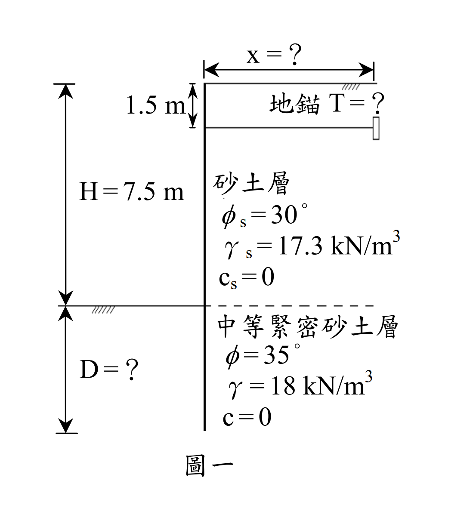

# SM-2007-4 — 板樁、錨定式版樁、固定端支撐法

**來源：** 結構工程技師高考 · 土壤力學與基礎設計 · 第4題
**考年：** 2007（民國96年）
**主分類：** [[SM-U2-3]] 開挖之穩定性分析
**副分類：** [[SM-U3-1]] 側向土壓力理論
**分析法：** 有效應力法
**標籤：** `板樁` `錨定式版樁` `固定端支撐法` `Blum等值梁法` `Rankine主動土壓力` `開挖穩定性` `貫入深度` `地錨有效距離`
**驗證狀態：** ⏳ unverified

---

## 題幹摘要

如圖一所示，為錨定式版樁（sheet pile），使用於地下水位以上開挖支撐，開挖面深度 $H=7.5$ m，其背後為砂性土壤，單位重 $\gamma_s = 17.3 \text{ kN/m}^3$，內摩擦角 $\phi_s = 30^\circ$，凝聚力 $c_s = 0$。開挖面以下為中等緊密砂土層，單位重 $\gamma = 18 \text{ kN/m}^3$，內摩擦角 $\phi = 35^\circ$，凝聚力 $c=0$。
若版樁深入中等緊密砂土層，底部為固定土壤支撐法（fixed-earth support）型式：
(一) 試計算地錨拉力 $T$ 與板樁需要埋入地下之長度 $D$。（假設安全係數採用 1.5）。（15 分）
(二) 又地錨應錨定在板樁後多少距離 $x$ 以外方為有效且安全？（10 分）

*圖說：開挖深 7.5m，地錨深度 1.5m。上層土 $\gamma_s=17.3, \phi_s=30^\circ$，下層土 $\gamma=18, \phi=35^\circ$。要求地錨拉力 T、貫入深度 D 及地錨有效距離 x。*

## 核心考點

本題主要測驗考生對於**錨定式版樁（Anchored Sheet Pile）**的設計與分析能力，特別指定採用**固定土壤支撐法（Fixed-Earth Support Method）**。出題者意圖測驗以下核心觀念：
1. **Blum 等值梁法（Equivalent Beam Method）的應用**：在固定土壤支撐法中，假設開挖面以下淨土壓力為零處存在一反曲點（鉸接點），將版樁拆分為上下兩段靜定梁進行求解。
2. **安全係數（FS）的正確引用時機**：在固定支撐法中，安全係數通常直接除以被動土壓力係數 $K_p$，以獲取更保守的淨壓力零點深度與貫入深度。
3. **分層土壤的主動土壓力跳躍**：開挖面上下土壤性質不同（$\phi_s=30^\circ \to \phi=35^\circ$），在開挖面交界處的主動土壓力會因 $K_a$ 改變而產生數值跳躍。
4. **地錨有效區的幾何判定**：地錨（或錨碇版）的被動破壞楔體不可與版樁的主動破壞楔體重疊，以確保地錨能發揮預期的抗拉能力。

## 解題關鍵步驟

- **戰略地圖**：
  1. 依 Rankine 理論計算兩層土的 $K_a$ 與下層土的 $K_p$。
  2. 將給定的安全係數 $FS=1.5$ 作用於被動土壓力係數，得 $K_p' = K_p / 1.5$。
  3. 求出開挖面以下的「淨土壓力為零點」深度 $y$。
  4. 假設該點為鉸接點（彎矩為零），以上半段梁為自由體，對鉸接點取力矩平衡，求出地錨拉力 $T$。
  5. 由水平力平衡求出鉸接點的剪力 $R$，再利用 Blum 近似法公式 $L_5 = \sqrt{6R/k'}$ 求出下半段所需長度，進而得到總貫入深度 $D$。
  6. 利用主動、被動破壞面與水平面的夾角（$45^\circ \pm \phi/2$），計算不重疊的最小安全距離 $x$。

## 用到的公式

$$K_a = \tan^2\left(45^\circ - \frac{\phi}{2}\right) \quad ; \quad K_p = \tan^2\left(45^\circ + \frac{\phi}{2}\right)$$

$$K_p' = \frac{\boxed{K_{p2}}}{FS}$$

$$y = \frac{\sigma_v' \cdot \boxed{K_{a2}}}{\gamma(\boxed{K_p'} - \boxed{K_{a2}})}$$

$$\sum M_{hinge} = 0 \implies \boxed{T}$$

$$R = \sum P_{active} - \boxed{T}$$

$$L_5 = \sqrt{\frac{6 \boxed{R}}{\gamma(\boxed{K_p'} - \boxed{K_{a2}})}} \implies D = \boxed{y} + \boxed{L_5}$$

$$x \ge \boxed{D} \cot\left(45^\circ + \frac{\phi_2}{2}\right) + H \cot\left(45^\circ + \frac{\phi_1}{2}\right) + h_a \cot\left(45^\circ - \frac{\phi_1}{2}\right)$$

## 涉及陷阱

- **陷阱分析**：
  - **陷阱一：未處理 $K_a$ 的跳躍**：開挖面下方雖然是下層土，但其承受的上覆壓力 $\sigma_v'$ 來自上層土。在 $z=7.5^+$ 處，計算主動土壓力必須改用下層土的 $K_{a2}$。
  - **陷阱二：安全係數的誤用**：部分考生可能會先用 $FS=1$ 算出理論深度 $D_{theory}$，最後再乘以 $1.5$。但題目特別註明「假設安全係數採用 1.5」，依據台灣考題慣例，此類題型應將 FS 除以被動土壓力係數 $K_p$ 來進行後續推導，確保求出的 $T$ 也是基於安全設計。
  - **陷阱三：地錨被動破壞面的起算深度**：題目僅給定地錨拉桿深度 $1.5$ m，未給錨碇版高度。實務與解題上通常保守假設被動破壞面自拉桿深度起算。

## 圖形（如有）

- [SM-2007-4-pressure-viz.html](../../raw/solutions/SM-2007-4/SM-2007-4-pressure-viz.html)

## 手寫補充（如有）

_(無)_

## 相關題目

- [[SM-2005-1]] — 板樁、錨定式版樁、自由端支撐法
- [[SM-2022-4]] — 板樁、開挖穩定性、貫入深度
- [[SM-2014-3]] — 開挖穩定性、板樁、自由端支持法
- [[SM-2020-2]] — 板樁、開挖穩定性、砂湧
- [[SM-2017-4]] — 開挖穩定性、管湧、臨界水力坡降
