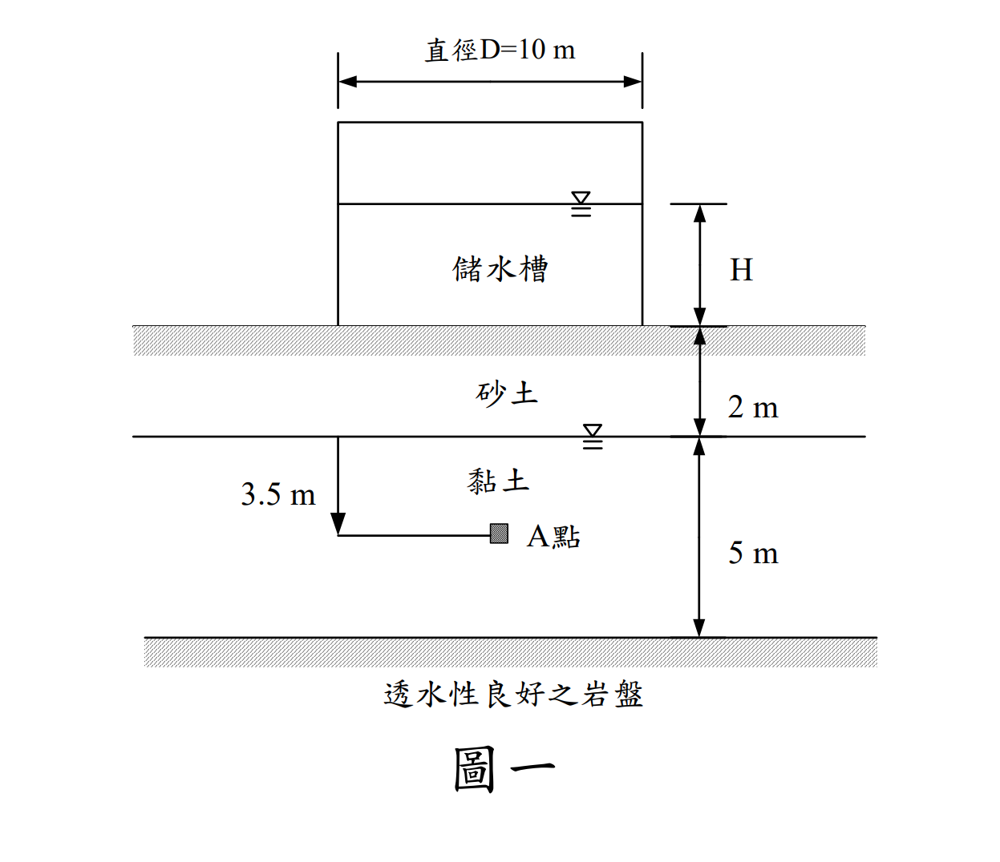

# SM-2008-2 — 應力增量、孔隙水壓參數、Skempton

**來源：** 結構工程技師高考 · 土壤力學與基礎設計 · 第2題
**考年：** 2008（民國97年）
**主分類：** [[SM-U1-5]] 土壤強度特性與變形性
**分析法：** 混合
**標籤：** `應力增量` `孔隙水壓參數` `Skempton` `破壞準則` `儲水槽` `有效應力`
**驗證狀態：** ✅ verified

---

## 題幹摘要

二、有一工廠為解決用水問題，擬興建一內徑 D=10 m 之儲水槽，如圖一所示。由試驗得知砂土層之飽和度 S=50%，孔隙比 e=0.7，比重 Gs=2.66；黏土層之飽和單位重γsat=19 kN/m³。已知蓄水的荷重增量 Δq 造成圖中 A 點垂直應力增量 Δσv 和水平應力增量 Δσh 分別為 1.5Δσv=3Δσh=Δq。已知黏土層有效凝聚力 c'=0，有效摩擦角φ'=30°，靜止土壓力係數 K0=0.5，破壞時之孔隙水壓力參數 Af=0.7，地下水位於地表下 2 m。試問水槽中的水位 H 上升至多高時黏土中的 A 點產生破壞？（25 分）
（註：假設水槽自重不計，且水位快速上升）

*圖說：本圖顯示一內徑 10 m 儲水槽置於地表。地層分為兩層，上層為 2 m 厚砂土，地下水位於地表下 2 m 處；下層為 5 m 厚黏土。A 點位於黏土層內，距黏土層頂部深 3.5 m（砂土 2 m + 黏土 3.5 m = 距地表深 5.5 m）。*

## 核心考點

這是一道結合「應力增量」、「Skempton 孔隙水壓參數」與「有效應力破壞準則」的綜合題。
出題者旨在測驗考生是否了解：
1. 短期不排水加載（水位快速上升）時，土壤內會產生超額孔隙水壓力，其大小可用 Skempton 參數 $A_f$ 與 $B$ 估算。
2. 土壤真正的破壞是由「有效應力」控制，即便是在不排水條件下，只要能推算出現場的孔隙水壓，就能將總應力轉換為有效應力，並代入 Mohr-Coulomb 有效應力破壞準則判斷是否破壞。
3. 題目雖給了直徑 D=10 m，但又直接給定了應力增量與 $\Delta q$ 的關係式，測驗考生能否直接利用已知關係式建立代數方程式求解。

## 解題關鍵步驟

1. **計算初始有效應力**：先依據土層參數求出 A 點的初始總應力 $\sigma_{v0}$ 與水壓 $u_0$，得出初始垂直有效應力 $\sigma'_{v0}$。再利用靜止土壓力係數 $K_0$ 求出初始水平有效應力 $\sigma'_{h0}$。
2. **計算總應力增量與超額水壓**：根據題目給定條件，以水槽荷重增量 $\Delta q$ 表示 $\Delta\sigma_v$ 與 $\Delta\sigma_h$。由於黏土飽和，取 $B=1$，代入 Skempton 孔隙水壓公式 $\Delta u = \Delta\sigma_3 + A_f(\Delta\sigma_1 - \Delta\sigma_3)$ 求出破壞時的超額孔隙水壓。
3. **建立破壞時的有效應力**：將初始有效應力加上總應力增量，再扣除超額孔隙水壓，得到破壞時的垂直與水平有效應力 $\sigma'_{vf}$、$\sigma'_{hf}$（皆為 $\Delta q$ 的函數）。
4. **代入破壞準則求解**：將 $\sigma'_{vf}$ 與 $\sigma'_{hf}$ 代入 $c'=0, \phi'=30^\circ$ 的 Mohr-Coulomb 破壞準則，解出 $\Delta q$，進而換算為水深 $H$。

## 用到的公式

$$\gamma_{sand} = \frac{G_s + S \cdot e}{1+e} \gamma_w = \frac{2.66 + 0.5 \times 0.7}{1 + 0.7} \times 9.81 = \frac{3.01}{1.7} \times 9.81 = 17.37 \text{ kN/m}^3$$

$$\sigma_{v0} = \gamma_{sand} \times 2 + \gamma_{sat,clay} \times 3.5 = 17.37 \times 2 + 19 \times 3.5 = 34.74 + 66.50 = 101.24 \text{ kN/m}^2$$

$$u_0 = \gamma_w \times 3.5 = 9.81 \times 3.5 = 34.34 \text{ kN/m}^2$$

$$\sigma_{v0}' = \sigma_{v0} - u_0 = 101.24 - 34.34 = 66.90 \text{ kN/m}^2$$

$$\sigma_{h0}' = K_0 \cdot \sigma_{v0}' = 0.5 \times 66.90 = 33.45 \text{ kN/m}^2$$

$$1.5\Delta \sigma_v = \Delta q \implies \Delta \sigma_v = \frac{2}{3} \Delta q = 0.667 \Delta q$$

$$3\Delta \sigma_h = \Delta q \implies \Delta \sigma_h = \frac{1}{3} \Delta q = 0.333 \Delta q$$

$$\Delta u = B[\Delta \sigma_3 + A_f (\Delta \sigma_1 - \Delta \sigma_3)] = 1 \cdot \left[ \frac{1}{3}\Delta q + 0.7 \left( \frac{2}{3}\Delta q - \frac{1}{3}\Delta q \right) \right]$$

$$\Delta u = \frac{1}{3}\Delta q + 0.7 \times \frac{1}{3}\Delta q = \frac{1.7}{3}\Delta q = 0.567 \Delta q$$

$$\sigma_{1f}' = \sigma_{vf}' = \sigma_{v0}' + \Delta \sigma_v - \Delta u = 66.90 + \frac{2}{3}\Delta q - \frac{1.7}{3}\Delta q = 66.90 + \frac{0.3}{3}\Delta q = 66.90 + 0.1 \Delta q$$

$$\sigma_{3f}' = \sigma_{hf}' = \sigma_{h0}' + \Delta \sigma_h - \Delta u = 33.45 + \frac{1}{3}\Delta q - \frac{1.7}{3}\Delta q = 33.45 - \frac{0.7}{3}\Delta q = 33.45 - 0.233 \Delta q$$

$$\sigma_{1f}' = \sigma_{3f}' \tan^2\left(45^\circ + \frac{\phi'}{2}\right) + 2c' \tan\left(45^\circ + \frac{\phi'}{2}\right)$$

$$\sigma_{1f}' = 3 \sigma_{3f}'$$

$$66.90 + 0.1 \Delta q = 3 \left( 33.45 - \frac{0.7}{3} \Delta q \right)$$

$$66.90 + 0.1 \Delta q = 100.35 - 0.7 \Delta q$$

$$0.8 \Delta q = 33.45 \implies \Delta q = 41.81 \text{ kN/m}^2$$

$$H = \frac{\Delta q}{\gamma_w} = \frac{41.81}{9.81} = \boxed{4.26 \text{ m}}$$

## 涉及陷阱

**陷阱分析**：
- **陷阱 1**：將 $\Delta\sigma_v$ 直接當作有效應力增量。這是未排水加載，必須扣除 $\Delta u$ 才能得到有效應力增量。
- **陷阱 2**：忽略砂土層的水位條件。砂土層在地下水位以上，飽和度 S=50%，需使用公式 $\gamma_t = (G_s + Se)\gamma_w / (1+e)$ 準確計算單位重，不能當作乾土或全飽和。
- **陷阱 3**：$\Delta\sigma_1$ 與 $\Delta\sigma_3$ 的判定。由於 $\Delta\sigma_v = 2/3 \Delta q$ 大於 $\Delta\sigma_h = 1/3 \Delta q$，且初始 $\sigma'_{v0} > \sigma'_{h0}$，故加載過程中垂直方向始終為大主應力，水平方向為小主應力。若搞錯 $A_f$ 公式中括號內的相減順序會導致錯誤。

## 圖形（如有）

_(無)_

## 手寫補充（如有）

_(無)_

## 相關題目

- [[SM-2025-2]] — 三軸試驗、CU試驗、CD試驗
- [[SM-2024-1]] — 三軸試驗、CD試驗、莫爾圓
- [[SM-2018-2]] — CU三軸試驗、正常壓密黏土、軸差應力
- [[SM-2013-3]] — K0壓密、三軸試驗、AC試驗
- [[SM-2012-1]] — 三軸試驗、CU試驗、UU試驗
