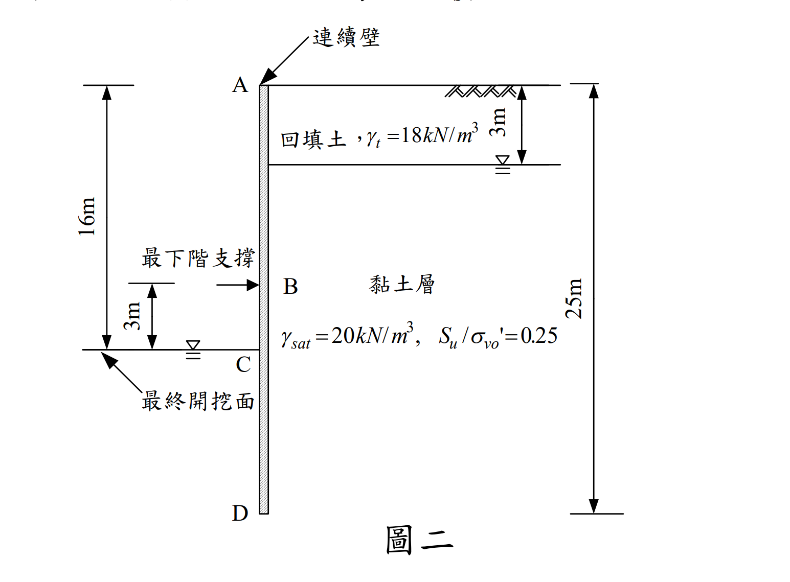

# SM-2008-3 — 開挖穩定性、連續壁、貫入深度

**來源：** 結構工程技師高考 · 土壤力學與基礎設計 · 第3題
**考年：** 2008（民國97年）
**主分類：** [[SM-U2-3]] 開挖之穩定性分析
**副分類：** [[SM-U3-1]] 側向土壓力理論、[[SM-U1-5]] 土壤強度特性與變形性、[[SM-U2-5]] 地層改良方法
**分析法：** 總應力法
**標籤：** `開挖穩定性` `連續壁` `貫入深度` `不排水剪力強度` `被動土壓力` `地盤改良` `安全係數`
**驗證狀態：** ⏳ unverified

---

## 題幹摘要

三、某開挖工程於土層中進行，如圖二所示。地表為一厚 3 m 之回填土，單位重 $\gamma_t = 18 \text{ kN/m}^3$。其下方為一黏土層，飽和單位重 $\gamma_{sat} = 20 \text{ kN/m}^3$，正規化不排水剪力強度 $S_u / \sigma_{v0}' = 0.25$，且不排水剪力強度不受開挖解壓之影響。連續壁總深度為 25 m，開挖深度 16 m，最下階支撐位於最終開挖面上方 3 m 處。（25 分）
(一) 試利用側土壓力平衡式計算其貫入深度安全係數 FS。
(二) 為提高其安全係數，擬於被動土壓力側（開挖面內側）進行地盤改良，若改良區土體之平均單位重為 $\gamma_m = 21.5 \text{ kN/m}^3$，試問改良後之平均單壓強度 $q_u$ 應為多少才能使貫入深度的安全係數 FS $\ge$ 1.5。
（註：計算時忽略連續壁之工作彎矩 $M_s$）

*圖說：開挖面總深 16m，連續壁總深 25m。最下階支撐位於 13m 處。地表 0~3m 為回填土，地下水位於 3m 處。3m 以下為黏土層。*

## 核心考點

- **總應力法（$\phi=0$）的側土壓力應用**：由於土壤為黏土，且為開挖短期的不排水狀況，側向土壓力需採用總應力法計算，公式為 $\sigma_h = \sigma_v \pm 2S_u$。
- **SHANSEP 概念（正規化剪力強度）**：不排水剪力強度 $S_u$ 隨初始有效覆土應力 $\sigma_{v0}'$ 呈線性遞增，必須釐清 $\sigma_{v0}'$ 是開挖前（未解壓）的原始有效應力。
- **貫入深度安全係數定義**：採用自由端支撐法（Free Earth Support Method），以最下階支撐為鉸支承取力矩平衡，安全係數定義為：$FS = \frac{M_R (\text{被動側抵抗力矩})}{M_D (\text{主動側傾覆力矩})}$。

## 解題關鍵步驟

**解題策略**：
1. **建立初始應力與強度剖面**：計算出開挖前的有效垂直應力 $\sigma_{v0}'(z)$，進而求出不排水剪力強度 $S_u(z)$ 的分布方程式。
2. **計算主動與被動側土壓力分布**：以總應力計算，$\sigma_{h,A} = \sigma_{v,A} - 2S_u$ 與 $\sigma_{h,P} = \sigma_{v,P} + 2S_u$。
3. **力矩平衡求 FS**：分別計算主動與被動土壓力對於最下階支撐點 ($z=13$m) 的力矩，求出 FS。
4. **反算地盤改良強度**：將被動側土壤單位重替換為 $\gamma_m$，並以未知的 $q_u$ 取代 $2S_u$。在 $FS=1.5$ 的條件下反求 $q_u$。

## 用到的公式

$$\sigma_{v0}'(z) = 18 \times 3 + (20 - 9.81) \times (z - 3) = 54 + 10.19(z - 3) = 10.19z + 23.43 \text{ (kPa)}$$

$$S_u(z) = 0.25 \cdot \sigma_{v0}'(z) = 0.25[10.19z + 23.43] = 2.5475z + 5.8575 \text{ (kPa)}$$

$$\sigma_{v,A}(z) = 18 \times 3 + 20(z - 3) = 20z - 6 \text{ (kPa)}$$

$$\sigma_{h,A}(z) = \sigma_{v,A}(z) - 2S_u(z) = (20z - 6) - 2(2.5475z + 5.8575) = 14.905z - 17.715 \text{ (kPa)}$$

$$F_A = \frac{1}{2} (176.05 + 354.91) \times (25 - 13) = \frac{1}{2} (530.96) \times 12 = 3185.76 \text{ kN/m}$$

$$y_A = \frac{12}{3} \times \frac{2(354.91) + 176.05}{176.05 + 354.91} = 4 \times \frac{885.87}{530.96} = 6.6737 \text{ m}$$

$$M_A = 3185.76 \times 6.6737 = 21260.9 \text{ kN-m/m}$$

$$\sigma_{v,P}(z) = 20(z - 16) \text{ (kPa)}$$

$$\sigma_{h,P}(z) = \sigma_{v,P}(z) + 2S_u(z) = 20(z - 16) + 2(2.5475z + 5.8575) = 25.095z - 308.285 \text{ (kPa)}$$

$$F_P = \frac{1}{2} (93.235 + 319.09) \times (25 - 16) = \frac{1}{2} (412.325) \times 9 = 1855.46 \text{ kN/m}$$

$$y_P' = \frac{9}{3} \times \frac{2(319.09) + 93.235}{93.235 + 319.09} = 3 \times \frac{731.415}{412.325} = 5.3216 \text{ m}$$

$$y_P = (16 - 13) + y_P' = 3 + 5.3216 = 8.3216 \text{ m}$$

$$M_P = 1855.46 \times 8.3216 = 15440.4 \text{ kN-m/m}$$

$$FS = \frac{M_P}{M_A} = \frac{15440.4}{21260.9} = 0.726$$

$$\boxed{FS = 0.73}$$

$$M_P \ge 1.5 \times M_A = 1.5 \times 21260.9 = 31891.4 \text{ kN-m/m}$$

$$\sigma_{h,P}(z) = \sigma_{v,P}(z) + 2S_{um} = 21.5(z - 16) + q_u$$

$$67.5 q_u + 7836.75 = 31891.4$$

$$67.5 q_u = 24054.65$$

$$q_u = 356.36 \text{ kPa}$$

$$\boxed{q_u \ge 356.36 \text{ kPa}}$$

## 涉及陷阱

**陷阱分析**：
- **陷阱一：誤加水壓力**。使用總垂直應力 $\sigma_v$ 計算 $\phi=0$ 的側向土壓力時，計算結果已為「總側向土壓力」（包含了水壓力），不可再額外加上靜水壓力，否則會重複計算。
- **陷阱二：錯用解壓後的應力求 $S_u$**。題目明示「不受開挖解壓之影響」，因此被動側的 $S_u$ 必須維持原樣，使用開挖前的 $\sigma_{v0}'$ 計算。
- **陷阱三：單壓強度與剪力強度的換算**。地盤改良後的單壓強度為 $q_u$，對應的不排水剪力強度為 $S_{um} = q_u / 2$。在被動土壓力公式中是 $+2S_{um}$，也就是直接加上 $q_u$。

## 圖形（如有）

- [SM-2008-3-slope-viz.html](../../raw/solutions/SM-2008-3/SM-2008-3-slope-viz.html)

## 手寫補充（如有）

_(無)_

## 相關題目

- [[SM-2017-4]] — 開挖穩定性、管湧、臨界水力坡降
- [[SM-2015-3]] — 開挖穩定性、支撐系統、視土壓力
- [[SM-2014-3]] — 開挖穩定性、板樁、自由端支持法
- [[SM-2023-4]] — 開挖穩定性、基盤隆起、連續壁
- [[SM-2022-4]] — 板樁、開挖穩定性、貫入深度
