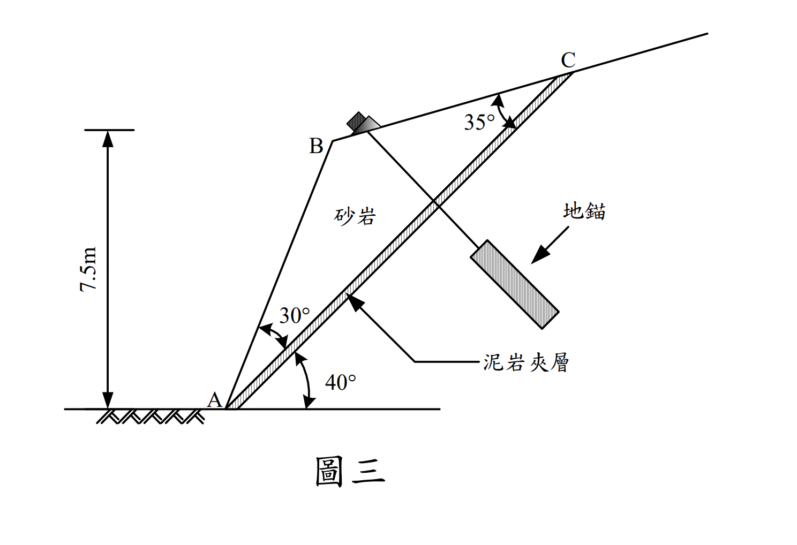

# SM-2008-4 — 平面滑動分析、岩石邊坡、水平地震力

**來源：** 結構工程技師高考 · 土壤力學與基礎設計 · 第4題
**考年：** 2008（民國97年）
**主分類：** [[SM-U3-3]] 坡地工程
**分析法：** 混合
**標籤：** `平面滑動分析` `岩石邊坡` `水平地震力` `地錨` `Mohr-Coulomb破壞準則` `安全係數`
**驗證狀態：** ⏳ unverified

---

## 題幹摘要

一岩石邊坡為砂岩含有一泥岩夾層，如圖三所示。已知砂岩之單位重 $\gamma = 20 \text{ kN/m}^3$，泥岩夾層之凝聚力 $c = 10 \text{ kN/m}^2$，摩擦角 $\phi = 28^\circ$，水平地震力係數 $k_h = 0.2$。（25 分）
(一) 試問於水平地震力 $k_hW$ 與滑動塊體 ABC 自重 $W$ 的作用下，此邊坡之安全係數 $FS$ ＝？（註：此時不考慮有地錨之情形）
(二) 同上題，若欲採用一排地錨，地錨垂直於滑動面 AC，地錨間距（指垂直紙面之間距）2 m，試問每支地錨荷重 $T$ 應為多大才能滿足於地震力作用下安全係數 $FS \ge 1.2$ 的規定。（註：假設地錨只增加正向力）

*圖說：滑動塊體為 ABC。滑動面 AC 與水平面夾角 $40^\circ$。坡面 AB 與 AC 夾角 $30^\circ$。頂面 BC 與 AC 夾角 $35^\circ$。點 B 相對於底端 A 的垂直高度為 7.5m。地錨垂直於滑動面 AC 設置。*

## 核心考點

本題測驗工程師對於**岩坡平面滑動（Planar Failure）**的剛體力學分析能力。出題者刻意給定各邊夾角與單一垂直高度，測驗考生利用正弦定理（Sine Rule）解構幾何並求取滑動塊體面積與重量的能力。同時，加入了水平地震力，測驗考生是否能正確將地震力分解至平行與垂直滑動面的方向（特別是地震力會**減少正向力**的陷阱）。最後，引入地錨設計，測驗考生將所需額外抗滑力反推為地錨荷重，並注意單位長度轉換至單支地錨間距的計算。

## 解題關鍵步驟

1. **解構幾何（最容易出錯的一步）**：
   - 觀察 $\triangle ABC$。滑動面 AC 傾角為 $40^\circ$。坡面 AB 傾角為 $40^\circ + 30^\circ = 70^\circ$。
   - 利用點 B 垂直高度 7.5m，求出 AB 長度。
   - 根據三角形內角和求出 $\angle B = 180^\circ - 30^\circ - 35^\circ = 115^\circ$。
   - 運用正弦定理求出滑動面 AC 長度，接著計算 $\triangle ABC$ 面積及每公尺寬度的重量 $W$。
2. **分析作用力與安全係數（無地錨時）**：
   - 地震力 $F_h = k_h W$ 必須施加於**最不利方向**（水平向左外推）。
   - 將 $W$ 與 $F_h$ 投影至平行滑動面（驅動力）與垂直滑動面（正向力）。

## 用到的公式

$$L_{AB} = \frac{H}{\sin\beta}$$

$$L_{AC} = \boxed{L_{AB}} \frac{\sin B}{\sin C}$$

$$W = \gamma \left( \frac{1}{2} \boxed{L_{AB}} \cdot \boxed{L_{AC}} \sin A \right)$$

$$T_d = \boxed{W} \sin\alpha + k_h\boxed{W} \cos\alpha$$

$$N = \boxed{W} \cos\alpha - k_h\boxed{W} \sin\alpha$$

$$FS = \frac{c L_{AC} + \boxed{N} \tan\phi}{\boxed{T_d}}$$

$$T = s \cdot \frac{FS_{req} \boxed{T_d} - \boxed{T_r}}{\tan\phi}$$

## 涉及陷阱

- **陷阱**：向左的地震力會產生遠離滑動面的垂直分力，因此會**減小**有效正向力，不可加錯符號。
   - 帶入 Mohr-Coulomb 準則計算抗滑力，求出初始 FS。
3. **地錨設計**：
   - 根據目標 $FS = 1.2$ 反推所需的總抗滑力。
   - 計算現有抗滑力與目標抗滑力之差額，此差額必須由地錨提供。
   - 因為地錨**垂直**於滑動面，其張力完全轉換為滑動面上的正向力增量 $\Delta N$。
   - 求出每公尺所需地錨張力 $P$，再乘上間距 2m，即為單支地錨荷重 $T$。

## 圖形（如有）

_(無)_

## 手寫補充（如有）

_(無)_

## 相關題目

- [[SM-2023-2]] — 邊坡穩定、平面滑動、安全係數
- [[SM-2014-1]] — 無限邊坡分析、安全係數、平行滲流
- [[SM-2024-2]] — 無限邊坡分析、安全係數、水力坡降
- [[SM-2021-4]] — Fellenius法、瑞典圓弧法、邊坡穩定
- [[SM-2006-3]] — 側向滑動、Rankine主動土壓力、Rankine被動土壓力
