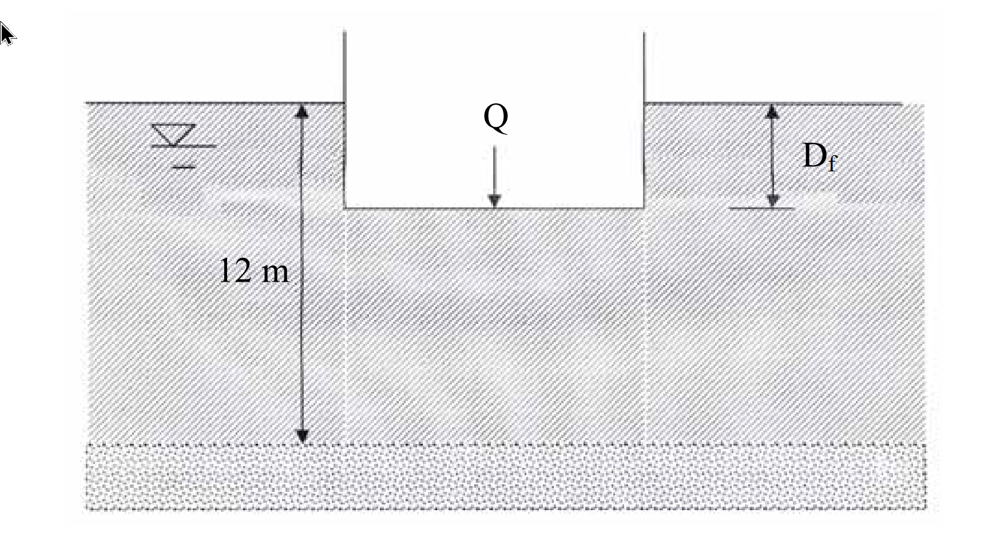

# SM-2009-2 — 筏式基礎、代償式基礎、Terzaghi承載力公式

**來源：** 結構工程技師高考 · 土壤力學與基礎設計 · 第2題
**考年：** 2009（民國98年）
**主分類：** [[SM-U2-1]] 淺基礎之支承力與沉陷量
**副分類：** [[SM-U2-3]] 開挖之穩定性分析
**分析法：** 混合
**標籤：** `筏式基礎` `代償式基礎` `Terzaghi承載力公式` `容許承載力` `基盤隆起` `不排水剪力強度`
**驗證狀態：** ✅ verified

---

## 題幹摘要

有一筏式基礎，基礎之設計尺寸為：$B = 8 \text{ m}$，$L = 12 \text{ m}$，承載荷重 $Q = 18 \text{ MN}$。該處地層為正常壓密黏土，$\gamma_{sat} = 17 \text{ kN/m}^3$，$c_u = 35 \text{ kN/m}^2$，黏土下方為砂土層，地下水位於地表下 3 m處。
(一) 如採用部分代償式（partially compensated）基礎，且安全係數為 3，則基礎埋置深度 $D_f$ 為何？
(二) 其在開挖時將開挖面內之水位抽降至與開挖底面等高，此時下方土層之抗隆起安全係數為何？（25 分）

*圖說：筏基尺寸 8m x 12m，載重 Q，埋置深度 D_f。黏土層總厚度 12m，地下水位於地表下（依題意為 -3m），下方為砂土層。*

## 核心考點

1. **部分代償式基礎的淨承載力概念**：測驗考生是否了解「代償式基礎」是利用挖除土壤的重量來抵消部分結構物載重，進而減少淨載重（Net pressure），因此安全係數應定義在「淨極限承載力」與「淨施加壓力」的比值。
2. **淺基礎承載力（總應力分析）**：飽和黏土層短期的承載力行為，適用 $\phi=0$ 條件，利用 Terzaghi 或 Skempton 承載力公式求 $q_{u,net}$。
3. **開挖抗隆起分析（Basal Heave）**：測驗開挖面下方黏土層的穩定性。題目特別給定「黏土下方為砂土層」，且可算出剩餘厚度 $T \approx B/\sqrt{2}$，強烈暗示應採用 Terzaghi 的隆起公式，以檢驗破壞面是否受到下方硬土層的限制。
4. **水位的影響**：測驗考生是否清楚在黏土層的短期（不排水）開挖分析中，總應力法下孔隙水壓不直接影響抗剪強度，但會影響底部上舉（Uplift / Blowout）風險。

## 解題關鍵步驟

**戰略地圖：**
- **第一階段（求 $D_f$）**：
  1. 計算筏基施加之總接觸壓力 $q = Q/A$。
  2. 計算淨極限承載力 $q_{u,net} = c_u N_c F_c$（本題採 Terzaghi 矩形公式）。
  3. 建立安全係數方程式 $FS = q_{u,net} / q_{net}$，其中 $q_{net} = q - \gamma D_f$，解出 $D_f$。
- **第二階段（求隆起 FS）**：
  1. 確認開挖深度 $H = D_f$，計算黏土層剩餘厚度 $T = 12 - D_f$。
  2. 計算 Terzaghi 破壞區寬度 $B' = B/\sqrt{2}$，判斷破壞面是否碰到砂土層（比較 $T$ 與 $B'$）。
  3. 代入 Terzaghi 隆起公式（或 Bjerrum & Eide 公式）求出抗隆起安全係數。
  4. （進階檢核）檢核砂土層水壓造成的上舉（Uplift）安全係數。

## 用到的公式

$$q = \frac{Q}{A} = \frac{18 \times 10^3 \text{ kN}}{8 \text{ m} \times 12 \text{ m}} = 187.5 \text{ kN/m}^2$$

$$q_u = c_u N_c \left(1 + 0.3 \frac{B}{L}\right) + q_0$$

$$q_{u,net} = q_u - q_0 = c_u N_c \left(1 + 0.3 \frac{B}{L}\right)$$

$$q_{u,net} = 35 \times 5.7 \times \left(1 + 0.3 \times \frac{8}{12}\right) = 199.5 \times 1.2 = \boxed{239.4 \text{ kN/m}^2}$$

$$FS = \frac{q_{u,net}}{q_{net}} = \frac{q_{u,net}}{q - \gamma_{sat} D_f}$$

$$3 = \frac{239.4}{187.5 - 17 \times D_f}$$

$$187.5 - 17 D_f = 79.8$$

$$17 D_f = 107.7 \implies \boxed{D_f = 6.34 \text{ m}}$$

$$T = 12 - H = 12 - 6.34 = 5.66 \text{ m}$$

$$\frac{B}{\sqrt{2}} = \frac{8}{1.414} = 5.66 \text{ m}$$

$$FS_{heave} = \frac{c_u N_c \left(1 + 0.3 \frac{B}{L}\right) + c_u \frac{H}{B'}}{\gamma_{sat} H}$$

$$FS_{heave} = \frac{239.4 + 35 \times \frac{6.34}{5.66}}{17 \times 6.34} = \frac{239.4 + 39.2}{107.78} = \frac{278.6}{107.78} = \boxed{2.58}$$

$$N_c = 5 \left(1 + 0.2 \frac{B}{L}\right)\left(1 + 0.2 \frac{H}{B}\right) = 5(1.133)(1.1585) = 6.56$$

$$FS_{heave} = \frac{c_u N_c}{\gamma_{sat} H} = \frac{35 \times 6.56}{17 \times 6.34} = \boxed{2.13}$$

## 涉及陷阱

**陷阱分析：**
- **陷阱 1：安全係數的定義**。對於代償式基礎，FS 必須是「淨承載力 / 淨載重」，若用「總承載力 / 總載重」會完全失去代償的物理意義。
- **陷阱 2：水位的處理**。總應力分析中，開挖移除的土壤重量直接以總單位重 $\gamma_{sat}$ 計算，不需要去扣除水壓或使用有效單位重 $\gamma'$。
- **陷阱 3：隆起公式的選用**。若忽略下方為砂土層的條件，直接代入公式，可能會錯失破壞面深度的幾何檢核（$B' \le T$）。

## 圖形（如有）

- [SM-2009-2-slope-viz.html](../../raw/solutions/SM-2009-2/SM-2009-2-slope-viz.html)

## 手寫補充（如有）

_(無)_

## 相關題目

- [[SM-2020-4]] — Terzaghi承載力公式、承載力因數、不排水剪力強度
- [[SM-2010-4]] — Meyerhof承載力公式、承載力因數、形狀深度修正係數
- [[SM-2017-3]] — 平鈑載重試驗、容許承載力、沉陷量控制
- [[SM-2017-4]] — 開挖穩定性、管湧、臨界水力坡降
- [[SM-2015-3]] — 開挖穩定性、支撐系統、視土壓力
