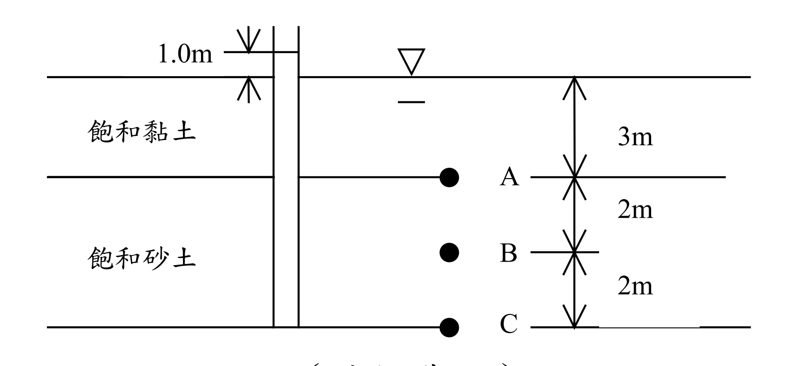

# SM-2009-3 — 有效應力原理、總應力、孔隙水壓

**來源：** 結構工程技師高考 · 土壤力學與基礎設計 · 第3題
**考年：** 2009（民國98年）
**主分類：** [[SM-U1-4]] 土體內應力
**副分類：** [[SM-U1-2]] 土壤滲透、[[SM-U1-1]] 土壤基本性質
**分析法：** 有效應力法
**標籤：** `有效應力原理` `總應力` `孔隙水壓` `受壓水層總水頭` `三相關係` `飽和單位重`
**驗證狀態：** ⏳ unverified

---

## 題幹摘要

某地層由飽和黏土層及下方之砂土層組成，地下水位於地表面。黏土之含水量 $\omega = 30\%$，孔隙比 $e = 0.8$；砂土之土粒比重 $G_s = 2.65$，含水量 $\omega = 18.5\%$。砂土層為一受壓水層，經由置於砂土層底部之水壓計測得該點之水頭高於地表面 1.0 m，如圖所示。試分別求砂土層之頂部、中間、底部，即 A、B、C 三點處之孔隙水壓力及垂直向總應力與有效應力。（25 分）

*圖說：地層由上覆3m厚飽和黏土（$\omega = 30\%$, $e = 0.8$）與下伏4m厚飽和砂土（$G_s = 2.65$, $\omega = 18.5\%$）組成。地下水位位於地表面。置於砂土層底部（C點）的水壓計顯示水頭高出地表面 1.0m。要求計算砂土層頂部(A)、中間(B)、底部(C)三點的孔隙水壓、垂直向總應力與有效應力。*

## 核心考點

本題主要測驗考生兩個核心概念：
1. **土壤基本物理性質的換算**：如何利用三相圖關係（飽和度 $S$、含水量 $\omega$、孔隙比 $e$、比重 $G_s$）求出地層的飽和單位重 $\gamma_{sat}$。
2. **受壓水層中的孔隙水壓分布**：受壓水層（confined aquifer）代表砂土層為高透水層，而上覆黏土層為阻水層（aquitard）。由於砂土層滲透性遠大於黏土層（$k_{sand} \gg k_{clay}$），水頭在砂土層內的垂直損失可忽略不計，因此砂土層內各點的總水頭（Total Head）皆相同，皆高於地表面 1.0 m。

出題者意圖確保考生不會單純套用靜水壓力公式 $u = \gamma_w z$，而是能根據受壓水層的總水頭來正確推算各深度的孔隙水壓，再結合總應力求出有效應力。

## 解題關鍵步驟

**解題步驟：**
1. **推算土壤單位重**：
   - 黏土層：利用 $S \cdot e = \omega \cdot G_s$ 找出未知的 $G_s$，再代入 $\gamma_{sat}$ 公式。
   - 砂土層：利用 $S \cdot e = \omega \cdot G_s$ 找出未知的 $e$，再代入 $\gamma_{sat}$ 公式。
2. **計算垂直向總應力 ($\sigma_v$)**：依據深度逐層累加 $\gamma_{sat} \times \Delta z$。
3. **判斷砂土層的水頭分布與孔隙水壓 ($u$)**：
   - 設定地表面為基準面（$z=0$），總水頭 $h = h_e + h_p$。
   - 砂土層內部各點的總水頭均為 $h = 1.0 \text{ m}$。
   - 壓力水頭 $h_p = h - z$（注意 $z$ 為負值），進而求出 $u = h_p \cdot \gamma_w$。
4. **計算有效應力 ($\sigma_v'$)**：利用有效應力原理 $\sigma_v' = \sigma_v - u$ 求解。

## 用到的公式

$$G_{s(clay)} = \frac{S \cdot e}{\omega} = \frac{1 \cdot 0.8}{0.3} = 2.667$$

$$\gamma_{sat(clay)} = \frac{G_{s(clay)} + e}{1 + e} \gamma_w = \frac{2.667 + 0.8}{1 + 0.8} \times 9.81 = 1.926 \times 9.81 = \boxed{18.89 \text{ kN/m}^3}$$

$$e_{(sand)} = \frac{\omega \cdot G_s}{S} = \frac{0.185 \times 2.65}{1} = 0.490$$

$$\gamma_{sat(sand)} = \frac{G_{s(sand)} + e_{(sand)}}{1 + e_{(sand)}} \gamma_w = \frac{2.65 + 0.490}{1 + 0.490} \times 9.81 = 2.107 \times 9.81 = \boxed{20.67 \text{ kN/m}^3}$$

$$h_A = h_B = h_C = 1.0 \text{ m}$$

$$h_{pA} = h_A - z_A = 1.0 - (-3.0) = 4.0 \text{ m}$$

$$u_A = h_{pA} \cdot \gamma_w = 4.0 \times 9.81 = \boxed{39.24 \text{ kPa}}$$

$$h_{pB} = h_B - z_B = 1.0 - (-5.0) = 6.0 \text{ m}$$

$$u_B = h_{pB} \cdot \gamma_w = 6.0 \times 9.81 = \boxed{58.86 \text{ kPa}}$$

$$h_{pC} = h_C - z_C = 1.0 - (-7.0) = 8.0 \text{ m}$$

$$u_C = h_{pC} \cdot \gamma_w = 8.0 \times 9.81 = \boxed{78.48 \text{ kPa}}$$

$$\sigma_{v,A} = \gamma_{sat(clay)} \times 3.0 = 18.89 \times 3.0 = \boxed{56.67 \text{ kPa}}$$

$$\sigma_{v,A}' = \sigma_{v,A} - u_A = 56.67 - 39.24 = \boxed{17.43 \text{ kPa}}$$

$$\sigma_{v,B} = \sigma_{v,A} + \gamma_{sat(sand)} \times 2.0 = 56.67 + 20.67 \times 2.0 = 56.67 + 41.34 = \boxed{98.01 \text{ kPa}}$$

$$\sigma_{v,B}' = \sigma_{v,B} - u_B = 98.01 - 58.86 = \boxed{39.15 \text{ kPa}}$$

$$\sigma_{v,C} = \sigma_{v,B} + \gamma_{sat(sand)} \times 2.0 = 98.01 + 20.67 \times 2.0 = 98.01 + 41.34 = \boxed{139.35 \text{ kPa}}$$

$$\sigma_{v,C}' = \sigma_{v,C} - u_C = 139.35 - 78.48 = \boxed{60.87 \text{ kPa}}$$

## 涉及陷阱

**陷阱分析：**
- **陷阱一：誤用靜水壓力計算孔隙水壓。** 若忽略受壓水層特性，直接用 $u = \gamma_w z$ 計算，將導致 A、B、C 三點水壓低估，有效應力高估。
- **陷阱二：誤以為砂土層內有水流導致水頭隨深度線性遞減。** 實際上砂土層透水性極大，內部無明顯水頭損失。題目雖只有 C 點有水壓計，但整個砂土層的總水頭均應視為一致（$h=1.0\text{m}$）。
- **陷阱三：黏土層 $G_s$ 未知。** 需利用飽和條件（$S=1$）去反推黏土層的 $G_s$，才能求得單位重。

## 圖形（如有）

_(無)_

## 手寫補充（如有）

_(無)_

## 相關題目

- [[SM-2020-1]] — 有效應力原理、總應力、孔隙水壓
- [[SM-2021-1]] — 有效應力原理、總應力、孔隙水壓
- [[SM-2015-4]] — 抽水降階、Darcy定律、穩定滲流
- [[SM-2012-1]] — 三軸試驗、CU試驗、UU試驗
- [[SM-2010-2]] — Rankine主動土壓力、土壓力分布圖、水中單位重
