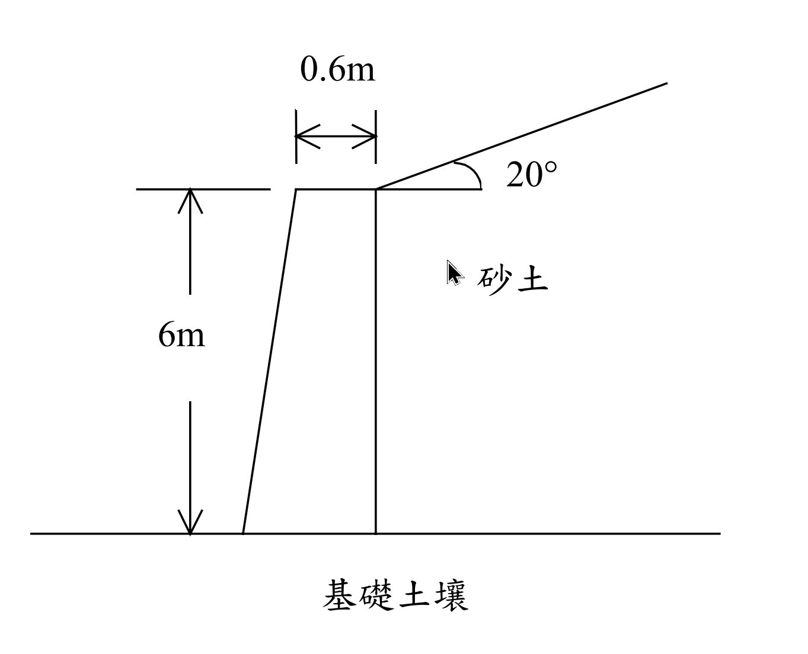

# SM-2009-4 — 重力式擋土牆、Rankine主動土壓力、傾斜背填土

**來源：** 結構工程技師高考 · 土壤力學與基礎設計 · 第4題
**考年：** 2009（民國98年）
**主分類：** [[SM-U3-2]] 擋土結構物穩定分析
**副分類：** [[SM-U3-1]] 側向土壓力理論
**分析法：** 混合
**標籤：** `重力式擋土牆` `Rankine主動土壓力` `傾斜背填土` `偏心距` `抗滑動` `抗傾覆` `安全係數`
**驗證狀態：** ⏳ unverified

---

## 題幹摘要

茲設計一重力式混凝土擋土牆高 6 m，牆頂寬度為 0.6 m，其背填土為砂土，與水平成 20°。背填土之單位重為 18 kN/m³，摩擦角為 30°；混凝土之單位重為 24 kN/m³；而牆底之基礎土壤單位重為 16 kN/m³，摩擦角為 33°。（25 分）
(一)若欲使所有作用力之合力通過牆底，且距牆趾為三分之一牆底寬度時，則牆底寬度須為多少？
(二)根據以上所得的結果，試分別檢核此擋土牆抵抗水平滑動及傾倒之安全係數。若安全係數不足時，在不改變牆底寬度的情況下，有何改善的方式？

*圖說：擋土牆高 6 m，頂寬 0.6 m，牆背垂直，牆前傾斜。背填土傾角 $\alpha=20^\circ$，屬砂土 ($\gamma = 18 \text{ kN/m}^3, \phi = 30^\circ$)。基礎土壤 $\gamma = 16 \text{ kN/m}^3, \phi = 33^\circ$。*

## 核心考點

本題測驗工程師對於擋土牆整體穩定性分析的完整掌握能力，核心考點包括：
1. **傾斜背填土之主動土壓力**：須熟悉 Rankine 理論中當背填土傾斜時，土壓力係數 $K_a$ 的計算，且其作用方向應平行於背填土地表面（即與水平面夾 $\alpha$ 角），因此會產生水平與垂直兩個分力。
2. **合力偏心距與底寬之關係**：考驗對於「合力通過底寬 1/3 處」此一邊界條件的力學意義（即偏心距 $e = B/6$，基礎底面恰好不產生張力），並能將其轉化為力矩與垂直力的代數方程式以反求底寬 $B$。
3. **穩定性檢核與工程對策**：要求計算抗滑動（$FS_{SL}$）與抗傾覆（$FS_{OT}$）安全係數，並在評估其不足時，提出實務上在「不改變底寬」限制條件下的有效改善方案。

## 解題關鍵步驟

**解題策略：**
1. **計算主動土壓力**：利用傾斜背填土的 Rankine 公式計算 $K_a$，求出總主動土壓力 $P_a$，並將其分解為水平分力 $P_{ah}$ 與垂直分力 $P_{av}$。
2. **建立力矩平衡方程式**：將擋土牆斷面拆分為矩形（後側）與三角形（前側），以底寬 $B$ 為未知數，列出牆身自重 $W$ 及其對牆趾之抗傾覆力矩。
3. **求解底寬 $B$**：依據題目條件「合力距牆趾為 $B/3$」，利用 $x = (\sum M_R - \sum M_O) / \sum V = B/3$ 的關係式，解一元二次方程式求出 $B$。
4. **檢核安全係數**：代入 $B$ 值，計算 $FS_{OT} = \sum M_R / \sum M_O$ 與 $FS_{SL} = \sum F_R / \sum F_D$（假設底面摩擦角 $\delta = \phi_f = 33^\circ$）。
5. **提出改善對策**：針對不足的安全係數，提出增設抗滑榫、加深埋置深度或改變背填土等不改變牆寬的方案。

## 用到的公式

$$K_a = \cos \alpha \frac{\cos \alpha - \sqrt{\cos^2 \alpha - \cos^2 \phi}}{\cos \alpha + \sqrt{\cos^2 \alpha - \cos^2 \phi}}$$

$$\cos 20^\circ = 0.9397 \quad ; \quad \cos 30^\circ = 0.8660$$

$$\sqrt{\cos^2 20^\circ - \cos^2 30^\circ} = \sqrt{0.9397^2 - 0.8660^2} = \sqrt{0.8830 - 0.7500} = \sqrt{0.1330} = 0.3647$$

$$K_a = 0.9397 \times \frac{0.9397 - 0.3647}{0.9397 + 0.3647} = 0.9397 \times \frac{0.5750}{1.3044} = 0.4142$$

$$P_a = \frac{1}{2} K_a \gamma H^2 = \frac{1}{2} \times 0.4142 \times 18 \times 6^2 = 134.20 \text{ kN/m}$$

$$P_{ah} = P_a \cos 20^\circ = 134.20 \times 0.9397 = 126.11 \text{ kN/m}$$

$$P_{av} = P_a \sin 20^\circ = 134.20 \times 0.3420 = 45.90 \text{ kN/m}$$

$$\sum V = W_1 + W_2 + P_{av} = 86.4 + (72 B - 43.2) + 45.90 = 72 B + 89.10 \text{ kN/m}$$

$$\sum M_R = M_{W1} + M_{W2} + M_{Pav} = (86.4 B - 25.92) + (48 B^2 - 57.6 B + 17.28) + 45.90 B = 48 B^2 + 74.70 B - 8.64$$

$$\sum M_O = P_{ah} \times \frac{H}{3} = 126.11 \times 2 = 252.22 \text{ kN-m/m}$$

$$x = \frac{\sum M_R - \sum M_O}{\sum V} = \frac{B}{3}$$

$$3(\sum M_R - \sum M_O) = B \cdot \sum V$$

$$3(48 B^2 + 74.70 B - 8.64 - 252.22) = B(72 B + 89.10)$$

$$144 B^2 + 224.10 B - 782.58 = 72 B^2 + 89.10 B$$

$$72 B^2 + 135.00 B - 782.58 = 0$$

$$8 B^2 + 15 B - 86.953 = 0$$

$$B = \frac{-15 + \sqrt{15^2 - 4 \times 8 \times (-86.953)}}{2 \times 8} = \frac{-15 + \sqrt{225 + 2782.50}}{16} = \frac{-15 + 54.84}{16} = 2.49 \text{ m}$$

$$\boxed{B = 2.49 \text{ m}}$$

$$\sum V = 72(2.49) + 89.10 = 268.38 \text{ kN/m}$$

$$\sum M_R = 48(2.49)^2 + 74.70(2.49) - 8.64 = 297.60 + 186.00 - 8.64 = 474.96 \text{ kN-m/m}$$

$$\sum M_O = 252.22 \text{ kN-m/m}$$

$$FS_{OT} = \frac{\sum M_R}{\sum M_O} = \frac{474.96}{252.22} = 1.88$$

$$\sum F_R = \sum V \tan \delta = 268.38 \times \tan 33^\circ = 268.38 \times 0.6494 = 174.29 \text{ kN/m}$$

$$\sum F_D = P_{ah} = 126.11 \text{ kN/m}$$

$$FS_{SL} = \frac{\sum F_R}{\sum F_D} = \frac{174.29}{126.11} = 1.38$$

## 涉及陷阱

**陷阱分析：**
- ⚠ **陷阱 1：忽略主動土壓力的垂直分力**。當背填土傾斜時，Rankine 主動土壓力的方向會平行於地表面，因此 $P_a$ 具有垂直向下之分力 $P_{av}$。此分力會增加牆底總垂直力，並提供額外的抗傾覆力矩，若忽略將導致方程式完全錯誤。
- ⚠ **陷阱 2：牆身形心力臂計算錯誤**。牆體前傾後直，計算自重力矩時需正確將牆底座標設定為 $0 \sim B$，並注意三角形重心距離底角的正確位置（距底角 2/3 底寬）。
- ⚠ **陷阱 3：摩擦角與底面摩擦力**。牆底基礎為混凝土與土壤接觸，其實際摩擦角 $\delta$ 通常為 $(2/3 \sim 1.0)\phi_f$。本題未明示，保守或一般取 $\delta = \phi_f$ 計算，需清楚標示假設。

## 圖形（如有）

_(無)_

## 手寫補充（如有）

_(無)_

## 相關題目

- [[SM-2018-4]] — 懸臂式擋土牆、Rankine主動土壓力、抗傾覆
- [[SM-2025-3]] — 重力式擋土牆、抗滑動、Rankine主動土壓力
- [[SM-2016-3]] — 加勁擋土結構、抗滑動、抗傾覆
- [[SM-2016-4]] — Coulomb土壓力、抗滑動、抗傾覆
- [[SM-2015-2]] — Rankine主動土壓力、張力裂縫、土壓力合力作用點
