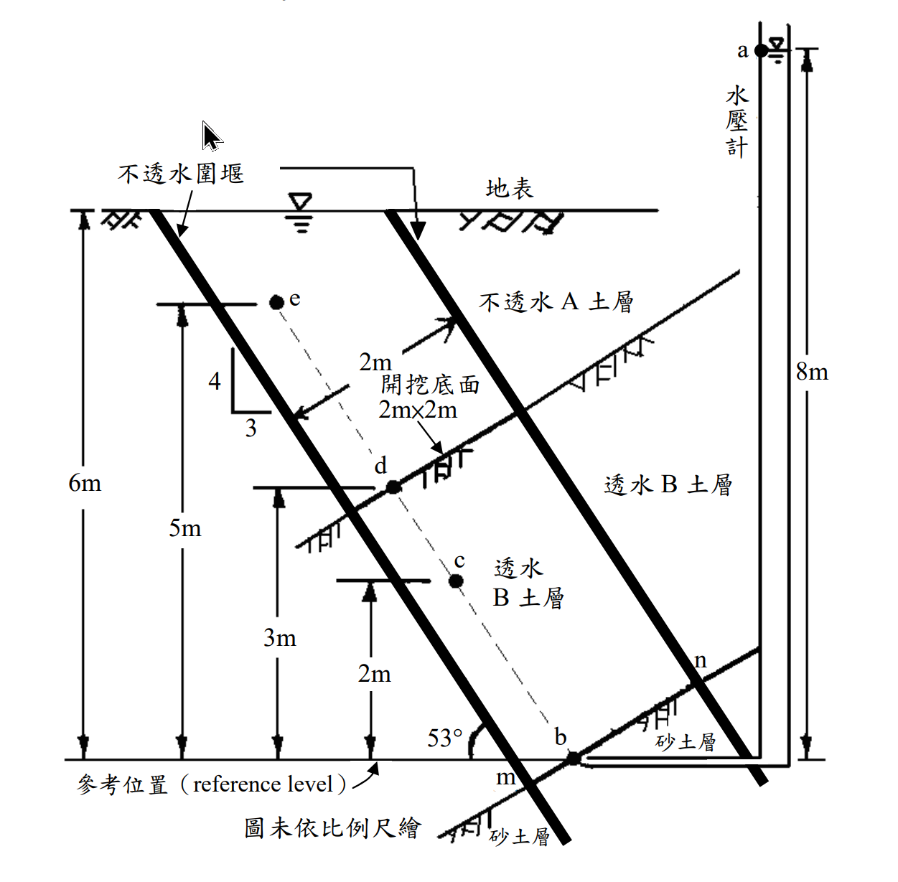

# SM-2011-2 — 流網、Darcy定律、滲透係數

**來源：** 結構工程技師高考 · 土壤力學與基礎設計 · 第2題
**考年：** 2011（民國100年）
**主分類：** [[SM-U1-2]] 土壤滲透
**副分類：** [[SM-U2-3]] 開挖之穩定性分析
**分析法：** 有效應力法
**標籤：** `流網` `Darcy定律` `滲透係數` `水頭計算` `水力坡降` `滲流量` `圍堰開挖`
**驗證狀態：** ✅ verified

---

## 題幹摘要

二、某工地因施工需要在複雜土層進行傾斜向開挖底面為 2 m×2 m 正方形之圍堰開挖，如下圖所示，開挖後水在圍堰內土層 B 之土壤中產生滲流，試求：
(一) a、b、c、d、e 各點之總水頭、高度水頭及壓力水頭各為若干（m）？
(二) 試繪流經此土壤之流網及計算流經此土壤之平均水力坡降 $i_{bd}$ 為若干？
(三) 若此土層 B 之土壤透水係數 $k = 0.005 \text{ cm/sec}$，試計算其滲流量為若干（$\text{m}^3\text{/day}$）？（25 分）

*圖說：本圖顯示一傾斜向圍堰開挖，邊界傾角為 4垂直:3水平（即 $\theta = 53^\circ$）。開挖底面為 2m × 2m 之正方形，位於高程 5m 處。透水層 B 位於不透水圍堰與不透水 A 土層之間，底部連接水頭高 8m 之砂土層。圖中標示 a、b、c、d、e 點，以供水頭計算。*

## 核心考點

- 測驗考生對於一維與二維滲流中總水頭、高度水頭、壓力水頭關係的掌握度。
- 測驗是否能正確認知「流徑長度」（需沿流線方向計算，而非垂直高差）。
- 測驗流量計算中「垂直於流向之截面積」與「水平面積」的幾何轉換觀念。

## 解題關鍵步驟

- **步驟 1**：定義基準面（reference level = 0m），找出各點之高程 $Z$。
- **步驟 2**：確認邊界條件。底面連接之砂土層水頭為 8m（$h_b = 8\text{m}$）；頂部開挖底面自由滲水，壓力水頭為 0，總水頭等於其高程（$h_e = 5\text{m}$）。
- **步驟 3**：利用流徑長度 $L = \Delta Z / \sin 53^\circ$，計算水力坡降 $i$。
- **步驟 4**：根據 $h = h_b - i \cdot s$，求出各點總水頭，再推算壓力水頭。

## 用到的公式

$$L = \frac{\Delta Z}{\sin\theta}$$

$$\boxed{i} = \frac{\Delta h}{\boxed{L}}$$

$$h = h_b - \boxed{i} \cdot s$$

$$P = \boxed{h} - Z$$

$$A_{\perp} = A_{\text{horiz}} \cdot \sin\theta$$

$$Q = k \cdot \boxed{i} \cdot \boxed{A_{\perp}}$$

## 涉及陷阱

- **陷阱 1**：流徑長度誤用垂直高差。斜向滲流的流徑是沿著 53° 的斜線，必須除以 $\sin 53^\circ = 0.8$。
- **陷阱 2**：計算流量時，截面積誤用 $2\text{m} \times 2\text{m}$。由於流向傾斜，垂直流向的截面積應為 $A_{\perp} = A_{\text{horiz}} \times \sin 53^\circ = 4 \times 0.8 = 3.2\text{m}^2$。
- **陷阱 3**：流網邊界條件的認知。水平的開挖面為等位線，因此流線接近頂部時必須轉向為垂直進入開挖面，這點在手繪流網時需特別注意。

## 圖形（如有）

- [SM-2011-2-seepage-viz.html](../../raw/solutions/SM-2011-2/SM-2011-2-seepage-viz.html)

## 手寫補充（如有）

_(無)_

## 相關題目

- [[SM-2018-3]] — 流網、滲流量、流槽數Nf
- [[SM-2022-3]] — Darcy定律、滲透係數、等效滲透係數
- [[SM-2024-2]] — 無限邊坡分析、安全係數、水力坡降
- [[SM-2021-1]] — 有效應力原理、總應力、孔隙水壓
- [[SM-2015-4]] — 抽水降階、Darcy定律、穩定滲流
