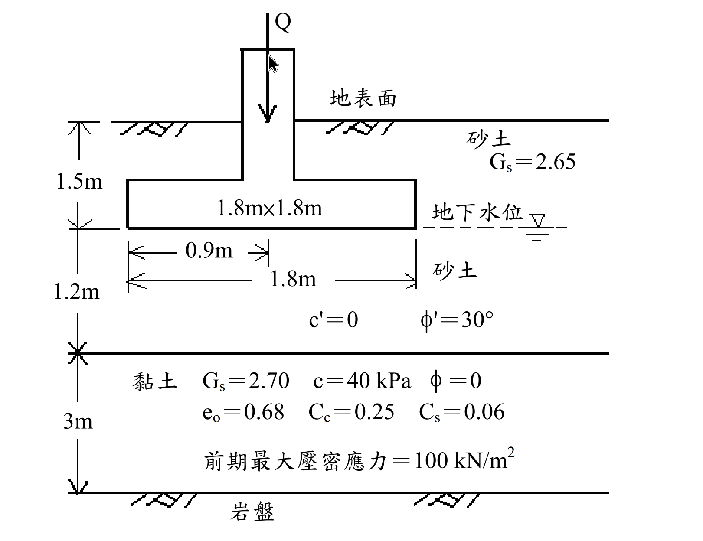

# SM-2011-3 — 壓密沉陷量、2:1應力傳佈、過壓密

**來源：** 結構工程技師高考 · 土壤力學與基礎設計 · 第3題
**考年：** 2011（民國100年）
**主分類：** [[SM-U1-3]] 土壤夯實及壓密
**分析法：** 混合
**標籤：** `壓密沉陷量` `2:1應力傳佈` `過壓密` `部分飽和` `回脹指數`
**驗證狀態：** ✅ verified

---

## 題幹摘要

如下圖所示之 1.8m×1.8m 正方基礎承受 Q 為 1 MN 之鉛垂向之正方柱載重，假設砂土層之孔隙比 $e$ 為 0.65，比重 $G_s$ 為 2.65，地下水位以上砂土之飽和度為 50%；黏土層之比重 $G_s$為 2.70，壓縮性指數 $C_c$為 0.25，回脹性指數 $C_s$為 0.06，最初孔隙比 $e_o$ 為 0.68。其他參數如圖中所標示。
(一)假設壓力以 2：1（V：H）分布方式向下傳遞，試計算基礎中心下方黏土層之平均新增鉛垂向應力為若干（kPa）？
(二)試計算黏土層之壓密沉陷量為若干（mm）？（25 分）

*圖說：基礎底寬 1.8m×1.8m，埋置深度 1.5m，受載 1MN。地下水位位於基礎底面。地層剖面由上至下為：1.5m 砂土(水位上)、1.2m 砂土(水位下)、3m 黏土、底層岩盤。*

## 核心考點

本題測驗考生對於淺基礎沉陷量計算之完整流程掌握度，主要核心意圖包含：
1. **部分飽和土壤之單位重計算**：水位以上的砂土層給定 $S=50\%$，需正確代入三相圖公式求取濕單位重 $\gamma_t$。
2. **2:1 應力分布法之應用**：測驗是否能正確計算深度 $z$ 處之新增應力，並理解「平均新增應力」在實務上的簡化取法（通常取黏土層中央深度）。
3. **過壓密狀態 (OCR) 的判別與沉陷量計算**：給定前期最大壓密應力 $p_c'=100 \text{ kPa}$，考生必須先計算初始有效覆土應力 $p_0'$ 並與 $p_c'$ 比較。本題設計 $p_0' + \Delta\sigma$ 剛好跨越 $p_c'$，因此必須分段使用回脹指數 $C_s$ 與壓縮指數 $C_c$ 計算沉陷量。

## 解題關鍵步驟

**解題步驟：**
1. **求取各層單位重**：分別計算水位上砂土 ($\gamma_t$)、水位下砂土 ($\gamma_{sat}$、$\gamma'$)、黏土 ($\gamma_{sat}$、$\gamma'$) 之單位重。
2. **計算初始有效應力 $p_0'$**：計算基礎中心下方、黏土層中央處之初始有效覆土應力。
3. **計算平均新增應力 $\Delta\sigma_{avg}$**：採用 2:1 應力分布法，計算黏土層中央深度之新增應力作為平均值。
4. **判斷應力歷史並計算沉陷量 $S_c$**：比較 $p_0'$、$p_c'$ 與 $p_0' + \Delta\sigma_{avg}$，代入過壓密雙段沉陷公式求解。

## 用到的公式

$$\gamma = \frac{G_s + S \cdot e}{1+e}\gamma_w$$

$$p_0' = \Sigma (\gamma_i \cdot H_i) - u$$

$$\Delta\sigma_{avg} = \frac{Q}{(B+z_m)(L+z_m)}$$

$$S_c = \frac{C_s H}{1+e_0}\log\left(\frac{p_c'}{\boxed{p_0'}}\right) + \frac{C_c H}{1+e_0}\log\left(\frac{\boxed{p_0'} + \boxed{\Delta\sigma_{avg}}}{p_c'}\right)$$

## 涉及陷阱

**陷阱分析：**
- **陷阱一：忽略水位以上的飽和度**。若直接將水位上砂土視為乾燥 ($S=0$) 或忽略不計，將導致 $p_0'$ 計算錯誤。
- **陷阱二：計算 $\Delta\sigma$ 的深度 $z$ 定義**。2:1 應力分布法的深度 $z$ 必須由「基礎底面」起算，而非地表面。至黏土層中央之深度 $z = 1.2 + 3.0/2 = 2.7 \text{ m}$。
- **陷阱三：沉陷量公式錯用**。若未檢查 $p_0' + \Delta\sigma_{avg}$ 是否大於 $p_c'$，可能只套用 $C_s$ 計算，忽略了跨越 $p_c'$ 後進入正常壓密線的 $C_c$ 貢獻段。

## 圖形（如有）

_(無)_

## 手寫補充（如有）

_(無)_

## 相關題目

- [[SM-2025-1]] — 一維壓密、壓密度、排水路徑
- [[SM-2024-3]] — 地下水位下降、有效應力、正常壓密
- [[SM-2022-1]] — 夯實試驗、最佳含水量、最大乾單位重
- [[SM-2021-2]] — 正常壓密黏土、壓密沉陷量、時間因數
- [[SM-2019-2]] — 主要壓密沉陷量、時間因數、預壓工法
